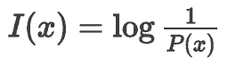
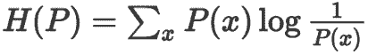
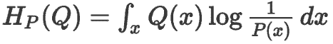
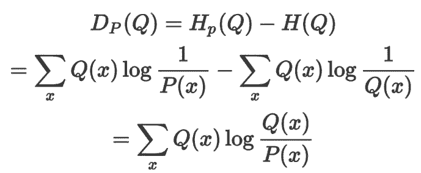
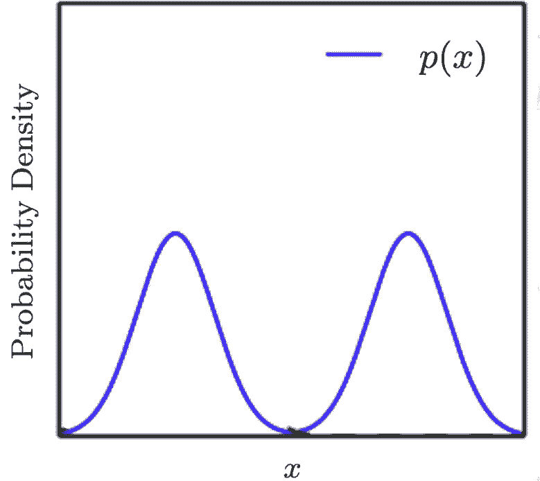
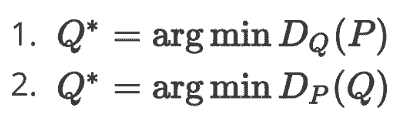
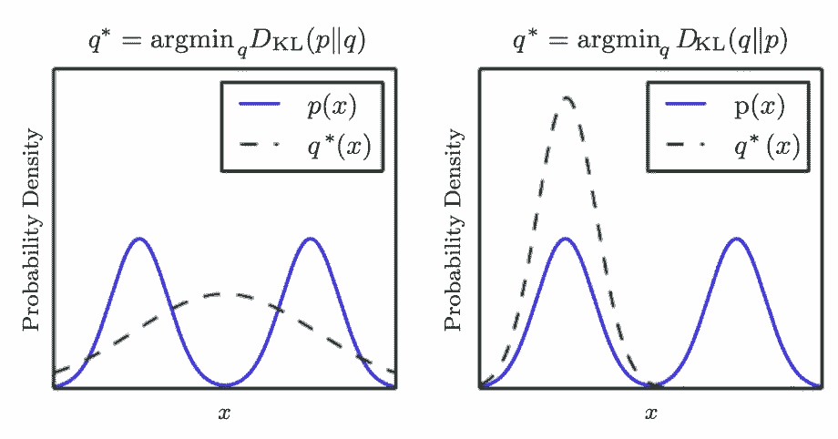

# 教程 | 如何理解 KL 散度的不对称性

机器之心原创

**作者：邱陆陆**

> 众所周知，多被用于量化分布间的差异的 KL 散度是不对称的。今天我们来聊一聊，两个分布的一对 KL 散度之间究竟有什么不同。

为了讨论这个知识点，我们需要掌握（或者暂且当做已知）的先决知识点有：

1 自信息：符合分布 P 的某一事件 x 出现，传达这条信息所需的最少信息长度为自信息，表达为  

2 熵：从分布 P 中随机抽选一个事件，传达这条信息所需的最优平均信息长度为香农熵，表达为 

3 交叉熵：用分布 P 的最佳信息传递方式来传达分布 Q 中随机抽选的一个事件，所需的平均信息长度为交叉熵，表达为 

4 KL 散度：用分布 P 的最佳信息传递方式来传达分布 Q，比用分布 Q 自己的最佳信息传递方式来传达分布 Q，平均多耗费的信息长度为 KL 散度，表达为 D_p(Q) 或 D_KL(Q||P)，KL 散度衡量了两个分布之间的差异。

注意，如果表达成 D_p(Q)  形式，要传达的信息所属的分布在括号内；如果表达成 D_KL(Q||P) 形式，要传达的信息所属的分布在前。

新增知识点：D_P(Q)与 D_Q(P) 有什么不一样？

公式 D_P(Q) 里一共涉及了两个分布：

*   要传达的信息来自哪个分布，答案是 Q

*   信息传递的方式由哪个分布决定，答案是 P

由 KL 散度的公式可知，分布 Q 里可能性越大的事件，对 D_P(Q) 影响力越大。如果想让 D_P(Q) 尽量小，就要优先关注分布 Q 里的常见事件（假设为 x），确保它们在分布 P 里不是特别罕见。

因为一旦事件 x 在分布 P 里罕见，意味着在设计分布 P 的信息传递方式时，没有着重优化传递 x 的成本，传达事件 x 所需的成本，log(1/P(x)) 会特别大。所以，当这一套传递方式被用于传达分布 Q 的时候，我们会发现，传达常见事件需要的成本特别大，整体成本也就特别大。

类似地，想让 D_P(Q) 特别小，就要优先考虑分布 P 里那些常见的事件们了。这时，分布 Q 里的常见事件，就不再是我们的关注重点。

下面让我们举一个实际的例子，来自《Deep Learning》一书第三章。

假设存在一个真实分布 P，由两个高斯分布混合而成，用蓝线表示。

现在，在不知道分布 P 的信息的情况下，我们做出了一个常见的假设：假设数据符合高斯分布。

当我们尝试用一个普通的高斯分布 Q 来近似分布 P，换言之，尝试让 Q 尽量「贴近」P 的时候，可以选择的目标函数有：

选择不同的目标函数，会产生完全不同的 Q。

如果我们选择目标函数 1，结果会像左图一样。在优化过程中，重要的是分布 P 中的*常见事件*，也就是蓝线的两峰，我们要优先确保它们在分布 Q 里不是特别罕见（信息长度不是特别长）。由于分布 P 里有两个峰值区域，分布 Q 无法偏向任何一个峰值，拉锯的结果是，Q 选择了横亘在分布 P 两个峰值中间。

如果我们选择目标函数 2，结果会像右图一样，重要的是分布 P 中的*罕见事件*（信息长度特别长的那些事件），也就是蓝线的谷底，我们优先确保它们在分布 Q 里不是特别常见。左图里那种，分布 Q 横亘在分布 P 两个峰值中间，是我们最不希望发生的、KL 散度格外大的情况。相反，只有一个峰值的分布 Q 最终会选择贴合分布 P 两个峰值区域中的任意一个。

最后，直觉上，因为 D_Q(P)=H_Q(P)-H(P)，其中多项式的第二项 H(P) 与分布 Q 完全无关，所以这时候，arg min D_Q(P) 等价于 arg min H_Q(P)。即，优化 KL 散度与优化交叉熵是等价的。但是，反过来的 D_P(Q)=H_P(Q)-H(Q) 就没有这等好事了。

以上，就是，KL 散度如何衡量分布间的差异，以及不对称的 KL 散度在衡量差异的时候会有什么不同了。

欢迎提问，以及拍砖。

****本文为机器之心原创，**转载请联系本公众号获得授权****。**

✄------------------------------------------------

**加入机器之心（全职记者/实习生）：hr@jiqizhixin.com**

**投稿或寻求报道：editor@jiqizhixin.com**

**广告&商务合作：bd@jiqizhixin.com**