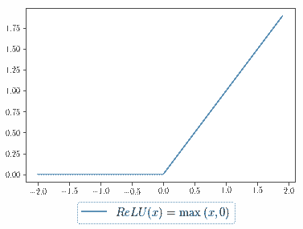
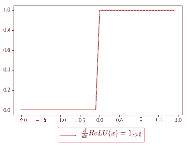

# 观点 | 我们该如何学习机器学习中的数学

选自 ycombinator 博客

**机器之心编译**

**作者：Vincent Chen**

**参与：机器之心编辑部**

> 数学在机器学习中非常重要，不论是在算法上理解模型代码，还是在工程上构建系统，数学都必不可少。通常离开学校后很难有机会静下心学习数学知识，因此我们最好能通过阅读小组或读书会等形式营造环境，并专注学习那些在实践中常常需要用到的数学知识。

数学达到什么水平才可以开始机器学习？人们并不清楚，尤其是那些在校期间没有研究过数学或统计学的人。

本文的写作目的是介绍构建机器学习产品或进行相关学术研究所必需的数学背景，以及数学在工程和研究中的重要性。这些建议是根据我和机器学习工程师、研究者和教育者交流而得到的，当然也有我自己在机器学习研究和业界工作中的个人经验。

为了构建必备的数学背景，我首先提出不同的思维模式和策略，帮助大家在学校之外也可以接受数学教育。然后，我会给出不同种类机器学习工作所需的数学背景，从高中水平的统计学和微积分到概率图模型（PGM）的最新进展。希望大家读完本文后，能够对自己在机器学习工作中所需要的数学教育有清楚的认知。

**关于数学焦虑**

很多人害怕数学，包括工程师。首先，我想解决「擅长数学」这一迷思。

一般精通数学的人有大量和数学有关的实践经验。因此，他们在研究数学时更容易保持专注。相比内在能力，学生的思维模式才是决定一个人学习数学能力的关键。

不过要想达到这种状态需要付出大量时间和努力，但是这并不会让你感到无聊。下文将帮助大家确定你所需要的数学水平，以及学习策略。

**机器学习中的数学**

作为软件工程的开发者，我们一般有基础的线性代数与矩阵微分学知识，也有一些概率论和编程的基础。因此以它们为基础，我们只需要根据不同的方向与领域调整知识结构就行。

那么我们该如何在校外学习数学呢？我相信学习数学最好的方法是将其作为一份全职工作，也就是学生。因为离开了学校，我们很难进行结构化的学习，也很难有正向的同龄压力和众多的学习资源。但是在校外学习中，我比较推荐成立学习小组或研讨会，它们同样能提供类似学校的学习环境。

在研究实验室中，这种课外学习可能是以阅读小组的形式进行。我们可以讨论课本中难以理解的地方，也可以讨论自己对它们的见解。而学习的环境是支持长期数学学习的动力，因此建立这种环境并意识到数学在工程与研究中的重要性非常关键。

**数学与代码**

数学和代码在机器学习工作流程中高度交织在一起。代码通常可以根据数学直观地构建，它甚至会共享数学符号与句法。实际上，NumPy 等现代数据科学框架令数学运算很容易转化为直观的代码。我们可以将代码作为巩固学习的方式，且数学和代码都依赖于对概念的精确理解与符号表示。例如，手动用 NumPy 实现损失函数或最优化算法是理解它们概念非常好的方式。

作为通过代码学习数学的案例，我们可以考虑一个实际的案例，即为神经网络实现反向传播和 ReLU 激活函数。作为入门级概念，反向传播是一种依赖于微积分链式求导法则的技术，它能高效计算梯度。为了在神经网络中利用链式求导法则，我们可以使用 ReLU 激活函数的梯度乘以上游导数。

为了完成反向传播的案例，首先我们可以可视化 ReLU 激活函数：



为了计算 ReLU 的梯度或斜率，我们可以将其可视化为分段函数，其中自变量小于零的地方斜率为 0，自变量大于零的地方斜率恒等于 1。



NumPy 可以帮助我们构建 ReLU 函数，使用 maximum 函数可以只输出该函数中所有参数中相对较大的值。如下所示 x 为输入，relu 为输出：

```py
relu = np.maximum(x, 0)
```

ReLU 激活函数的梯度值可以表示为以下，其中 grad 表示为上游梯度：

```py
grad[x < 0] = 0
```

如果没有首先手动推导出梯度，上述代码可能并不是那么容易理解。在我们的代码中，其将所有满足条件 [x < 0] 的元素梯度 grad 都设置为零，也就是说上游梯度只有在 x>0 的情况下才能继续向前传播。在数学上，这等价于 ReLU 激活函数梯度的分段线性表征，它将所有小于 0 的值压缩为 0，并乘上上游梯度。

如上所示，若对于微积分有一定的理解，那么我们可以清晰地理解这两行基本代码。因为机器学习中很多代码都在描述数学运算，因此了解数学原理对于理解机器学习模型过程非常重要。

**构建机器学习产品中的数学**

为了完成这一章节，我曾与机器学习工程师探讨到底哪些数学对于调试他们的系统最重要。以下一些问题与回答是工程师站在数学的角度下的看法。

*   我们可以使用什么样的降维算法可视化高维用户数据？

*   方法：主成分分析与 t 分布随机近邻嵌入

*   我们该怎样校准阈值（例如置信度选择 0.9 或 0.8）以阻止一些欺骗性的用户数据？

*   方法：概率校准

*   将卫星数据偏向硅谷或阿拉斯加等世界某块具体地区的最好方法是什么？

*   方法：开放性问题，也许可以是人口统计学方法

一般而言，统计学和线性代数能以某些方式应用于这些问题。然而，为了获得令人满意的回答，我们通常需要特定领域的方法。如果是这样的话，我们该如何选择一些我们需要学习的数学内容？

**定义你的系统**

目前有非常多的资源可以帮助我们跨越写代码而直接调用函数构建机器学习系统，例如数据分析中常用的 scikit-learn 和深度学习中常用的 keras。所以你们可以尝试回答以下关于搭建机器学习流程的问题：

1.  机器学习系统中输入和输出都是什么？

2.  我们该如何准备合适的数据以拟合系统？

3.  如何构建特征或数据以帮助模型提高泛化性能？

4.  如何为我们的任务定义合适的目标函数？

你可能会比较惊讶，定义机器学习系统可能会比较困难，但搭建的流程并不复杂。换而言之，构建机器学习产品要求非常多的工程工作，但并不要求有非常深厚的数学背景。

资源：[谷歌机器学习应用的四十三条经验法则（附 PDF）](https://mp.weixin.qq.com/s?__biz=MzA3MzI4MjgzMw==&mid=2650722526&idx=5&sn=4fd5eddcd49ffdc64f6b96dbe3597d25&chksm=871b14a0b06c9db68a9422f4c7de72acf7c9ef90cc9370de9e1defd36c2a74dcab8a69ef8c83&scene=21#wechat_redirect)

**学习必要的数学**

如果一头钻进机器学习工作流，你可能会发现在调试机器学习系统时会遇到一些困难。当遇到困难时你知道需要查找什么吗？你的权重是不是合理？为什么模型使用一些损失函数不能收敛？用什么样的度量方法衡量模型性能才是合理的？在这个时候，对数据分布做出假设、约束最优化方法或采用不同的算法都是非常有帮助的。

通常，你可能会发现在建模和调试过程背后有直观的数学原理，例如选择损失函数或评估度量，这些数学原理都会帮助我们实现更优的工程决策。

因此，根据实际工程中遇到的数学，再进一步学习这些数学才是更好的方法。

**机器学习研究中的数学**

这里，我想要描述下对机器学习研究有帮助的数学心态。对机器学习研究比较嘲讽的观点认为，它是一种即插即用的系统，把大量计算层级堆叠在一起而获得好的表现。在一些圈子里，研究人员依然质疑经验性的方法缺乏严谨的数学推导（例如，一些深度学习方法），无法为我们带来广义上的智能。

它担忧研究界可能是建立在已有的系统与假设上，并未扩展我们对机器学习领域的基础理解。研究员们需要贡献新的、基础的研究模块，从而用于启发全新的洞见与研究方法。例如像深度学习先驱 Geoff Hinton 提出 Capsule 网络一样，它重新考虑图像分类中常用的 CNN 基础。

为了机器学习的下一步跃迁，我们需要提出基础问题。这需要对数学的熟练掌握，就像深度学习书籍的作者 Michael Nielsen 描述的「有趣的多探索」。这个过程可能经历数千小时的思考、提问、推翻问题寻求新的视角。「有趣的探索」能让科学家提出深度、有洞见的问题，超越简单的想法和架构。

要清楚，在机器学习研究中，不可能什么都学。为了正确地「有趣探索」，需要你遵照自己的兴趣，而不是一直计较最热的新研究。

机器学习是一个异常丰富的研究领域，有大量未解决的问题：公正、可解释性、易用性。如同所有的学科一样，基本思想不是请求式的过程，需要耐心地用高级数学框架思考重大难题的解决方案。

**民主化机器学习研究**

我希望我没有把「研究数学」描述得过于难懂，因为使用数学的思路应该以直观的方式表现。悲哀的是，许多机器学习论文仍然充满大量复杂的、前后矛盾的术语，关键直觉难以理解。作为学生，你可以为自己、为这个领域做个伟大贡献：通过博客、推特等方式把这些密集的论文转写为可消化的直觉知识块。以 distill.pub 为例，它就专注于提供对机器学习研究的清晰解释。换言之，把技术思路的解释作为学习探索的方式，有趣而又有帮助。

**总结**

希望本文能够帮助大家针对机器学习提高数学水平。

*   不同的问题要求不同的数学水平，我鼓励大家首先理清自己的目标。

*   如果你希望构建产品，那么寻求同伴和研究小组，通过向最终目标的前进而激励自己学习。

*   在学界研究中，广泛的数学基础可以帮助贡献新的基础构造块，进而推动领域发展。

*   通常，数学（尤其是研究论文形式的数学）令人望而生畏，但是「沉醉其中」是学习过程的一大部分。**

*参考链接：https://blog.ycombinator.com/learning-math-for-machine-learning/*

****本文为机器之心编译，**转载请联系本公众号获得授权****。**

✄------------------------------------------------

**加入机器之心（全职记者 / 实习生）：hr@jiqizhixin.com**

**投稿或寻求报道：**content**@jiqizhixin.com**

**广告 & 商务合作：bd@jiqizhixin.com**