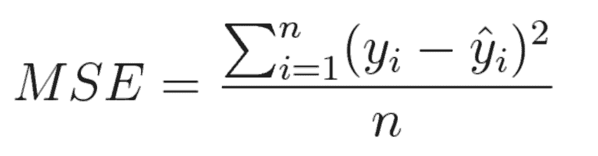

# 入门 | 机器学习中常用的损失函数你知多少？

选自 towards data science

**作者：Ravindra Parmar**

 ****机器之心编译**

**参与：李诗萌、王淑婷**

> 本文作者将常用的损失函数分为了两大类：分类和回归。然后又分别对这两类进行了细分和讲解，其中回归中包含了一种不太常见的损失函数：平均偏差误差，可以用来确定模型中存在正偏差还是负偏差。


*损失函数和优化*

机器通过损失函数进行学习。这是一种评估特定算法对给定数据建模程度的方法。如果预测值与实际结果偏离较远，损失函数会得到一个非常大的值。在一些优化函数的辅助下，损失函数逐渐学会减少预测值的误差。本文将介绍几种损失函数及其在机器学习和深度学习领域的应用。

没有一个适合所有机器学习算法的损失函数。针对特定问题选择损失函数涉及到许多因素，比如所选机器学习算法的类型、是否易于计算导数以及数据集中异常值所占比例。

从学习任务的类型出发，可以从广义上将损失函数分为两大类——回归损失和分类损失。在分类任务中，我们要从类别值有限的数据集中预测输出，比如给定一个手写数字图像的大数据集，将其分为 0～9 中的一个。而回归问题处理的则是连续值的预测问题，例如给定房屋面积、房间数量以及房间大小，预测房屋价格。

```py
NOTE 
        n        - Number of training examples.
        i        - ith training example in a data set.
        y(i)     - Ground truth label for ith training example.
        y_hat(i) - Prediction for ith training example. 
```

**回归损失**

**均方误差/平方损失/L2 损失**

数学公式：



*均方误差*

顾名思义，均方误差（MSE）度量的是预测值和实际观测值间差的平方的均值。它只考虑误差的平均大小，不考虑其方向。但由于经过平方，与真实值偏离较多的预测值会比偏离较少的预测值受到更为严重的惩罚。再加上 MSE 的数学特性很好，这使得计算梯度变得更容易。

```py
import numpy as np
y_hat = np.array([0.000, 0.166, 0.333])
y_true = np.array([0.000, 0.254, 0.998])
def rmse(predictions, targets):
    differences = predictions - targets
    differences_squared = differences ** 2
    mean_of_differences_squared = differences_squared.mean()
    rmse_val = np.sqrt(mean_of_differences_squared)
    return rmse_val
print("d is: " + str(["%.8f" % elem for elem in y_hat]))
print("p is: " + str(["%.8f" % elem for elem in y_true]))
rmse_val = rmse(y_hat, y_true)
print("rms error is: " + str(rmse_val)) 
```

**平均绝对误差/L1 损失**

数学公式：


*平均绝对误差*

平均绝对误差（MAE）度量的是预测值和实际观测值之间绝对差之和的平均值。和 MSE 一样，这种度量方法也是在不考虑方向的情况下衡量误差大小。但和 MSE 的不同之处在于，MAE 需要像线性规划这样更复杂的工具来计算梯度。此外，MAE 对异常值更加稳健，因为它不使用平方。

```py
import numpy as np
y_hat = np.array([0.000, 0.166, 0.333])
y_true = np.array([0.000, 0.254, 0.998])

print("d is: " + str(["%.8f" % elem for elem in y_hat]))
print("p is: " + str(["%.8f" % elem for elem in y_true]))

def mae(predictions, targets):
    differences = predictions - targets
    absolute_differences = np.absolute(differences)
    mean_absolute_differences = absolute_differences.mean()
    return mean_absolute_differences
mae_val = mae(y_hat, y_true)
print ("mae error is: " + str(mae_val)) 
```

**平均偏差误差（mean bias error）**

与其它损失函数相比，这个函数在机器学习领域没有那么常见。它与 MAE 相似，唯一的区别是这个函数没有用绝对值。用这个函数需要注意的一点是，正负误差可以互相抵消。尽管在实际应用中没那么准确，但它可以确定模型存在正偏差还是负偏差。

数学公式：


*平均偏差误差*

**分类损失**

**Hinge Loss/多分类 SVM 损失**

简言之，在一定的安全间隔内（通常是 1），正确类别的分数应高于所有错误类别的分数之和。因此 hinge loss 常用于最大间隔分类（maximum-margin classification），最常用的是支持向量机。尽管不可微，但它是一个凸函数，因此可以轻而易举地使用机器学习领域中常用的凸优化器。

数学公式：


*SVM 损失（Hinge Loss）*

思考下例，我们有三个训练样本，要预测三个类别（狗、猫和马）。以下是我们通过算法预测出来的每一类的值：


*Hinge loss/多分类 SVM 损失*

计算这 3 个训练样本的 hinge loss：

```py
## 1st training example
max(0, (1.49) - (-0.39) + 1) + max(0, (4.21) - (-0.39) + 1)
max(0, 2.88) + max(0, 5.6)
2.88 + 5.6
8.48 (High loss as very wrong prediction)
## 2nd training example
max(0, (-4.61) - (3.28)+ 1) + max(0, (1.46) - (3.28)+ 1)
max(0, -6.89) + max(0, -0.82)
0 + 0
0 (Zero loss as correct prediction)
## 3rd training example
max(0, (1.03) - (-2.27)+ 1) + max(0, (-2.37) - (-2.27)+ 1)
max(0, 4.3) + max(0, 0.9)
4.3 + 0.9
5.2 (High loss as very wrong prediction) 
```

**交叉熵损失/负对数似然：**

这是分类问题中最常见的设置。随着预测概率偏离实际标签，交叉熵损失会逐渐增加。

数学公式：


*交叉熵损失*

注意，当实际标签为 1(y(i)=1) 时，函数的后半部分消失，而当实际标签是为 0(y(i=0)) 时，函数的前半部分消失。简言之，我们只是把对真实值类别的实际预测概率的对数相乘。还有重要的一点是，交叉熵损失会重重惩罚那些置信度高但是错误的预测值。

```py
import numpy as np
predictions = np.array([[0.25,0.25,0.25,0.25],
                        [0.01,0.01,0.01,0.96]])
targets = np.array([[0,0,0,1],
                   [0,0,0,1]])
def cross_entropy(predictions, targets, epsilon=1e-10):
    predictions = np.clip(predictions, epsilon, 1. - epsilon)
    N = predictions.shape[0]
    ce_loss = -np.sum(np.sum(targets * np.log(predictions + 1e-5)))/N
    return ce_loss
cross_entropy_loss = cross_entropy(predictions, targets)
print ("Cross entropy loss is: " + str(cross_entropy_loss))
```

****本文为机器之心编译，**转载请联系本公众号获得授权****。**

✄------------------------------------------------

**加入机器之心（全职记者 / 实习生）：hr@jiqizhixin.com**

**投稿或寻求报道：**content**@jiqizhixin.com**

**广告 & 商务合作：bd@jiqizhixin.com****