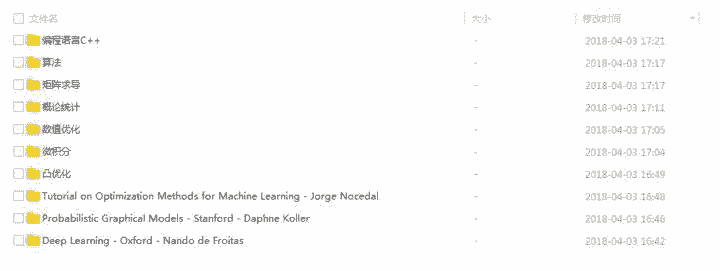

# 专栏 | 从入门到高阶，读懂机器学习需要哪些数学知识（附网盘）

机器之心专栏

**转自公众号：运筹 OR 帷幄（ID：ORycww)**

**作者：******留德华叫兽、王源****

> 本篇文章是由留德华叫兽 在知乎的优秀回答改编扩展而成的， 作者留德华叫兽有着应用数学和硕士运筹学、优化理论的背景转到德国海德堡大学读博，主要从事机器学习、计算机视觉的研究，希望自己的一些经验可以对想入门机器学习的朋友们有点借鉴作用。作者王源对数学优化和机器学习都有涉及，在原回答的框架下加入了自己学习过程的经验和理解，并收集了相关优秀课程的资源链接供大家参考。同时文末还给出了本文所述的全套优秀课程的网盘链接资源（包括视频，英文字幕，课件，参考书籍等等）。

本篇文章想要说明的是数学并非认识世界的唯一途径，即使数学水平不高的你同样也可以开展机器学习方面的工作和研究。但是不可否认数学是自然科学领域探究真理的有效工具，有了强大的数学背景知识会让你看待问题更加深刻，这就是我们经常会看到很多大牛们都是出身数学专业。另外本文所列举的课程比较多，要想一下子去穷尽所有课程显然也不现实，大可不必打好所有的数学基础再去学机器学习，最好的做法是当你对机器学习本身的理解达到一定瓶颈的时候，你可以补一补一些相关的数学基础之后再回去看机器学习的问题也许会更快的有所突破。所以本文针对不同学习基础的朋友们，划分初，中，高三个学习阶段，供大家在学习中进一步去取舍。

首先对人工智能、机器学习一个综述：

**大话“人工智能、数据科学、机器学习”--综述 - 知乎专栏（****https://zhuanlan.zhihu.com/p/26645993****）**

笼统地说，原理和基础都在数学这边，当然有很多偏应用和软件使用的技术，例如“深度学习调参”等，这些报个培训速成班就能学会的技术含量不那么高的东西，不在讨论范围内。

这里要讨论的，是如何系统的学习，然后自己能编出这机器学习或深度学习的程序或软件－－我想，这才能称为一个合格的机器学习、数据科学家。

## 

**1.入门基础**

1, 微积分（求导，极限，极值）例如传统的 BP 神经网络的训练算法实际上是基于复合函数求导的链式法则，又比如目前多数的监督学习训练算法都基于极大似然估计，而极大似然估计的求解往往涉及求导，求极值的内容。

*   微积分是最基础的数学内容了，平时我们接触的用的也是最多的，微积分的教材和课程也是多如牛毛，我也就不推荐特别正式的课程了，仅仅推荐一个 Essence of calculus（**https://goo.gl/sfHext**），作者以拉风的动画，深入的理解带你回顾一下微积分的关键概念。

2, 线性代数（矩阵表示、矩阵运算、特征根、特征向量）是基础中的基础，主成分分析（PCA）、奇异值分解（SVD）、矩阵的特征分解、LU 分解、QR 分解、对称矩阵、正交化和正交归一化、矩阵运算、投影、特征值和特征向量、向量空间和范数（Norms），这些都是理解机器学习中基本概念的基础。某篇图像分割 1w+引用的神文核心思想便就求解构造矩阵的特征向量。

国内的线性代数教材偏重于计算而忽视了线性空间，特征值等基本概念阐述。我个人也是在接触机器学习的内容后发现自己的线性代数基础并不牢固，下决心恶补线性代数，下面我推荐几个课程。

*   线性代数课程首推  MIT 的 Gilbert Strang 老爷子的课程。第一次听老爷子的课程，看到矩阵乘法竟然有四种理解方式的时候着实是惊呆了，原来线性代数可以这么美。看到 SVD 分解的时候马上就能感觉到 SVD 分解能在很多场景排上大用场。同时该课程深入浅出，相信一般本科生都可以看懂。课程链接如下：Video Lectures | Linear Algebra | Mathematics | MIT OpenCourseWare（**http://t.cn/RmyqB2v**）

*   3Blue1Brown 的 Essence of linear algebra（**https://goo.gl/ZuwgNK**）以非常直观的角度审视了线性代数的重要概念，直观但不失深刻，配合上高大上的动画效果，让人体会到了大道至简的感觉。一共 15 个视频，每段视频大约十分钟左右，花费不了多少时间就能看完。

3, 数据处理当然需要编程了，因此 C/C++/Python 任选一门（推荐 Python，因为目前很多库和 Library 都是用 Python 封装），数据结构可以学学，让你编程更顺手更高效，但是编程不是数据处理的核心。熟练使用 Matlab 或者 Python 调用 opencv 库是必要条件，但是 again 他们只是工具，业余时间自学，多练练就没问题。有同学问用 R 行不行，补充一点，用什么编程语言很大部分取决于你的核心算法会调用什么已有的库函数，比如楼主的科研里面核心算法往往是 MIP（混合整数规划）问题需要调用 Cplex 或 Gurobi 库函数，因此 C/C++/Python/Java 这些和 Cplex 接口良好的语言都可以拿来用，这时候 R 就别想了。(更新：最新 Gurobi 版本支持 R)

另外虽然图像处理界一些 open-source 的 code 都用 C++写的，但是鉴于使用方便都会提供 Python 的接口，因此需要用到这些 code 的话，用 Python 调用比较方便；但是，如果是高阶骨灰级玩家，需要修改甚至自己写源代码，那么还是推荐 C/C++，因为他们的速度最快。

我个人用的比较多的是 C++和 Python，因此下面推荐二个课程，

*   C++我觉得 coursera 上的 **C++程序设计（https://goo.gl/eAGvSz）** 就很好，适合有 C 语言基础的人去进一步学习。国内多数工科出身的非计算机软件专业的学生一般都只学过 C 语言，而 C 语言本身的风格比较“硬”，从 C 语言转到面向对象的程序设计，需要有一个思想上的适应过程。

*   优达学城上的**计算机科学导论(https://goo.gl/Lp3YjJ )**是一门零基础的 Python 入门课程。该课程的特点是深入浅出的授课方式，在讲解 Python 语法的同时背后潜移默化的传递着程序设计的思想，包括数据结构，代码风格，Debug 的小技巧。课程中间还穿插入一些对大牛的采访，大大提高了课程丰富性。

*   最后说一下 C++的经典教材 C++ prime plus，该书的厚度达到了一个很厚的境界，初学者基本不可能从头看到尾，更倾向于本书是一个字典式的查询式的书籍，需要的时候读其中 1-2 章节。套用一句经典语：不要想着一下子掌握一门编程语言的所有特性。

4, 算法（算法复杂度）。通常高校都会有算法类的课程，会概述各类算法的基础和应用，其中包括：精确算法、近似算法、启发式算法、演化算法、递归算法、贪婪算法等待，还有各类优化算法。这部分内容很多会和数据结构相互关联。算法非常核心，想必大家都听说过算法工程师这个职位。关于数学模型和算法的区别、联系，参见：

[【学界】整数规划精确算法/近似算法/(元)启发算法/神经网络方反向传播等算法的区别与关联](http://mp.weixin.qq.com/s?__biz=MzUxMTYwMzI0OQ==&mid=2247483848&idx=1&sn=371b705fd075e3f9f54d317034ec198f&chksm=f9706696ce07ef80a2a80cb5bfde21ef5b1a9d7edceaa16616b91ff61e7c1bb5c1c07012cfc9&scene=21#wechat_redirect)

*   算法类的课程我推荐 coursera 上面的 **Algorithms(https://goo.gl/at64Gz)**, 这个课程分为 part1 和 part2 两部分。该课程基于 Java 语言，个人觉得熟悉任何一门面向对象的语言（例如：C++)也不妨碍对该课程的学习。对于非 CS 出身的同学，该课程有相当的难度，课件的动画非常赞能够帮助你很形象的去理解各种算法，同时对算法的理论分析也有相当的深度（如果对理论的推导不感兴趣可以跳过，先暂时直接记住结论也行）。

5, 矩阵求导，这里把矩阵求导单独拎出来貌似是有点突兀了，因为矩阵求导和前四块内容比起来根本不是一个层次上的。我个人在开始学习机器学习的过程对矩阵求导产生了极大的疑惑，后来发现有类似疑惑的同学也不少，同时由于矩阵求导貌似是一个三不管的地带，微积分里的多元函数求导貌似是讲了点，矩阵分析可能也有涉及到的，但是缺乏一个统一的理论。很多监督学习的问题多半是一个极大似然估计问题，而这个极大似然估计问题多半是一个优化问题，而这个优化问题的求解多半依赖于矩阵求导得到最优解，最典型的例子就是逻辑回归了。下面推荐两个矩阵求导的材料供大家参考

*   **矩阵求导(http://t.cn/RmyKx2s)**

*   **The Matrix Cookbook.(http://t.cn/RmyK6Od)**

## 

**2.中级教程**

1，概率论+统计（很多数据分析建模基于统计模型）、统计推断、随机过程。可以毫不夸张的说，概率论+统计是机器学习的核心数学理论，前面提到的微积分和线性代数实际上是扮演打工仔的角色。进一步说大多数情况下，我们会依据概率论+统计推到出一个机器学习模型或者算法，而最终的计算过程往往要依赖微积分和线性代数。所以如果你仅仅是实现一个机器学习算法，那么掌握初级教程里边提到的微积分和线性代数就足够了，如果你想进一步探究机器学习算法为什么是这样的，你想解释机器学习模型为什么好用或者不好用，就需要概率论+统计的知识。

*   实话说概率统计的课程和教材看过不少，至今对概率统计的理解仍然不够。相信绝大多数工科生在本科都学过概率论与数理统计这门课，但是很多教材未能体现出概率真正的思想，名为概率论实际上改名叫做“各种概率分布的介绍”更为妥当，基本上这类教材的节奏都一样先介绍一种分布，然后开始求期望，求方差，求条件分布，各种微积分或组合数的运算啊。经过多年的摸爬滚打的经验，我推荐下面两门课程。

*   一个是 MIT 的概率系统分析与应用概率**Probabilistic Systems Analysis and Applied Probability(https://goo.gl/stzNFZ)**，这个是课程主页，课程视频相关资料和教材都有。这门课的主要教材是**introduction to probability(https://goo.gl/qWeZzM)**，作者是 Dimitri P. Bertsekas，作者以幽默的语言去诠释概率论，这一点是非吸引人的。

*   国内也有一个不错的教材，就是陈希儒的概率论与数理统计，该教材最经典的莫过于，用一个时间段内某个路口发生交通事故的实例去解释泊松分布为啥是这个长这个样子，力图告诉你分布背后的故事，而不是拘泥于计算。该课程也有网络视频课程不熟悉英文课程的同学也可参考 **中科大 概率论与数理统计(http://t.cn/RmyKd8W)**

2，线性规划+凸优化（或者只学一门叫 Numerical optimization，统计、机器学习到最后就是求解一个优化问题）、非线性规划等。个人觉得机器学习里边最常用到的优化内容都是属于 Numerical optimization 和 凸优化的，所以各推荐一门课程学习。

*   凸优化自然是首推 Stephen Boyd 和 Lieven Vandenberghe 的 教材**Convex optimization(http://t.cn/Rmy9Z9w)**** 与该教材对应的斯坦福的课程为 **Convex optimization(https://goo.gl/inJExJ)**。该书分为三部分，理论（主要介绍凸集，凸函数，凸优化等等概念），应用（凸优化在各种问题上的应用，只有真正的做过这些应用问题才能对这一章感悟很深），算法（这部分相对来说比较普通）。本人在博士一年级的时候购买了该书的纸质版，目前这本书已经快被翻烂了，每次看这本书都有新的感悟，尤其是应用这个部分。初学者建议先可以放一放应用这个部分，把理论部分啃下来，然后看看算法这部分。**

***   Numerical optimization 的主要内容是 基于梯度的优化算法，线搜索方法，线性规划，可微的非线性规划问题。这里推荐 Jorge Nocedal 和 Stephen J.Wright 的 Numerical optimization 与该教材对应的课程为 **Numerical optimization(http://t.cn/Rmy9eQV)**。该教材的特点是基本上把最常见的优化问题都覆盖了，同时完全可以感受到虽然是优化教材但是其思想很计算机，作者总是会用一些小技巧来千方百计的降低算法的计算量（就像数据结构里边的算法一样）。不同于上面那本凸优化书理论气息过于严重，本书的作者基本上是以算法为核心（虽然数学理论证明也一点不少），算法伪代码很多，如果会一门编程语言的同学马上就可以去实践了。初学者可以适当抛开部分数学理论证明，更多的放到理解算法 Motivation 上去，同时亲自去实践这些算法会更好一些。** 

 **3，数值计算、数值线代等

当年我是在数学系学的这门课，主要是偏微分方程的数值解。但我觉得其开篇讲的数值计算的一些 numerical issue 更为重要，会颠覆一个数学系出身小朋友的三观。(原来理论和现实差距可以这么大！) Conditional number, ill-conditioned problem，会让你以后的编程多留个心眼。

@留德华叫兽

这里提到了偏微分方程数值解，偏微分方程的理论一般是数学系才会学的课程，而且我们一般人的感受是偏微分方程和机器学习啊这些东西很遥远很遥远。其实也并非如此，一些研究者把偏微分方程和 Deep neural networks 结合在一起了，用偏微分方程对 SGD 进行建模进而进行一些分析。文章发表在 arx 上 **DEEP RELAXATION: PARTIAL DIFFERENTIAL EQUATIONS FOR OPTIMIZING DEEP NEURAL NETWORKS(http://bit.ly/2uLzBOY)**，不得不说作者的脑洞还是比较大的。

恭喜你，到这里，你就可以无压力地学习 Machine Learning 这门课了（其实机器学习，通篇都是在讲用一些统计和优化来做 clustering 和 classification 这俩个人工智能最常见的应用）。并且你就会发现，ML 课中间会穿插着很多其他课的内容。恩，知识总是相通的嘛，特别是这些跨专业的新兴学科，都是在以往学科的基础上由社会需求发展而来。

到这里，其实你已经能看懂并且自己可以编写机器学习里面很多经典案例的算法了，比如 regression，clustering，outlier detection。

关于优化类课程的综述，欢迎关注我的专栏：

[运筹帷幄]大数据和人工智能时代下的运筹学 - 知乎专栏（https://zhuanlan.zhihu.com/operations-research）

**运筹学（最优化理论）如何入门？ - 知乎（http://t.cn/RlNoHiM）**

学到 Mid-level，就已经具备绝大部分理论基础了。然后做几个实际项目，就能上手然后就可以“吹嘘”自己是搞机器学习的，就能找到一份工作了。

但是要读 Phd 搞机器学习的科研，那么高阶课程必不可少，而且同一个 topic 你需要上好几门课，并且你博士的课题，很可能只是一本书中一个章节里面一小节里讲的算法，去改进他。

比如，楼主的博士课题就是 mixed linear programming + discrete graphical models + markov random fields +regression + clustering + segmentation。

## 

**3.高阶课程**

再高阶的课程，就是比较 specific 的课程了，可以看你做的项目或者以后的 concentration 再选择选修，比如：Probabilistic Graphical Models（概率图模型）， Integer Programming（整数规划），计算机视觉，模式识别，视频追踪，医学图像处理，增强学习，深度学习, 神经网络，自然语言处理，网络信息安全，等等等等。

深度学习：目前非常火，打败了非常多几十年积累起来的经典方法。

增强学习：也很火，游戏 AI、自动驾驶、机器人等等，它都是核心。

概率图模型：深度学习之前非常 popular 的“学习”方法，有严格的数学模型和优美的算法，虽然目前被前俩者盖过了风头，但是依然有它的立足之处。什么？你不知道最近用 PGM 发了篇 Nature，打败了 CNN？快看下面：

**Robin Shen：如何评价 Vicarious 在 Science 上提出基于概率图模型（PGM）的 RCN 模型？（http://t.cn/RlNoFhH）**

再比如有用偏微分方程做图像处理的（比较小众），那么这时候你肯定要去学一下偏微分方程了，大都是以科研为主导的。

科研嘛，为了发文章，就是要尝试前人没尝试过的方法，万一效果不错呢，就是一篇好 paper 了，对吧。

附上顶尖会议排名，共勉：

**国际“顶尖”计算机视觉、机器学习会议大搜罗--附排名&接收率（https://zhuanlan.zhihu.com/p/28037164）**

互联网教学资源

书目没有特别推荐的，但是建议看英文原版。

楼主推荐海德堡大学历史上最年轻的教授 Fred 的机器学习视频（我基本都看过）：(**https://goo.gl/umwQEg**)另外一个教授给你上课的时候，开头一般是会推荐书给你的（如果你确实喜欢看书的话）。当然了，翻墙是楼主 suppose 你们需要拥有的基本生存技能。

（注：以下再推荐一些视频，仅受之以渔，多为 graduate course）

1，Machine Learning by Prof. **Nando de Freitas(****https://goo.gl/WGLRp7**)， 此视频是其在 UBC 时 13 年所录，后来跳槽去牛津计算机系了。(**https://goo.gl/a8avcx)**

2，Deep learning at Oxford 2015 by Prof. **Nando de Freitas(https://goo.gl/WGLRp7)**， 跳槽到牛津所录。

(**https://goo.gl/I5abw8**)

3，Probabilistic Graphical Models by Daphne Koller, 斯坦福大学计算机系教授(**https://goo.gl/WL1ZrQ**)

## 

**4.总结**

经过楼主殚精竭虑的整理，以上优秀课程的全套网盘链接资源（包括视频，英文字幕，课件，参考书籍等等），您可以轻松获得。配合本人上面所述的亲身学习经历，相信您可以选择出合适自己的课程开始学习的征途。

需在「运筹 OR 帷幄」公众号回复关键字 “**机器学习** "，获取网盘链接

下图是网盘资源预览：

作者简介：

**留德华叫兽**  系美国克莱姆森大学运筹学硕士，Ph.D. Candidate，师从整数规划大师 W. Adams，后跳槽至欧盟玛丽居里博士项目，期间前往意大利 IBM Cplex 实习半年，巴黎综合理工学术访问一季，现任德国海德堡大学交叉学科计算中心、组合优化实验室研究员，师从组合优化大师 G. Reinelt，主攻计算机视觉、（医学）图像处理。

**王源**  系流程工业综合自动化国家重点实验室，东北大学系统工程专业博士在读。研究方向为工业领域调度问题和运行优化问题。博士初期主要学习 Numerical optimization， Convex optimization，Nonlinear programming 相关知识，用以解决实际工业过程中的优化问题。因近年人工智能机器学习大火，因而研究重心逐渐从数学优化转至机器学习相关领域。探索新领域，不忘老本行，希望能从优化角度看待机器学习问题。

****本文为机器之心经授权转载，二次**转载请联系原作者获得授权****。**

✄------------------------------------------------

**加入机器之心（全职记者/实习生）：hr@jiqizhixin.com**

**投稿或寻求报道：editor@jiqizhixin.com**

**广告&商务合作：bd@jiqizhixin.com****