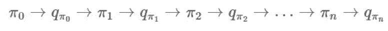
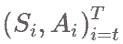
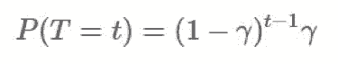
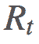
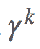
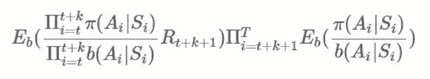

# 详解蒙特卡洛方法：这些数学你搞懂了吗？

选自 oneraynyday

**作者：****Ray Zhang**

****机器之心编译****

**参与：Panda**

> > 加州大学洛杉矶分校计算机科学专业的 Ray Zhang 最近开始在自己的博客上连载介绍强化学习的文章，这些介绍文章主要基于 Richard S. Sutton 和 Andrew G. Barto 合著的《Reinforcement Learning: an Introduction》，并添加了一些示例说明。该系列文章现已介绍了赌博机问题、马尔可夫决策过程和蒙特卡洛方法。本文是对其中蒙特卡洛方法文章的编译。更多相关文章和最新更新可访问：https://oneraynyday.github.io
> 
> **目录**
> 
> 1.目录
> 
> 2.引言
> 
> *   first-visit 蒙特卡洛
>     
>     
> 
> 3.蒙特卡洛动作值
> 
> 4.蒙特卡洛控制
> 
> *   探索开始
>     
>     
> *   在策略：ϵ-贪婪策略
>     
>     
> 
> *   ϵ-贪婪收敛 
>     
>     
> 
> *   离策略：重要度采样
>     
>     
> 
> *   离策略标记法
>     
>     
> *   普通重要度采样
>     
>     
> *   加权重要度采样
>     
>     
> *   增量实现
>     
>     
> *   其它：可感知折扣的重要度采样
>     
>     
> *   其它：预奖励重要度采样
>     
>     
> 
> 5.用 Python 实现的在策略模型
> 
> *   示例：Blackjack
>     
>     
> *   示例：Cliff Walking
>     
>     
> 
> 6.总结
> 
> 之前我们讨论过马尔可夫决策过程（MDP，参阅 https://goo.gl/wVotRL）以及寻找最优的动作-价值函数和的算法。我们使用了策略迭代和价值迭代来求解最优策略。
> 
> 有用于强化学习的动态编程解决方案是挺好的，但这也有很多限制。比如是否存在很多你知道状态转移概率的真实世界问题？你能一开始就从任意状态起步吗？你的 MDP 是否是有限的？
> 
> 那么，我认为你会很乐意了解蒙特卡洛方法。这是一种可近似困难的概率分布的经典方法，可以解决你对动态编程解决方案的所有担忧！
> 
> 同样，我们会按照 Richard Sutton 的强化学习教材《Reinforcement Learning: An Introduction》进行讲解，并会给出一些该书中没有的额外解释和示例。
> 
> **引言**
> 
> 蒙特卡洛模拟（Monte Carlo simulations）得名于摩纳哥的赌城，因为几率和随机结果是这种建模技术的核心，所以它就像是轮盘赌、骰子和老虎机等游戏一样。
> 
> 相比于动态编程，蒙特卡洛方法会以一种全新的方式看待问题。其提出的问题是：我需要从环境中获取多少样本才能将好策略与差策略区分开？
> 
> 这时候，我们需要重新引入「回报（return）」的概念，这是指长期运行的期望增益：
> 
> 
> 
> 有时候，如果 episode 有持续有限时间的非零概率，那么我们将使用一个折扣因子：
> 
> 
> 
> 我们将这些回报 与可能的 关联起来，以推导某种类型的：
> 
> 
> 
> 根据大数定律，当 N 趋近 ∞ 时，我们可以得到确切的期望。我们用 i 指代第 i 次模拟。
> 
> 现在，如果这是一个 MDP（99% 的强化学习问题都是），那么我们知道其会表现出强马尔可夫性（Strong Markov Property），即：
> 
> 
> 
> 使用这个性质，我们可以轻松推导出这个事实：期望中的 t 是完全无关的，从现在起我们将使用 Gs 来表示从某个状态（将该状态移至 t=0）开始的回报。
> 
> **first-visit 蒙特卡洛**
> 
> 求解价值函数的一种经典方法是采样 s 的第一次出现的回报，这种方法被称为 first-visit 蒙特卡洛预测。然后可用下面的算法找到最优的 V：
> 
> ```py
> pi = init_pi()
> returns = defaultdict(list)
> for i in range(NUM_ITER):
>     episode = generate_episode(pi) # (1)
>     G = np.zeros(|S|)
>     prev_reward = 0
>     for (state, reward) in reversed(episode):
>         reward += GAMMA * prev_reward
>         # backing up replaces s eventually,
>         # so we get first-visit reward.
>         G[s] = reward
>         prev_reward = reward
>     for state in STATES:
>         returns[state].append(state)
> V = { state : np.mean(ret) for state, ret in returns.items() } 
> ```
> 
> 另一种方法被称为 every-visit 蒙特卡洛预测，其中我们在每个 episode 中都会采样 s 的每次出现的回报。在这两种情况下，估计结果都会以二次方式收敛到期望。
> 
> **蒙特卡洛动作值**
> 
> 有时候，我们并不知道环境的模型，即我们不知道怎样的动作会导致怎样的状态，以及环境一般的交互方式。在这种情况下，我们可以使用动作值而非状态值，也就是说我们求解的是 q∗
> 
> 我们希望估计而非。将 G[s] 简单地改成 G[s,a] 似乎很恰当，事实也确实如此。一个显然的问题是：现在我们从 S 空间变成了 S×A 空间，这会大很多，而且我们仍然需要对其进行采样以找到每个状态-动作元组的期望回报。
> 
> 另一个问题是，随着搜索空间增大，如果我们在我们的策略方面过快地变得贪婪，那就越来越有可能我们也许无法探索所有的状态-动作对。我们需要适当地混合探索（exploration）和利用（exploitation）。我将在下一节解释我们克服这一问题的方法。
> 
> **蒙特卡洛控制**
> 
> 回想一下来自马尔可夫决策过程的策略迭代。这种情况没有太大的差别。我们仍然固定我们的 π，寻找，然后寻找一个新的 π′ 再继续。大致过程就像这样：
> 
> 
> 
> 我们寻找的方式类似于上面我们寻找 v 的方式。我们可以通过贝尔曼最优性方程（Bellman optimality equation）的定义改善我们的 π，简单来说就是：
> 
> 
> 
> 有关于此的更多详情请参阅之前的马尔可夫决策过程相关博文。
> 
> 现在，在蒙特卡洛方法的语境中，策略迭代的核心关键是：我们如何确保探索与利用的情况？
> 
> **探索开始**
> 
> 一种弥补大型状态空间探索的方法是指定我们从一个特定的状态开始，然后采取一个特定的动作，再在所有可能性上循环以采样它们的回报。这假设我们可以从任意状态开始，然后在每个 episode 开始时采取所有可能的动作；这在很多情况下都不是合理的假设。但是，对于二十一点（BlackJack）这样的问题，这是完全合理的，这意味着我们可以轻松解决我们的问题。
> 
> 在代码中，我们只需要给我们 (1) 处的代码加个小补丁即可：
> 
> ```py
> # Before (Start at some arbitrary s_0, a_0)
> episode = generate_episode(pi)
> # After (Start at some specific s, a)
> episode = generate_episode(pi, s, a) # loop through s, a at every iteration. 
> ```
> 
> **在策略：ϵ-贪婪策略**
> 
> 所以，如果我们不能假设我们可以从任何任意状态开始和采取任意动作，又如何呢？那么只要我们不太贪婪并且多次无限地探索所有状态，那么我们就可以确保收敛，是这样吗？
> 
> 上述内容本质上是在策略（on-policy）方法的主要特性之一。在策略方法是要试图改善当前正在运行试验的策略，而离策略（off-policy）方法则是想试图提升不同于当前运行试验的策略的另一个策略。
> 
> 有了这个说法，我们需要形式化「不太贪婪」。一种简单方法是使用所谓的「k-摇臂赌博机- ϵ-贪婪方法（k-armed bandits - ϵ-greedy methods）」！简单来说，给定一个状态，我们有 ϵ 概率会从所有动作的均匀分布中选取，有 1-ϵ 的概率选取 动作。
> 
> 现在我们的问题是：这会收敛到蒙特卡洛方法的最优 π∗ 吗？答案是：会收敛，但不会收敛到那个策略。
> 
> **ϵ-贪婪收敛**
> 
> 我们从 q 和一个 ϵ-贪婪策略 π′(s) 开始。
> 
> 
> 
> 同样，我们可以这样陈述：这个 ϵ 贪婪策略，就像任何贪婪策略一样，会在 上执行单调的提升。如果我们支持所有时间步骤，那么会得到：
> 
> 
> 
> 这就是我们收敛所需的。
> 
> 但是，我们需要找到这一策略实际会收敛到的位置。很显然，即使最优策略是确定性，因为我们迫使我们的策略是随机的，所以无法保证收敛到 π∗。但是，我们可以重构我们的问题：
> 
> 假设不再让我们的策略具有以概率 ϵ 均匀选择动作的随机性，而是让我们的策略具有能随机选取动作而不管策略如何规定的环境。那么，我们就可以保证有最优解。其证明的大致过程是，在 (1) 中，如果等式成立，那么我们有 π=π′，因此，则由于该环境的设置，方程在随机性下是最优的。
> 
> **离策略：重要度采样**
> 
> 1).离策略标记法
> 
> 现在介绍一些新术语！
> 
> *   π 是我们的目标策略（target policy）。我们试图优化这个策略的期望回报。
>     
>     
> *   b 是我们的行为策略（behavioral policy）。我们使用 b 来生成 π 之后会用到的数据。
>     
>     
> *   这是覆盖率（coverage）的概念。
>     
>     
>     
> 
> 离策略方法通常有 2 个或更多智能体，其中一个会生成数据，以让另一个智能体在这些数据上进行优化。我们将它们分别称为行为策略和目标策略。离策略方法比在策略方法更「炫酷」，就像神经网络比线性模型更「炫酷」一样。类似地，离策略方法通常更加强大，但也有模型的方差更高和收敛更慢的问题。
> 
> 现在我们来谈谈重要度采样（importance sampling）。
> 
> 重要度采样回答的是这个问题：「给定，则是怎样的？」换句话说，你该怎样使用你从 b 的采样得到的信息来确定来自 π 的期望结果？
> 
> 你可以用这种直观的方式思考它：「如果 b 选择 a 很多次且 π 也选择 a 很多次，则 b 的行为对确定 π 的行为而言应该是重要的。」反过来讲：「如果 b 选择 a 很多次且 π 从未选择 a，则 b 在 a 上的行为对 π 在 a 上的行为而言应该没有任何重要性。」有道理，对不对？
> 
> 这差不多就是重要度采样比（importance-sampling ratio）的意思了。给定一个轨迹，这个确切轨迹在给定策略 π 时的概率为：
> 
> 
> 
> π 和 b 之间的比即为：
> 
> 
> 
> 2).普通重要度采样
> 
> 现在，有很多可以利用这个的方法，以给我们提供一个 的优良估计。最基本的方法是使用被称为普通重要度采样（ordinary importance sampling）的技术。假设我们有采样得到的 N 个 episode：
> 
> 
> 
> 并将 s 的第一次到达时间表示为：
> 
> 
> 
> 我们想要估计，然后我们可以通过 first-visit 方法使用实验的均值来估计价值函数：
> 
> 
> 
> 当然，这可以轻松泛化成一种 every-visit 方法，但我只想呈现最简单的形式，理解要点就行了。也就是说，我们需要以不同的方式给每个 episode 的回报加权，因为对于 π 来说，更有可能发生的轨迹应该比永远不会发生的轨迹有更大的权重。
> 
> 重要度采样方法是一种无偏差估计器（unbiased estimator），但它有极端方差问题（extreme variance problems）的麻烦。假设某第 k 个 episode 的重要度比是 1000。这是个很大的比值，但绝对有可能发生。这是否意味着奖励必然会多 1000 倍？如果我们只有 1 个 episode，我们的估计就会是那样。在长期运行时，因为我们有乘法关系，所以这个比值可能要么会爆炸，要么就会消失。这对估计的目的而言是有一点问题的。
> 
> 3).加权重要度采样
> 
> 为了降低方差，降低估计的幅度是一种简单又直观的方法，具体做法是除以所有重要度比的幅度的总和（有点类似于一个 softmax 函数）：
> 
> 
> 
> 这被称为加权重要度采样（weighted importance sampling）。这是一种有偏差估计（其偏差会渐渐向 0 趋近），但方差更小。在此之前，人们可以为普通估计器提出糟糕的无界方差（unbounded variance），但这里的每一项的最大权重都为 1，这限制了方差的上界。Sutton 建议说，在实践中，总是使用加权的重要度采样。
> 
> 4).增量实现
> 
> 和很多采样技术一样，我们可以增量地实现它。假设我们使用了前一节介绍的加权重要度采样方法，那么我们可以有一些这种形式的采样算法：
> 
> 
> 
> 其中是我们的权重。
> 
> 我们希望基于 构建，这是非常可行的。用 表示，则我们可以保持这个运行总和的更新，即：
> 
> 
> 
>  的更新规则相当明显：
> 
> 
> 
> 现在， 是我们的价值函数，但在我们的动作值 上也可以应用一个非常类似的类比。
> 
> 在我们更新价值函数的同时，我们也可以更新我们的策略 π。我们可以使用古老又好用的更新我们的 π。
> 
> 警告：前方有大量数学内容。目前已有的信息实际已经够用了，但下面的介绍会让我们更接近现代的研究课题。
> 
> 5).其它：可感知折扣的重要度采样
> 
> 到目前为止，我们已经统计了回报，并且采样了回报以得到我们的估计。但是，我们忽略了 G 的内部结构。它实际上只是折扣奖励的和，而且我们无法将其整合进我们的比值 ρ 中。可感知折扣的重要度采样（discount-aware importance sampling）模型 γ 是一种终止概率，即 episode 在某个时间步骤 t 终止的概率，因此必然是一个几何分布 ∼geo(γ)：
> 
> 
> 
> 而完全回报可被视为是在随机变量的随机数上的期望：
> 
> 
> 
> 可以这样构建一个任意伸缩和（telescoping sum）：
> 
> 
> 
> 归纳起来，我们可以看到对于从 x 开始的 k，我们有。
> 
> 
> 
> 将其代入 G 中：
> 
> 
> 
> 这将导致在 项上的等效系数为 1、γ、γ2。这意味着我们现在可将 分解成不同的部分并在重要度采样比上应用折扣。
> 
> 现在回想一下，之前我们有：
> 
> 
> 
> *（加权重要度采样)*
> 
> 如果我们扩展 G，我们会有，总和中的一个分子为：
> 
> 
> 
> 注意我们在所有回报上应用同一比值的方式。其中某些回报乘上了整个轨迹的重要度比，这在「γ 是终止概率」的建模假设下是「不正确的」。直观来看，我们希望
> 
>  有，这是很简单的：
> 
> 
> 
> 这样就好多了！这样，每一部分回报都会有自己合适的比。这能极大地消除无界方差问题。
> 
> 6).其它：预奖励重要度采样
> 
> 这是另一种缓解有问题的 ρ 及其方差问题的方法，我们可以将 G 分解成它各自的回报并执行一些分析。来看一看：:
> 
> 
> 
> 对于每一项，我们有。扩展 ρ，我们可以看到：
> 
> 
> 
> 取没有恒定的的期望：
> 
> 
> 
> 回想一下，当且仅当它们独立时，你只能取 E(AB)=E(A)E(B)。根据马尔可夫性质，很显然如果 i≥t+k+1 且，那么任何和独立于
> 
> （对 b 的情况也一样）。我们可以将它们取出，然后得到：
> 
> 
> 
> 这可能看起来很丑陋，但可以观察到：
> 
> 
> 
> 因此我们实际上可以完全忽略后半部分：
> 
> 
> 
> 这意味着什么？我们实际上可以用期望表示我们原来的和：
> 
> 
> 
> 然后这又能再次降低我们的估计器的方差。
> 
> **用 Python 实现的在策略模型**
> 
> 因为蒙特卡洛方法一般都有相似的结构，所以我用 Python 做了一个离散的蒙特卡洛模型类，而且是可以即插即用的。你也可以在这里找到这些代码：https://github.com/OneRaynyDay/MonteCarloEngine。这已经经过了文档测试（doctest）。
> 
> ```py
> """
> General purpose Monte Carlo model for training on-policy methods.
> """
> from copy import deepcopy
> import numpy as np
> 
> class FiniteMCModel:
>     def __init__(self, state_space, action_space, gamma=1.0, epsilon=0.1):
>         """MCModel takes in state_space and action_space (finite) 
>         Arguments
>         ---------
> 
>         state_space: int OR list[observation], where observation is any hashable type from env's obs.
>         action_space: int OR list[action], where action is any hashable type from env's actions.
>         gamma: float, discounting factor.
>         epsilon: float, epsilon-greedy parameter.
> 
>         If the parameter is an int, then we generate a list, and otherwise we generate a dictionary.
>         >>> m = FiniteMCModel(2,3,epsilon=0)
>         >>> m.Q
>         [[0, 0, 0], [0, 0, 0]]
>         >>> m.Q[0][1] = 1
>         >>> m.Q
>         [[0, 1, 0], [0, 0, 0]]
>         >>> m.pi(1, 0)
>         1
>         >>> m.pi(1, 1)
>         0
>         >>> d = m.generate_returns([(0,0,0), (0,1,1), (1,0,1)])
>         >>> assert(d == {(1, 0): 1, (0, 1): 2, (0, 0): 2})
>         >>> m.choose_action(m.pi, 1)
>         0
>         """
>         self.gamma = gamma
>         self.epsilon = epsilon
>         self.Q = None
>         if isinstance(action_space, int):
>             self.action_space = np.arange(action_space)
>             actions = [0]*action_space
>             # Action representation
>             self._act_rep = "list"
>         else:
>             self.action_space = action_space
>             actions = {k:0 for k in action_space}
>             self._act_rep = "dict"
>         if isinstance(state_space, int):
>             self.state_space = np.arange(state_space)
>             self.Q = [deepcopy(actions) for _ in range(state_space)]
>         else:
>             self.state_space = state_space
>             self.Q = {k:deepcopy(actions) for k in state_space}
> 
>         # Frequency of state/action.
>         self.Ql = deepcopy(self.Q)
> 
>     def pi(self, action, state):
>         """pi(a,s,A,V) := pi(a|s)
>         We take the argmax_a of Q(s,a).
>         q[s] = [q(s,0), q(s,1), ...]
>         """
>         if self._act_rep == "list":
>             if action == np.argmax(self.Q[state]):
>                 return 1
>             return 0
>         elif self._act_rep == "dict":
>             if action == max(self.Q[state], key=self.Q[state].get):
>                 return 1
>             return 0
> 
>     def b(self, action, state):
>         """b(a,s,A) := b(a|s) 
>         Sometimes you can only use a subset of the action space
>         given the state.
> 
>         Randomly selects an action from a uniform distribution.
>         """
>         return self.epsilon/len(self.action_space) + (1-self.epsilon) * self.pi(action, state)
> 
>     def generate_returns(self, ep):
>         """Backup on returns per time period in an epoch
>         Arguments
>         ---------
> 
>         ep: [(observation, action, reward)], an episode trajectory in chronological order.
>         """
>         G = {} # return on state
>         C = 0 # cumulative reward
>         for tpl in reversed(ep):
>             observation, action, reward = tpl
>             G[(observation, action)] = C = reward + self.gamma*C
>         return G
> 
>     def choose_action(self, policy, state):
>         """Uses specified policy to select an action randomly given the state.
>         Arguments
>         ---------
> 
>         policy: function, can be self.pi, or self.b, or another custom policy.
>         state: observation of the environment.
>         """
>         probs = [policy(a, state) for a in self.action_space]
>         return np.random.choice(self.action_space, p=probs)
> 
>     def update_Q(self, ep):
>         """Performs a action-value update.
>         Arguments
>         ---------
> 
>         ep: [(observation, action, reward)], an episode trajectory in chronological order.
>         """
>         # Generate returns, return ratio
>         G = self.generate_returns(ep)
>         for s in G:
>             state, action = s
>             q = self.Q[state][action]
>             self.Ql[state][action] += 1
>             N = self.Ql[state][action]
>             self.Q[state][action] = q * N/(N+1) + G[s]/(N+1)
> 
>     def score(self, env, policy, n_samples=1000):
>         """Evaluates a specific policy with regards to the env.
>         Arguments
>         ---------
> 
>         env: an openai gym env, or anything that follows the api.
>         policy: a function, could be self.pi, self.b, etc.
>         """
>         rewards = []
>         for _ in range(n_samples):
>             observation = env.reset()
>             cum_rewards = 0
>             while True:
>                 action = self.choose_action(policy, observation)
>                 observation, reward, done, _ = env.step(action)
>                 cum_rewards += reward
>                 if done:
>                     rewards.append(cum_rewards)
>                     break
>         return np.mean(rewards)
> 
> if __name__ == "__main__":
>     import doctest
>     doctest.testmod() 
> ```
> 
> 如果你想在不同的 gym 使用它，你就要自己动手试试看。
> 
> **示例：Blackjack（二十一点）**
> 
> 我们在这个示例中使用了 OpenAI 的 gym。在这里，我们使用了一个衰减的 ϵ-贪婪策略来求解 Blackjack。
> 
> ```py
> import gym
> env = gym.make("Blackjack-v0")
> 
> # The typical imports
> import gym
> import numpy as np
> import matplotlib.pyplot as plt
> from mc import FiniteMCModel as MC
> 
> eps = 1000000
> S = [(x, y, z) for x in range(4,22) for y in range(1,11) for z in [True,False]]
> A = 2
> m = MC(S, A, epsilon=1)
> for i in range(1, eps+1):
>     ep = []
>     observation = env.reset()
>     while True:
>         # Choosing behavior policy
>         action = m.choose_action(m.b, observation)
> 
>         # Run simulation
>         next_observation, reward, done, _ = env.step(action)
>         ep.append((observation, action, reward))
>         observation = next_observation
>         if done:
>             break
> 
>     m.update_Q(ep)
>     # Decaying epsilon, reach optimal policy
>     m.epsilon = max((eps-i)/eps, 0.1)
> 
> print("Final expected returns : {}".format(m.score(env, m.pi, n_samples=10000)))
> 
> # plot a 3D wireframe like in the example mplot3d/wire3d_demo
> X = np.arange(4, 21)
> Y = np.arange(1, 10)
> Z = np.array([np.array([m.Q[(x, y, False)][0] for x in X]) for y in Y])
> X, Y = np.meshgrid(X, Y)
> 
> from mpl_toolkits.mplot3d.axes3d import Axes3D
> 
> fig = plt.figure()
> ax = fig.add_subplot(111, projection='3d')
> ax.plot_wireframe(X, Y, Z, rstride=1, cstride=1)
> ax.set_xlabel("Player's Hand")
> ax.set_ylabel("Dealer's Hand")
> ax.set_zlabel("Return")
> plt.savefig("blackjackpolicy.png")
> plt.show() 
> ```
> 
> 我们得到了一个看起来相当不错的图表，因为此时没有可用的王牌（因此 Z 中使用了 False 来绘制网格图）。
> 
> 
> 
> 我也写了一个该模型的快速离策略版本，但还尚待完善，因为我只是想得出一个表现基准。下面是结果：
> 
> ```py
> Iterations: 100/1k/10k/100k/1million.
> Tested on 10k samples for expected returns.
> 
> On-policy : greedy
> -0.1636
> -0.1063
> -0.0648
> -0.0458
> -0.0312
> 
> On-policy : eps-greedy with eps=0.3
> -0.2152
> -0.1774
> -0.1248
> -0.1268
> -0.1148
> 
> Off-policy weighted importance sampling:
> -0.2393
> -0.1347
> -0.1176
> -0.0813
> -0.072 
> ```
> 
> 因此，看起来离策略的重要度采样可能更难以收敛，但最终结果比 ϵ-贪婪策略好。
> 
> **示例：Cliff Walking**
> 
> 所需的代码修改实际上很少，因为正如我之前提到的那样，蒙特卡洛采样受环境的影响相当小。我们只需要修改这部分代码（去除绘图部分）：
> 
> ```py
> # Before: Blackjack-v0
> env = gym.make("CliffWalking-v0")
> # Before: [(x, y, z) for x in range(4,22) for y in range(1,11) for z in [True,False]]
> S = 4*12 
> # Before: 2
> A = 4 
> ```
> 
> 然后我们运行这个 gym，Eπ(G) 得到 -17.0。还不错！在 Cliff Walking 问题中，一张地图中有的模块是悬崖，其它的是平台。每一步时，你走在平台上的奖励是 -1，掉下悬崖的奖励是 -100。每当你走在悬崖模块上时，你都要回到开始位置。对于这么大的地图，每 episode -17.0 是接近最优的策略。
> 
> **总结**
> 
> 对于任意具有「奇怪的」动作或观察空间概率分布的任务而言，蒙特卡洛方法在计算最优价值函数和动作价值方面是一种非常好的技术。我们未来还将介绍蒙特卡洛方法的更好变体，但这篇文章也能为你学习强化学习提供很好的基础知识。
> 
> *原文链接：https://oneraynyday.github.io/ml/2018/05/24/Reinforcement-Learning-Monte-Carlo/*
> 
> ****本文为机器之心编译，**转载请联系本公众号获得授权****。**
> 
> ✄------------------------------------------------
> 
> **加入机器之心（全职记者 / 实习生）：hr@jiqizhixin.com**
> 
> **投稿或寻求报道：**content**@jiqizhixin.com**
> 
> **广告 & 商务合作：bd@jiqizhixin.com**