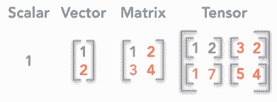

# 资源 | 用 Python 和 NumPy 学习《深度学习》中的线性代数基础

选自 KDnuggets

**作者：Hadrien Jean**

**机器之心整理**

**参与：刘晓坤**

> 本文系巴黎高等师范学院在读博士 Hadrien Jean 的一篇基础学习博客，其目的是帮助初学者/高级初学者基于深度学习和机器学习来掌握线性代数的概念。掌握这些技能可以提高你理解和应用各种数据科学算法的能力。

对于初学者而言，《深度学习》（Ian Goodfellow、Yoshua Bengio、Aaron Courville）中的理论基础部分可能过于简略。作者按照这本书的第二章的线性代数内容来逐一介绍机器学习中的线性代数基础，读者可以在原书、中译版或中文笔记中查看每个小节的基础介绍，或直接参考该博客的推导部分。作者除了对部分概念进行详细推导之外，还添加了多个示例，并给出了 python/numpy 的实现代码。

*   博客地址：https://hadrienj.github.io/posts/Deep-Learning-Book-Series-Introduction/

*   GitHub 地址：https://github.com/hadrienj/deepLearningBook-Notes

*   《深度学习》中文版下载地址：https://github.com/exacity/deeplearningbook-chinese

*《深度学习》第二章目录。*

*博客目录。*

纯符号的公式推导可能令人觉得过于抽象，在博客中作者一般先列出具体案例，再给出符号表述。

例如，用带彩色的数字方阵来解释基本定义：

*标量、向量、矩阵、张量的区别。*

符号表述：

再给出 python/numpy 示例代码：

*用 numpy 构建数组。*

对某些运算关系，作者给出了直观可理解的图示：

*单位圆和由矩阵 A 变换后的椭圆，其中的向量是 A 的两个特征向量。*

对于某些较为复杂的对象，作者还给出了函数可视化和交互界面。例如，在特征值分解的二次型变换问题中，二次型函数

其正定型、负定型、不定型的可视化：

正定型函数的交互界面：

最后一个小节的 PCA（主成分分析）问题，是对之前介绍概念的综合运用，读者可以将其作为自主练习。

*PCA 作为坐标系统变换问题。*

*协方差矩阵的特征向量。*

*旋转数据以在一个轴上得到最大方差。*

祝大家学习愉快！ 

*原文链接：https://www.kdnuggets.com/2018/05/boost-data-science-skills-learn-linear-algebra.html*

****本文为机器之心编译，**转载请联系本公众号获得授权****。**

✄------------------------------------------------

**加入机器之心（全职记者/实习生）：hr@jiqizhixin.com**

**投稿或寻求报道：**content**@jiqizhixin.com**

**广告&商务合作：bd@jiqizhixin.com**