# 资源 | 来自独秀同学的深度网络数学笔记，还不快收藏？

选自 towardsdatascience

**作者：Piotr Skalski**

**机器之心编译**

**参与：Geek AI、张倩**

> 为了更加深入地了解深度网络背后的工作原理，本文作者花时间学习了隐藏在模型背后的数学原理，并对一些概念进行了梳理，包括神经网络、单个神经元、激活函数、损失函数等基本概念。本文叙述比较容易理解，数学基础一般的读者也能有所收获。

如今，我们已经拥有了许多高级的、专业的神经网络程序库和框架，例如：Keras、TensorFlow 或 Pytorch。我们不需要时刻担心权值矩阵的规模，也不需要记住我们决定使用的激活函数的导数公式。通常，我们所需要做的就是创建一个神经网络。即使是一个结构非常复杂的网络，也只需要导入少量程序包和几行代码就能实现。这节省了我们查找漏洞的时间，提高了工作效率。然而，关于神经网络内部工作原理的知识对架构选择、超参数调优以及优化等任务有很大帮助。

**引言**

为了更加深入地了解神经网络的工作原理，我决定在这个夏天花一些时间看一看隐藏在模型背后的数学原理。我还决定写一篇文章将新学到的信息组织起来，帮助自己和他人理解这些难以理解的概念。对于那些对代数或微积分不太熟悉的人，我会尽量叙述地容易理解一些。正如标题所示，本文涉及到很多数学知识。


*图 1\. 训练集的可视化*

举例而言，我们将解决如上面图 1 所示的数据集的二分类问题。从属于这两种类别的点形成了圆圈，这种数据的组织形式对于很多传统机器学习算法来说很不方便，但是一个小型神经网络却可能利用这种数据很好地工作。为了解决这个问题，我们将使用具有图 2 所示的结构的神经网络——五个全连接层，每层的节点数不一。我们将在隐藏层中使用 ReLU 作为激活函数，在输出层中则使用 Sigmoid 函数。这是一个十分简单的网络架构，但其复杂程度已经足以帮助我们应对上述问题。

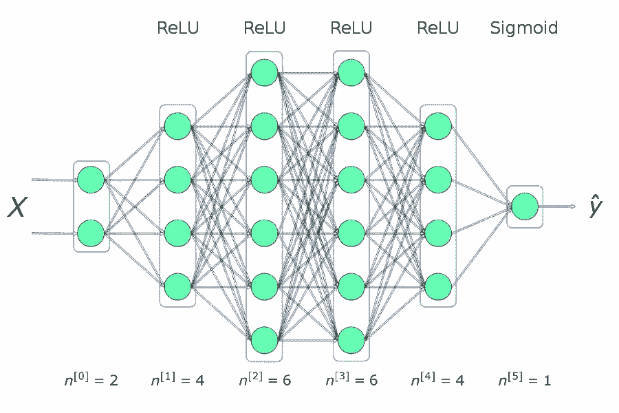

*图 2\. 神经网络架构*

**Keras 的解决方案**

首先，我将展示使用目前最流行的机器学习库之一——Keras 实现的解决方案。

```py
from keras.models import Sequential
from keras.layers import Dense

model = Sequential()
model.add(Dense(4, input_dim=2,activation='relu'))
model.add(Dense(6, activation='relu'))
model.add(Dense(6, activation='relu'))
model.add(Dense(4, activation='relu'))
model.add(Dense(1, activation='sigmoid'))

model.compile(loss='binary_crossentropy', optimizer='adam', metrics=['accuracy'])
model.fit(X_train, y_train, epochs=50, verbose=0)
```

解决方案就是如此。正如我在引言中提到的，我们只需要引入少量的程序包、写上几行代码就足以创建并训练一个模型，该模型能够以接近 100% 的准确率对我们测试集中的数据进行分类。我们的任务可以归结为根据选定的网络架构提供超参数（网络层数、每一层中神经元的数量、激活函数或 epoch 的数量）。现在让我们看看表面的框架背后发生了什么。而且，为了防止你打瞌睡，我为学习过程创建了一个很酷的可视化演示样例。

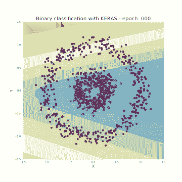

*图 3\. 在训练过程中，从属于某一类别的区域的可视化过程*

**什么是神经网络？**

让我们首先回答一个关键的问题：什么是神经网络？这是一种受到生物学启发而构建能够进行学习并且独立找出数据之间联系的计算机程序的方法。如图 2 所示，网络就是一个以层次的形式组织起来的软件「神经元」的集合，神经元以一种可以进行通信的方式连接起来。

**单个神经元**

每个神经元接受一组 x 值（从 x_1 到 x_n）作为输入，然后计算出预测的 y^ 值。向量 *x *实际上包含训练集的 m 个样本中某个样本的特征值。此外，每个神经元都有一套自己的参数，这些参数通常指的是 w（权值的列向量）以及 b（偏置），在学习过程中参数会不断变化。在每一轮迭代中，神经元会根据目前的权值向量 w 加上偏置计算出 x 向量值的加权平均。最后，计算结果会被传递给一个非线性的激活函数 g。在本文后面的部分，我将稍微提到一些目前最流行的激活函数。

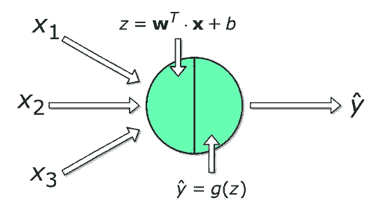

*图 4\. 单个神经元*

**单个网络层**

现在，让我们考虑稍微大一点的结构，看看如何对神经网络中的某一整层进行计算。我们将利用我们对于单个神经元中计算过程的知识，并且对整个层进行向量化，从而将这些计算组合成矩阵方程。为了统一符号，我们为选定的层「l」写出这些方程。此外，下标 i 表示某神经元在这一层中的序号。

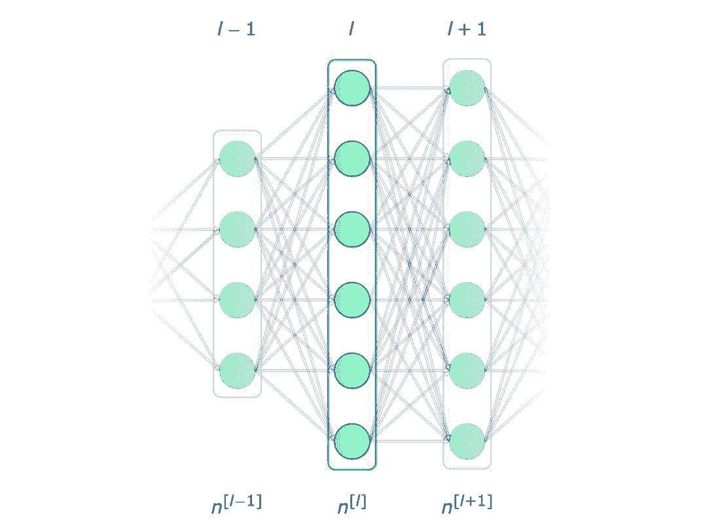

*图 5\. 单个网络层*

请注意：我们使用 *x *和 y^ 书写单个神经元的方程，它们分别表示特征的列向量以及预测值。当我们转而对每一层的计算进行表示时，我们使用向量 *a *代表这一层的激活结果。因此，向量 *x *是第 0 层（输入层）的激活结果。层中的每个神经元将根据以下方程进行类似的计算：

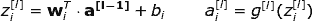

为了让读者更清晰地理解，我们将第二层的方程展开如下：

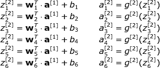

如你所见，在每一层中，我们都会执行许多非常相似的计算。使用「for 循环」执行这种计算的效率并不高，所以我们在这里使用向量化处理来加速计算过程。首先，我们通过将转置后的权值 w 的水平向量重叠起来得到矩阵 *W*。类似地，我们将层中的每个神经元的偏置重叠起来去创建垂直向量 *b*。现在，我们就可以一次性地直接为层中的所有神经元执行计算过程。我们同时会在下面写出用到的矩阵和向量的维度。

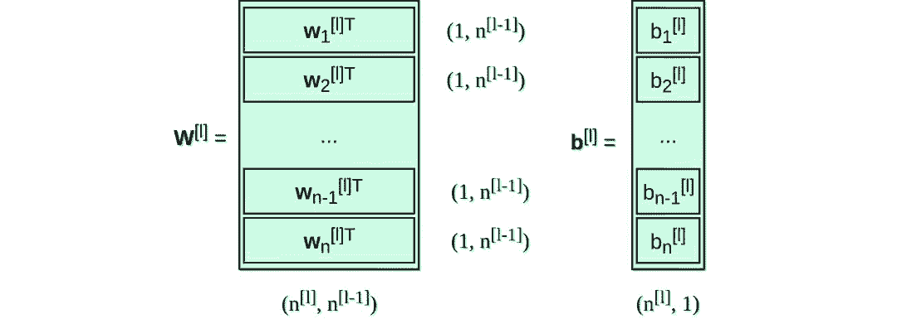

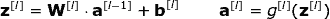

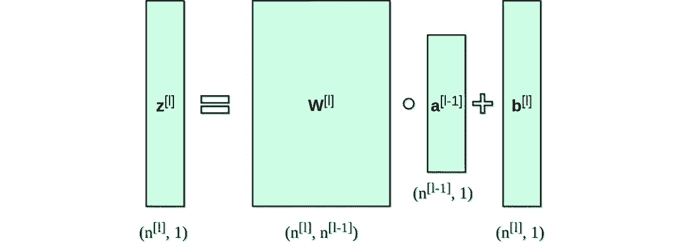

**对多个样本进行向量化**

目前我们看到的方程都只涉及到一个样本。但是在神经网络的学习过程中，你通常会用到包含超过百万条样本的巨型数据集。因此，我们接下来要进行对多个样本的向量化操作。假如我们的数据集拥有 m 条样本，每个样本带有 nx 个特征。首先，我们将每层的垂直向量 x、a 、 z 列在一起，分别构成 X，A，Z 矩阵。接着，我们考虑这些新创建的矩阵，重写之前列出的方程。

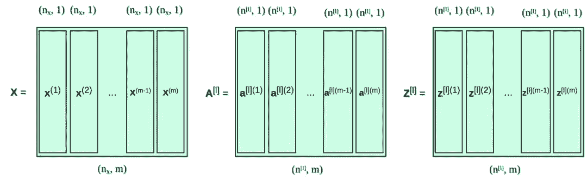

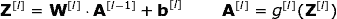

**什么是激活函数，为什么我们需要它？**

激活函数是神经网络的关键元素之一。如果没有激活函数，神经网络就会成为一个线性函数的组合，那么神经网络最终本身也就是一个线性函数。这样一来，模型的扩展性就会非常有限，并不比 logistic 回归模型强。而这种非线性元素让模型具有很大的灵活性，也使我们能够在学习过程中创建复杂的函数。激活函数也对训练的速度有很大影响，这也是我们选择激活函数的一个重要标准。图 6 显示了一些常用的激活函数。目前，对于隐藏层来说，ReLU 可能是最流行的激活函数。我们仍然会使用 sigmoid，尤其是当我们要处理二分类问题，希望模型的返回值介于 0-1 之间时，我们在输出层会使用 sigmoid。

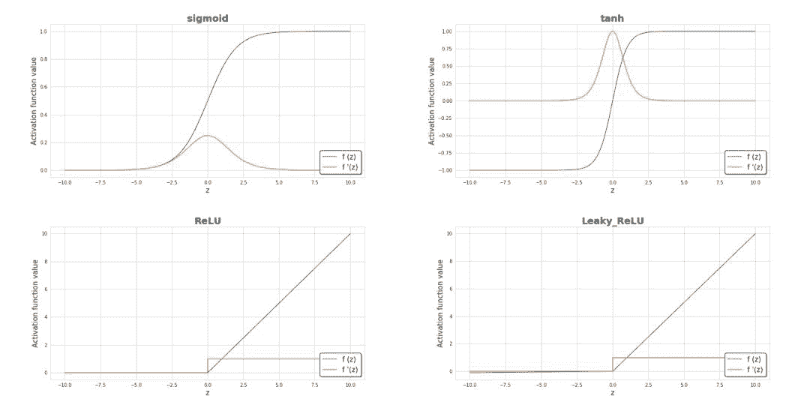

*图 6\. 最流行的激活函数及其导数*

**损失函数**

损失函数的值是关于学习过程的进度的基本信息来源。一般来说，损失函数用来衡量我们离「理想」的解还有多远。在本文的例子中，我们使用的是对数损失函数（binary cross entropy），对于不同的问题，我们可以应用不同的激活函数。我们所使用的激活函数如下，而其函数值在学习过程中变化的可视化演示如图 7 所示。我们可以看到，随着一次次的迭代，损失函数的值是如何减小、而准确率是如何提升的。


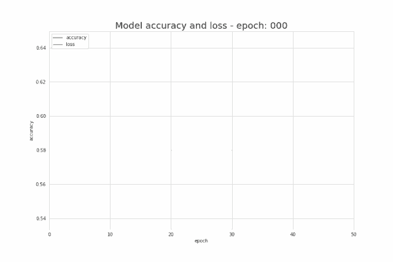

*图 7\. 学习过程中准确率和损失函数值的变化情况*

**神经网络是如何学习的？**

神经网络的学习过程就是不断改变参数 W 和 b 的值，从而使损失函数最小。为了实现这个目标，我们需要借助于微积分知识，并且使用梯度下降法去找到函数的最小值。在每轮迭代中，我们将计算损失函数对我们的神经网络中每个参数的偏导数。对于那些不熟悉这类计算的人来说，我只能说导数具有很强的刻画函数斜率的能力。多亏了这一点，我们就能知道如何操作这些变量，从而使函数值移动到图中谷底的鞍点。为了让你对梯度下降的工作方式形成直观的印象（防止你再次睡着），我在下面制作了一个小的可视化演示样例。可以看到，在每个连续的 epoch 中，我们是一步步朝着最小值移动的。在我们的神经网络中，它以相同的方式工作，在每轮迭代中计算出的梯度显示了我们应该移动的方向。主要的区别在于，在我们的神经网络模型中，我们拥有更多需要操作的参数。那么，应该如何计算如此复杂的导数呢？

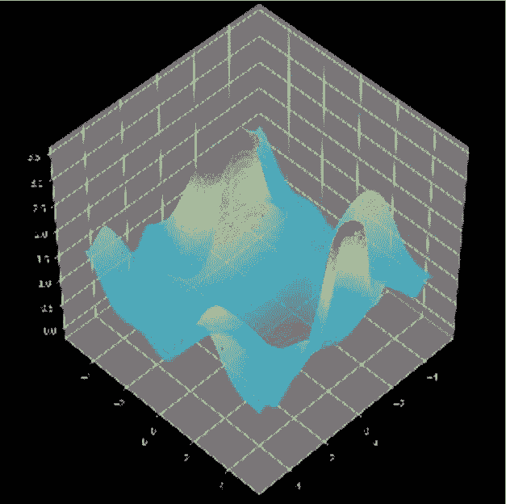

*图 8\. 梯度下降过程*

**反向传播**

反向传播是一种可以帮我们计算出非常复杂的梯度的算法。神经网络的参数将根据下面的公式进行调整：


在上面的方程中，α 代表学习率——一种让你能够控制执行调整的程度的超参数。选择一个合适的学习率是十分关键的，如果学习率太小，神经网络的学习速度就会非常慢；而如果学习率太大，我们又可能找不到最小值。

dW 和 db 是使用链式法则计算出来的损失函数关于 W 和 b 的偏导数。dW 和 db 的规模分别与 W 和 b 相同。图 9 显示了神经网络中的一连串操作。我们可以很清楚地看到前向传播和后向传播协同工作，从而优化损失函数。

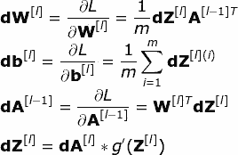

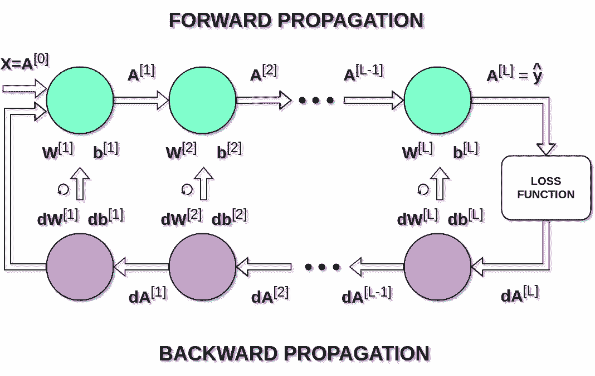

*图 9\. 前向传播和后向传播*

**结语**

希望我已经为你解释清楚了神经网络内部发生的数学运算过程。能够对这个计算过程的基础有最基本的了解将有助于我们使用神经网络。我认为我所提到的是这部分最重要的知识，但这也只是这些数学知识的冰山一角。我强烈建议你们试着编程实现一个这样的小型神经网络，最好仅仅使用 Numpy，而不要使用高级框架。

*原文链接：https://towardsdatascience.com/https-medium-com-piotr-skalski92-deep-dive-into-deep-networks-math-17660bc376ba*

****本文为机器之心编译，**转载请联系本公众号获得授权****。**

✄------------------------------------------------

**加入机器之心（全职记者 / 实习生）：hr@jiqizhixin.com**

**投稿或寻求报道：**content**@jiqizhixin.com**

**广告 & 商务合作：bd@jiqizhixin.com**