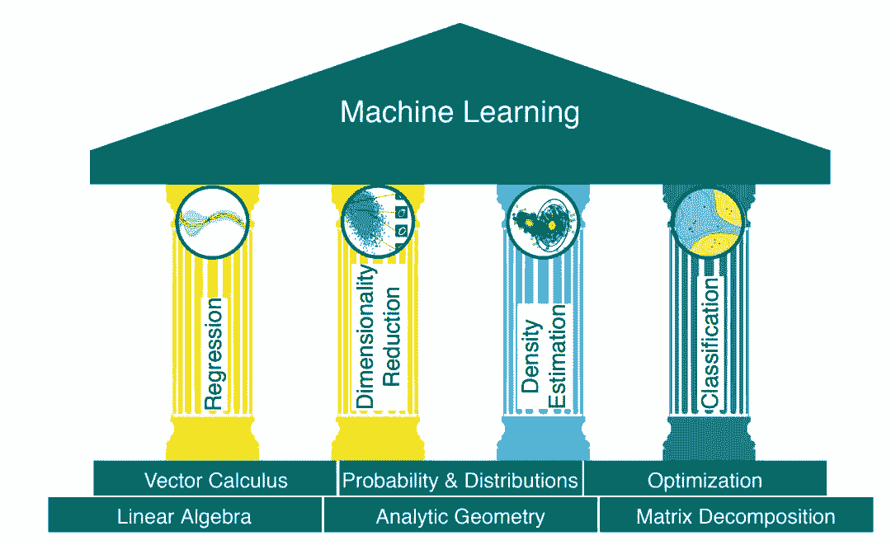
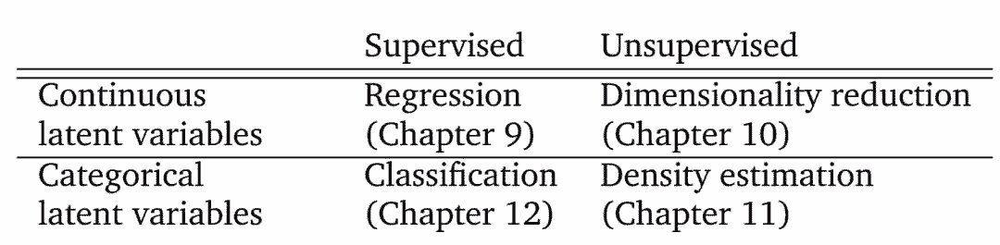
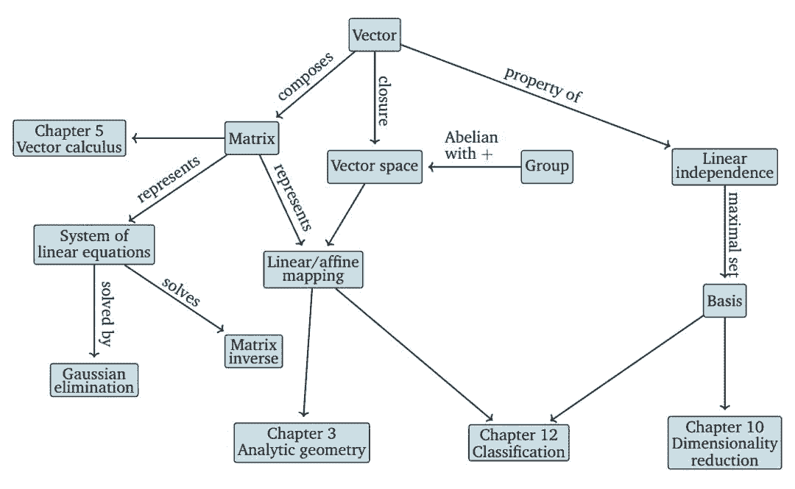

# 机器学习中的数学，这是一份新鲜出炉的热门草稿

选自 mmlbook

**作者：Marc Peter Deisenroth、A Aldo Faisal、Cheng Soon Ong**

**机器之心编译**

**参与：路雪、王淑婷**

> 近日，Marc Peter Deisenroth、A Aldo Faisal 和 Cheng Soon Ong 所著书籍《Mathematics for Machine Learning》的全部草稿已放出，机器之心整理了这本书的简要概述。感兴趣的读者可从以下链接获取全文（英文版）。

书籍地址：https://mml-book.github.io/

以下是这本书的部分序言。

机器学习是捕捉人类知识、对适合构建机器和工程化自动系统的格式进行推理的最新尝试。随着机器学习越来越普遍，软件包越来越易用，自然而然地，从业者不会注意低级技术细节。但是，这带来了一些风险，即从业者不了解设计决策，更容易忽略机器学习算法的局限性。对成功的机器学习算法的背后机制感兴趣的从业者需要学习如下必备知识：

*   编程知识和数据分析工具；

*   大规模计算和相关框架；

*   数学和统计学知识，以及机器学习如何在其上构建。

在大学里，机器学习的基础课程会先花时间介绍部分必备知识。由于历史原因，机器学习课程通常属于计算机科学系，学生通常接受过前两项必备知识领域的训练，但对数学和统计学知识可能涉猎不多。目前的机器学习教科书尝试用一两章的篇幅覆盖背景数学知识，可能在书的开头或者是附录。而本书将介绍基础机器学习概念的数学基础，并收集相关信息。

**为什么要再写一本关于机器学习的书？**

机器学习构建于数学语言之上，以表达看似直观实则难以形式化的概念。一旦得到恰当的形式化，我们就可以使用数学工具推导出机器学习算法设计的选择结果。这帮助我们理解正在解决的任务，同时了解智能的本质。全球数学专业的学生常见的一种抱怨是数学话题似乎与实际问题没有什么相关。我们认为机器学习是促使人们学习数学的直接动力。

本书旨在作为构建现代机器学习基础的大量数学文献的指南。我们通过直接指出数学概念在基础机器学习问题中的有用性来促进对数学概念学习的需求。为使书籍尽量简短，我们省略了很多细节和高级概念。本书主要介绍基础数学概念及其在机器学习语境中的意义，读者可在章节最后找到进一步学习的大量资源。对于具备数学背景的读者，本书提供简洁但表述准确的机器学习概览。与主要介绍机器学习方法和模型或编程知识的书籍不同，本书仅提供四个代表性机器学习算法。我们主要关注模型背后的数学概念，并描述其抽象之美。我们希望所有读者能够通过数学模型中的基础选择更加深入地了解机器学习应用中出现的机器学习基础问题和相关的实际问题。

**目标读者**

随着机器学习应用在社会中的广泛应用，我们认为每个人都应该了解其背后的原则。本书以学术数学风格写成，可以帮助读者准确理解机器学习背后的概念。我们鼓励不熟悉这一风格的读者坚持阅读本书，并牢记每个话题的目标。我们将在文本中插入大量评论，希望可以帮助读者获取对全局的理解。本书假设读者具备中学数学和物理知识。例如，读者应该了解过导数和积分，以及二维三维几何向量。因此，本书的目标读者包括本科大学生、夜校学生和参与机器学习在线课程的人们。

本书结构如下所示：

第一部分：数学基础

1\. 引言和动机

2\. 线性代数

3\. 解析几何

4\. 矩阵分解

5\. 向量微积分

6\. 概率和分布

7\. 连续优化

第二部分：机器学习核心问题

1\. 当模型遇到数据

2\. 线性回归

3\. 利用主成分分析进行降维

4\. 利用高斯混合模型进行密度估计

5\. 利用支持向量机进行分类

我们可以用以下两种策略来理解机器学习中的数学：

按从基础到高级的顺序构建概念。这通常是偏技术性领域（如数学）的首选方法。该策略的优点是，读者可以随时依赖自己以前学过的定义，不会遇到那些晦涩难懂、难以接受的观点。但对于从业者来说，许多基础概念本身并不怎么有趣，因此大多数基础定义会被他们很快遗忘。

从实际需求向下挖掘出更基础的要求。这种目标驱动方法的优点是，读者随时都知道为什么他们需要研究特定的概念，并且清晰地知道自己需要哪些知识。这种策略的缺点是知识的基础并不稳固，读者必须记住一组自己并不理解的单词。

本书分为两部分，第一部分讲数学基础，第二部分将第一部分的概念应用于基本的机器学习问题中，继而形成了图 1.1 中阐述的「机器学习四大支柱」。

*图 1.1：机器学习的基础和四大支柱。*

**第一部分关于数学**

我们将数值数据表示为向量，并将这些数据的表格表示为矩阵。向量和矩阵的研究被称为线性代数，见本书第二章。

我们经常认为数据是一些真实潜在信号的噪声观测结果，并希望通过机器学习从噪声中识别出信号。为此我们需要一种语言来量化噪声的含义。我们也经常希望能有预测因子来表达某种不确定性，例如，量化我们对特定测试数据概率预测值的置信度。对不确定性的量化属于概率论的领域，在本书第六章有所涉及。

为了把爬山法（hill-climbing）应用于训练机器学习模型，我们需要形式化梯度的概念，它会告诉我们寻找解的方向。搜索方向这个想法是通过微积分来形式化的，我们在第五章介绍了这一点。如何使用这些搜索方向序列来找到山顶被称为优化，见本书第七章。

**第二部分关于机器学习**

本书第二部分介绍了机器学习的四大支柱，如下表所示。表中的每一行区分了问题的相关变量是连续还是类别。我们解释了如何将本书第一部分介绍的数学概念应用于机器学习算法的设计中。

*表 1.1：机器学习的四大支柱。*

*图 2.2：该思维导图展示了本章介绍的概念及其与其他章节的关联。*

****本文为机器之心编译，**转载请联系本公众号获得授权****。**

✄------------------------------------------------

**加入机器之心（全职记者 / 实习生）：hr@jiqizhixin.com**

**投稿或寻求报道：**content**@jiqizhixin.com**

**广告 & 商务合作：bd@jiqizhixin.com**