# 从基础概念到数学公式，这是一份 520 页的机器学习笔记（图文并茂）

机器之心整理

**笔记作者：****Jim Liang**

> 近日，来自 SAP（全球第一大商业软件公司）的梁劲（Jim Liang）公开了自己所写的一份 520 页的学习教程（英文版），详细、明了地介绍了机器学习中的相关概念、数学知识和各种经典算法。机器之心看到后，也迫不及待的推广给更多的读者。完整的 PDF 请从文后作者公开的链接下载。

在介绍中，Jim Liang 写到：

> 人工智能是这两年风头正劲的领域，也是未来具有颠覆性可能的新领域。不少人尝试去学习机器学习相关的知识。然而，一旦越过最初的 overview 阶段，很多人就开始打退堂鼓了，然后迅速放弃。
> 
> 为什么会这样？
> 
> **极 高 的 学 习 曲 线**
> 
> *   首当其冲就是数学，涉及统计学、微积分、概率、线性代数等，大家虽然都学过高等数学，但如果你还记得里面的细节，算你牛。更可能的情况是，多数人都对高等数学忘记了，面对各种算法里的大量公式，感到厌恶，甚至恐惧。
>     
>     
> *   其次因为机器学习本身是一个综合性学科，而且是一个快速发展的学科，知识点散乱，缺乏系统性。
>     
>     
> *   市面上的机器学习/深度学习书籍、文章、教程，遍地开花，但能以清晰的方式表达、循序渐进地讲解的教程，其实不多，大量的教程没有考虑到学习者的基础，使得初学者感到挫败和困惑。
>     
>     
> 
> **图 解 机 器 学 习**
> 
> 正是对机器学习的过程中的痛苦有切身体会，我希望能做一份教程，以浅显易懂的方式去讲解它，降低大家的学习门槛。我为此花费了数月时间，经常做到深夜，把自己的学习笔记整理成了这份教程。

**从结构来看，全部教程包含两部分：**

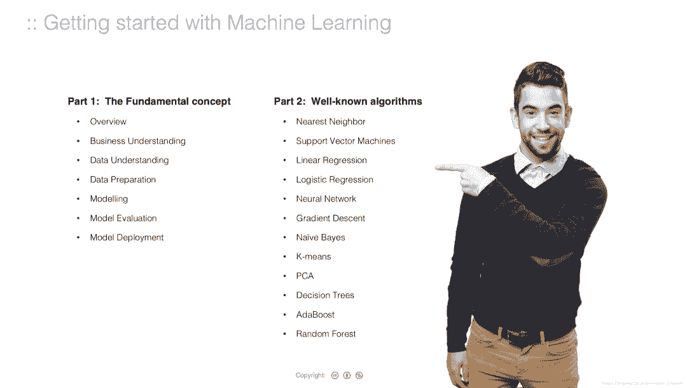

Part 1 介绍了基本概念，包括：

*   机器学习的流程

*   数据处理

*   建模

*   评估指标（如 MSE、ROC 曲线）

*   模型部署

*   过度拟合

*   正则化等

在第一部分，作者先介绍了如今应用普遍的机器学习：从自动驾驶、语音助手到机器人。其中有些思想，也是众多读者们了解过的，例如：为何机器学习在这个时候会火（大数据、计算力、更好的算法）；机器学习、人工智能、深度学习三者的关系等。

除了这些基础概念，这份教程也对机器学习模型的开发流程做了图像化展示（如下图），即使对此不太了解的读者，也能通过这种流程展示有所学习。

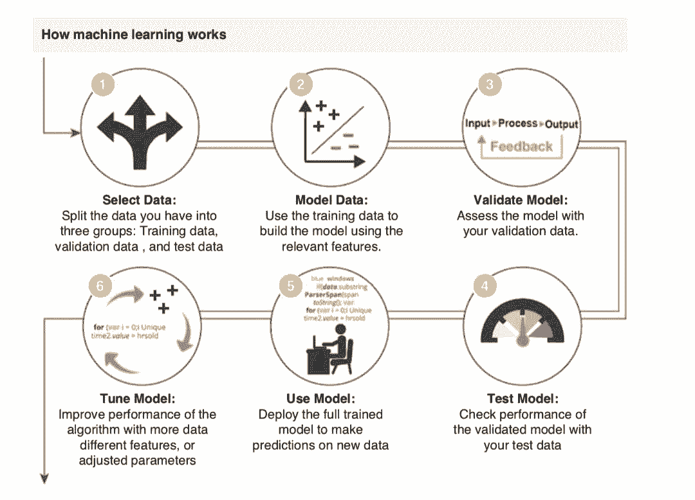

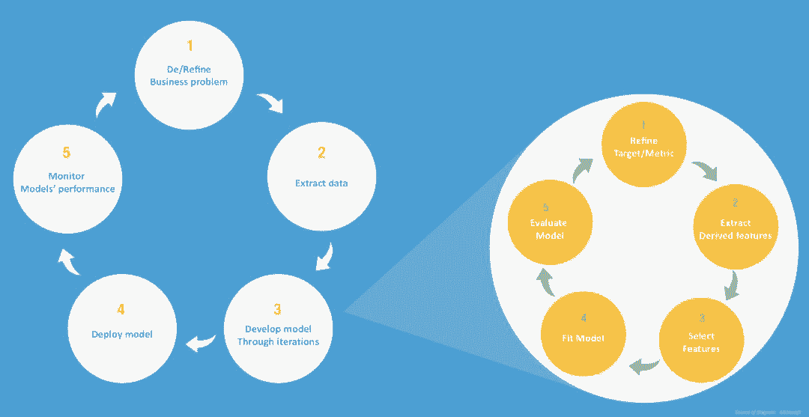

*建立机器学习解决方案的步骤*

在 Part1 的其他小节，作者以类似的图像展示，对数据、建模、模型部署等内容做了详细介绍，这里就不一一列举，可以从原报告查看。

在 Part2，作者介绍了 常用的算法，包括：

*   线性回归

*   逻辑回归

*   神经网络

*   SVM

*   Knn

*   K-Means

*   决策树

*   随机森林

*   AdaBoost

*   朴素贝叶斯

*   梯度下降

*   主成分分析

这部分包含了大量的数学公式，但作者尽力注解了其中的每个公式，从而充分、清晰地表达了众多数学概念。

例如在「神经网络」部分，作者整理了 59 页的笔记（从 311 页到 369 页）。作者从人脑中的神经元架构说起，介绍了人工神经网络（ANN）、人工神经元工作的原理。这份笔记非常注重图像化的概念解释，理解起来非常直观。

例如，下图中的概念解释很形象地展现了生物神经元和人工神经元工作方式的相似性。

*生物神经元的树突输入-轴突输出模式和人工神经元的输入输出模式对比。*

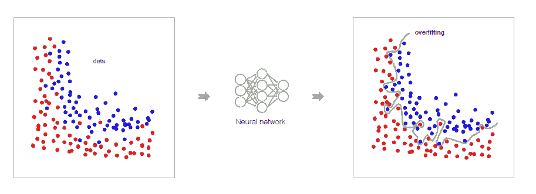

*过拟合的解释。*

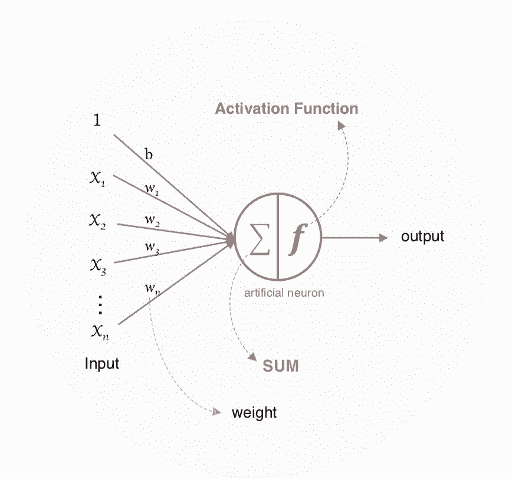

*人工神经元的基础结构。*

在涉及到数学公式时，作者会在旁边有详细的注解，如下图所示：

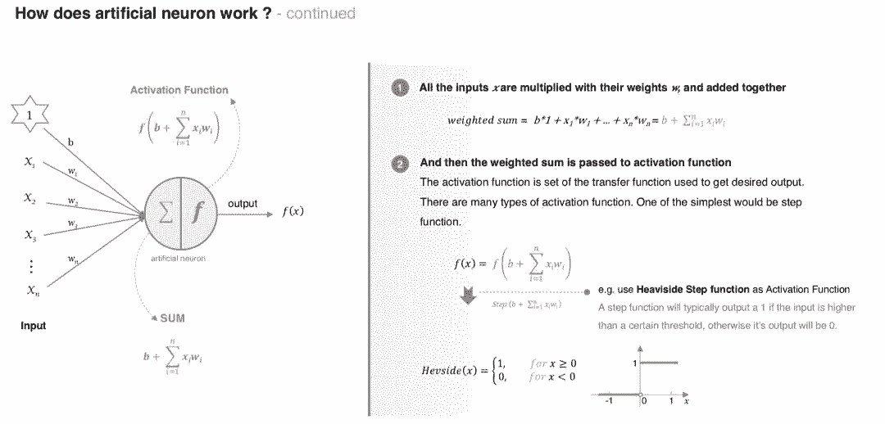

对于并列的可选项（如激活函数、常用神经网络架构等），也会有全面的列表：

*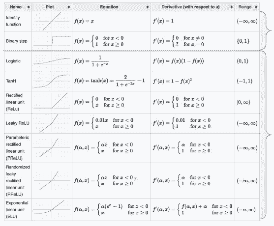*

*常用的激活函数。*

然后会有每个激活函数的单独介绍：

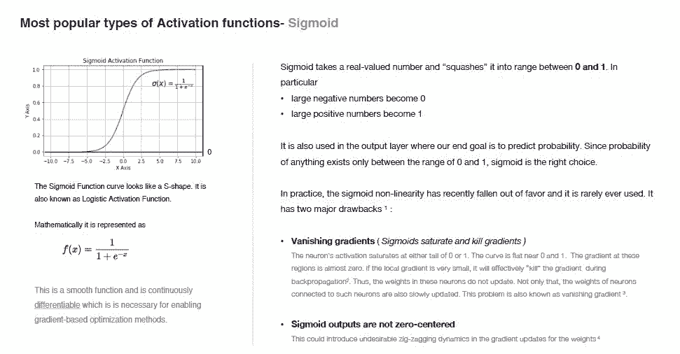

*Sigmoid 激活函数。*

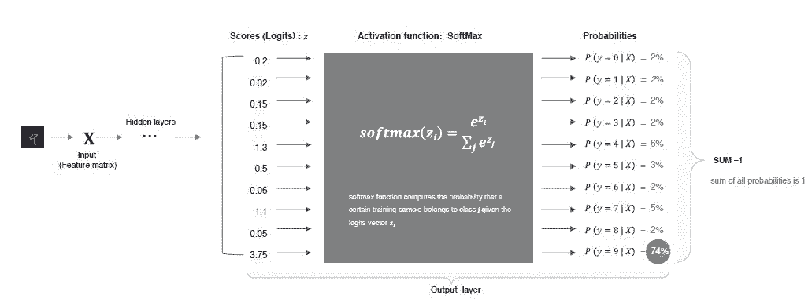

*用神经网络分类手写数字的前向传播示例（softmax 激活函数）。*

对于神经网络中较为复杂的概念（如求导、反向传播），几张图就能解释清楚：

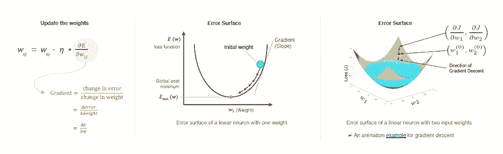

关于神经网络的完整训练过程，作者用简略流程图+计算细节展开的方式呈现：

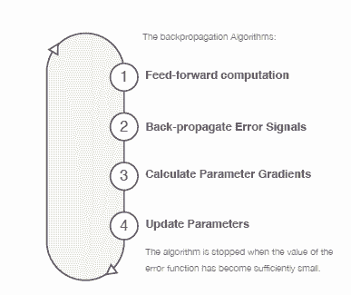

*反向传播算法完整流程。*

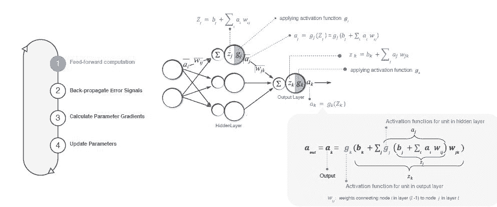

*前向传播部分的计算细节。*

就像前面提到的，这部分除了「神经网络」的介绍，还包括随机森林、梯度下降等概念的介绍，读者们可查看原教程。

**总结**

看完这份教程之后，小编觉得这是一份包罗万象的学习笔记，既适合非专业人士了解有关机器学习的基础概念，又适合有专业背景的学生进一步学习。

写教程是为了自己持续学习，分享教程是为了帮助更多人学习。就像作者所说，「Learning by doing/teaching, 写这个教程主要是强迫自己持续学习，另外，也想分享给他人，希望能帮助到更多想学习 Machine Learning 的人，降低大家的学习痛苦。」

教程文档下载地址（百度云）：https://pan.baidu.com/s/1tNXYQNadAsDGfPvuuj7_Tw

****本文为机器之心整理，**转载请联系原作者获得授权****。**

✄------------------------------------------------

**加入机器之心（全职记者/实习生）：hr@jiqizhixin.com**

**投稿或寻求报道：editor@jiqizhixin.com**

**广告&商务合作：bd@jiqizhixin.com**