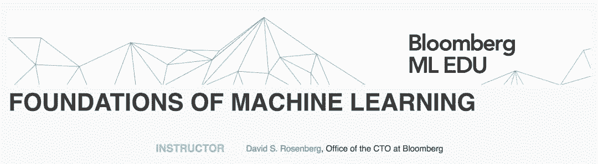
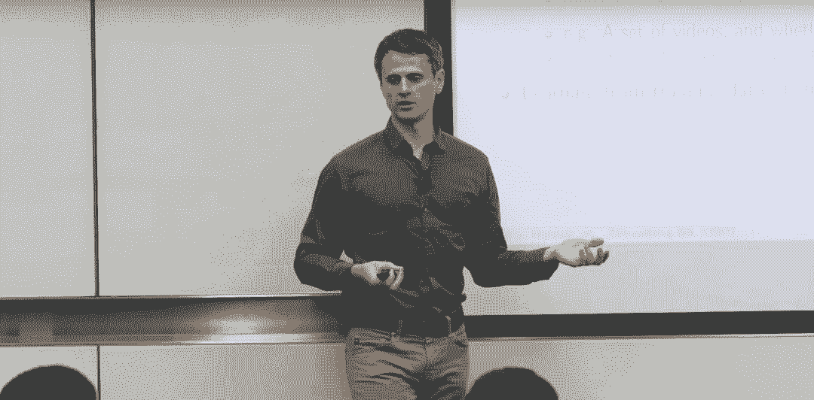

# 资源 | Bloomberg 推出在线免费课程：《机器学习基础》

选自 Bloomberg

**作者：David S. Rosenberg**

**机器之心编译**

**参与：路、李泽南**

> 彭博（Bloomberg）近日推出的《机器学习基础》免费课程致力于让人们深入了解机器学习专家使用的概念、技术和数学框架。该课程是视频讲解模式，目前已包含 30 节课，另有 7 次作业。

课程链接：https://bloomberg.github.io/foml/#home

**课程简介**

彭博推出的《机器学习基础》课程是一门训练课程，最初只向彭博内部软件工程师开放，作为「机器学习教育」（Machine Learning EDU）计划的一部分。本课程覆盖机器学习和统计建模的大量主题。主要目标是帮助参与者深入理解机器学习专家使用的概念、技术和数学框架。这门课程旨在使更多具备强大数学背景的个人能够获取更多珍贵的机器学习技术，包括软件开发者、实验科学家、工程师和金融专业人士。

这门课程一共包含 30 节课，观看地址：https://www.youtube.com/playlist?list=PLnZuxOufsXnvftwTB1HL6mel1V32w0ThI

这门课程包括一套完整的作业，每份作业都包含 Python 理论元素和实现挑战（Python 正在快速发展，是数据科学和机器学习学界和业界都很流行的编程语言）。本课程还可作为其他更专业课程的基础课程，或者其他独立研究的基础。

第一讲《黑箱机器学习》快速介绍了实际机器学习，只需要参与者熟悉基础的编程概念。

**必备条件**

查看该课程的数学水平是否适合自己的最快方式：https://davidrosenberg.github.io/mlcourse/Notes/prereq-questions/math-questions.pdf，参与者可从这里预览课程第一部分中的一些数学概念。

*   坚实的数学背景，相当于以下课程的大学本科初级水平：线性代数、多变量微积分（multivariate differential calculus）、概率论和统计学。例如，纽约大学的《DS-GA 1002: Statistical and Mathematical Methods》课程内容就足够了。

*   Python 编程知识，大部分作业需要参与者掌握一定的 Python 编程知识。

*   推荐：至少一门进阶、基于证明（proof-based）的数学课程。

*   推荐：具备计算机科学背景，如「数据结构和算法」课程。

**《机器学习基础》课程目录：**

1.  黑箱机器学习（BLACK BOX MACHINE LEARNING）

2.  案例研究：流失预测（CASE STUDY: CHURN PREDICTION）

3.  统计学习理论入门（INTRODUCTION TO STATISTICAL LEARNING THEORY）

4.  随机梯度下降（STOCHASTIC GRADIENT DESCENT）

5.  过度风险分解（EXCESS RISK DECOMPOSITION）

6.  L1 和 L2 正则化（L1 AND L2 REGULARIZATION）

7.  LASSO、Ridge 和 Elastic net（LASSO, RIDGE, AND ELASTIC NET）

8.  用于回归和分类的损失函数（LOSS FUNCTIONS FOR REGRESSION AND CLASSIFICATION）

9.  拉格朗日对偶和凸优化（LAGRANGIAN DUALITY AND CONVEX OPTIMIZATION）

10.  支持向量机（SUPPORT VECTOR MACHINES）

11.  次梯度下降（SUBGRADIENT DESCENT）

12.  特征提取（FEATURE EXTRACTION）

13.  核方法（KERNEL METHODS）

14.  性能评估（PERFORMANCE EVALUATION）

15.  「CITYSENSE」：用于异常行为检测的概率模型（"CITYSENSE": PROBABILISTIC MODELING FOR UNUSUAL BEHAVIOR DETECTION）

16.  最大似然估计（MAXIMUM LIKELIHOOD ESTIMATION）

17.  条件概率模型（CONDITIONAL PROBABILITY MODELS）

18.  贝叶斯方法（BAYESIAN METHODS）

19.  贝叶斯条件概率模型（BAYESIAN CONDITIONAL PROBABILITY MODELS）

20.  分类和回归树（CLASSIFICATION AND REGRESSION TREES）

21.  基础统计学和 bootstrap 入门（BASIC STATISTICS AND A BIT OF BOOTSTRAP）

22.  bagging 和随机森林（BAGGING AND RANDOM FORESTS）

23.  梯度提升（GRADIENT BOOSTING）

24.  多类别和结构化预测简介（MULTICLASS AND INTRODUCTION TO STRUCTURED PREDICTION）

25.  K-means 聚类（K-MEANS CLUSTERING）

26.  高斯混合模型（GAUSSIAN MIXTURE MODELS）

27.  用于潜在变量模型的期望最大化算法（EM ALGORITHM FOR LATENT VARIABLE MODELS）

28.  神经网络（NEURAL NETWORKS）

29.  反向传播和链式法则（BACKPROPAGATION AND THE CHAIN RULE）

30.  下一步（NEXT STEPS）

**第一课：黑箱机器学习**

程序员具备大量记录文档良好的机器学习库就可以进行机器学习，而无需理解真正的运作原理。我们鼓励此类「黑箱」机器学习……只要你遵循本节课介绍的步骤。为了恰当地使用机器学习库，你需要了解基本的机器学习词汇、概念和工作流。我们将介绍标准的机器学习问题类型（分类和回归），讨论预测函数、特征提取、学习算法、性能评估、交叉验证、样本偏差（sample bias）、非平稳性（nonstationarity）、过拟合和调参。

Note：本课程的主讲人 David Rosenberg 是彭博公司数据科学组 Office of the CTO 的科学家，同时也是纽约大学数据科学中心（Center for Data Science）的一名副教授，多次获得该中心「年度教授」（Professor of the Year）奖项。他在 UC Berkeley 获得博士学位，研究方向是统计学习理论和自然语言处理。在此之前，他在哈佛大学获得应用数学硕士学位，研究重心是计算机科学，在耶鲁大学获得数学学士学位。**

*原文链接：https://bloomberg.github.io/foml/#home*

****本文为机器之心编译，**转载请联系本公众号获得授权****。**

✄------------------------------------------------

**加入机器之心（全职记者 / 实习生）：hr@jiqizhixin.com**

**投稿或寻求报道：**content**@jiqizhixin.com**

**广告 & 商务合作：bd@jiqizhixin.com**