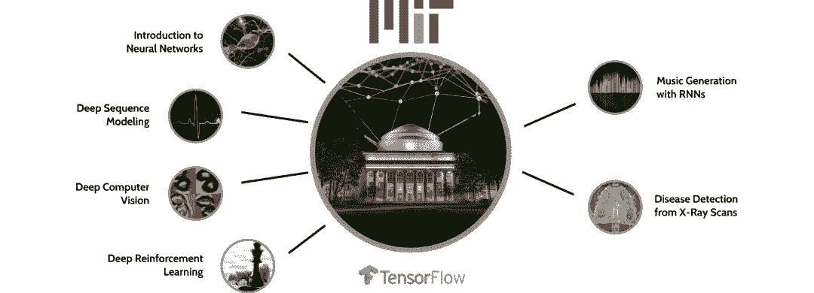
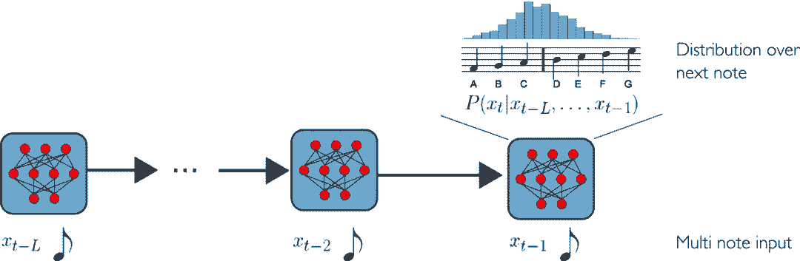
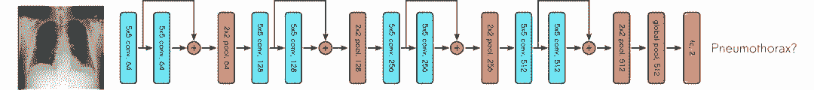
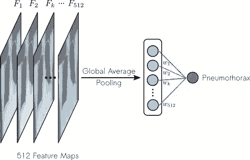
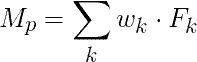
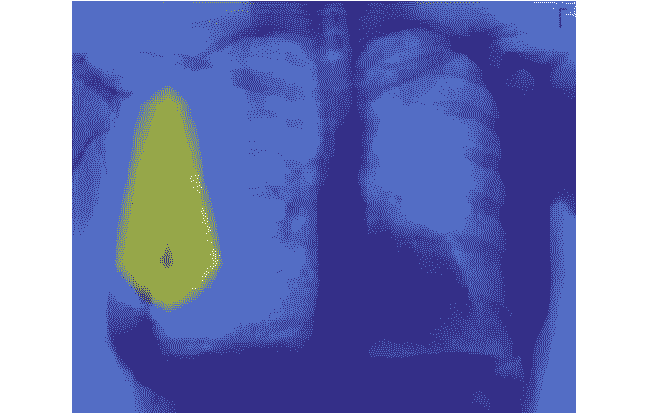
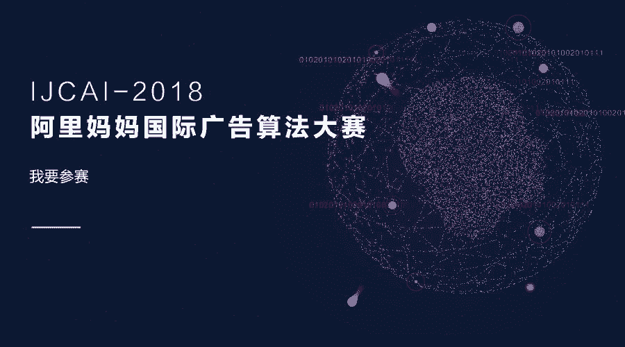

# 一门面向所有人的人工智能公开课：MIT 6.S191，深度学习入门

选自 Medium

**机器之心编译**

**参与：黄小天、李泽南**

> 对初学者来说，有没有易于上手，使用流行神经网络框架进行教学的深度学习课程？近日，麻省理工学院（MIT）正式开源了在线介绍性课程「MIT 6.S191：深度学习入门」。该课程包括一系列有关神经网络及其在序列建模、计算机视觉、生成模型和强化学习等方面的基本应用知识。

*   课程链接：http://introtodeeplearning.com/

*   课程视频：https://www.youtube.com/watch?list=PLtBw6njQRU-rwp5__7C0oIVt26ZgjG9NI&v=JN6H4rQvwgY

*   课程 GitHub：https://github.com/aamini/introtodeeplearning_labs



*MIT 6.S191： MIT 关于深度学习算法及其应用的官方入门课程*

MIT 6.S191 不仅仅是一门深度学习课程系列。在设计它时，我们希望做的更多。我们想要听众具备必须的实践技能，部署自己的深度学习模型，并将其应用到课程之外倍感兴奋、深受启发的问题上。

因此，在这门课程的教学中，我们选用了 TensorFlow。我们设计了两个基于 TensorFlow 的软件 lab 作为演讲课程的补充，一个是通过循环神经网络聚焦于音乐生成，另一个则专注于医疗图像的气胸检测。

MIT 6.S191 的课程设计原则是尽可能地易于上手，不仅针对于不同背景不同水平的人，也针对于 MIT 社区内外的人。

相应地，首个 lab 介绍 TensorFlow 基础——构建和执行计算图、sessions 以及在深度学习中常用的一般操作，同样也会重点介绍 TensorFlow 最新的重大更新：Eager mode。

这些背景知识有助于学生在 TensorFlow 中构建音乐生成和气胸检测模型。

**通过 RNN 生成音乐**

循环神经网络（RNN）多是应用于序列建模和预测任务，诸如从股票趋势到自然语言处理，再到医疗信号识别（比如心电图），范围异常广泛。你可以查看课程中的深度序列建模一节以了解 RNN 及其应用的相关背景知识。

RNN 同样适用于音乐生成，可以捕捉时序数据中的依赖关系。在第一个 lab 中，学生致力于编码音乐文件数据集，界定 TensorFlow 中的 RNN 模型，并从中采样以生成全新的音乐。

**音乐生成 RNN 模型**

该数据集是一个流行音乐片段的集合，被编码成向量格式以馈送给 RNN 模型。一旦数据被处理，下一步则是使用该数据集定义和训练 RNN 模型。

该模型基于单个 LSTM 模块，其中状态向量追踪两个连续节点之间的时间依赖关系。在每一时间步，先前节点的序列被馈送进模块，LSTM 最后单元的最后输出馈送给全连接层。因此在先前所有时间步的节点给定的情况下，我们可以输出下一节点在时间步 t 上的概率分布。下图是这一过程的可视化。



*预测序列中下一音乐节点的可能性*

我们为学生提供构建 RNN 模型并定义合适的计算图的指导。再次，我们已经设计这些 lab，供有兴趣的人使用，不管其有无 TensorFlow 经验。

该 lab 首先致力于设置相关超参数，定义占位符变量，初始化 RNN 模型的权重。学生接着定义其自己的 RNN(input_vec, weights, biases)，它接受相应的输入变量并定义一个计算图。

Lab 允许学生试验不同的损失函数，优化方案，甚至是准确度指标：

```py
1.  `loss_op = tf.reduce_mean(tf.nn.softmax_cross_entropy_with_logits(`

2.  `logits, labels))`

3.  `optimizer = tf.train.AdamOptimizer(learning_rate)`

4.  `true_note = tf.argmax(output_vec,1)  # identify the correct note`

5.  `pred_note = tf.argmax(prediction, 1) # identify the predicted note`

6.  `correct_pred = tf.equal(pred_note, true_note) # compare!`

```

**生成新音乐**

乐趣并不止于构建和训练 RNN！毕竟，该 lab 是关于音乐生成——剩下的是使用 RNN 实际地创建新音乐。

该 Lab 指导学生把一个种子馈送给已训练的模型（毕竟如果没有什么开始的话，它无法预测任何新的音符！），接着使用已训练的 RNN 迭代地预测每一个连续的音符。这相当于从 RNN 在每个时间步输出的下一个音符的概率分布中随机抽样，然后使用这些样本生成一首新歌。

像以前一样，我们只给学生一个指导架构，定义采样由其自己决定。

为了提供已生成歌曲的一个采样，我们继续并训练模型，接着从中采样生成新歌。试听一下由已训练模型生成的一个实例：https://soundcloud.com/alexanderamini/mit-6s191-rnn-song。

**生成更多逼真的音乐**

你很可能已发现，这里还有大量的提升空间。我们希望学生继续通过我们提供的框架，调试超参数，扩充数据集来生成更加悦耳的音乐。

**气胸检测**

第二个 lab 补充了课程中用于计算机视觉的深度学习一节。学生有机会在逼真的医疗图像数据集上使用 CNN 检测疾病。特别地，学生使用一组真实的胸部 X 射线构建模型，检测和分类被预测有气胸的扫描，这种情况发生在肺与胸壁之间的空气量异常的情况下。

我们把这一 lab 推进到分类之外，以尝试解决可解释性的问题——什么是反映网络为什么和如何把一个特定类别标签分配给指定图像的量化指标。为解决这一问题，学生部署了一项称之为类别激活映射的特征可视化技术，以获得对区分性图像区域的理解。

**数据集**

在这里，我们使用了 ChestXRay 数据集的一个子集。顾名思义，这是一个大型 X 射线胸透照片数据集，并标有相应的诊断信息。

鉴于它是一个基于真实世界信息的数据集，其中含有大量噪音。在这里，我们希望让学生们能够使用真实的数据，以便了解包装和注释数据会面临的挑战——特别是在计算机视觉的背景下。


**CNN 模型**

学生们将使用与训练的 CNN 模型展开气胸疾病检测任务；在这里，我们不会让神经网络保持黑箱状态，而是会提供模型和训练模型调用的代码，并希望以此能够让学习者充分参与整个实验。此外，lab 还将实现成本和预测函数，以及 CNN 分类器的评估指标（如 ROC 曲线）。



*用于气胸检测的 CNN 架构*

**用 CAM 解释 CNN 的输出**

这一 lab 的主要目的是应用类激活图（CAM）来解释 CNN 的输出。虽然目前已有很多用于图像分类的 CNN 模型资源，但我们发现很少有介绍可解释性的 lab。但对于初学者而言，认识并接受深度学习局限性是非常重要的——这些都是本 lab 的一部分，也是整个课程的一部分。将 CAM 结合到实验中也为学生们提供了阅读和上手实践最新研究成果的机会，这会是一种非常有意义的体验。

CAM 是一种可视化图片在 CNN 中最后的卷积层上被「注意」区域的方法。请注意，CAM 可视化适用于在最终全连接层之前具有全局平均池化层的架构，其中我们输出最后一个卷积层上每个单元的特征映射的空间平均值。

CAM 有效地高亮了输入图像中分配特定类别标签最重要的部分。也可以直观地说：一个类的 CAM 是基于每个特征图，将图像分配给该类的重要性。CNN 中的特征映射反映了图像中特定视觉图案（即特征）的存在。我们通过对特征映射的重要性加权的特征映射和来计算 CAM。因此，在重要信道中具有更大激活的输入图像的区域在 CAM 中被赋予了更大的权重，因此显得「更热」。

在气胸分类器的背景下，这相当于强调胸透照片中识别（或未识别到）气胸最为重要的那些像素。



*最终特征图上的类激活映射*

为了进行具体说明，我们让 F_k 代表 k-th 在卷积神经网络最后一个卷积层上的特征图，然后让 w_k 代表 k-th 在特征凸和全连接层上的权重。于是，用于气胸检测的类激活图为：



在对最终的类激活图进行上采样以后，我们可以把胸透照片中与气胸检测最相关的区域可视化（至少是从神经网络的角度看）。

该 lab 从头到尾演示了 CAM 在 TensorFlow 中计算和可视化的整个过程。学生们需要定义函数来提取特征图，计算 CAM 的权重：

```py
1.  `(feature_maps, dense_weights) = extract_features_weights(model)`

```

在这里，学生们需要将从最后的卷积层中提取的 Feature_maps 输入，并从全连接层 dense_weights 输入到 CAM 计算的函数中，然后定义上采样过程。



*气胸阳性的胸透照片类激活图*

正如气胸阳性的胸透照片示例所展示的那样，CAM 最终可以可视化为一张热图。

或许这个 lab 最有意思的部分是它所引发的讨论。学生们需要仔细研究模型对输入胸透照片进行错误分类的实例，CAM 在这些实例中的样子，并思考自己可以对模型做出哪些修改来突破这些限制。构建一种可以「窥探」神经网络内部运行机制的算法可以帮助激发学生们的好奇心，并让他们体会到机器学习中可解释性的重要性。

以上这些教学 Lab 都是 MIT 6.S191 系列课程所独有的，授课者为本课程进行了专门设计。目前，所有 MIT 6.S191 课程的视频都可以在网上免费观看了。 

*原文链接：https://medium.com/tensorflow/mit-6-s191-introduction-to-deep-learning-24994d705aca*

IJCAI2018 阿里妈妈国际广告算法大赛于 2018 年 2 月正式启动，获奖队伍将有机会前往斯德哥尔摩参加 IJCAI2018。**点击阅读原文参与报名。**

 **