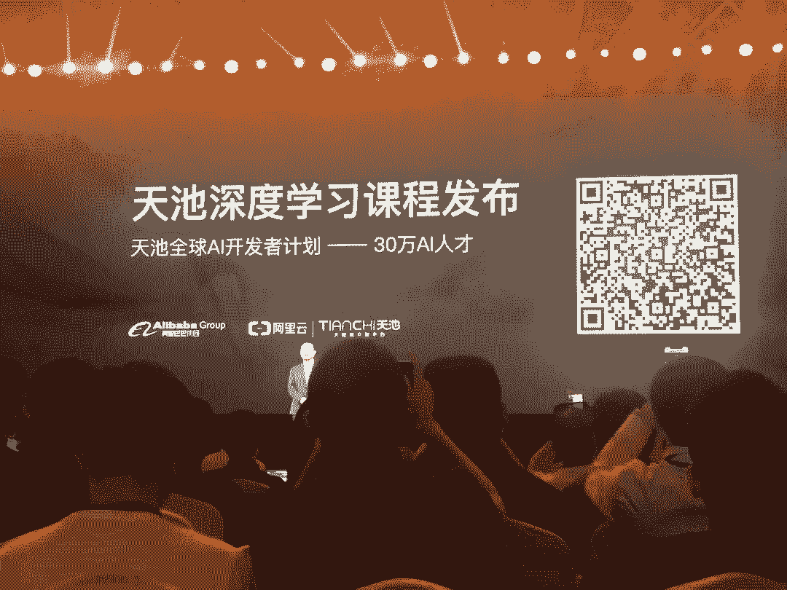

# 资源 | 阿里发布免费深度学习课程：从感知机开始说起

机器之心整理

**参与：机器之心编辑部**

> 在今天的 2018 云栖大会·上海峰会上，阿里巴巴发布了免费的天池深度学习课程，涵盖了神经网络基础、CNN、RNN、递归网络、强化学习以及 GAN，内容很全面，感兴趣的同学可做为学习资源。

课程地址：https://tianchi.aliyun.com/markets/tianchi/aiacademy

*课程设置，正式上线时会提供直播（见图中上线时间），直播结束后也会持续提供录播视频。*

目前该课程只开放了感知机的介绍，这也是机器学习与深度学习的基础。机器之心对感知机课程的相关内容做了梳理：

首先阿里巴巴向寒介绍了感知机的生物学基础，即大脑由神经元组成，它们之间会传递电讯号以激活其它神经元。在大脑的学习中，我们需要确定神经元之间的连接强度与神经元本身的激活程度。感知机也如同大脑，它会学习单元之间的连接强度或权重，也会通过激活函数学习激活程度。

如上所示为向寒介绍的单神经元输入的计算方式，简单而言即前一层所有神经元激活值分别乘上连接强度 w 再求和。这种加权求和的方式可进一步馈送到激活函数。下图展示了一些常见的激活函数：

这些激活函数将会为神经元提供非线性属性，且在不变输入下控制了激活程度。介绍了加权求和与激活函数这两个基本组件后，向寒继续展示了以误差为驱动的感知机算法，这也是很多初学者接触到的第一种参数更新算法。

在上图中，先预测所有训练数据，再对比真实标注，如果有错误就更新。其中权重与偏置项的更新即根据梯度下降求出。更新权重与偏置项后，我们可以再次预测训练数据，并对比真实标注而确定是否还有误差，有误差就重复上面过程继续更新。

下图展示了感知机分类的几何解释，其中绿色虚线为决策边界、w 为权重参数向量。在描述了感知机分类的几何解释后，随后阿里巴巴解释了几何角度上的参数更新过程。

当然除了这种直观的解释，向寒还介绍了非常多的线性可分数据与感知机的收敛问题。

其实多个神经元进行 Voting 和 Averaging 可以提升性能。如下所示为进行平均的感知机：

除了上述这些基本解释，向寒还介绍了感知机的限制与著名的异或问题（XOR），并随后解释了多层感知机与它是如何解决异或问题的。这些内容都是非常基础的概念。视频最后一部分则重点解释了反向传播，这是深度学习最基本也是最常用的更新方式，它能将梯度按路径分配到前层神经元中的参数，因而能更新整个网络。

虽然我们只简要了解了第一部分 30 分钟的课程，但后面还有非常多的内容与主题，包括卷积网络和递归网络等基本架构、强化学习与生成对抗网络等前沿的优秀方法。我们也希望该课程能帮助广泛的读者了解并入门机器学习。

更多有关感知机的内容：

*   [基础 | 机器学习入门必备：如何用 Python 从头实现感知器算法](http://mp.weixin.qq.com/s?__biz=MzA3MzI4MjgzMw==&mid=2650720367&idx=2&sn=d71e1e6550faece1cb5fb58bd7c919d9&chksm=871b0c11b06c8507d765a781b3ff49c1755deba7f12f36763b468aa23dfafccd768f59538004&scene=21#wechat_redirect)

*   [学界 | 从感知机到 GAN，机器学习简史梳理](http://mp.weixin.qq.com/s?__biz=MzA3MzI4MjgzMw==&mid=2650726606&idx=4&sn=ca0ecf20ff390cf8c5b1f8dfc5e3cbcf&chksm=871b24b0b06cada6fda39099b8d051b8845aba2e4d4a05fc64e72a09ddb987577fee3c1b2b94&scene=21#wechat_redirect)

*   [入门 | 从感知机到深度神经网络，带你入坑深度学习](http://mp.weixin.qq.com/s?__biz=MzA3MzI4MjgzMw==&mid=2650736206&idx=3&sn=20a019ce95f61904e5ef8255bf0c3743&chksm=871ac230b06d4b265254c8d535142407851a311e07bed74bde828752f25441a6ccc859c3773a&scene=21#wechat_redirect)

*   [神经网络快速入门：什么是多层感知器和反向传播？](http://mp.weixin.qq.com/s?__biz=MzA3MzI4MjgzMw==&mid=2650720758&idx=1&sn=3004c425e0d427f4900a182d74bed31d&chksm=871b0d88b06c849e951469ae1ed54e5f66074d6322eb6681c85727bb8199154709c04c48c034&scene=21#wechat_redirect)

****本文为机器之心整理，**转载请联系本公众号获得授权****。**

✄------------------------------------------------

**加入机器之心（全职记者 / 实习生）：hr@jiqizhixin.com**

**投稿或寻求报道：**content**@jiqizhixin.com**

**广告 & 商务合作：bd@jiqizhixin.com**