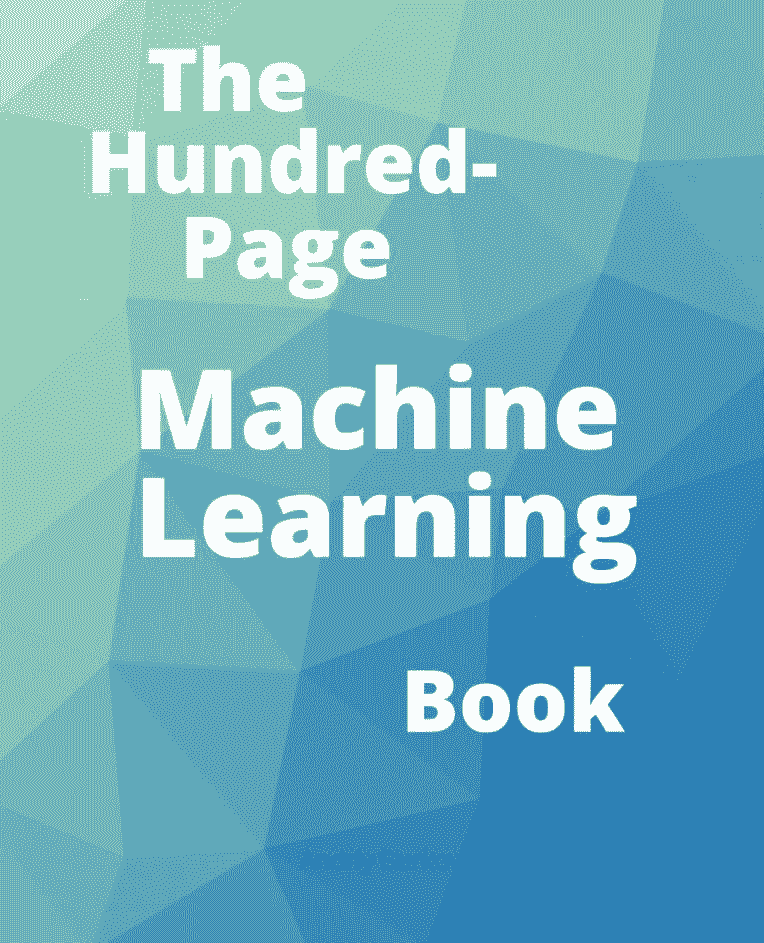
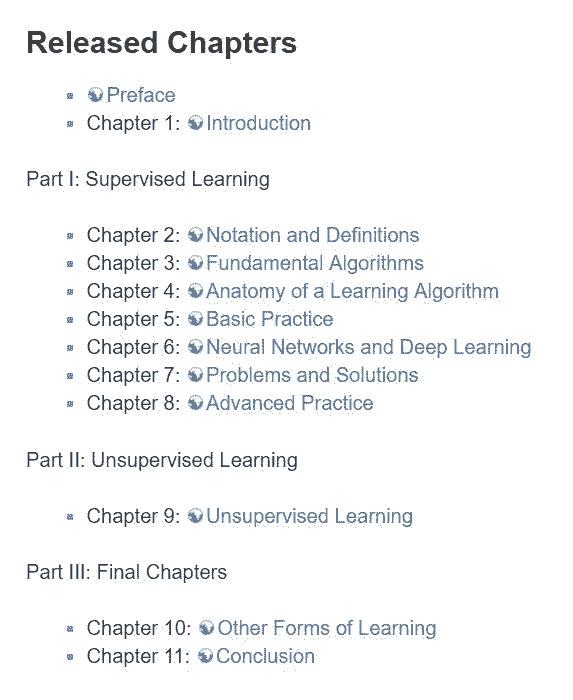
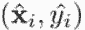
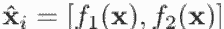
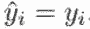
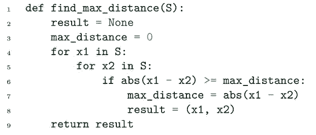
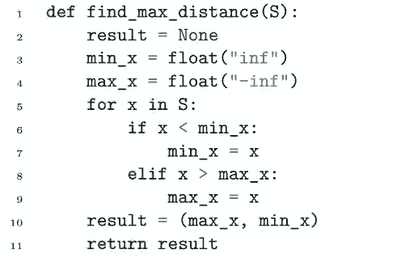
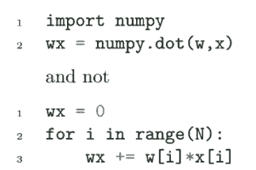

# 新手福利：免费百页机器学习入门书

选自 themlbook

**作者：Andriy Burkov**

**机器之心编译**

****参与：张倩********、淑婷、晓坤****

> 近日，Gartner 公司机器学习团队负责人、人工智能博士 Andriy Burkov 开源了自己写的机器学习入门书——《The Hundred-Page Machine Learning Book》。这本书短小精悍，只有一百页左右，包含大量自 20 世纪 60 年代以来具有重要实用价值的机器学习材料。它既适用于初学者，也适用于有经验的从业者。

作者本着「先读后买」的原则，允许读者免费下载。

下载地址：http://themlbook.com/wiki/doku.php

本书是陆陆续续写的，之前已经公开一部分内容，近日终于完成初稿。

**初稿目录**

为让读者一睹为快，机器之心将从第八章中截取一部分内容进行介绍。

**新书试读**

第八章介绍了在某些情况下可能会用到的实践技术。这些技术被应用在一些非常具体的环境中。在许多实际情况下，你很可能不需要使用这些技术，但有时它们非常实用。本章包含八个小节，分别是：处理不平衡数据集、组合模型、训练神经网络、高级正则化、处理多输入问题、处理多输出问题、迁移学习及算法效率。以下是其中两个小节：

**组合模型** 

集成算法，如随机森林，通常会组合具有相同性质的模型。它们通过组合数百个较弱的模型来提高性能。在实践中，有时我们可以通过组合利用不同学习算法得出的较强模型来获得额外的性能提升。在这种情况下，我们通常只需要两三个模型。

有三种典型的模型组合方式：

1.  取平均

2.  多数投票

3.  堆栈

取平均适用于回归以及那些返回分类分数的分类模型。你只需将所有模型应用到输入 x，然后平均预测值，我们可以把这些模型称为基础模型。为了查看平均的模型效果是否比每个单独的算法更好，你可以使用自己选择的度量在验证集上测试它。

多数投票适用于分类模型。你可以把所有基础模型应用到输入 x，然后返回所有预测值中占多数的类。如果出现平局，你要么随机选择一个类，或者返回一条错误信息（如果错误分类会导致成本巨大）。

堆栈包括构建元模型，该模型将基础模型的输出作为输入。假如你想组合分类器 f_1 和分类器 f_2，且它们都预测同一组类别。为了给堆栈模型创建训练样本，你设置了和。

如果有些基础模型不仅返回了一个类，还返回了对每个类的分数，你也可以把这些分数作为特征使用。

为了训练堆栈模型，建议使用来自训练集的样本，并使用交叉验证为堆栈模型调参。

显而易见，你要确保堆栈模型在验证集上的表现要比每个用来堆栈的基础模型更好，否则就没有必要这么做。

组合多个模型最终能够带来更好性能的原因是，多个无关联的较强模型更有可能一致妥协正确的结果。这里的关键词是「无关联（uncorrelated）」。不同的较强模型最好是通过不同的特征或性质不同的算法来获得，如支持向量机和随机森林。组合不同版本的决策树学习算法或具有不同超参数的支持向量机可能不会带来很大的性能提升。

**算法效率**

并非所有用于解决问题的算法都很实用。有些算法可能很快，有些却很慢。有些问题可以用快速算法解决，但其他问题可能只能用较慢的算法解决。

算法分析是计算机科学的一个研究方向，着重测定、分析算法的复杂性。大 O 符号用于对算法进行分类，依据的是算法的运行时间及随输入大小增长产生的占用空间需求。

例如，假设我们要在大小为 N 的一组示例 S 中寻找两个最遥远的一维示例。我们可以用 Python 写出如下所示的算法来解决这个问题：

在上述算法中，我们遍历 S 中所有的值，在首次遍历的每次迭代中，我们再次遍历 S 中所有的值。因此，上述算法对数字进行了 N² 次比较。如果我们把比较（一次）、abs（两次）和赋值（两次）运算所花费的时间作为单位时间，那么这个算法的时间复杂度（或者简单地说，复杂度）至多是 5N²。在最坏的情况下测定算法的复杂度时使用大 O 符号。对于上述算法，我们使用大 O 符号将算法的复杂度写为 O(N²)（忽略常数，如上述例子中的 5）。

这一问题还可以用下面这个算法解决：

在上述算法中，我们只遍历 S 中所有的值一次，因此算法复杂度为 O(N)。在这种情况下，我们认为后面这个算法比前面的快。

通常来讲，如果一个算法复杂度的输入大小可以用大 O 符号写成多项式的形式，这个算法就被视为高效算法。因此 O(N) 和 O(N²) 都是高效算法。然而，对于比较大的输入，O(N²) 算法可能也会很慢。在大数据领域，科学家经常用到的是 O(logN) 算法。

从实用的角度来讲，在实施你的算法时应该尽可能避免遍历。你应该将运算用在矩阵和向量，而不是遍历上。计算 wx 的算法如下：

使用合适的数据结构。如果一个集合中的元素顺序并不重要，那么要用 set 而不是 list。当 S 被认定为 set 时，用于验证 S 中的某个示例的运算是高效的，当 S 被认定为一个 list 时，该运算是低效的。

用来优化 Python 代码的另一个重要数据结构是 dict，也叫字典或哈希图（hashmap）。它允许你用非常快速寻找键值的方法定义一个键值对的集合。

除非你知道自己在做什么，否则请尽量使用主流库来写代码。科学 Python 包（如 numpy、scipy 和 scikit-learn）是由考虑到效率的资深科学家、工程师创建的。这些包拥有很多用 C 语言实现以达到最大速度的方法。

如果你需要迭代大量元素，可以使用创建函数的生成器，该函数一次返回一个而不是所有元素。

使用 Python 中的 cProfile 包来找出代码中的不足。

最后，当从算法的角度无法再改进代码时，你还可以通过以下方式进一步提高代码的运行速度：

*   用 multiprocessing 包并行运行计算

*   用 PyPy、Numba 或类似工具将 Python 代码编译成快速、优化的机器代码。

****本文为机器之心编译，**转载请联系本公众号获得授权****。**

✄------------------------------------------------

**加入机器之心（全职记者 / 实习生）：hr@jiqizhixin.com**

**投稿或寻求报道：**content**@jiqizhixin.com**

**广告 & 商务合作：bd@jiqizhixin.com**