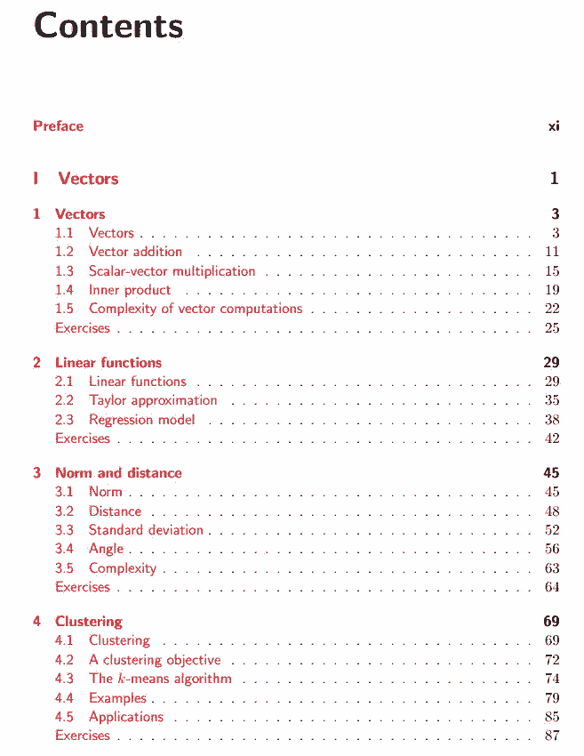
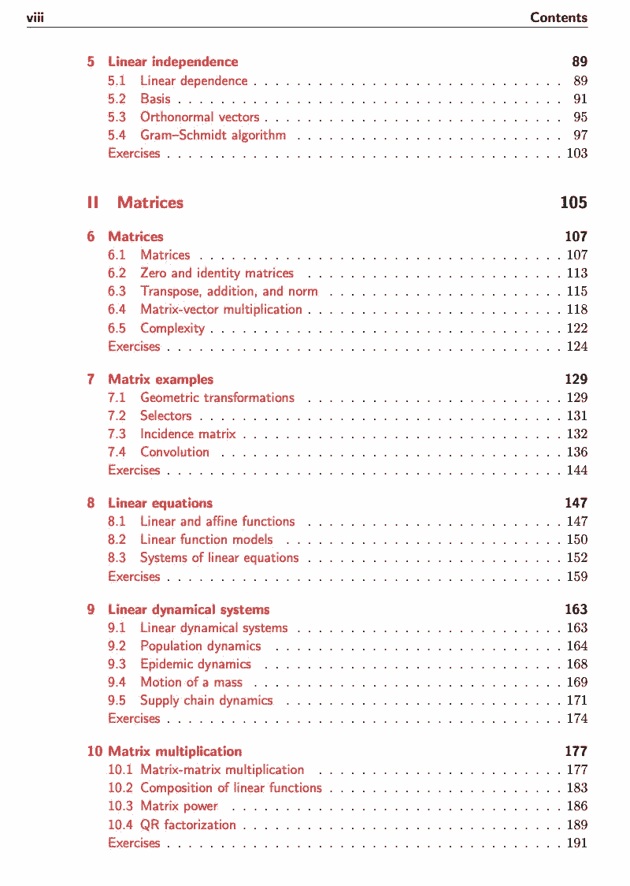
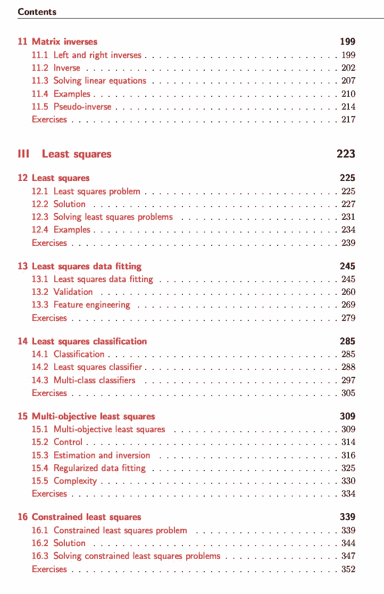
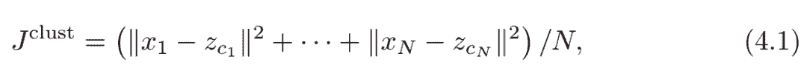
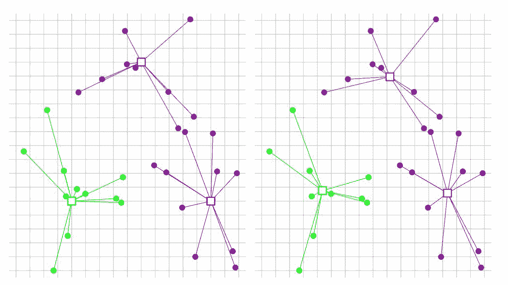
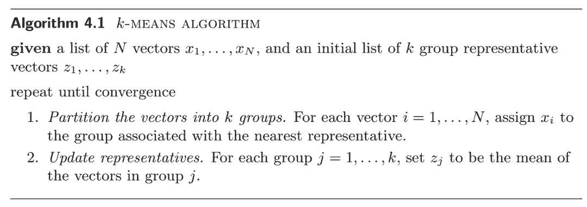
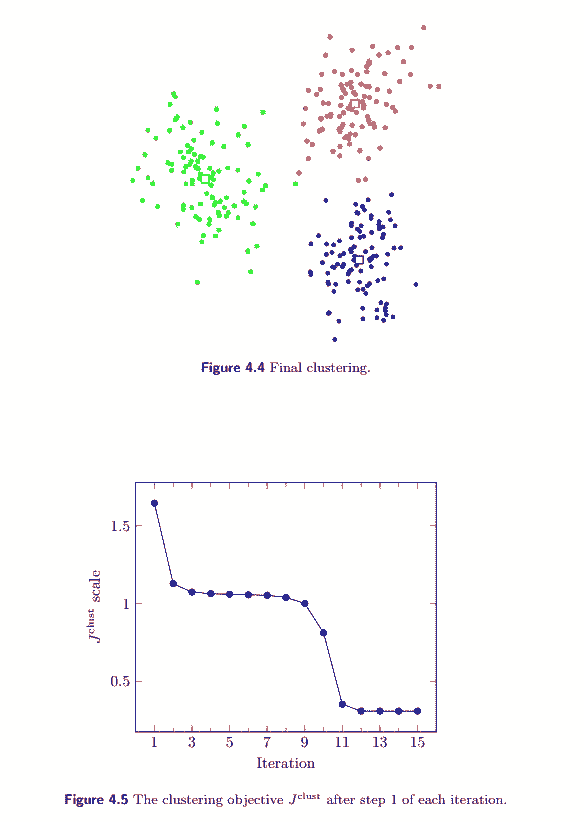
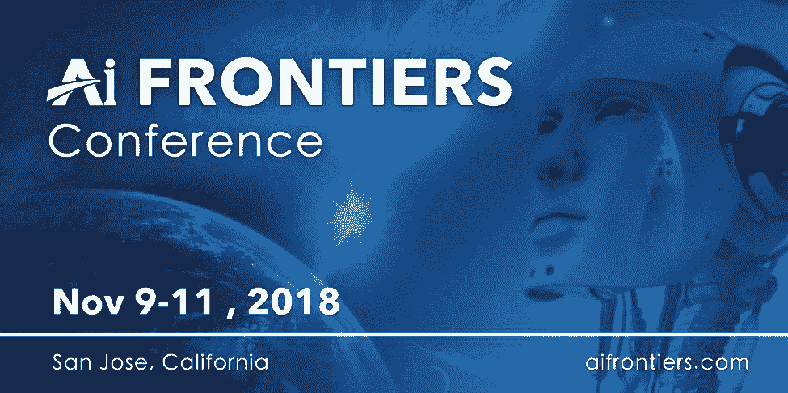

# 线性代数与张量？这本开放书籍帮你扫清通往 ML 的数学绊脚石

机器之心编辑

**参与：思源**

> 数学是机器学习的基础。斯坦福大学教授 Stephen Boyd 联合加州大学洛杉矶分校的 Lieven Vandenberghe 教授出版了一本基础数学书籍，从向量到最小二乘法，分三部分进行讲解并配以辅助资料。此外，这本书也是斯坦福 EE103 课程、UCLA EE133A 课程的教材，由剑桥大学出版社出版（允许网络公开）。

项目地址：https://web.stanford.edu/~boyd/vmls/

这一本书的资料还是比较齐全的，除了本身 473 页的教材，还有另一本 178 页的对应代码讲解。当然如果读者只需要了解数学部分的话，代码部分是不需要了解的。但是如果比较关注线性代数的应用，可能就需要阅读这些基础代码，并顺便学一学 Julia 语言了。最后，这一本书还提供了对应的课程 PPT，读者也可以把它们作为辅助资料。

<mp-miniprogram class="miniprogram_element" data-miniprogram-appid="wxf424e2f3e2f94500" data-miniprogram-path="pages/technology/technology?id=64cc669a-900a-449c-ac73-f71d0e91fc86&amp;from=weapp" data-miniprogram-nickname="机器之心 Synced" data-miniprogram-avatar="http://mmbiz.qpic.cn/mmbiz_png/f3g058loLBj0Pib4UhuCFagffSB1RHImwskFzvic6mSp2LDhuerbXxeqqv0b63wSt2Pas7MicNWIcia358rlnhiaVag/640?wx_fmt=png&amp;wxfrom=200" data-miniprogram-title="张量" data-miniprogram-imageurl="http://mmbiz.qpic.cn/mmbiz_jpg/KmXPKA19gW9ibPkV06iblq7S0Mk7dJk4e9JAs2XBvBXVXzTLicvWPJN3O2OzrQCvu1I9rx8FrA59bwWL7njXZtlyA/0?wx_fmt=jpeg"></mp-miniprogram>

**书籍简介** 

这本书旨在介绍向量、矩阵和最小二乘方法等应用线性代数的基础内容，它的目标是为只有很少或根本没有线性代数基础的初学者提供入门方法，包括线性代数的基本思想以及在数据科学和机器学习等领域的应用方法。

不过读者还是需要熟悉一般的数学符号，并且在一些地方也会用到微积分，但它们并不起关键作用，因此基本上以前学过高数就差不多了。这本书包含了很多传统概率论与统计学所讨论的话题，例如使用数学模型拟合数据等，但读者不一定需要这一方面的背景知识。

这本书比一般的应用线性代数课本要有更少的数学成分，只会详细介绍基本线性代数、线性独立性等理论概念，以及 QR 因式分解这一计算工具。而这本书讨论的大多数机器学习等方面的应用只会使用一种方法，即最小二乘法及其扩展。在某种意义下，该书更强调的是应用，即依赖于少量基本数学概念和方法，而覆盖大多数应用。但是这本书所呈现的数学是完整的，因为它会仔细证明每一个数学声明。然而，与大多数介绍性的线性代数课本相比，这本书描述了许多实际应用。包括一些通常被认为是高级主题的应用，如文档分类、状态估计和投资组合优化等。

这本书并不需要任何计算机编程的知识，因此可以作为传统的教学课程，我们只需要阅读对应章节并完成一些不涉及数值计算的练习题就行了。然而，这种方法会并不能使我们完全理解这本书，同时也得不到实际锻炼，例如我们可以使用这本书的观点与方法构建一个基于数据的预测模型、增强图像数据或优化投资组合等。随着计算力的不断增长，以及 NumPy 等高效矩阵运算库的发展，这本书中的描述的方法可以轻松地应用到实践中。因此读者还可以使用 Python 等编程语言练习不同的项目而补充学习资源，只有使用真实数据搭建应用才能真切地理解理论思想。本书提供了一些需要数值计算的练习题，且数据文件与编程语言的资源都可在线获得。

这本书主要分为三部分。第一部分介绍了向量及各种向量运算和函数，例如加法、向量内积、距离和角度等。本书还展示了如何使用向量表示文档中的词数、时间序列、目标属性、产品规格、音频数据和图像等。第二部分如同前一部分重点关注矩阵的概念与应用，包括矩阵的求逆和解线性方程等。第三部分介绍了最小二乘法，它不仅展示了如何简单而自然地近似求解一个超定方程组，同时还有一些可应用到很多方法的最小二乘扩展知识。

该书还可用于自学，并辅以在线提供的资料，例如下面这份 470 页的 PPT。

地址：https://web.stanford.edu/~boyd/vmls/vmls-slides.pdf

按照设计，本书的进度会逐渐加快，也就是说第一部分和第二部分有许多细节和简单的例子，第三部分有更多高级的例子和应用。对于只有很少线性代数基础或根本没有的读者而言，课程可以侧重于第一部分和第二部分，并且仅简单了解一些更高级的应用。而熟悉背景知识的读者可以快速过一遍前面两部分，并将重点放在最后的应用部分上。








除了线性代数等数学基础，这本书还介绍了很多机器学习应用，包括比较流行的 K 均值聚类等。而这些机器学习算法主要都介绍了数学表现形式和伪算法，并不涉及具体的代码，读者可另外查看这本书的配套代码实现。这本书提供的了基于 Julia 语言的配套代码！

下面我们将简要介绍聚类这一方面课本内容与对应的 Julia 代码。聚类也就是说将同类的无监督数据聚在一起，它的目标函数可以简单地定义为各样本到对应聚类中心的距离和。如果这个距离和非常大，那么聚类的效果就不好，我们会希望通过最优化算法最小化这个距离。在这本书中，距离可以定义为：



而 K 均值聚类会更形象地利用图像展示聚类效果，下图展示了 K 均值聚类迭代一次的更新过程：



而这一更新过程会有对应的为代码：



除了这些基础内容外，这本书还会展示很多可视化内容以帮助理解理论知识，例如展示了最终聚类结果的图 4.4 和展示了损失函数下降趋势的图 4.5：



当然，K 均值聚类还提供了对应 Julia 实现，如下展示了实现该算法的代码，读者在学习这本书的同时还能顺便学学 Julia 语言。

```py
function kmeans(X, k; maxiters = 100, tol = 1e-5)
    if ndims(X) == 2
        X = [X[:,i] for i in 1:size(X,2)]
    end;
    N = length(X)
    n = length(X[1])
    distances = zeros(N)  
    reps = [zeros(n) for j=1:k]  
    assignment = [ rand(1:k) for i in 1:N ]
    Jprevious = Inf  
    for iter = 1:maxiters
        for j = 1:k
            group = [i for i=1:N if assignment[i] == j]             
            reps[j] = sum(X[group]) / length(group);
        end;
        for i = 1:N
            (distances[i], assignment[i]) = 
                findmin([norm(X[i] - reps[j]) for j = 1:k]) 
        end;
        J = norm(distances)² /  N
        println("Iteration ", iter, ": Jclust = ", J, ".")
        if iter > 1 && abs(J - Jprevious) < tol * J  
            return assignment, reps
        end
        Jprevious = J
    end
end 
```

最后，这本书的对应代码和数据都可以在 GitHub 中找到：https://github.com/VMLS-book。

点击「阅读原文」，查看大会官网信息。机器之心读者限时特别优惠折扣码（25% off）：P25JH

