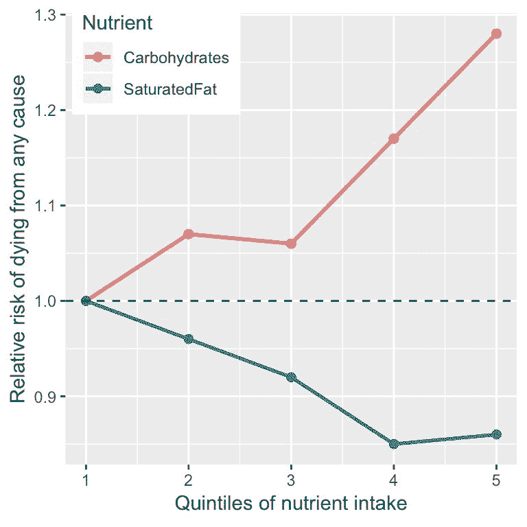
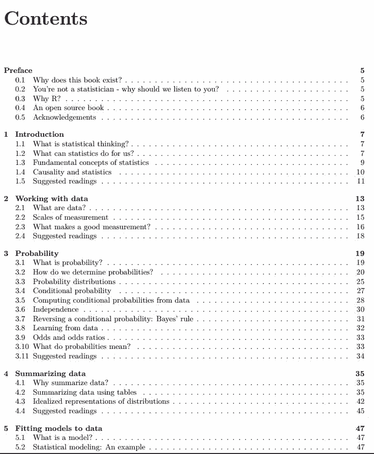
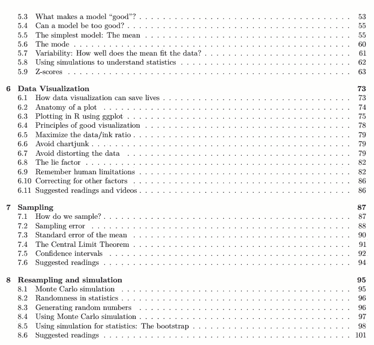
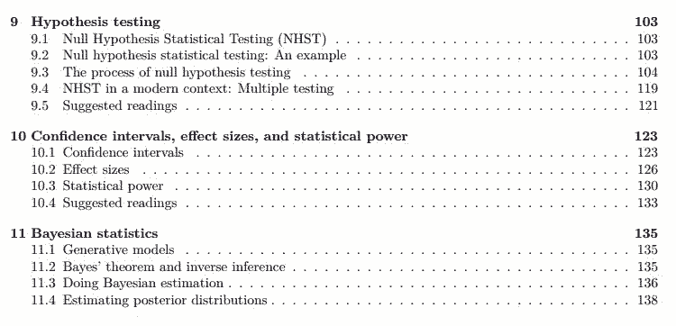
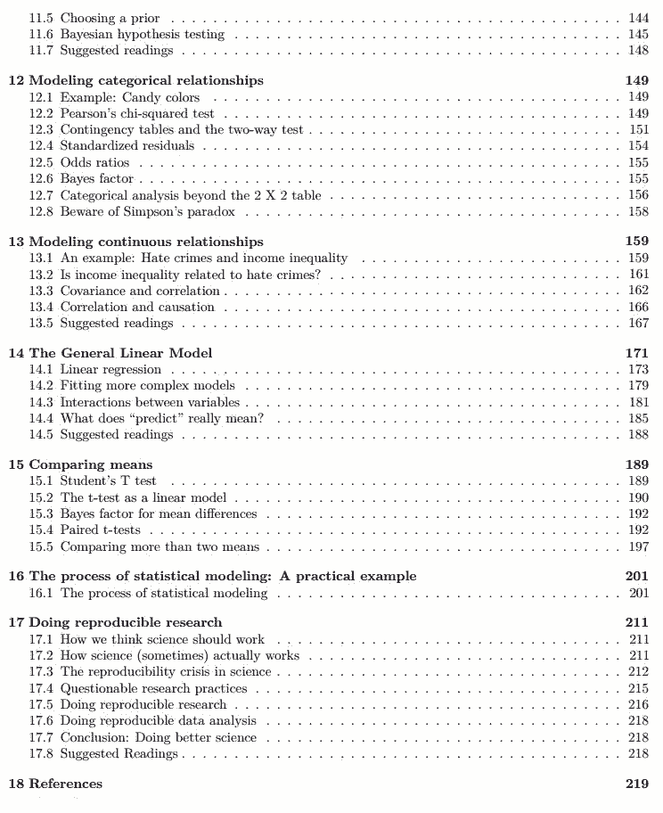

# 想回炉再造一波统计学？这本斯坦福大学教材也许能帮你

机器之心报道

**参与：机器之心编辑部**

> 近日，斯坦福大学心理学教授 Russell A. Poldrack 公开了他为斯坦福大学统计学本科教程准备的教材。这本书引入了一些实用的新理念和新方法。Russell 教授在序言中称自己并未接受过统计学家的培训，但是在过去 20 年的脑成像研究中他掌握了多种复杂统计和计算工具，对哪些统计方法有助于科研有自己独到的见解。

该课程要求使用 R 语言，课程涉及数据、概率、模型与数据的拟合、数据可视化、采样、假设验证、贝叶斯统计学、通用线性模型、统计建模过程、如何进行可复现研究等概念和方法。

<mp-miniprogram class="miniprogram_element" data-miniprogram-appid="wxf424e2f3e2f94500" data-miniprogram-path="pages/technology/technology?id=f95a0c9d-125c-42b3-8883-c4bd78e1f8be&amp;from=weapp" data-miniprogram-nickname="机器之心 Synced" data-miniprogram-avatar="http://mmbiz.qpic.cn/mmbiz_png/f3g058loLBj0Pib4UhuCFagffSB1RHImwskFzvic6mSp2LDhuerbXxeqqv0b63wSt2Pas7MicNWIcia358rlnhiaVag/640?wx_fmt=png&amp;wxfrom=200" data-miniprogram-title="统计学习理论" data-miniprogram-imageurl="http://mmbiz.qpic.cn/mmbiz_jpg/KmXPKA19gW81mnEQuQlW2GG6FBTEV53LfoPPWg6Cm7Janehb8ChjxXCiaaT3Ckyic7XJvMiaGBHp3LCLANSGIaajg/0?wx_fmt=jpeg"></mp-miniprogram>

本书地址：http://thinkstats.org/StatsThinking21.pdf

以下是本书的部分内容。

**写作背景**

2018 年，我开始在斯坦福给本科生上一门统计学课程。此前我从未教过统计学，所以这是一个改变现状的机会。我对心理学专业的本科统计学教育越来越不满意，因此想带来一些新的想法和方法，尤其是 21 世纪实际统计实践中广泛使用的方法。这些方法利用当今日益增长的算力来解决统计问题，其方式远远超出了心理学学生在统计学课程中所学到的标准方法。

教这门课的第一年，我用的教材是 Andy Field 的《An Adventure in Statstics》。这本书中有很多我非常喜欢的地方，比如它围绕模型构建来介绍统计实践，并且非常谨慎地对待零假设检验。但我大部分学生却讨厌此书，因为它需要涉猎大量的故事来获得统计知识。我也发现了其中的不足，因为有很多我想要讲的主题（特别是人工智能领域的机器学习等）书中没有讨论。最终，我觉得如果能有一本与我的讲课内容比较接近的书，学生们会非常受益。这也是我编写这本书的初衷。它的框架和 Field 的书大致相同，因为我的课程最初很大程度上是基于那本书的内容，但本书内容与他的书大相径庭（也没那么有趣）。

**什么是统计思维？**

统计思维是用一些相对简单的术语来描述复杂的世界，捕捉其结构的本质，进而帮助我们理解世界的一种方式。同时，它还帮我们认识到我们对于自己的知识有多么不确定。统计思维最早起源于数学和统计学，以及计算机科学、心理学及其它学科。

与统计思维相比，其它形式的思维描述世界的方式都没那么准确。人类通常会用直觉去尝试回答那些可以使用统计思维回答的问题，但答案通常是错的。例如，多数美国人都认为近几年的暴力犯罪率比往年要高，但数据分析显示，这一比率自 20 世纪 90 年代以来就开始平稳下降。直觉败给了统计，这是因为我们依赖于常常导致错误答案的最佳猜测（best guesses，心理学家称之为启发式方法）。人们进行判断时常依赖最先想到的经验和信息，并将其作为判断的依据。我们很容易想到暴力犯罪的例子，因此觉得这种事件非常普遍。基于此，我们关于犯罪率日益增长的判断可能源于新闻报道的增加，尽管实际犯罪率是下降的。**统计学为我们提供了一种更加准确地认识世界的工具，帮助我们克服由直觉带来的错误。**

**统计学的意义**

统计学可以在三个方面为我们提供帮助：

*   描述：用一种大家能理解的简单方式来描述这个复杂的世界。

*   决策：在面对不确定性时，通常需要基于数据做出决策。

*   预测：基于对过去状况的知识对新情况做出预测。

我们来看一个实例，关于我们都很关心的问题：如何决定健康的食物？这个话题太宽泛，我们将其细化为一个具体问题：食物中的饱和脂肪是糟糕的东西吗？

一种回答方式是基于常识。

如果我们吃饱含脂肪的东西，这些脂肪会直接转化为体内的脂肪，对吗？

我们都看过脂肪堵塞动脉的照片，所以吃脂肪会堵塞我们的动脉，对吗？

回答这个问题的另一种方式是听取权威人士的意见。美国食品药品监督管理局（US Food and Drug Administration）的饮食指南中有一条重要建议：「健康的饮食应当限制饱和脂肪的摄入」。你也许期待这些指南基于科学，在某些情况下它们的确如此。但正如 Nina Teicholz 在《Big Fat Surprise》中所概括的，该建议似乎更多基于营养学研究人员的教条，而不是实际证据。

最后，我们还是得看实际的科学研究。首先我们可以从一项名为 PURE 的大型研究开始，这项研究对来自 18 个国家 135000 多人的饮食和健康结果（包括死亡）进行了调查。对该数据的一项分析（发表在《The Lancet》2017; Dehghan et al. (2017)）显示，PURE 调查人员分析了不同种类的宏营养素（包括饱和脂肪和碳水化合物）的摄入与研究追踪期间人们死亡可能性之间的关系。该研究追踪期的时间中位数为 7.4 年，也就是说有一半人被追踪的时间少于 7.4 年，而另一半人则超过 7.4 年。下图绘制了研究中的一些数据（从论文中摘取），展示了饱和脂肪和碳水化合物的摄入与任何死亡风险之间的关系。

*图 1.1：来自 PURE 研究的数据图表，展示了任何死亡风险与饱和脂肪和碳水化合物的相对摄入量之间的关系。*

上图基于十个数字。为了获得这些数字，研究人员根据参与者（即样本）对这两种营养的摄入量进行排序，然后把 135,335 位参与者分成了五组（quintiles）。第一组是摄入量最少的五分之一参与者；第五组是摄入量最高的五分之一。接下来研究人员计算了研究追踪期间每组的死亡率。该数字是与摄入量最少的小组相比的死亡相对风险：如果数字大于 1，则意味着这组的参与者死亡率要大于摄入量最少的组；如果它小于 1，则结果相反。结果很清楚：那些摄入更多饱和脂肪的人们在研究期间死亡率更低，他们摄入脂肪越多，这个效应越明显。与之相反的是碳水化合物，人们摄入的碳水化合物越多，在研究期间死亡率越高。这个例子展示了如何利用统计学用一组较为简单的数字描述复杂的数据集。如果我们同时观察每个参与者的数据，我们将会被数据淹没，很难发现以更简单的方式描述数据时所呈现的模式。

表 1.1 显示随着饱和脂肪摄入量的增加，死亡率降低；而摄入碳水化合物越多则死亡率更高，但我们也知道数据中必然存在很多不确定性。有些人即使摄入很少的碳水化合物，仍然较早去世，同样，有些人食用了大量碳水化合物却仍长命百岁。鉴于这种可变性，我们想确定在数据中看到的这种关系是否足够强大，如果饮食和长寿之间没有真正的关系，我们不认为这种情况会随机发生。统计学给我们提供了确定这些关系的工具，而外界的人通常将此视为统计学的主要目的。但通过全书，我们将会发现这种基于模糊证据的黑白决策需求经常导致研究人员误入歧途。

基于数据，我们还能预测未来结果。例如，保险公司可能会基于特定人群摄入脂肪和碳水化合物的数据来预测他们的寿命长短。预测的一个重要方面是，它要求我们把从已有数据中得到的关系泛化到其它情况；如果我们的结论限于特定时期的特定人群，则研究结果用处不大。一般来说，研究人员必须假设样本代表的是大量人群，这就要求他们以无偏的方式获得样本。例如，如果 PURE 研究招募的所有参与者都是践行素食主义的宗教人员，那我们就没法把研究结果泛化到遵循不同饮食标准的人身上。

**统计学的基本概念**

有些非常基本的概念几乎贯穿了统计学的所有方面。其中有些是 Stigler 2016 年在《The Seven Pillars of Statistical Wisdom》一书中提出的，我在这里对此进行了补充。

**从数据中学习**

看待统计学的一种方式是将其作为从数据中学习的工具。在任何情况下，我们要了解情况总是需要从一系列假设或者猜想开始。在 PURE 研究中，研究人员可能就会猜测吃更多饱含脂肪的食物会导致更高的死亡率，因为饱和脂肪本身传递的就是一种负面信息。在后面的课程中，我们会介绍先验知识（prior knowledge）的概念，它反映了我们对情况的已有知识。这种先验知识的力量可能会有所不同，通常要基于我们的经验。如果我去一家从未去过的餐馆吃饭，我可能不会对其抱有太高的期望，但如果去一家我已经去过十次的餐馆吃饭，我的期望会高得多。类似地，如果我查看一个餐馆的评论网站，发现其平均四星评论仅基于三条评论，那我对它的期望不会太高，但如果它的四星评论是基于 300 条评论，那结果就不一样了。

统计学给我们提供了一种方式来描述如何用新数据来更新我们的想法，这样统计学和心理学之间就有了深刻的联系。实际上，从心理学当中学到的关于人类和动物学习的很多理论都与机器学习领域密切相关。机器学习是统计学和计算机科学的交叉领域，它关注如何构建能够从经验中学习的计算机算法。虽然统计学和机器学习经常尝试解决同样的问题，但来自这两个领域的研究人员总是采用不同的方法，著名统计学家 Leo Breiman 曾将二者称为「两种文化」，以此来反映二者的方法有多不同（Breiman 2001）。在本书中，我将把这两种文化糅合到一起，因为它们都为思考数据提供了有用的工具。

**Aggregation**

对统计学的另一种理解是「扔掉数据的科学」。在上面提到的 PURE 研究案例中，我们取了 10 万多个数字，并将其浓缩到 10 个。这种 aggregation 是统计学中最重要的概念之一。当它第一次被提出时，在当时是革命性的：如果抛弃了每个参与者的所有细节，我们该如何确保没有遗漏重要的东西呢？

正如我们将看到的，统计学提供了表征数据集合结构的方法，以及为什么这种方法通常有效的理论基础。然而，还有一点也很重要：aggregation 可能会走得过于远。稍后我们会遇到这种案例，其中根据数据总结出来的结论可能会产生误导性。

**不确定性**

世界是不确定的。我们知道抽烟会导致肺癌，但这个因果关系是概率性的：一位 68 岁的老人近五十年来每天抽两盒烟，并且还会继续这样下去，他得肺癌的风险是 15%，比不抽烟的人得肺癌的几率高。但是，这也意味着也有很多人虽然抽烟但并不会得肺癌。统计学提供了一些工具来概括不确定性，让我们在不确定性的前提下做决策，并做出可以量化其不确定性的决策。

我们常看到记者写科学研究人员「证明」了一些假设。但是统计分析不会「证明」假设。统计学提供的是证据，但它通常受限于现实世界中的不确定性。

**采样**

aggregation 的概念表示我们可以从数据崩溃中得到有用的见解，但是我们需要多少数据呢？采样即表明我们可以基于来自所有数据的少数样本来总结整体数据的特征，前提是样本的获取方式正确。例如，PURE 研究一共收集了 135000 多人的样本，但该研究的目标是提供样本来源群体这数十亿人的特征。如上所述，该研究获取样本的方式非常关键，这决定了结果的可泛化性。另一个关于采样的基本洞见是：尽管样本量越大越好（就其代表整个群体的能力而言），但是样本量变大会出现回报减小的情况。事实上，样本量增加所带来的回报率递减遵循一个简单的数学规则，即样本量的平方根。********

**目录**

1.  点击**「阅读原文」**填写报名表单，工作人员在审核后会发送评选申请表格。

2.  申请企业需按照要求填写评选申请表格。

3.  未尽事宜可添加机器之心小助手：syncedai3 进行咨询；添加好友请备注「年度评选」。