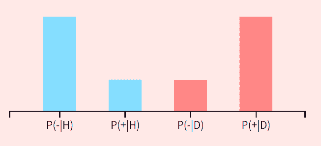

# 这是一本好玩的可视化统计概率入门书

机器之心报道

**参与：张倩、晓坤**

> 想学统计概率但书读不下去？那可能不是你的问题，是书有问题。

来自斯坦福大学的一位研究生和他的伙伴们开发了一本颇有新意的统计概率入门教材，与传统教材不同的是，这本书充分利用了数据可视化技术，交互性和趣味性都非常强，可以边读边玩。

教材链接：https://seeing-theory.brown.edu/cn.html#firstPage

该书共分为 6 章，分别为基础概率论、进阶概率论、概率分布、统计推断：频率学派、统计推断：贝叶斯学派和回归分析，每章分为三个小节，如图所示：

**一本可以玩的统计概率入门书** 

还记得中学课本上的「抛硬币」实验吗？与我们最开始接触统计概率知识时一样，这本书也是从「抛硬币」开始讲起。但不同的是，这本书真的可以让你「抛硬币」！你可以选择点击图中的「抛一次硬币」或「抛 100 次硬币」按钮，左图中的「observed outcomes」柱状图就会发生变化。

上图是打开这本书时的原始界面。现在让我们开始试验：点击「抛 100 次硬币」

*点击 1 次「抛 100 次硬币」的结果* 

*点击 10 次「抛 100 次硬币」的结果* 

随着抛硬币次数的增加，左图不断发生变化。有时间的同学可以玩一下（or 一天）。类似的玩法还有掷骰子、抽牌等。其中，掷骰子时还可以设置每一面的权重，这样最终期望值也会很不一样。

当然，以上只是一些入门级的玩法。作者从第二章开始介绍「进阶概率论」。此时，可视化的优势变得更加明显，玩法也更加复杂。

*「古典概型」部分的可视化。* 

*「置信区间」部分的可视化。设置好概率分布类型、样本大小和置信水平之后，就可以点击「开始生成样本」，左右两边的图都开始随着样本增加发生变化。* 

当然，「好玩」只是这本教材的附加属性，其核心属性还是干货满满的知识讲解及其可视化。下文将以第五章中的「贝叶斯公式」一节为例展现本书的核心特点。

**贝叶斯公式**

在「贝叶斯公式」这一节，使用了「健康/患病」和「阳性/阴性」两个二值变量来进行贝叶斯公式的后验概率计算。

我们可以通过鼠标拖动来改变健康和患病人数的比例，这决定了先验概率 P(患病)。如下图所示，P(Healthy) 或 P(H)=1，即 P(患病)=0。

右侧能看到对应的图示，蓝色点标示健康。

再把健康人数比例调到 0.66。

人群分布图也同时发生了变化。

然后，我们可以继续设置似然度 P(阳性 | 患病) 等的值。

这样也顺便统计出了 P(阳性) 的值。知道 P(患病)=0.34、P(阳性 | 患病)=0.75、P(阳性)=0.58，就可以直接计算后验概率 P(患病 | 阳性)=0.34x0.75/0.42=0.60。

我们可以选择只陆续采样一个样本，看看检查结果如何，右下方可以看到被检查出阳性或阴性的健康人数和患病人数的分布。

选择检查所有样本之后，就可以立即看到最终的健康/患病人数的分布。

可惜的是，这些计算并没有按照逐个采样进行动态更新，而是一次性根据所有样本得到的，从而难以体会贝叶斯学派和频率学派的区别所在，感兴趣的读者也可以自己按照逐个采样的结果来计算后验概率。

**关于作者**

本教材的主要设计者 Daniel Kunin 现在是斯坦福大学的在读硕士生，主修计算和数学工程。他对学科之间的联系感兴趣，热衷于将数据可视化作为一种教学工具，希望用数学模型来帮助大家理解复杂的过程。他们设计的这一教材获得了 2017 年的 Kantar Information is Beautiful 奖项。数据可视化使用 Mike Bostock 的 javascript 库 D3.js 制作。

****本文为机器之心报道，**转载请联系本公众号获得授权****。**

✄------------------------------------------------

**加入机器之心（全职记者 / 实习生）：hr@jiqizhixin.com**

**投稿或寻求报道：**content**@jiqizhixin.com**

**广告 & 商务合作：bd@jiqizhixin.com**