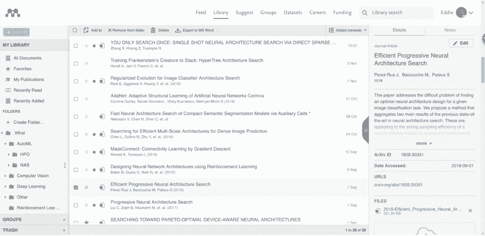
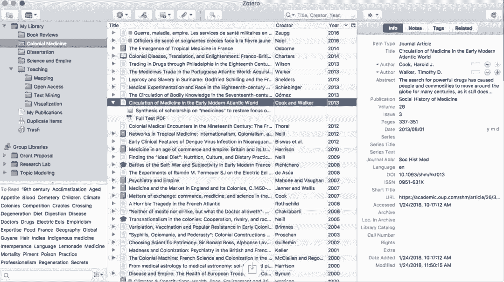
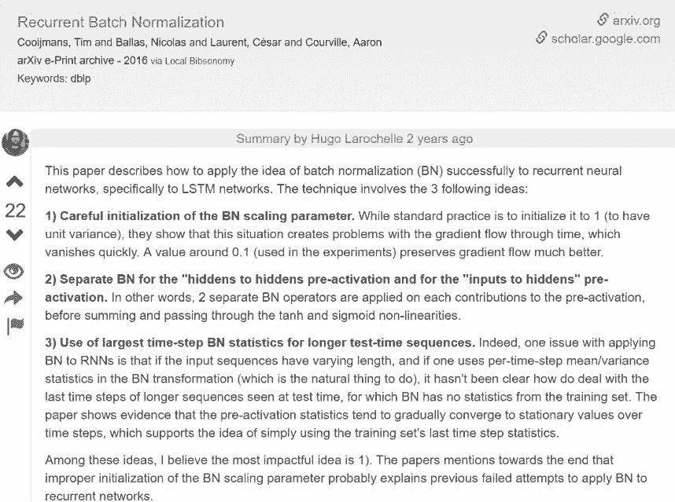
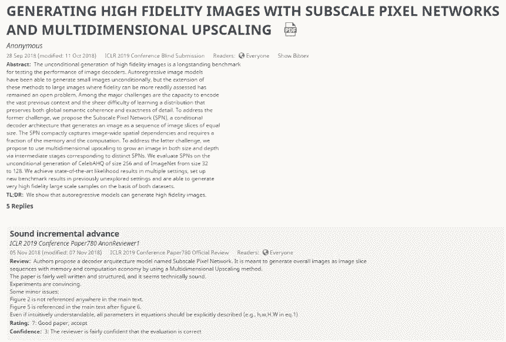
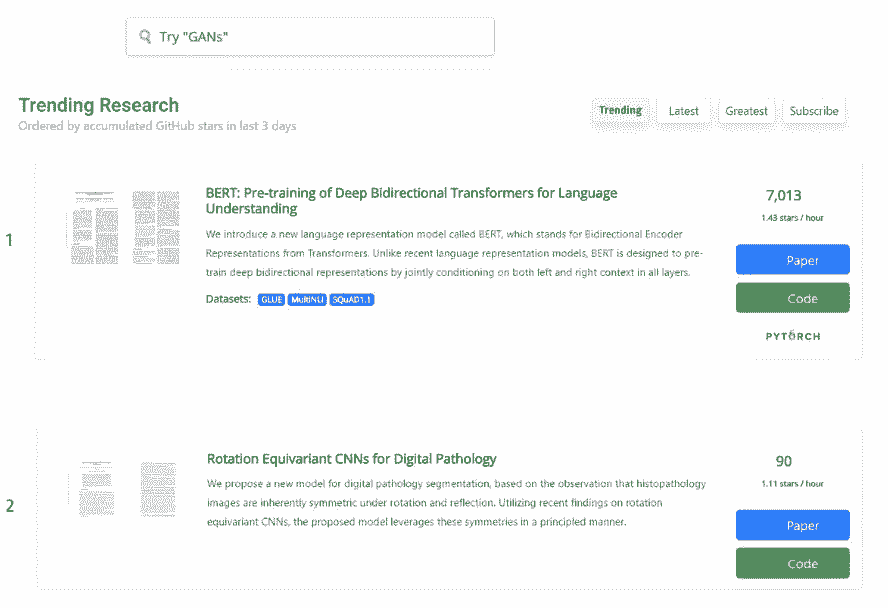
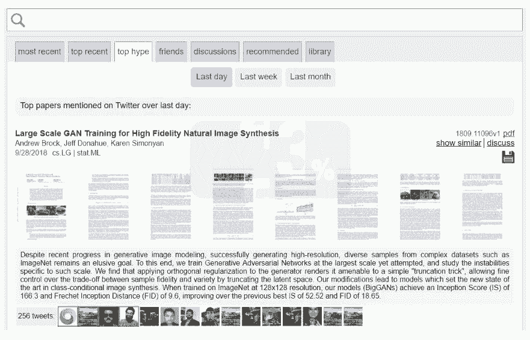
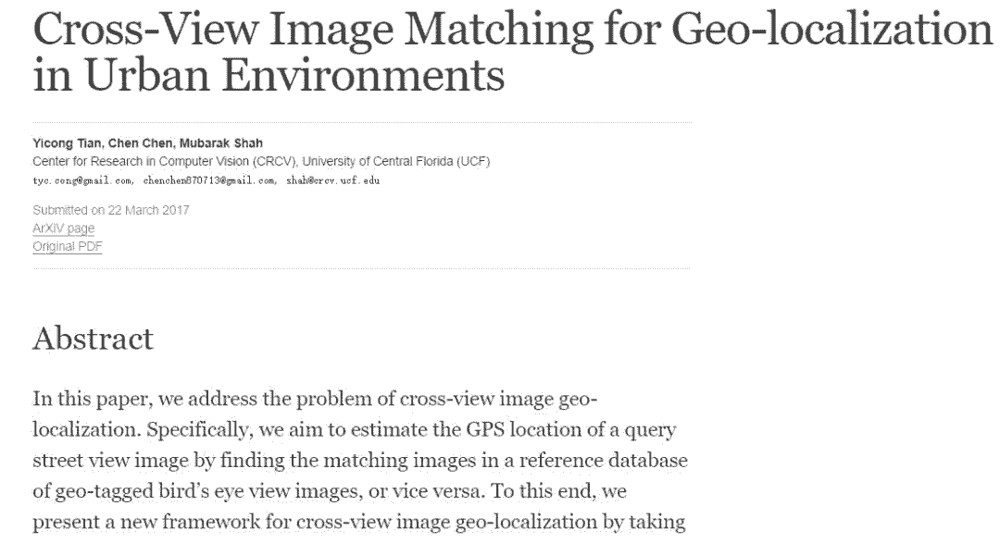
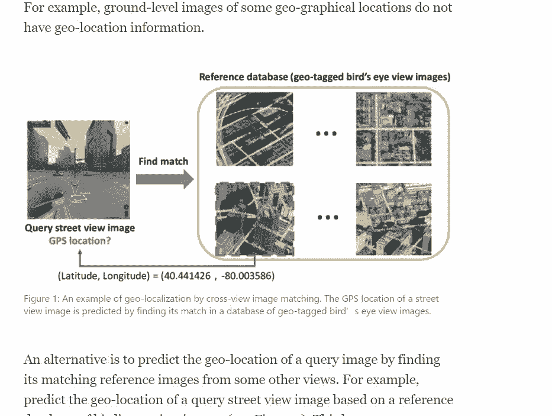
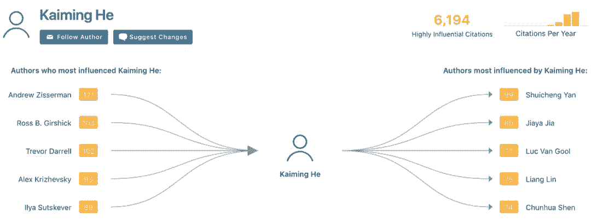
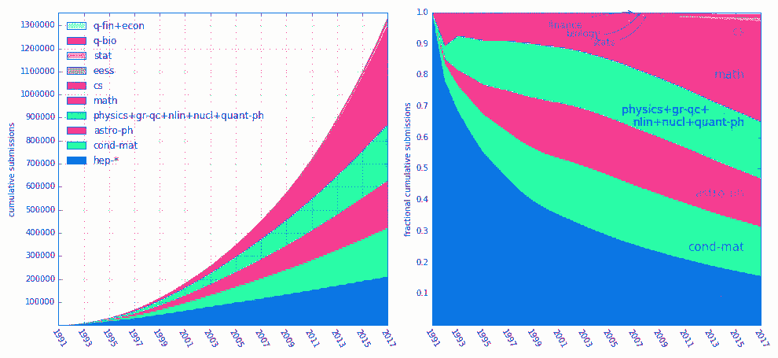

# 死磕论文前，不如先找齐一套好用的工具

选自 Medium

**作者：******Eddie Smolyansky****

******机器之心编译******

**参与：刘******晓坤、王淑婷****

> 还在机器学习论文的海洋里忘我沉沦？先花几分钟学些新工具，不亏，论文阅读、评论、社交、管理、搜索、复现、写作全不误。

作为像深度学习这样高产领域的研究人员，我们经常会发现自己被论文的汪洋所淹没。这些论文是如此之多，想全部读完并跟踪最新研究似乎很难很难。我觉得形成这种局面的一个重要原因是，我们没有充分利用现有工具和服务来让工作变得更加简单。另一个原因是缺少能够在一个界面下满足我们所有需求的真正好产品，不过说到这个就得另写一篇博客了。

最近，我开始了解 ML 的一个子领域，对该子领域相关文献的优先排序、阅读和管理让我感到非常沮丧……最后我选择找些工具来帮忙处理这项任务，我想把这些好用的产品和服务分享给你们。希望能够帮那些需要和科学论文打交道的人改善工作流程。

我主要关注的是论文阅读和展示的问题（而非写作）：

1.  Reference Manager（也叫论文库）

2.  用社交平台来分享知识

3.  运用自动论文分析算法来获取额外的元数据（关键词、相关数据集、重要引用等）

**Reference Manager（也叫论文库）**

你可以在这些平台上创建和管理所有以前和未来的阅读清单，添加个人笔记并和小组分享。这些库会被同步到云端，也就是说你在任何地方都能打开论文。看书可以用 goodreads，不过看论文的话，最好从下列工具中选择：

1.  Mendeley：这款产品虽然颜值不咋地，但它有免费的商业模式，支持 web、PC、Mac 和移动手机等多个平台。除了一般的论文笔记，你还可以直接注释和高亮显示 PDF。它的云存储是有限额的，超过几百篇论文之后就得付费。

2.  Paperpile：它需要付费订阅（没有免费版本，可以用谷歌账号免费试用 30 天），但看起来很潮，用起来也感觉不错。你可以非常轻松地把论文库从其它服务平台上导入到这款产品中。你还可以把库同步到自己的谷歌云，这算是它的一个优势。目前它只能在谷歌浏览器上使用。

3.  Zotero：这是一个免费和开源的实现，你只需为超额的云存储付费。类似 Mendeley，不过功能没它多。

*   Mendeley：https://www.mendeley.com/

*   Paperpile：https://paperpile.com/

*   Zotero：https://www.zotero.org/

当然，你还有很多选择，不过这几个是我用过并且感觉还不错的。如果让我选的话我会选 Mendeley，因为它支持很多平台而且还免费。

*Mendeley 的界面*

*Zotero 的界面*

**arXiv 进化版**

arXiv 于 1991 发布，并在近十年内鲜有变化，尽管论文发表数大幅增长（到 2016 年 10 月提交论文数已经达到了每月超过 10000 篇）。当然，我们现在对论文资源库提供的功能已经有很多新的需求。我们想要能执行论文分析的算法，想找到实现论文结果的代码，希望有能共享信息的社交平台，我们还可能对双列格式的 pdf 文档感到厌烦。

在网上搜索现有解决办法之后，我找到很多此类工具。

**社交平台**

1.  Shortscience：这是一个能共享论文概述的平台，目前有超过 1000 篇论文概述，并仍在持续增长；

2.  OpenReview：这是一个能提供公开论文评审过程的平台，所有提交的论文会公开作者姓名等信息，同时接受同行的评价及提问，可以匿名或实名地对论文进行评价。公开评审结束后，论文作者也能够调整和修改论文。Openreview 目前仅对特定学术会议提供评审功能，例如 ICLR，并且由于受到广泛质疑，ICLR 在 Openreview 上的评审也被改成了双盲评审。除了官方评审之外，近期很多论文的评论区也能看到读者和作者之间的积极交流。

3.  Scirate：能看到热度较高的 arXiv 论文，并按学科分门别类，还能浏览相关论文的评论。但其热度排序基于该网站内的点赞数，而这个网站的活跃度并不高。

*   Shortscience：http://www.shortscience.org/

*   OpenReview：https://openreview.net/

*   Scirate：https://scirate.com/

*Shortscience 的论文概述示例*

*Openreview 上的 ICLR 2019 论文及评审示例*

**找到论文的代码实现**

1.  Papers With Code：自动把论文连接到实现代码的 GitHub 资源库和数据集，并根据 GitHub 的收藏量排序。每篇论文可能有多个合并的条目。

2.  Github pwc：以相当简洁的列表关联论文和代码实现，包含最新的 NIPS 论文。

3.  GitXiv：每个项目可以方便地展示为 arXiv+GitHub+链接+讨论，可惜的是这个项目不再维护了。

*   Papers With Code：https://paperswithcode.com/

*   Github pwc：https://github.com/zziz/pwc

*   GitXiv：http://www.gitxiv.com/

*Papers With Code 界面。*

*GitHub pwc 页面上的一些链接。*

**其它工具**

1.  arXiv-sanity：相比于 arXiv 有很大的改进，包括在浏览中显示摘要、评论和非常基本的社交、库功能。这个整合了很多便捷功能的网站，是 Andrej Karpathy 在空闲时开发的。

2.  arXiv-vanity：可以将来自 arXiv 的论文渲染成响应式网页，从而让人们不用再看 pdf 文档。

*   arXiv-sanity：http://arxiv-sanity.com/

*   arXiv-vanity：http://arxiv-vanity/

*arXiv-sanity 界面*

*arXiv-vanity 转换论文示例*

**论文搜索和分析**

1.  Google scholar：如今搜索论文的首选，可以在这里查看论文统计和引用参考文献，还能通过关注作者或者论文获得新论文更新提醒，以及利用自动化推荐来提供一个基本库。

2.  Semantic scholar：可以结合外部材料整合进行论文的语义分析。功能包括：展示引用和参考文献、度量论文影响力、展示论文图表、自动生成关键词（根据标题）、分析作者、在互联网寻找额外资源（例如，相关 youtube 视频），以及推荐论文。

*   Google scholar：https://scholar.google.co.il/

*   Semantic scholar：https://www.semanticscholar.org/

*   Semantic Scholar: author profile page

*Semantic Scholar：作者简介界面*

**适用于作者的工具**

1.  Overleaf：支持多人协作的在线 LaTeX 编辑器，好比用谷歌文档写论文，很好实现。

2.  Authorea：一种支持多人协作在线撰写论文的方法，旨在减少 LaTeX 的使用，支持现代 WYSIWYG 编辑器。支持内联代码和数据，促进可复现性，支持内联公共评论和其它合理功能。

3.  Code ocean：基于云计算的再现性平台。我的理解是你将自己的研究作为 Jupyter 环境代码上传，然后在线运行，并复现作者曾取得的相同图表/输出。

*   Overleaf：https://www.overleaf.com/

*   Authorea：https://www.authorea.com/

*   Code ocean：https://codeocean.com/

[如果你觉得前文太长，可以选择……不看]

**我的建议**

*   管理阅读库：Mendeley

*   阅读和写论文评论：shortscience 和 openreview

*   将论文和 GitHub 资源库匹配：paperswithcode 和 pwc

*   论文和作者分析：Semantic scholar

*   写论文：Overleaf

顺便提一下，谷歌最近发布的 Dataset Search 也是搜索数据集的神器哦。

最后，希望这篇博客里推荐的服务平台中至少有一个能让你改善工作流程。嘻嘻~

*arXiv 上不同主题的提交量，数据来自其统计页面。*

*原文地址：https://towardsdatascience.com/finding-and-managing-research-papers-a-survey-of-tools-and-products-9151810d1b4d*

****本文为机器之心编译，**转载请联系本公众号获得授权****。**

✄------------------------------------------------

**加入机器之心（全职记者 / 实习生）：hr@jiqizhixin.com**

**投稿或寻求报道：**content**@jiqizhixin.com**

**广告 & 商务合作：bd@jiqizhixin.com**