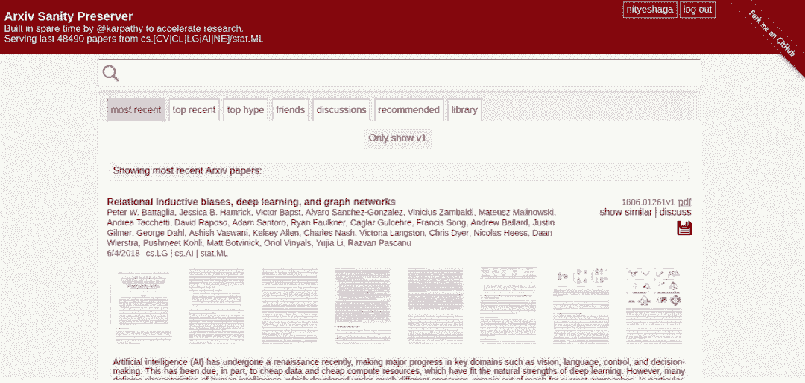
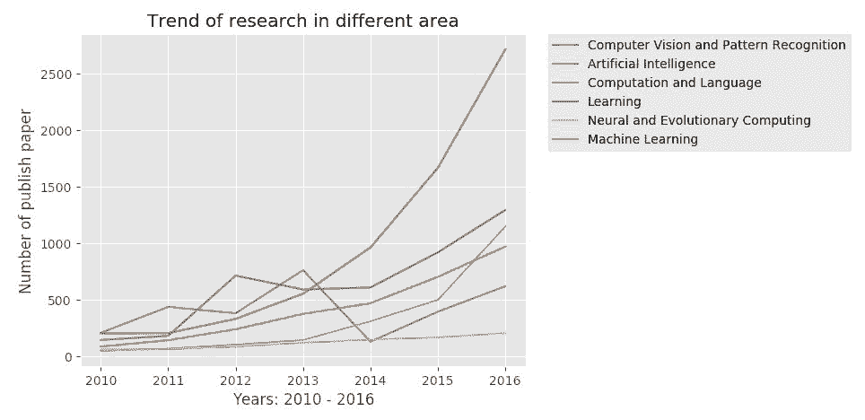
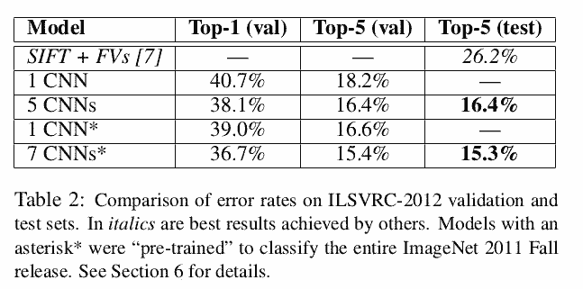

# 入门 | 学完了在线课程？如何开启深度学习论文的阅读模式

选自 Medium

**作者：Nityesh Agarwal**

**机器之心编译**

**参与：****刘晓坤、李亚洲**

> 在读完书或者完成深度学习在线课程之后，如何才能继续学习机器学习？如何才能「自给自足」地理解这一领域的最新突破？答案就是读论文，机器学习领域的论文是所有前沿思想与技术的孵化所。大多数深度学习概念与技术都是近几年提出来的，想要深入理解它们就必须要看原论文，而不能仅仅关注在线课程、博客甚至是书籍，只有论文才是根本。

在一个 Quora 问答《I want to pursue machine learning as a career but not sure if I am qualified. How can I test myself?》中，问到如何测试某人是否达到了从事机器学习职业的标准。吴恩达说（只要不断学习）任何人都可胜任机器学习的工作。他说，在完成一些机器学习课程之后，「进一步的学习，阅读研究论文。最好是尝试复现研究论文中的结果。」

OpenAI 的研究员 Dario Amodei 说，「为了测试自己是否适合从事 AI 安全或者机器学习的工作，只要尝试快速实现大量模型。从最近的论文中找到一个机器学习模型，实现它，快速的让它能跑起来。」

这表明，读研究论文，对个人进一步了解这个领域极为重要。

每个月都有大量的论文被发表，任何认真学习 ML 的人，都不能只是依靠别人把最新研究分解过的教程类文章或者课程。新的、独创性的研究都是在读文章的时候做出来的。机器学习领域的研究节奏从未如此快过，你能跟上节奏的唯一方法就是养成阅读论文的习惯。

在此文章中，我会尝试给出阅读论文的可行性建议。最后，我会尝试分解一篇论文，从此开始读论文。

**如何读论文**

**arXiv.org**

arXiv 是预印本论文的网上发布平台，研究者一般在著名的学术期刊或会议论文发表之前就先将其发布到该平台。

那么为什么先发到 arXiv 上呢？其实事实证明，研究和实际撰写论文并不是终点，将论文提交给某个学术期刊发表是非常漫长的过程。在一篇论文提交给学术期刊后，同行审议的过程一般需要数月甚至一年多的时间。而现在它对于机器学习领域来说是不可取的，因为这个领域发展从未如此迅速。

所以，研究者在预印本资源库 arXiv 上发表论文以快速传播他们的研究，并获得快速反馈。

**Arxiv Sanity Preserver**

让研究者能轻松的预印论文自然很不错。但对于阅读的人而言，预印论文的数量太多了，对于新手而言肯定不适合（个人观点，想试试也无妨）。

所以，我要向你推荐 Arxiv Sanity Preserver：http://www.arxiv-sanity.com/

*Arxiv Sanity Preserver 由 Andrej Karpathy 建立。*

arXiv Sanity 对于 arXiv 而言，正如 Twitter 的 newsfeed 对于 Twitter 的作用。在 newsfeed 中，你能看到最有趣的符合你个人口味的推文，arXiv Sanity 也一样。它能让你基于研究趋势、你的过去喜好以及你关注的人的喜好来排序论文。

[`v.qq.com/iframe/preview.html?vid=l1343o5ndnw&width=500&height=375&auto=0`](https://v.qq.com/iframe/preview.html?vid=l1343o5ndnw&width=500&height=375&auto=0)

**Machine Learning-Reddit 上的 WAYR thread**

WAYR 是 What Are You Reading 的简写。这是一个 Reddit 的子网站（subreddit）Machine Learning 上的一个 thread，其中人们在上面推送近期阅读的机器学习论文，并讨论他们发现的有趣结果。

如我所说，每周在 arXiv 上发表的机器学习领域的研究论文数量非常多。这意味着几乎不可能让个人每周都把它们全部读完，同时还能兼顾其它事情。同时，也不是所有论文都值得一读的。

因此，你需要把精力集中在最有潜力的论文上，而以上介绍的 thread 就是我推荐的一种方式。

**Newsletter、Newsletter、Newsletter!**

Newsletter 是我个人最喜欢的追踪 AI 最新进展的资源。你只需要订阅它们，就可以定期在电子邮件里收到推送。然后，你就能了解到这周里和 AI 相关的最有趣的新闻、文章和研究论文。

我已经订阅了以下 Newsletter：

*   Import AI（Jack Clark）：这是我的最爱，因为除了推送以上我介绍的那些信息之外，它还拥有称为「Tech Tales」的特色栏目。这个栏目包含新的 AI 相关的基于上周时间的短篇科幻小说。

*   地址：https://jack-clark.net/

*   Machine Learning（Sam DeBrule）：他也以相同的名字在 Medium 上发表文章，其中有一些非常有趣的文章，推荐阅读。

*   地址：https://machinelearnings.co/

*   Nathan.ai（Nathan Benaich）：以上两个快讯是周报形式，而这个是季刊形式。因此，你能在每三个月收到一封长邮件，其中总结了过去三个月里最有趣的领域进展。

*   地址：https://www.getrevue.co/profile/nathanbenaich

*   The Wild Week（Denny Britz）：这个快讯的展示很简洁，但在过去两个月里似乎没那么活跃了。总之我也在这里提一下，万一 Denny 又继续更新了呢。

*   地址：https://www.getrevue.co/profile/wildml

**在 Twitter 上关注「AI 大牛」**

另一种追踪领域最前沿的方式是在 Twitter 上关注著名的研究者和研究机构的账号。以下是我的关注列表：

*   Michael Nielsen

*   Andrej Karpathy

*   Francois Chollet

*   Yann LeCun

*   Chris Olah

*   Jack Clark

*   Ian Goodfellow

*   Jeff Dean

*   OpenAI

**但我要怎么「开始」？**

没错，这才是更加迫切的问题。

首先，确保你理解机器学习的基础，例如回归和其它算法；理解深度学习的基础，一般神经网络、反向传播、正则化，以及一些进阶内容，例如卷积网络（CNN）、循环网络（RNN）和长短期记忆网络（LSTM）的工作方式。我不认为阅读研究论文是理清基础的好办法，有很多其它资源可以用来打好基础。比如吴恩达的《Machine Learning》、《Deep Learning》在线课程，周志华的《机器学习》（西瓜书）、Bengio 等著的《深度学习》教材。

学好基础后，你应该从阅读引入那些基本概念、思想的研究论文开始。从而你可以聚焦于习惯研究论文的形式，不要太担心对第一篇研究论文的真正理解，你已经对那些概念很熟悉了。

我推荐从 AlexNet 这篇论文开始。

论文地址：https://papers.nips.cc/paper/4824-imagenet-classification-with-deep-convolutional-neural-networks

为什么推荐这一篇？看看下图：

我们可以看到，计算机视觉和模式识别（Computer Vision and Patter Recognition）的论文发表数从 2012 年开始暴涨，而这一切都源于 AlexNet 这篇论文。

AlexNet 的作者是 Alex Krizhevsky、Ilya Sutskever 和 Geoffrey Hinton，论文标题为《ImageNet Classification with Deep Convolutional Networks》。这篇论文被认为是该领域中影响力最大的论文。它介绍了研究者如何使用称为 AlexNet 的卷积神经网络赢得了 2012 年的 ImageNet 大规模视觉识别挑战赛（ILSVRC）的冠军。

让计算机观察和识别目标是计算机科学最早期的研究目标之一。ILSVRC 就像是计算机视觉的奥林匹克，其中参赛者（计算机算法）需要准确识别图像属于 1000 个类别的哪一个。而且，在 2012 年，AlexNet 在这项竞赛中远远超越了竞争对手：

它获得了 15.3% 的 top-5 准确率，第二名仅获得 26.2% 的 top-5 准确率。

毋庸置疑，整个计算机视觉社区都非常令人兴奋，该领域的研究正前所未有地向前加速。人们开始意识到深度神经网络的强大力量，你也可以在该领域尝试获得更多的成果。只要你们了解一些卷积网络的基础，那么掌握 AlexNet 论文的内容就会很简单，它们将会给你带来更多的知识与力量。

完成这一篇论文后，你可以尝试其它与 CNN 相关的开创性论文，也可以转而了解其它如 RNN、LSTM 和 GAN 等流行的架构。

当然目前还有很多渠道获取重要的研究论文，例如在 GitHub 中就有非常多的论文集合。

论文集合：https://github.com/floodsung/Deep-Learning-Papers-Reading-Roadmap

此外，最后还有一个非常优秀的平台 Distill，是一个现代的交互、视觉化期刊平台，面向现有以及新的机器学习研究成果。Distill 使用了现代用户界面，注重对研究的理解与诠释。

Distill 地址：https://distill.pub (https://distill.pub/)

虽然 Distill 更新非常慢，但它的每一篇都非常经典。

*原文链接：https://towardsdatascience.com/getting-started-with-reading-deep-learning-research-papers-the-why-and-the-how-dfd1ac15dbc0*

****本文为机器之心编译，**转载请联系本公众号获得授权****。**

✄------------------------------------------------

**加入机器之心（全职记者 / 实习生）：hr@jiqizhixin.com**

**投稿或寻求报道：**content**@jiqizhixin.com**

**广告 & 商务合作：bd@jiqizhixin.com**