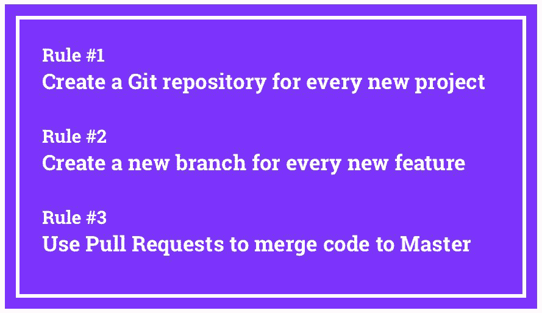

# 入门 | 敲黑板！你和 GitHub 高手就差这三条规则······

选自 Medium

**作者：Ariel Camus**

**机器之心编译**

**参与****：高璇、路**

> 本文作者 Ariel Camus 介绍了每天使用 Git 和 GitHub 的重要性，还分享了三个帮助大家成为 Git 和 GitHub 高手的简单规则。

本文不会介绍如何创建 GitHub 简历或如何使用终端提交 Git。我将解释每天使用 Git 和 GitHub 的重要性，尤其对于正在学习写代码的人。我还将分享并讨论三个简单的规则，你可以通过遵循这些规则，变成一个优秀的 Git 和 GitHub 使用者。

**为什么 Git 和 GitHub 如此重要?**

如果你正在学习编程，而且你的终极目标是获得一份软件开发的工作。在这种情况下，答案很简单：

学习 Git 和 GitHub 非常重要，因为 99% 的公司都会使用 Git 和 GiHub。所以，学习使用 Git 和 GitHub 可以让你更容易被雇佣，并且能将你和初级开发者区别开来。

高级开发者之所以成为高级开发者，并不是因为他们更了解特定语言的语法，而是他们有和真实用户一起处理大型复杂项目和完成业务目标的经验。

当你仍在学习写代码阶段时，你很难获得这种经验。然而，获得现实世界经验的一个简单方法就是利用现实世界项目使用的工具和方法。Git 和 GitHub 就是一个例子。

你还可以做的事情：远程结对编程、为开源做贡献、为你的简历构建专业设计网站。

即使你同意「掌握 Git 和 GitHub 有助于找工作」，你可能仍然会想：

「为什么 Git 和 Github 对公司如此重要？」

简而言之，Git 允许团队以异步方式高效地为同一个项目贡献代码。这使得团队能够更好地协作，从而解决更大更复杂的问题。

Git 是一个分布式版本控制系统，它还提供取消更改、创建代码分支、解决合并冲突等机制。这些都是非常有用的特性，可以解决每个软件团队每天都面临的特定问题和常见问题。Git 是当今的主流解决方案。

另一方面，GitHub 是 Git 之上的附加层，它为其他特定和常见问题提供解决方案，比如代码审查、pull request、问题管理/bug 跟踪等等。

注：尽管 Git 是大多数公司的首选版本控制解决方案，但 GitHub 仍然有一些强大的竞争对手，比如 GitLab 和 Bitbucket。但是，如果你知道如何使用 GitHub，那么你就能驾轻就熟地使用 GitLab 或 Bitbucket。

现在你已经了解了掌握 Git 和 Github 的重要性，接下来我们来看三个简单规则，它们可以让你在学习编写代码阶段，就轻松成为专业的 Git 和 Github 用户。

**如何利用 3 条简单规则掌握 Git 和 Github？**

我是 Microverse 的创始人，Microverse 是一所面向远程软件开发人员的学校，在你找到工作前完全免费使用。我们在 22 周计划中，不仅教学生如何编程，同时也会给他们大量的指导和构思，让他们在计划中获得实际经验。

为了成为专业的 Git 和 Github 用户，我们要求学生遵循以下三个规则。培训结束后，我们的学生应该能自然而然运用 Git、GitHub、branch、合并请求和代码评审。

在讨论这三条简单规则前，请先完成以下任务：

1.  如果你对 Git 和 Github 还不熟悉，请先从 HubSpot 上完成这个很棒的教程：https://product.hubspot.com/blog/git-github；

2.  如果你还不了解 GitHub 流，你应该先学习它，因为我们后边会用到：https://guides.github.com/tion/flow/。

无需多言，三条能令你在学习编程阶段就能熟练掌握 Git 和 Github 的简单规则如下：

*   规则 #1：为每个新项目创建一个 Git 仓库

*   规则 #2：为每个新特性创建一个新分支

*   规则 #3：使用 Pull Request 将代码合并到 Master 分支

即使你的项目非常简单或者你只是单独工作，但只要在每次编程时遵循这三条规则，你很快就可以成为 Git 和 GitHub 的使用高手。

我们会简单分析每条规则，以便你理解该如何做以及为什么这些规则很重要。

**规则 #1：为每个新项目创建一个 Git 仓库**

第一条规则很简单，但是养成习惯非常重要。每当你开始一个新项目时，如你的简历、学习项目、编程挑战的解决方案等等，你都应该创建一个新的 Git 仓库，并将其推送到 GitHub 上。

拥有专用的 repo 是为你编写的每一行代码使用版本控制的第一步。使用版本控制是你加入公司、开始从事实际项目后的工作方式。及早学习并养成习惯。

注：如果使用终端比较麻烦，你无法在所有项目中使用 Git，可以考虑使用 Github 桌面应用程序（https://desktop.github.com/）。

**规则 #2：为每个新特性创建一个新分支。**

假设你希望在简历里构建一个新的「Contact me」部分/组件。那么为这个新特性创建一个专用的分支，给它一个有意义的名称（例如 contact-me-section），并将所有代码提交给这个特定的分支。

如果你不知道何为分支，请返回到 Github 流（https://guides.github.com/guidetion/flow/），阅读我之前推荐的内容。

使用分支可以让你和团队成员以并行的方式处理不同的特性，同时将每个特性的代码与其他代码区分开来。这使得不稳定的代码不会轻易并到主代码库中。

即使你是团队中唯一的成员，一旦你真正开始工作，熟练使用特性分支会使 GitHub 流的过程变得轻而易举。

**规则 #3：使用 Pull Request 将代码合并到 Master 分支**

默认情况下，每个仓库都从一个主分支开始。永远不要直接在主分支上进行改动。相反，你应该使用特性分支，并打开一个新的 PR，将特性分支代码与主分支代码合并。

在现实工作中，会有人查看你的 Pull Request，并在批准前进行代码审查。GitHub 甚至会对你的代码进行自动测试，让你知道它是否有问题。如果你的代码与主分支代码之间存在合并冲突，你也会收到通知。例如，如果另一个开发人员推送到主分支的更改影响了你修改过的文件时，就会发生这种情况。

在代码经过审查、测试和批准之后，reviewer 会允许你合并 Pull Request，或者他们直接合并你的 Pull Request。

即使你单独工作，也要习惯于创建 Pull request，以便将更改合并到主分支。这是几乎所有开源项目使用的基本工作流程。如果你曾经贡献过某个项目，理解这三个规则将让你的贡献很容易被接受。

**结语**

如果你仍然感到困惑，那就慢慢来，记住这三条规则。不要试图去想「如何做」，而要专注于「做什么」和「为什么」。

一旦「做什么」和「为什么」清楚了，在时机成熟时你就能知道「如何做」了。重复这个过程 2-3 次，你就会对它们得心应手了。**

*原文链接：https://medium.freecodecamp.org/follow-these-simple-rules-and-youll-become-a-git-and-github-master-e1045057468f*

****本文为机器之心编译，**转载请联系本公众号获得授权****。**

✄------------------------------------------------

**加入机器之心（全职记者 / 实习生）：hr@jiqizhixin.com**

**投稿或寻求报道：**content**@jiqizhixin.com**

**广告 & 商务合作：bd@jiqizhixin.com**