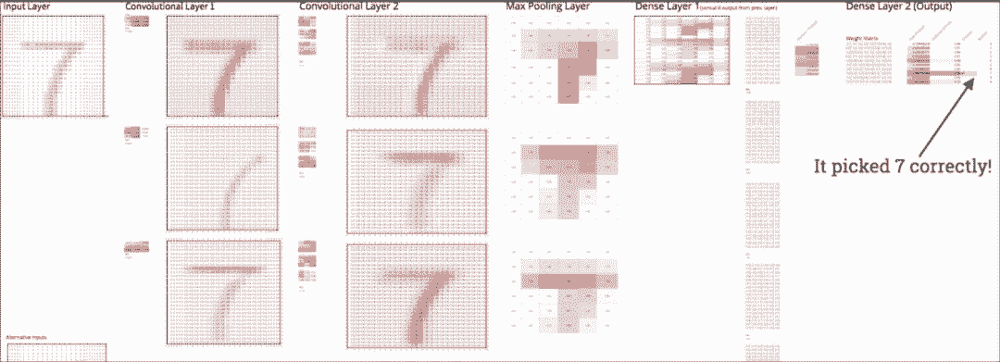
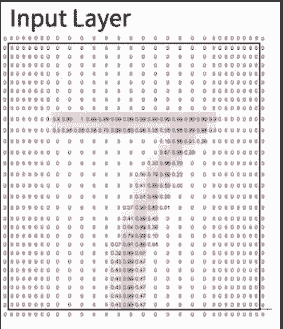
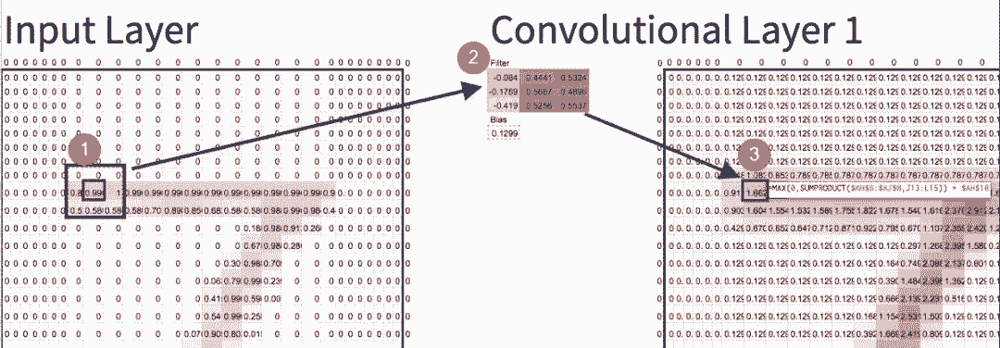
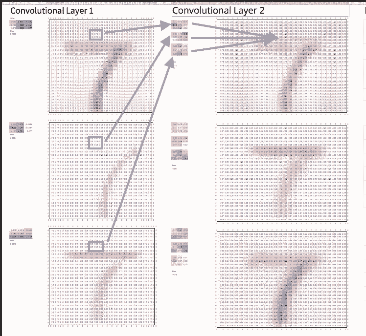

# 想要实现深度神经网络？一张 Excel 表格就够了

选自 Medium

**作者：Blake West**

**机器之心编译**

> 卷积神经网络（CNN）经常被用于图像识别、语音处理等领域，是人工智能近年来快速发展的重要组成部分。然而，对于入门人士来说，我们似乎难以理解其中的原理。实际上「卷积」等概念并非遥不可及，本文作者 Blake West 向我们介绍了使用 Excel、Google Sheets 等电子表格实现卷积神经网络的方法。

事实上，深度卷积神经网络根本不像它听起来这么可怕。本文将在谷歌表格中实现一次来证明给你看。进入演示地址，下载为 Excel 表格，然后你就可以随意编辑，看看不同层是怎样影响模型最后的预测结果的。

演示地址：https://docs.google.com/spreadsheets/d/1SwfVctd4TjdN2S8BL09ktpQN_41sARYzD3NEHyr-8Z0/edit?usp=sharing

下面我们会从较高角度来做一个简短的卷积神经网络原理的介绍。

在我们开始前，我要介绍一下 FastAI，我最近完成了他们的深度学习课程，所有的灵感和功劳都归他们。Jeremy Hdward 是一个非常棒的导师，和他的联合创始人 Rachel Thomas 在课上展示了怎样用 excel 做卷积神经网络。但就现在的状况来说，这个表在网上找不到，而且我不认为这个表格是完整的网络。我做了一点扩展，然后把这个放到了谷歌表格里，这样大家都能随意地耍了。

**如何构建？**

我用 MNIST 数据集训练了一个非常简单的卷积神经网络，这个数据集是用来预测有手写数字图片里的数字的。每一个图片都是 28×28 像素大小。每一个像素用 0（空白）到 1（深色）之间来表示。MNIST 是一个非常经典的数据集，常被用于各种新技术的研究，如 Geoffrey Hinton 等人的 Capsule。这个数据集非常的小所以训练起来很快，但这个数据集又有足够多的数据来展示机器学习的复杂性。这个模型的工作是预测图片里的数字是多少。每一个图片都明确的是 0-9 之间的一个数。

MNIST 数据集的一个例子，28×28 像素大小。注意：我加了有条件的格式，这样有更大数字的像素会显得更红。

我用了一个非常著名的深度学习库 Keras，然后把我模型中训练好的权重放到表里。训练好的权重只是数字。把它们放到表格里就是说从模型里复制然后粘贴到表格里。最后一步是在表格里加上复制模型功能的公式，就用传统的加法、乘法等。让我再说一次：用来重现一个深度学习模型的数学就是乘法和加法。

Keras 文档：https://keras.io

下图是模型每一层的权重/参数。权重是机器学习模型自动学来的。这个模型有差不多 100 个权重。更复杂的模型很容易就有几亿个参数。在下图你可以看到这模型的所有的 1000 个参数。

**何时应该使用卷积神经网络？**

卷积神经网络的工作方式是在序列数据中找寻模式，这个模式可能难以用语言表达，或用简单的规则来表达。卷积神经网络假设序列的顺序是很重要的。

举个例子，图片分类是卷积神经网络主要的用途之一，因为像素是逻辑上有序的，而且对于所有人类来说图片里充满了模式。但是，只要试着用语言来描述到底什么区分开了一只猫和吉娃娃，你就知道为什么卷积神经网络有用了（下意识感知过程）。

另一方面，如果你收集了两支棒球队的各种数据，并希望从中预测出两者对决的结果，在这种情况下卷积神经网络就是一个不太合适的选择。你所拥有的数据（如联赛获胜&失败次数，球队击球平均数）并无固有顺序性。在这里顺序其实并不重要，而我们也已提取了自己所认为有用的特征。在这里，卷积神经网络并不适用。

**理解 CNN**

为了理解 CNN 背后的工作原理，我们将深度卷积神经网络拆分成「深度」、「卷积」和「神经网络」并分别解释。

**卷积**

想象你正闭着眼睛，试图识别手写图像上的数字。你可以和看着图像的人交谈，但他们并不知道这个数字是什么。所以你只能问一些简单的问题，该怎么办？

有一些可行的问题，例如，「它在顶部是基本呈直线吗？」「它有对角线吗？」等。问了足够多的问题以后，你就能很好的猜测该数字到底是 7 还是 2，或任何其它数字。

直观上，这正是卷积运算的工作方式。计算机是盲目的，所以它会按照自己的方式询问大量的关于小区域模式的问题。

*方框 1 中的数字和方框 2 中的数字分别对应相乘，然后得到所有乘积的和，即方框 3 的数字。这就是卷积运算。*

为了询问这些问题，图像中的每一个像素需要运行一个函数（即卷积运算），生成相应的像素值，以回答对应的关于小区域模式的问题。卷积运算利用卷积核寻找模式。例如，上图方框 2 中的数字在右侧的红色更深（值更大），左侧更浅（值更小）。则该卷积核的作用就是寻找竖直的颜色从左向右变深的边缘（简称左边缘）。

这可能不够直观，但只要在该表格中尝试交互你就能发现卷积核的工作方式。卷积核寻找的是和自己相似的模式。并且一个 CNN 通常有数百个卷积核，你可以对所有像素捕捉不同类型的模式，例如左边缘、上边缘、对角线、角等。

**深度**

寻找边缘是很基本的要素，那对于更复杂的形状要怎么处理呢？这正是「深度」即多层的用武之地。通过底部卷积层的运算中，我们已经有了图像的「左边缘」、「上边缘」和其它简单的卷积模式的分布。现在添加更多的层，对前面得到的所有模式分布再次进行卷积操作，然后组合起来。所以结合一个左边缘和一个上边缘各 50% 可以给你一个任意的左角，怎么样，很强大吧。

第二个卷积层取上一个卷积层得到的像素输出为输入，并用自己的卷积核对其进行卷积运算。和之前一样，我们得到了第二个卷积层的新的对应像素值。

实际应用的 CNN 会有很多个层，使得网络能构建越来越抽象和复杂的形状。即使仅仅经过 4 到 5 层的卷积，模型也能开始寻找关于脸部、动物等物体的关键特征。

**神经网络**

现在你或许会问自己，「这都很好，但是把所有的卷积结果一起提出来听起来很乏味？怎样才能把所有这些卷积核给出的结果结合起来变成有意义的东西呢。

首先，在一个更高的层面上，我们的卷积网络可以分成两个部分。第一个是卷积，卷积在图片数据里找出有用的特征。

第二部分是，在表格靠后的」密集层「（即全连接层，这么命名是因为这里每一个神经元都有好多参数）是用来分类的。一但你有了这些纹理，这些密集层的作用其实就是对每一个可能的数计算一堆线性回归，然后给一个分数。最高的分数就是模型的最终预测。

矩阵 1 是我们的卷积输出。每个矩阵 1 中的像素乘以矩阵 2 中的数字，求和之后的结果生成方框 3 里的数字。接下来对绿色框里的矩阵重复同样的运算。在这里，我们最终得到了 8 个输出，在深度学习里它们被称为「神经元」。

想要最终找出这些卷积核和密集层中正确的权重，是非常繁杂的一项工作。幸运的是，自动更新权重是神经网络工作的一部分，所以我们不必担心这一点。如果你对此比较好奇，请查找「反向传播」的有关内容（可参阅：[被 Geoffrey Hinton 抛弃，反向传播为何饱受质疑？（附 BP 推导）](http://mp.weixin.qq.com/s?__biz=MzA3MzI4MjgzMw==&mid=2650731098&idx=1&sn=c7391caee3a567b4b046406d53f022f2&chksm=871b3624b06cbf320f3725fe452d291e04a4a8c1beda8ee9e00f1d10266847be4736090aade3&scene=21#wechat_redirect)）。

**总结**

每个卷积神经网络都包含两大部分：卷积，它总是先开始行动，寻找图片中有用的特征；而分层在其后，经常被称为「密集」层，它们会根据特征对事物进行分类。

为了对这些概念有一个清晰的认识，我推荐你使用电子表格对它们进行操作。

在这里，你可以从头到尾跟踪一个像素，看着它通过过滤器，最终会发生些什么。我还在电子表格的评论中加入了更多技术细节的解释。

**资源**

想要学习更多？我推荐这些资源：

*   交互式卷积——一个强大的交互式卷积神经网络教程（只包括卷积部分，不包括神经网络部分），由 Victor Powell 编写：http://setosa.io/ev/image-kernels/。

*   深度学习实践——我已从这份 Fast.AI 课程中学到了很多，它是在线课程，完全免费：http://course.fast.ai/。

*   卷积神经网络视频展示——这份包含 20 分钟 CNN 讲解的教程由 Jeremy Howard（FastAI 创始人）授课，请跳至视频的第 21 分钟开始：https://www.usfca.edu/data-institute/certificates/deep-learning-part-one。

**Notes**

训练卷积神经网络需要的数学基础包括微积分，这样才能自动调整权重。但随着模型训练完成，它实际上只需要乘法与加法进行预测。在实践中，微积分部分的内容是由你使用的深度学习库来处理的。

*原文链接：https://medium.com/@bwest87/building-a-deep-neural-net-in-google-sheets-49cdaf466da0*

****本文为机器之心编译，**转载请联系本公众号获得授权****。**

✄------------------------------------------------

**加入机器之心（全职记者/实习生）：hr@jiqizhixin.com**

**投稿或寻求报道：editor@jiqizhixin.com**

**广告&商务合作：bd@jiqizhixin.com**