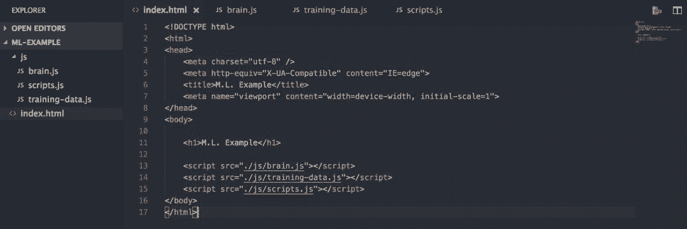
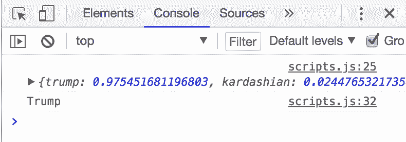

# 入门 | 无需基础知识，使用 JavaScript 构建你的第一个神经网络

选自 ITNEXT

**作者：Daniel Simmons**

**机器之心编译**

**参与：程耀彤、李泽南**

> > 随着新技术和新工具的出现，构建神经网络已不再是一件需要大量机器学习相关知识的工作了。本文将会教你以 JavaScript 库 Brain.js 为基础，构建并训练自己的神经网络。
> 
> **设定目标**
> 
> （如果你只想直接上手，请跳过这部分......）
> 
> 首先，本文作者还不是神经网络或机器学习方面的专家。坦率的说，我仍然对人工智能的大部分内容感到困惑。但希望这能够鼓励到正在读这篇文章，并急切想尝试机器学习的初学者们。
> 
> 机器学习是近年来在人们眼前时不时会出现的新概念，这让我不禁对自己说：「看起来这很酷，但是我不确定我是否想在接下来几个月的时间里学习线性代数和微积分……」
> 
> 然而，和很多的开发人员一样，我对 JavaScript 很感兴趣，偶尔也会寻找在 JS 中实现机器学习的例子，结果却发现大量的文章和 StackOverflow 的帖子都在告诉我们对于机器学习来说 JS 是一种多么糟糕的语言。诚然，目前这种观点还是事实。然后我就有所动摇了，认为他们是对的，我应该回头去验证格式输入并等待 CSS 网格的启动。
> 
> 但是后来我发现了 Brain.js，这让我大吃一惊。它在是如何被人们雪藏的？！这个库的文档写得非常好且易于遵循，在上手大约 30 分钟之内，我就建立并训练了一个神经网络。事实上，如果你想直接跳过整篇文章，仅仅在 Github 上阅读该库的教程，请便。它真的很棒：https://github.com/BrainJS/brain.js
> 
> 也就是说，接下来的内容不是关于深入研究神经网络的隐藏输入层、激活函数或如何使用 TensorFlow 的教程。相反，这是一个简单的、入门级别的关于如何实现 Brain.js 的解释，这有点超出了文档的范围。
> 
> **构建一个神经网络**
> 
> 以下是我们将要做的事情的概述：
> 
> 1\. 创建你的起始文件
> 
> 2\. 决定你想要你的神经网络做什么
> 
> 3\. 设置 Brain.js 并搞清楚如何处理训练数据和用户输入
> 
> 4\. 收集一些训练数据
> 
> 5\. 运行神经网络
> 
> 6\. 利润？
> 
> 如果你希望直接下载此项目的可用版本，而不是按照文章进行操作，那么你可以在这里克隆 Github 存储库：https://github.com/lordpoint/neural-network-author-classifier
> 
> **1 - 起始文件**
> 
> 创建一个新目录并在其中放置一个 index.html 样板文件。然后创建三个 JS 文件：brain.js、 training-data.js 和 scripts.js（或用于默认 JS 文件的任何通用项），随后将所有这些文件导入到 index.html 的底部文件中。
> 
> 
> 
> *永远不要害怕观察文件结构*
> 
> 到目前为止都很容易。
> 
> 现在，在这里获取 Brain.js 的源代码：https://raw.githubusercontent.com/harthur-org/brain.js/master/browser.js
> 
> 将全部内容复制并粘贴到空的 Brain.js 文件中，点击 save 和 bam：完成 4 个文件中的 2 个。
> 
> **2 -「我的目的是什么？」**
> 
> 接下来是有趣的部分：决定你的机器能学到什么。今天的机器学习模型可以解决无数的实际问题，例如，进行情感分析或图像分类等。我碰巧认为将文本作为输入的机器学习的应用程序非常有趣，因为你几乎可以在任何地方找到训练数据，而它们还有各种各样的潜在用途，所以我们将在这里使用的例子是一个处理文本分类的例子：
> 
> 我们将训练一个模型，让它判定一条推特是由 Donald Trump（唐纳德·特朗普）还是 Kim Kardashian（金·卡戴珊）写的。
> 
> Ok，这可能不是最有用的应用程序。但是 Twitter 是机器学习素材的宝库，尽管它可能是无用的，但我们的推特作者识别器仍然会说明一个强大的观点。一旦它被训练完成，我们的神经网络将可以在看到它从未看过的推特后确定它是由 Donald Trump 还是 Kim Kardashian 所发出的，仅仅通过识别他们所写东西中的模式。为了做到这一点，我们将需要提供尽可能多的训练数据，以便将其复制/粘贴到我们的 training-data.js 文件中，然后我们可以看看我们是否能找到一些推特的作者。
> 
> **3 - 建立和数据处理**
> 
> 现在剩下要做的就是在我们的 scripts.js 文件中建立 Brain.js，并提供一些在 training-data.js 文件中的训练数据。但是在此之前，让我们先从整个项目的高度上来看一下这些组件是如何工作的。
> 
> 建立 Brain.js 非常简单，所以我们不会花费太多时间，但是有一些关于如何预测其输入数据被格式化的细节，我们应该先来看一下。我们先看一下文档汇中包含的建立示例（我在此略微做过修改），这些示例很好地说明了这一点：
> 
> ```py
> let net = new brain.NeuralNetwork();
> 
> net.train([
>   {
>     Input: { r: 0.03, g: 0.7, b: 0.5 },
>     Output: { black: 1 }
>   },{
>     Input: { r: 0.16, g: 0.09, b: 0.2 },
>     Output: { black: 1 }
>   },{
>     Input: { r: 0.5, b: 0.5 },
>     Output: { black: 1 }
>   }
> ]);
> 
> let output = net.run({ r: 1, g: 0.4, b: 0 }); 
> ```
> 
> 首先，上面的例子实际上是一个可用的 AI（它看着给定的颜色，然后告诉你黑色文本还是白色文本在上面更清晰）。它可以说明 Brain.js 是多么容易使用。只是实例化、训练、然后运行而已。我的意思是，如果你将训练数据内联，将会是 3 行代码。非常简洁。
> 
> 现在让我们来谈一下训练数据。在上面的例子中，除了训练数据整体 input: {}, output: {} 的格式，还有两个重要的事情需要注意。
> 
> 首先，数据不需要长度相同。正如你在上面第 11 行看到的，只有一个 R 和 B 值通过，而另外两个输入通过了 R、G 和 B 的值。另外，值得一提的是，即使上面的例子将输入看作对象，你也可以使用数组。我提到这点很大程度上是因为我们将在项目中传递不同长度的数组。
> 
> 第二，这些不是有效的 RGB 值。如果你想真的使用它们，每个都会变成黑色。这是因为输入值必须介于 0 和 1 之间才能使 Brain.js 和它们一起工作。因此，在上面的例子中，每种颜色都必须经过处理（可能只是经过一个将其除以 255 的函数进行处理——RGB 的最大值）以使其工作。之后我们也会做同样的事情。
> 
> 3.1—encode()
> 
> 所以如果我们想让神经网络接受推特（即字符串）为输入，我们需要通过一个类似的函数（下面称为 encode()）来处理它们，这将使字符串中的每一个字符变成一个介于 0 和 1 之间的值，并将其储存在一个数组中。幸运的是，Javascript 有一个将字符转化成 ASCII 的简单方法，叫做 charCodeAt()。所以我们将使用它并将输出除以 扩展的 ASCII 码的最大值：255（我们用扩展的 ASCII 码，以防遇到像é 或 ½ 这样的边缘情况），这将确保我们得到的值 <1。
> 
> 3.2—processTrainingData()
> 
> 另外，我们会将训练数据存储为纯文本，而不是我们最终将输入到人工智能的编码数据——稍后你将会看到这样做的好处。所以我们需要另一个函数（下面称为 processTrainingData()）将前面提到的编码函数应用到训练数据中，有选择地将文本转换为编码字符，并返回一组训练数据，这些数据将与 Brain.js 很好的工作。
> 
> 下面是所有的代码（这会进入你的 『scripts.js』 文件中）：
> 
> ```py
> let trainedNet;
> 
> function encode(arg) {
>    return arg.split('').map(x => (x.charCodeAt(0) / 255));
> }
> 
> function processTrainingData(data) {
>    return data.map(d => {
>        return {
>            input: encode(d.input),
>            output: d.output
>        }
>    })
> }
> 
> function train(data) {
>    let net = new brain.NeuralNetwork();
>    net.train(processTrainingData(data));
>    trainedNet = net.toFunction();
>    console.log('Finished training...');
> };
> 
> function execute(input) {
>    let results = trainedNet(encode(input));
>    let output;
>    results.trump > results.kardashian ? output = 'Trump' : output = 'Kardashian';
>    return output;
> }
> 
> train(trainingData); 
> ```
> 
> *31 行，工作开始变多了。*
> 
> 在这里你会注意到在 train() 函数中的第 20 行有前面文档的示例中没有提到的（除了我们已经讨论过的两个辅助函数外），它将训练过的神经网络保存到一个叫 trainedNet 的全局变量中。这可以防止我们每次使用神经网络时不得不重新训练它们。一旦网络被训练并保存到变量中，我们可以将它称为函数，并传入编码输入（如 execute() 函数中的第 25 行）以使用机器学习模型。
> 
> 好的，所以现在你的 index.html、brain.js、和 scripts.js 文件都完成了。现在我们需要的是将一些东西放入 training-data.js 中，准备好开始吧。
> 
> **4 - 训练**
> 
> 下一个重要任务是进行训练。像我之前提到的，我们将所有推特存储为文本，并将它们编码为数值，这将使你在实际需要复制/粘贴训练数据时变得更加容易。没有必要的格式。只需要在文本中粘贴并添加一个新行。
> 
> ```py
> const trainingData = [
>    {
>        input: "Inside Chi's nursery",
>        output: { kardashian: 1 }
>    },{
>        input: "Why I dyed my hair pink",
>        output: { kardashian: 1 }
>    },{
>        input: "Feeling Blue (wearing @kkwbeauty powder contour in medium & dark contour kit as eye shadow, & a new lip coming soon)",
>        output: { kardashian: 1 }
>    },{
>        input: "I will be interviewed by @JudgeJeanine on @FoxNews at 9:00 P.M. Enjoy!",
>        output: { trump: 1 }
>    },{
>        input: "Dem Memo: FBI did not disclose who the clients were - the Clinton Campaign and the DNC. Wow!",
>        output: { trump: 1 }
>    },{
>        input: "Thank you to the great men and women of the United States @SecretService for a job well done!",
>        output: { trump: 1 }
>    }
> ] 
> ```
> 
> 把它添加到你的 『training-data.js』 文件中，我们就大功告成了！
> 
> 注意：虽然上面的例子只显示了每个人的 3 个样本，但我用了 10 个；我只是不希望这个样本占用太多空间。当然，你的神经网络的准确性会随着你提供的训练数据量的增加而成比例的增加，所以你可以随意使用比我更多或更少的数据，看看数据集体量是如何影响模型性能的。
> 
> **5 - 执行**
> 
> 现在，运行新训练的神经网络只需要在 『script.js』 文件的底部额外添加一行调用 execute() 函数的指令，并传入一个 Trump 或 Kardashian 的推特。确保要有记录（console.log），因为我们还没有建立 UI。下面是一个来自 Kim Kardashian 的推特，它不在我的训练数据中（即神经网络之前没有见过这篇推特）：
> 
> ```py
> console.log(execute("These aren't real. Kanye would never write Yeezy on the side")); 
> ```
> 
> 然后在本地主机上拉起 index.html 页面，检查 console，然后......
> 
> 
> 
> 在这里！该网络正确识别了它之前从未见过的来自 Kim Kardashian 的推特，确定性为 86%。
> 
> 现在让我们用 Trump 的推特再尝试一下：
> 
> ```py
> console.log(execute("Whether we are Republican or Democrat, we must now focus on strengthening Background Checks!")); 
> ```
> 
> 结果是......
> 
> 
> 
> 再一次，一个从未见过的推特。再一次，正确识别！这次有 97% 的确定性。
> 
> **6 - 受益**
> 
> 现在你有一个神经网络可以训练你想要的任何文本！你可以轻松地调整它来识别电子邮件或公司在线评论中的情绪，识别垃圾邮件，分类博客文章，确定信息是否紧急，或任何上千种不同的应用程序。尽管我们的推特识别器是无用的，但是它仍然说明了一个非常有趣的观点：像这样的神经网络可以执行类似根据写作方式识别作者这样的细致入微的任务。
> 
> 所以，即使你并没有试图创建一个以机器学习为基础的应用或可用工具，这仍然是你开发工具中很好的经验。你永远不知道这些知识什么时候就能派上用场，甚至可能在未来开辟新的机会。
> 
> *原文链接：**https://itnext.io/you-can-build-a-neural-network-in-javascript-even-if-you-dont-really-understand-neural-networks-e63e12713a3*
> 
>  *******本文为机器之心编译，**转载请联系本公众号获得授权****。**
> 
> ✄------------------------------------------------
> 
> **加入机器之心（全职记者/实习生）：hr@jiqizhixin.com**
> 
> **投稿或寻求报道：editor@jiqizhixin.com**
> 
> **广告&商务合作：bd@jiqizhixin.com*****