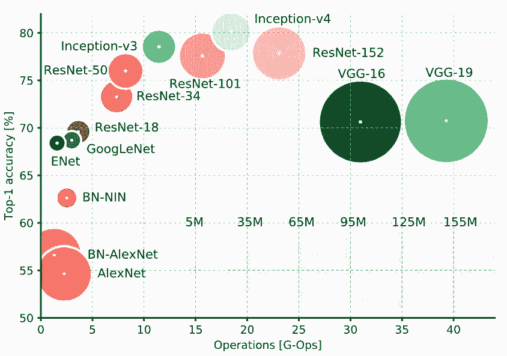
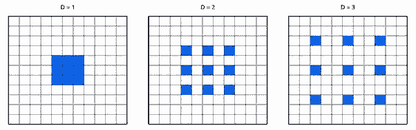
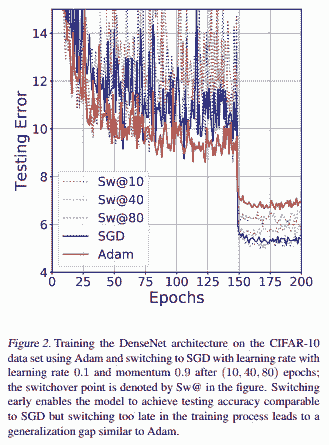
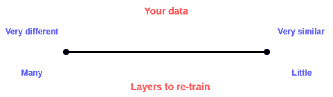

# 想入门设计卷积神经网络？这是一份综合设计指南

选自 hackernoon

**作者：George Seif**

**机器之心编译**

**参与：****Nurhachu Null、刘晓坤**

> 这篇文章可以作为一个设计指南，为特定分类任务的 CNN 设计提供指导。作者围绕准确率、速度、内存消耗三个指标的权衡，从网络类型、架构设计、数据处理和迁移学习等方面介绍了 CNN 设计过程中使用的方法。

你想开始做图像分类，但是无从着手。应该使用哪个预训练网络？如何修改网络以使其满足需求？你的网络应该包含 20 层还是 100 层？哪些是最快的、最准确的？这些是你为图像分类选择最好的 CNN 时会遇到的众多问题。

当选择 CNN 来进行图像分类时，有 3 个非常主要的指标需要去优化：准确率、速度和内存消耗。在这些指标上的性能取决于你所选择的 CNN 以及对它所做的任何修改。不同的网络（如 VGG、Inception 以及 ResNet 等）在这些指标上有不同的权衡。此外，你还可以修改这些网络结构，例如通过削减某些层、增加某些层、在网络内部使用扩张卷积，或者不同的网络训练技巧。

这篇文章可以作为一个设计指南，为特定的分类任务的 CNN 设计提供指导。尤其是，我们会聚焦在 3 个主要指标上：准确率、速度和内存消耗。我们会研究很多不同的分类 CNN，并探索它们在这 3 个指标方面对应的属性。我们还会研究对这些基本 CNN 可能做出的修改，以及这些修改会怎样影响这些指标。最后，我们会研究如何为特定图像分类任务最优地设计 CNN。

**网络类型**

在网络类型和这 3 个指标上有着明确的权衡。首先，你肯定会希望使用 Inception 或者 ResNet 类型的设计。它们比 VGGNet 和 AlexNet 更新，而且在速度和准确率之间提供了更好选择的权衡（正如你在上图中看到的）。斯坦福大学的 Justin Johnson 对其中的一部分做了很棒的基准测试（https://github.com/jcjohnson/cnn-benchmarks）。

Inception 和 ResNet 的选择确实是速度和准确率的权衡：要准确率，用超深层的 ResNet；要速度，用 Inception。

**使用巧妙的卷积设计来减少运行时间和内存消耗**

对 CNN 一般设计的最新进展已经提出了一些非常棒的可选择方法，它们能够在没有太多的准确率损失的情况下加速 CNN 的运行，并减少内存消耗。所有的这些方法都可以很容易地集成在上述的任何一类卷积神经网络中。

*   MobileNets（https://arxiv.org/pdf/1801.04381.pdf）使用深度分离的卷积来极大地减少运算和内存的消耗，同时仅牺牲 1% 到 5% 的准确率，准确率的牺牲程度取决于你想要获得的计算节约。

*   XNOR-Net（https://arxiv.org/pdf/1603.05279.pdf）使用二进制卷积，也就是说，卷积运算只涉及两个可能的数值：0 或者 1。通过这种设计，网络可以具有较高程度的稀疏性，易于被压缩而不消耗太多内存。

*   ShuffleNet（https://arxiv.org/pdf/1707.01083.pdf）使用点组卷积和通道随机化来极大地减少计算代价，同时还能维持比 MobileNets 高的准确率。事实上，它们可以在超过 10 倍的运算速度下达到早期最先进的分类 CNN 的准确率。

*   Network Pruning（https://arxiv.org/pdf/1605.06431.pdf）是为了减少运行时间和内存消耗而删除 CNN 的部分权重的技术，而且有希望不降低准确率。为了保持准确率，被删除的部分应该对最终结果没有大的影响。链接中的论文展示了使用 ResNets 可以轻易地做到这一点。

**网络深度**

这个比较容易：通常增加更多地层会提升准确率，同时会牺牲一些速度和内存。然而，我们已经意识到的是这种权衡受制于边际效应，也就是说，我们增加的层越多，通过增加每一层而带来的准确率提升将越少。

 **

**激活函数**

关于激活函数，最近有很多争议。然而，很好的一个经验法则就是从 ReLU 开始。使用 ReLU 通常会在开始的时立即得到一些好的结果。不像 ELU、PReLU 或者 LeakyReLU 一样还需要一些繁琐的调整。当你确定你的设计使用 ReLU 能够达到不错的效果，那你就可以调整其它的部分，并调整它们的参数，以尝试对准确率做最后的提升。

**卷积核大小**

你也许认为使用更大的卷积核总会导致最高的准确率，同时还会损失速度和内存。然而，情况并不总是如此，因为研究中多次发现使用较大的卷积核会使得网络难以发散。使用更小的核（例如 3×3）会更好一些。ResNet 和 VGGNet 都相当全面的诠释了这一点。正如这两篇论文所展示的，你也可以使用 1×1 的核来减少特征的数目。

**空洞卷积**

为了能够使用远离中心的像素，空洞卷积（Dilated Convolution）在卷积核的权重之间使用空格。这使得网络不用增加参数数目就能够指数级地扩展感受野，也就是说根本没有增加内存消耗。已经证明，空洞卷积可以在微小的速度权衡下就能增加网络准确率。

**数据增强**

你应该经常做数据增强。使用更多的数据已经被证明能够持续地增强性能，甚至达到极限（https://arxiv.org/pdf/1707.02968.pdf）。使用数据增强，你可以免费获得更多数据。增强类型取决于你的应用。比如，如果你做的是无人车的应用，你可能会遇到路上的车、树以及建筑物，所以，将你的图像垂直翻转是没有意义的。然而，你一定会遇到由于天气变化或者场景变化而引起的光线改变，通过改变光线和水平翻转来增强数据是有意义的。可以看一下这个数据增强库（https://github.com/aleju/imgaug）

**训练优化器**

当你最终要训练网络的时候，有几种可以选择的优化算法。很多人说 SGD 在准确率方面会得到最好的结果，在我的经验看来，这是正确的。然而，调整学习率设置和参数是枯燥的，也是具有挑战性的。另一方面，虽然使用自适应的学习率（例如 Adam,、Adagrad 或者 Adadelta）比较容易，也比较快速，但是你可能得不到和 SGD 一样的最优准确率。

最好就是让优化器遵循和激活函数一样的「风格」：先使用最容易的，看看它是否奏效，然后使用更复杂的来调节和优化。我个人推荐以 Adam 作为开始，因为根据我的经验，它最容易使用：设置一个不太高的学习率，一般默认 0.0001，然后你通常会得到一些非常好的结果。随后你可以从零开始使用 SGD，或者甚至以 Adam 作为开始，然后使用 SGD 精调。事实上，[这篇文章](http://mp.weixin.qq.com/s?__biz=MzA3MzI4MjgzMw==&mid=2650735242&idx=5&sn=11de56fd5a6f40ceaaebc3ca7c519b24&chksm=871ac6f4b06d4fe28e74bc0ef95bdfcec3321241e2728f5e7adf0f787394b6c7c262a03c747e&scene=21#wechat_redirect)发现使用 Adam，中间换到 SGD，能够以最容易的方式达到最好的准确率。看一下论文中的这张图：

**类别均衡**

很多情况下你会遇到不均衡数据，尤其是在现实应用中。举一个现实中的简单例子：由于安检原因，你在训练深度网络来预测输入视频中的某人是否持有杀伤性武器。但是在你的训练数据中，你只有 50 个视频中的人持有武器，而 1000 个视频中的人是没有持有武器的！如果你立即使用这些数据训练你的网络，你的模型一定会以很高的偏差偏向于预测某人未持有武器。

可以用以下的方法来解决类别不均衡问题:

*   在损失函数中使用类别权重。本质上，样本数量不足的类别在损失函数中接受较高的权重，这样的话特定类别的误分类会在损失函数中导致较高的误差。

*   过采样：对训练样本中数量不足的类别进行重复采样，这样有助于样本分布的均衡化。当可用数据较少的时候这个方法最能奏效。

*   降采样：你也可以简单地跳过包含过多样本的类别中的一些训练样本。当可用数据非常多的时候，这个方法最奏效。

*   数据增强：对少数类别的数据进行数据扩增。

**优化你的迁移学习**

对大多数应用而言，使用迁移学习要比从零开始训练网络更加合适。然而，需要选择的是：你要舍弃哪些层，保留哪些层。这非常依赖于你的数据。你的数据和预训练网络（通常是在 ImageNet 上训练）所用的数据越相似，你需要重新训练的层就越少，反之亦然。例如，假设你要训练网络来区分一张图片是否包含葡萄，所以你会有大量的包含葡萄和不包含葡萄的图像。这些图像和 ImageNet 中使用的图像相当相似，所以你仅仅需要重新训练最后几层，或许只需要重新训练全连接层。然而，倘若你要分类的是一幅外太空的图像是否包含一颗行星能够，这种数据和 ImageNet 中的数据大有不同，所以你还需要重新训练后边的卷积层。简而言之，应该遵循以下的原则：

**总结**

本文给出了用于图像分类应用而设计 CNN 的全面指南。希望你能够愉快地阅读本文，并学到一些新的、有用的东西。

*原文链接：*

*https://hackernoon.com/a-comprehensive-design-guide-for-image-classification-cnns-46091260fb92*

****本文为机器之心编译，**转载请联系本公众号获得授权****。**

✄------------------------------------------------

**加入机器之心（全职记者/实习生）：hr@jiqizhixin.com**

**投稿或寻求报道：**content**@jiqizhixin.com**

**广告&商务合作：bd@jiqizhixin.com****