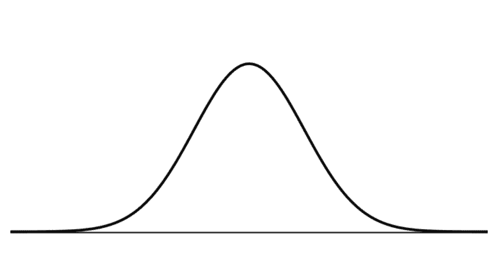

# 从统计到概率，入门者都能用 Python 试验的机器学习基础

选自 dataquest

**作者：Christian Pascual**

 ****机器之心编译**

**参与：王淑婷、思源**

> 概率论与统计学是机器学习的基础，但很多初学者不太了解它们。本文介绍了概率及统计的基本概念、联系以及用法，并以正态分布为例展示了什么是概率分布、分布函数以及经验法则。同样本文还概念性地解释了中心极限定理，以及为什么正态分布在整个统计学中如此重要。此外，本文很多试验都可以用 Python 实现，不了解 Python 的读者也可以跳过。

要学习统计，就不可避免得先了解概率问题。概率涉及诸多公式和理论，容易让人迷失其中，但它在工作和日常生活中都具有重要作用。先前我们已经讨论过描述性统计中的一些基本概念，现在，我们将探讨统计和概率的关系。

**前提条件：**

与上一篇博客类似，本文不要求读者具备统计知识，但至少要对 Python 有一个基本的了解。考虑到读者可能不太了解 for 循环和列表, 下面将先对它们做个简单的介绍。

**什么是概率？**

从最基本的层面上来说，概率要回答的是一个这样的问题：「一个事件发生的几率是多少？」为了计算某个事件发生的几率，我们还要考虑其它所有可能发生的事件。

概率问题的典型代表是扔硬币。在扔硬币的过程中，只会产生两种结果：

 1\. 正面朝上

 2\. 反面朝上

这两种结果构成了一个样本空间，即所有可能结果的集合。为了计算一个事件发生的概率，我们要统计该事件发生（比如将硬币掷为正面朝上）的次数，并用它除以总试验次数。因此，概率会告诉我们，把一枚硬币掷为正面朝上或反面朝上的几率为 1/2。通过观察可能发生的事件，概率可以为我们提供一个预测事件发生频率的框架。

然而，即使结果看起来很明显，但如果我们真的试着去扔一些硬币，我们很可能得到过高或过低的正面朝上概率。假设扔硬币的做法不公平，那我们能做什么？收集数据！我们可以使用统计法来计算基于真实世界观察样本的概率，并将其与理想中的概率做对比。

**从统计到概率**

通过扔 10 次硬币并计算正面朝上的次数，我们可以获得数据。我们把这 10 次扔硬币的过程当做试验，而硬币正面朝上的次数将是数据点。也许正面朝上的次数不是「理想的」5 次，但不必着急，因为一次试验只是一个数据点。

如果进行多次试验，那我们预计所有试验正面朝上的的平均概率将接近 50%。下面的代码分别模拟了 10 次、100 次、1000 次和 1000000 次试验，然后计算了正面朝上的平均频率。下图是对这一过程的总结。


```py
import random
def coin_trial():
    heads = 0
    for i in range(100):
        if random.random() <= 0.5:
            heads +=1
    return heads

def simulate(n):
   trials = []
   for i in range(n):
       trials.append(coin_trial())
   return(sum(trials)/n)

simulate(10)
>> 5.4

simulate(100)
>>> 4.83

simulate(1000)
>>> 5.055

simulate(1000000)
>>> 4.999781
```

coin_trial 函数代表了 10 次硬币投掷的模拟。它使用 random() 函数来生成一个介于 0 和 1 之间的随机浮点数，如果浮点数在 0.5 以下，它会增加 heads（正面朝上）次数。然后，simulate 根据你想要的次数来重复这些试验，并返回所有试验后正面朝上的平均次数。

硬币投掷模拟的结果很有趣。首先，模拟的数据显示正面朝上的平均次数接近概率估计的结果。其次，随着试验次数的增加，这个 平均数也更加接近预期结果。做 10 次模拟时，有轻微的误差，但试验次数为 1000000 次时，误差几乎完全消失。随着我们增加试验次数，与预期平均数的偏差在不断减小。听起来很耳熟是不是？

当然，我们可以自己扔硬币，但是通过在 Python 代码中模拟这一过程可以为节省大量时间。随着我们获得越来越多的数据，现实世界（结果）开始与理想世界（预期）重合。因此，给定足够的数据，统计就可以让我们根据现实世界的观察来估计概率。概率提供了理论，而统计提供了使用数据来检验该理论的工具。于是，统计样本的数值特征，特别是均值和标准差，成为了理论的替代。

你可能会问：「如果我本来就可以计算理论概率，那我为什么还要用一个替代品？」投掷硬币是一个非常简单的例子，但有些更有趣的概率问题并没有这么容易计算。随着时间的推移，一个人患病的可能性有多大？当你开车时，一个关键的汽车部件出故障的概率是多少？

计算概率没有什么简单的方法，所以我们必须依靠数据和统计。给定更多的数据，我们的结果有更多的置信度，确信计算结果代表了这些重要事件发生的真实概率。

假设我是一名在职侍酒师，购买之前，我要先弄清楚哪些葡萄酒品质更优。我手头已有很多数据，所以我们将使用统计数据来指导决策。

**数据和分布**

在解决「哪种葡萄酒更好」的问题之前，我们需要注意数据的性质。直观来说，我们想通过打分来选出比较好的葡萄酒，但问题是：分数通常分布在一个范围内。那我们要如何比较不同类型葡萄酒的得分，并在一定程度上确定一种葡萄酒比另一种更好呢？

若有一个正态分布（也称为高斯分布），它是概率和统计领域中一个特别重要的现象。正态分布如下所示：



正态分布最重要的特质是对称性和形状，以及其广泛的普适性。我们一直称其为分布，但是分布的到底是什么？我们可以直观地认为概率分布是一个任务中所有可能存在的事件及其对应的概率，例如在「抛硬币」任务中，「正面」和「反面」两个事件，以及它们对应出现的概率 1/2 可以组成一个分布。

在概率中，正态分布是所有事件及对应概率的特定分布。x 轴表示我们想知道概率的事件，y 轴是与每个事件相关联的概率——从 0-1。在这里，我们没有深入讨论概率分布，但是知道正态分布是一种特别重要的概率分布。

在统计中，正态分布是数据值的分布。在这里，x 轴是数据的值，y 轴是这些值的计数。以下是两张相同的正态分布图，但是根据概率和统计来进行标记：


在概率的正态分布中，最高点表示发生概率最大的事件。离这个事件越远，概率下降越厉害，最后形成一个钟的形状。而在统计的正态分布中，最高点代表均值，与概率中的情况类似，离均值越远，频率下降越厉害。也就是说，两端的点与均值存在极高的偏差，且样本非常罕见。

如果你通过正态分布怀疑概率和统计之间存在另一种关系，那么你没猜错！我们将在本文后面探讨这种重要关系，先别着急。

既然打算用质量分数的分布来比较不同的葡萄酒，我们需要设置一些条件来搜索感兴趣的葡萄酒。我们将收集葡萄酒的数据，然后分离出一些感兴趣的葡萄酒质量分数。

为了取得数据，我们需要以下代码：

```py
import csv
with open("wine-data.csv", "r", encoding="latin-1") as f:
    wines = list(csv.reader(f))
```

数据以表格形式显示在下面。我们需要 points 列，所以我们将把它提取到自己的列表中。一位葡萄酒专家告诉我们匈牙利的托卡伊白葡萄酒非常棒，而一位朋友则建议我们以意大利的蓝布鲁斯科红葡萄酒开始入手。我们可以用数据来比较这些葡萄酒！

如果你不记得数据是什么样子的，下面有一个简要的表格供你参考和重新了解。


```py
# Extract the Tokaji scores
tokaji = []
non_tokaji = []
for wine in wines:
    if points != '':
        points = wine[4]
    if wine[9] == "Tokaji":
        tokaji.append(float(points))
    else:
        non_tokaji.append(points)

# Extract the Lambrusco scores 
lambrusco = []
non_lambrusco = []
for wine in wines:
    if points != '':
        points = wine[4]
    if wine[9] == "Lambrusco":
        lambrusco.append(float(points))
    else:
        non_lambrusco.append(float(points))
```

如果把每组质量分数可视化为正态分布，我们可以根据它们所处的位置立即判断两种分布是否相同，但如下所示用这种方法很快会遇到问题。因为我们有大量数据，所以假设分数会呈正态分布。虽然这种假设在这里没问题，但实际上这么做很危险，这点将在稍后讨论。


当两个分数分布重叠太多时，最好假设你的分数是来自同一个而非不同的分布。在另一种极端即两个分布没有重叠的情况下，可以安全地假设它们来自不同的分布。麻烦在于有些重叠的情况比较特殊。例如，一个分布的极高点可能与另一个分布的极低点相交，这种情况下我们该如何判断这些分数是否来自不同的分布。

因此，我们再次期望正态分布可以给我们一个答案，并在统计学和概率之间架起一座桥梁。

**重新审视正态分布**

正态分布对概率和统计学来说至关重要，原因有二：中心极限定理和 3σ 准则。

**中心极限定理**

在上一节中，我们展示了如果把掷硬币的试验重复十次，正面朝上的平均结果将接近理想的 50%。随着试验次数的增加，平均结果会越接近真实概率，即使个别试验本身并不完美。这种想法或数学上称为依概收敛就是中心极限定理的一个关键原则。

在掷硬币的例子中，一次试验扔 10 次硬币，我们会估计每次试验正面朝上的次数为 5。之所以是估计，是因为我们知道结果并没有那么完美（即，不会每次都得到 5 次正面朝上的结果）。如果我们做出很多估计，根据中心极限定理，这些估计的分布将看起来像正态分布，这种分布的顶点或估计值的期望将与真实值一致。我们观察到，在统计学中正态分布的顶点与平均值一致。因此，给定多次「试验」作为数据，中心极限定理表明，即使我们不知道真正的概率，我们也可以通过数据估计出分布可能的形状。

中心极限定理让我们知道多次试验的平均值将接近真实平均值，而 3σ准则将告诉我们有多少数据将围绕这个平均值分布。

**3σ 准则**

3σ 准则（也被称为经验法则或 68-95-99.7 法则），是我们观察到有多少数据落在平均值某一距离内的一种表达。注意，标准差（又名「sigma」）是数据观测值与平均值之间的平均距离。

3σ 准则规定，给定正态分布，68% 的观测值将落在平均值的一个标准差之间，95% 将落在两个标准差以内，99.7% 将落在三个标准差以内。很多复杂的数学都涉及这些值的推导，因此，具体不在本文的讨论范围之内。关键是要知道，3σ 准则使我们能够了解正态分布的不同区间内分别包含了多少数据。下图是对 3σ 准则所代表内容的总结。


我们将把这些概念与葡萄酒数据联系起来。根据假设，作为一个品酒师，我们想知道与普通葡萄酒相比，霞多丽白葡萄酒和黑皮诺葡萄酒更受欢迎的程度。我们收集了成千上万条关于葡萄酒的评论，而根据中心极限定理，这些评论的平均分数应该与葡萄酒质量（由评论者判断）的「真实」表征一致。

虽然 3σ 准则说明了你的数据有多少在已知值范围内，但它也说明了极端值的罕见性。任何偏离平均值三个标准差的值都应小心处理。通过 3σ准则和 Z-score，我们最终可以通过数值度量霞多丽白葡萄酒、黑皮诺葡萄酒与普通葡萄酒的区别程度。

**Z-score**

Z-score 是一个简单的计算，它回答了这样一个问题：「给定一个数据点，它离平均值有多少标准差？」下面是 Z-score 方程：


Z-score 本身并没有给你提供很多少信息。但当与一个 Z-table 比较时，它就非常有价值，该表列出了一个标准正态分布的累积概率，直到给定 Z-score。标准正态分布是平均值为 0、标准差为 1 的正态分布。即使我们的正态分布不是标准的，Z-score 也允许我们参考 Z-table。

累积概率（或称为概率分布函数）是给定点出现之前所有值的概率之和。一个简单的例子是平均值本身。平均值是正态分布的正中间部分，所以我们知道从左向右取值到平均值的所有概率之和为 50%。如果你想计算标准差之间的累计概率，3σ准则的值实际上会出现。下图是累积概率的可视化图。


所有概率之和必须等于 100%，所以我们用 Z-table 来计算正态分布下 Z-score 两边的概率。


这种超过某个 Z-score 的概率计算对我们很有用。它让我们从「一个值离平均值有多远？」的问题升级到「一个值与同一组观测值的平均值相差特定距离的可能性有多大？」因此，从 Z-score 和 Z-table 得出的概率将回答我们关于葡萄酒的问题。

```py
import numpy as np
tokaji_avg = np.average(tokaji)
lambrusco_avg = np.average(lambrusco)

tokaji_std = np.std(tokaji)
lambrusco = np.std(lambrusco)

# Let's see what the results are
print("Tokaji: ", tokaji_avg, tokaji_std)
print("Lambrusco: ", lambrusco_avg, lambrusco_std)
>>> Tokaji:  90.9 2.65015722804
>>> Lambrusco:  84.4047619048 1.61922267961
```

看起来朋友的推荐并不是很好！为了本文的目的，我们把托卡伊白葡萄酒和蓝布鲁斯科红葡萄酒的分数都视为正态分布。因此，每种葡萄酒的平均分数将代表它们在质量方面的「真实」分数。我们将计算 Z-score，看看托卡伊白葡萄酒的平均值与蓝布鲁斯科红葡萄酒的平均值相差多少。

```py
z = (tokaji_avg - lambrusco_avg) / lambrusco_std
>>> 4.0113309781438229

# We'll bring in scipy to do the calculation of probability from the Z-table
import scipy.stats as st
st.norm.cdf(z)
>>> 0.99996981130231266

# We need the probability from the right side, so we'll flip it!
1 - st.norm.cdf(z)
>>> 3.0188697687338895e-05
```

答案是差距很小。但这到底意味着什么？这种概率的无穷小量可能需要详细解释。

假设托卡伊白葡萄酒和蓝布鲁斯科红葡萄酒的质量没有什么差别。也就是说，二者的品质差不多。同样，由于葡萄酒之间的个体差异，这些葡萄酒的分数会有一些分散。根据中心极限定理，如果我们制作这两种葡萄酒分数的直方图，将会产生服从正态分布的质量分数。

现在，我们可以利用一些数据计算出这两种葡萄酒的平均值和标准差。这些值可以检验它们的品质是否相似。我们将使用蓝布鲁斯科红葡萄酒分数作为基础，并比较了托卡伊白葡萄酒的平均分数，反过来做也很简单。唯一不同的是负 Z-score。

Z-score 为 4.01！假设托卡伊和蓝布鲁斯科的品质相似，根据 3σ准则，99.7% 的数据应该在 3 个标准差范围内。在托卡伊和蓝布鲁斯科被视为品质相同的情况下，远离质量分数平均值的概率非常非常小。这种概率如此之小，以至于我们不得不考虑相反的情况：如果托卡伊不同于蓝布鲁斯科，将会产生不同的分数分布。

此处我们仔细选择了措辞：我没有说「托卡伊比蓝布鲁斯科好」。因为我们计算了这种概率，虽然微观上很小，但不是零。确切地，可以说托卡伊和蓝布鲁斯科绝对不是来自同一个分布，但不能就此说其中一种比另一种更好或更差。

这种推理属于推理统计的范畴，而本文只想做一个简单的介绍。本文介绍了很多概念，所以如果你觉得有些头疼，不妨回头慢慢看。

**总结**

我们从描述性统计开始，然后将其与概率联系起来。根据概率，我们开发了一种定量显示两组分数是否来自同一分布的方法。根据这种方法，我们比较了别人推荐的两种葡萄酒，发现它们很可能来自不相同的质量分数分布。也就是说，一种葡萄酒很可能比另一种更好。

统计不是只属于统计学家的领域，作为一名数据科学家，对常用的统计方法有一个直观的理解将有助于你构建自己的理论，以及随后测试这些理论的能力。在这里我们几乎没有触及推理统计，但是同样的想法将有助于指导理解统计原理。本文讨论了正态分布的优点，但是统计学家也开发了非正态分布的技术。

原文链接：https://www.dataquest.io/blog/basic-statistics-in-python-probability/


**点击「阅读原文」，直达大会首页。****