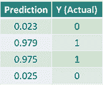

# 无需深度学习框架，如何从零开始用 Python 构建神经网络

选自 TowardsDataScience

**作者：****James Loy**

**机器之心编译**

**参与：陈韵竹****、王淑婷**

> 这是一份用于理解深度学习内部运作方式的初学者指南。作者根据自己从零开始学习用 Python 构建神经网络的经验，编写了一份攻略。内容涵盖神经网络定义、损失函数、前向传播、反向传播、梯度下降算法，对于想要了解深度学习运作原理的各位来说，内容精彩不可错过。

**动机：**为了深入了解深度学习，我决定从零开始构建神经网络，并且不使用类似 Tensorflow 的深度学习库。我相信，对于任何有理想的数据科学家而言，理解神经网络内部的运作方式都非常重要。

本文涵盖了我学到的所有东西，希望你也能从中获益！

**什么是神经网络？**

许多有关神经网络的介绍资料会将神经网络与大脑进行类比。但我发现，将神经网络简单地描述为一个从输入映射到输出的数学函数理解起来更容易。

神经网络由以下部分组成：

*   一个输入层，x

*   任意数量的隐藏层

*   一个输出层，ŷ

*   每两层之间都有一组权重和偏置，W 和 b

*   每个隐藏层都要选择一个激活函数 σ。在本文中，我们选用 Sigmoid 激活函数。

下图展示了 2 层神经网络的结构（请注意，在计算神经网络层数的时候，通常不计入输入层）。


*二层神经网络的结构*

利用 Python 建立神经网络非常容易。

```py
class NeuralNetwork:
    def __init__(self, x, y):
        self.input      = x
        self.weights1   = np.random.rand(self.input.shape[1],4) 
        self.weights2   = np.random.rand(4,1)                 
        self.y          = y
        self.output     = np.zeros(y.shape)
```

**训练神经网络**

一个简单 2 层神经网络的输出 ŷ 可以表示为：


你可能注意到，在上面的等式当中，权重 W 和偏置 b 是影响输出 ŷ 的唯一变量。

自然，权重和偏差的正确值决定了预测的强度。根据输入数据微调权重和偏置的过程称为神经网络训练。

训练过程的每一次迭代包含以下步骤：

*   计算预测的输出 ŷ，称为前向传播

*   更新权重和偏置，称为反向传播

以下流程图说明了这个过程：


**前向传播**

正如我们在上图中所看到的，前向传播只是一个简单的计算。对于一个基本的 2 层神经网络，神经网络的输出计算如下：


我们可以在 Python 代码中添加一个前向传播函数来做到这一点。简单起见，我们假设偏置为 0。

```py
class NeuralNetwork:
    def __init__(self, x, y):
        self.input      = x
        self.weights1   = np.random.rand(self.input.shape[1],4) 
        self.weights2   = np.random.rand(4,1)                 
        self.y          = y
        self.output     = np.zeros(self.y.shape)

    def feedforward(self):
        self.layer1 = sigmoid(np.dot(self.input, self.weights1))
        self.output = sigmoid(np.dot(self.layer1, self.weights2))
```

然而，我们仍然需要一种方法来评估我们的预测的「优秀程度」（即，我们的预测与真实值相差多少？）这就需要用到损失函数了。

**损失函数**

损失函数有很多种，而我们问题的性质会决定我们使用哪种损失函数。在本文中，我们将采用简单的误差平方和。


误差平方和，即每个预测值和真实值之间差值的平均值。这个差值是取了平方项的，所以我们测量的是差值的绝对值。

在训练过程中，我们的目标是找到一组最佳的权重和偏置，使损失函数最小化。

**反向传播**

现在，我们已经找到了预测误差的方法（损失函数），那么我们需要一种方法将错误「传播」回去，从而更新权重和偏置。

为了确定权重和偏置调整的适当值，我们需要知道损失函数对权重和偏置的偏导数。

从微积分的角度来看，函数的偏导数也就是函数的斜率。


*梯度下降算法*

如果我们知道了偏导数，我们可以通过简单增加或减少偏导数（如上图所示）的方式来更新权重和偏置。这就是所谓的梯度下降。

然而，由于损失函数的方程不包含权重和偏置，所以我们不能直接计算损失函数对权重和偏置的偏导数。因此，我们需要链式法则来帮助计算。


以上是用于计算损失函数对权重偏导数的链式法则。简单起见，我们只展示了一层神经网络的偏导数。

唷！这看起来不大好看，但这能让我们获得所需——损失函数对权重的偏导数（斜率），以便相应调整权重。

既然我们已经有了链式法则公式，接下来我们把反向传播函数添加到 Python 代码中。

```py
class NeuralNetwork:
    def __init__(self, x, y):
        self.input      = x
        self.weights1   = np.random.rand(self.input.shape[1],4) 
        self.weights2   = np.random.rand(4,1)                 
        self.y          = y
        self.output     = np.zeros(self.y.shape)

    def feedforward(self):
        self.layer1 = sigmoid(np.dot(self.input, self.weights1))
        self.output = sigmoid(np.dot(self.layer1, self.weights2))

    def backprop(self):
        # application of the chain rule to find derivative of the loss function with respect to weights2 and weights1
        d_weights2 = np.dot(self.layer1.T, (2*(self.y - self.output) * sigmoid_derivative(self.output)))
        d_weights1 = np.dot(self.input.T,  (np.dot(2*(self.y - self.output) * sigmoid_derivative(self.output), self.weights2.T) * sigmoid_derivative(self.layer1)))

        # update the weights with the derivative (slope) of the loss function
        self.weights1 += d_weights1
        self.weights2 += d_weights2
```

为了更深入地理解微积分和链式法则在反向传播中的应用，我强烈推荐 3Blue1Brown 的视频教程。

[`v.qq.com/iframe/preview.html?vid=l0658vrygyr&width=500&height=375&auto=0`](https://v.qq.com/iframe/preview.html?vid=l0658vrygyr&width=500&height=375&auto=0)

**整合**

既然我们已经有了做前向传播和反向传播的完整 Python 代码，我们可以将神经网络应用到一个示例中，看看它的效果。


我们的神经网络应该能够习得理想的权重集合以表示这个函数。请注意，对于我们来说，仅通过检查来计算权重并非一件小事。

如果我们将神经网络进行 1500 次迭代，看看会发生什么。下图展示了每次迭代的损失函数值，我们可以清晰地发现损失函数单调下降到最小值。这与我们前面讨论的梯度下降算法是一致的。


让我们看看神经网络在进行 1500 次迭代后的最终预测（输出）：



*进行 1500 次迭代后的预测值*

我们成功了！我们的前向传播和反向传播算法成功训练了神经网络，且预测值收敛到了真实值。

请注意，预测值和真实值之间还是有一些轻微差异的。这是可取的，因为它防止了过度拟合，并且使得神经网络具有更强的泛化能力。

**下一步**

幸运的是，我们的探索还没有结束。关于神经网络和深度学习还有很多需要学习的地方。例如：

*   除了 Sigmoid 函数之外，我们还可以使用哪些激活函数？

*   在训练神经网络时使用学习率

*   使用卷积进行图像分类任务

**最后一点想法**

在撰写此文的过程中，我已经学到了很多，希望本文也能对你有所帮助。

在没有完全了解神经网络内部工作原理的情况下，虽然使用诸如 TensorFlow 和 Keras 之类的深度学习库可以让我们很容易地建立深度网络，但我认为对于有抱负的数据科学家而言，深入理解神经网络还是大有裨益的。

**延伸阅读：**

*   [从零开始：教你如何训练神经网络](http://mp.weixin.qq.com/s?__biz=MzA3MzI4MjgzMw==&mid=2650734516&idx=1&sn=97750fa6b84ecdf97f3d0363d1d94ae3&chksm=871b3bcab06cb2dcba6a0c46a8444af5e6e567c608c52ef8cd1da38479d662fede71dadf6aa6&scene=21#wechat_redirect)

*   [了解神经网络，你需要知道的名词都在这里](http://mp.weixin.qq.com/s?__biz=MzA3MzI4MjgzMw==&mid=2650732815&idx=2&sn=e8204c8e6e26539bd12fd114d0014c95&chksm=871b3d71b06cb4674c49ba50da59cee2657aca9bcce5acabda0283ae51f46affb668e4d7d3d6&scene=21#wechat_redirect)

*   [从感知机到深度神经网络，带你入坑深度学习](http://mp.weixin.qq.com/s?__biz=MzA3MzI4MjgzMw==&mid=2650736206&idx=3&sn=20a019ce95f61904e5ef8255bf0c3743&chksm=871ac230b06d4b265254c8d535142407851a311e07bed74bde828752f25441a6ccc859c3773a&scene=21#wechat_redirect)

*原文链接：https://towardsdatascience.com/how-to-build-your-own-neural-network-from-scratch-in-python-68998a08e4f6*

****本文为机器之心编译，**转载请联系本公众号获得授权****。**

✄------------------------------------------------

**加入机器之心（全职记者/实习生）：hr@jiqizhixin.com**

**投稿或寻求报道：**content**@jiqizhixin.com**

**广告&商务合作：bd@jiqizhixin.com**