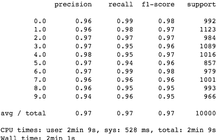

# 教程 | 用 Scikit-Learn 构建 K-近邻算法，分类 MNIST 数据集

选自 TowardsDataScience

**作者：Sam Grassi**

**机器之心编译**

**参与：乾树、刘晓坤**

> K 近邻算法，简称 K-NN。在如今深度学习盛行的时代，这个经典的机器学习算法经常被轻视。本篇教程将带你使用 Scikit-Learn 构建 K 近邻算法，并应用于 MNIST 数据集。然后，作者将带你构建自己的 K-NN 算法，开发出比 Scikit-Learn K-NN 更准更快的算法。

**K 近邻分类模型**


*懒惰的程序员*

K 近邻算法是一种容易实现的监督机器学习算法，并且其分类性能的鲁棒性还不错。K-NN 最大的优点之一就是它是一个惰性算法，即该模型无须训练就可以对数据进行分类，而不像其他需要训练的 ML 算法，如 SVM、回归和多层感知机。

**K-NN 如何工作**

为了对给定的数据点 p 进行分类，K-NN 模型首先使用某个距离度量将 p 与其数据库中其它点进行比较。

距离度量就是类似欧几里得距离之类的标准，以两个点为输入并返回这两个点之间距离的简单函数。

因此，可以假设距离较小的两个点比距离较大的两个点相似度更高。这是 K-NN 的核心思想。

该过程将返回一个无序数组，其中数组中的每一项都表示 p 与模型数据库中 n 个数据点之间的距离。所以返回数组的大小为 n。

K 近邻的 K 的含义是：k 是一个任意值（通常在 3-11 之间），表示模型在对 p 分类时应该考虑多少个最相似的点。然后模型将记录这 k 个最相似的值，并使用投票算法来决定 p 属于哪一类，如下图所示。


*懒惰的程序员*

上图中的 K-NN 模型的 k 值为 3，箭头指向的中心点为 p，算法将对这个点进行分类。

如你所见，圆圈中的三个点是与 p 最接近或最相似的三个点。因此，使用简单的投票算法，p 将被归为「白色」，因为白色在 k 个最相似值中占大多数。

酷炫！但令人惊讶的是，这个简单的算法可以在某些情况下实现不俗的结果，并且可以应用于各种各样的问题，我们将在下面介绍。

**在 Scikit-Learn 中实现 K-NN 算法用来分类 MNIST 图像**

**数据：**

对于这个例子，我们将使用常见的 MNIST 数据集。MNIST 数据集是机器学习中最常用的数据集之一，因为它很容易实现，而且是验证我们模型的可靠方法。


MNIST 是一组包含 70,000 个手写数字 0-9 的数据集。任意两个手写数字都不相同，有些可能很难正确分类。

**算法：**

我们从 Scikit-Learn 的 Python 库的 KNeighborsClassifier() 函数入手。这个函数有很多参数，但在这个例子中我们只需用少量几个参数。具体来说，我们只会传递 n_neighbors 参数的值（就是 k 值啦）。

weights 参数给出了模型使用的投票算法的类型，其中默认值是 uniform。这意味着在对 p 进行分类时，k 个点中的每一个的权重都一样。algorithm 参数也将使用默认值 auto，因为我们希望 Scikit-Learn 自动找到对 MNIST 数据进行分类的最佳算法。

以下是一个用 Scikit-Learn 构建 K-NN 分类器的 Jupyter Notebook：

> **Scikit-Learn 实现的用于 MNIST 的 K 近邻算法**
> 
> Notebook 地址：https://gist.github.com/samgrassi01/82d0e5f89daac3e65531a6ef497cc129#file-skl-knn-ipynb
> 
> 我们通过导入所需的库直接开始。
> 
> ```py
> In [1]:
> import numpy as np
> 
> from sklearn import datasets, model_selection
> from sklearn.neighbors import KNeighborsClassifier
> from sklearn.metrics import classification_report
> 
> mnist = datasets.fetch_mldata('MNIST original')
> data, target = mnist.data, mnist.target
> 
> # make sure everything was correctly imported
> data.shape, target.shape
> Out[1]:
> ((70000, 784), (70000,))
> ```
> 
> **构建数据集**
> 
> 我们通过制作不同的数据集来构建 K-NN 模型。我们将创建一个可以获取特定大小数据集、返回数据集大小的函数。
> 
> ```py
> In [2]:
> # make an array of indices the size of MNIST to use for making the data sets.
> # This array is in random order, so we can use it to scramble up the MNIST data
> indx = np.random.choice(len(target), 70000, replace=False)
> 
> # method for building datasets to test with
> def mk_dataset(size):
>     """makes a dataset of size "size", and returns that datasets images and targets
>     This is used to make the dataset that will be stored by a model and used in 
>     experimenting with different stored dataset sizes
>     """
>     train_img = [data[i] for i in indx[:size]]
>     train_img = np.array(train_img)
>     train_target = [target[i] for i in indx[:size]]
>     train_target = np.array(train_target)
> ```
> 
> 不错。现在我们将使用这个函数来构建两个不同大小的数据集，来看看模型在不同数据量上的分类性能怎么样。
> 
> 提示：制作较小的数据集时，你仍然可以进行分类，但模型毕竟少了一些数据，这可能会导致分类错误。
> 
> ```py
> In [3]:
> # lets make a dataset of size 50,000, meaning the model will have 50,000 data points to compare each 
> # new point it is to classify to
> fifty_x, fifty_y = mk_dataset(50000)
> fifty_x.shape, fifty_y.shape
> Out[3]:
> ((50000, 784), (50000,))
> In [4]:
> # lets make one more of size 20,000 and see how classification accuracy decreases when we use that one
> twenty_x, twenty_y = mk_dataset(20000)
> twenty_x.shape, twenty_y.shape
> Out[4]:
> ((20000, 784), (20000,))
> ```
> 
> 注意这些数据是如何为模型匹配标签的。模型需要这些标签来理解每一个点代表什么，因此可以把我们要分类的点放在一个特定的类中，而不是说「这是与待分类点最相似的类」。
> 
> 现在我们将构建一个大小为 10000 的测试集。
> 
> ```py
> In [5]:
> # build model testing dataset
> test_img = [data[i] for i in indx[60000:70000]]
> test_img1 = np.array(test_img)
> test_target = [target[i] for i in indx[60000:70000]]
> test_target1 = np.array(test_target)
> test_img1.shape, test_target1.shape
> Out[5]:
> ((10000, 784), (10000,))
> ```
> 
> 不错！现在我们已经完成了所有的数据处理，可以开始搭建 K-NN 模型了！
> 
> **构建模型**
> 
> 我们首先将 Scikit-Learn K-NN 模型放在函数中，以便可以轻松调用它并对其进行调整。
> 
> ```py
> In [6]:
> def skl_knn(k, test_data, test_target, stored_data, stored_target):
>     """k: number of neighbors to use in classication
>     test_data: the data/targets used to test the classifier
>     stored_data: the data/targets used to classify the test_data
>     """
> 
>     classifier = KNeighborsClassifier(n_neighbors=k)  
>     classifier.fit(stored_data, stored_target)
> 
>     y_pred = classifier.predict(test_data) 
> 
>     print(classification_report(test_target, y_pred))
> ```
> 
> **测试**
> 
> 现在我们看看这个模型在两个不同的测试集上的运行效果。
> 
> ```py
> In [7]:
> %%time
> # stored data set size of 50,000
> skl_knn(5, test_img1, test_target1, fifty_x, fifty_y) 
> ```
> 
> 
> 
> ```py
> In [8]:
> %%time
> # stored data set size of 20,000
> skl_knn(5, test_img1, test_target1, twenty_x, twenty_y)
> ```
> 
> 
> 
> 可以的！我们的模型与人眼识别差不多！如你所见，当模型有更多的数据可以使用时（50,000 而不是 20,000 个点），它的性能会更好。更加引人注目的是，它非常简单，并且能以人类水平来获取不同图像之间的复杂关系。更多的细节分析请访问这个 GitHub repo：https://github.com/samgrassi01/Cosine-Similarity-Classifier。

厉害了！我们使用 Scikit-Learn 构建了一个非常简单的 K 近邻模型，该模型在 MNIST 数据集上表现非凡。

不足之处？分类这些点需要很长时间（两个数据集分别耗时 8 分钟和 4 分钟），讽刺的是，K-NN 仍然是最快的分类方法之一。我们必须有一个更快的方法。

**构建一个更快的模型**

大多数 K-NN 模型使用欧几里德距离或曼哈顿距离作为 go-to 距离度量。这些指标非常简单，而且在各种各样的情况中都表现不错。

还有一个很少用到的距离标准度量是余弦相似度。余弦相似度通常不是 go-to 距离度量标准，这是因为它违反了三角不等式，而且对负数无效。但是，余弦相似度对于 MNIST 来说很完美。它速度快、算法简单，而且比 MNIST 中应用其他距离度量的准确率稍高一些。

但是，为了得到最佳性能，我们需要自己编写 K-NN 模型。然后，我们应该能得到比 Scikit-Learn 模型更高的性能，甚至能得到更高的准确度。让我们看看以下建立的 K-NN 模型的 Notebook 吧：

> **构建一个更快的 KNN 分类器**
> 
> Notebook 地址：https://gist.github.com/samgrassi01/15a1fe53dcde8813eed9367b103676b2#file-cos-knn-ipynb
> 
> 在这个 notebook 中，我们将构建一个简单的 K-NN 模型，该模型使用余弦相似度作为距离度量对 MNIST 图像进行分类，试图找到更快或更加准确的模型。
> 
> 首先，需要导入所需的库，然后构建与 Scikit-Learn K-NN notebook 相同的数据集。
> 
> ```py
> In [1]:
> import numpy as np
> import heapq
> from collections import Counter
> from sklearn.metrics.pairwise import cosine_similarity
> from sklearn import datasets, model_selection
> from sklearn.metrics import classification_report
> 
> mnist = datasets.fetch_mldata('MNIST original')
> data, target = mnist.data, mnist.target
> 
> # make sure everything was correctly imported
> data.shape, target.shape
> Out[1]:
> ((70000, 784), (70000,))
> ```
> 
> 使用与 Scikit-Learn K-NN notebook 相同的方法，设置完全相同的数据集。
> 
> ```py
> In [2]:
> # make an array of indices the size of MNIST to use for making the data sets.
> # This array is in random order, so we can use it to scramble up the MNIST data
> indx = np.random.choice(len(target), 70000, replace=False)
> 
> # method for building datasets to test with
> def mk_dataset(size):
>     """makes a dataset of size "size", and returns that datasets images and targets
>     This is used to make the dataset that will be stored by a model and used in 
>     experimenting with different stored dataset sizes
>     """
>     train_img = [data[i] for i in indx[:size]]
>     train_img = np.array(train_img)
>     train_target = [target[i] for i in indx[:size]]
>     train_target = np.array(train_target)
> 
>     return train_img, train_target
> In [3]:
> # lets make a dataset of size 50,000, meaning the model will have 50,000 data points to compare each 
> # new point it is to classify to
> fifty_x, fifty_y = mk_dataset(50000)
> fifty_x.shape, fifty_y.shape
> Out[3]:
> ((50000, 784), (50000,))
> In [4]:
> # lets make one more of size 20,000 and see how classification accuracy decreases when we use that one
> twenty_x, twenty_y = mk_dataset(20000)
> twenty_x.shape, twenty_y.shape
> Out[4]:
> ((20000, 784), (20000,))
> In [5]:
> # build model testing dataset
> test_img = [data[i] for i in indx[60000:70000]]
> test_img1 = np.array(test_img)
> test_target = [target[i] for i in indx[60000:70000]]
> test_target1 = np.array(test_target)
> test_img1.shape, test_target1.shape
> Out[5]:
> ((10000, 784), (10000,))
> ```
> 
> **构建模型**
> 
> 下面，我们创建函数 cos_knn()，作为用于 MNIST 数据集的分类器。你可以利用函数的注释了解其工作原理。
> 
> ```py
> In [6]:
> def cos_knn(k, test_data, test_target, stored_data, stored_target):
>     """k: number of neighbors to use for voting
>     test_data: a set of unobserved images to classify
>     test_target: the labels for the test_data (for calculating accuracy)
>     stored_data: the images already observed and available to the model
>     stored_target: labels for stored_data
>     """
> 
>     # find cosine similarity for every point in test_data between every other point in stored_data
>     cosim = cosine_similarity(test_data, stored_data)
> 
>     # get top k indices of images in stored_data that are most similar to any given test_data point
>     top = [(heapq.nlargest((k), range(len(i)), i.take)) for i in cosim]
>     # convert indices to numbers using stored target values
>     top = [[stored_target[j] for j in i[:k]] for i in top]
> 
>     # vote, and return prediction for every image in test_data
>     pred = [max(set(i), key=i.count) for i in top]
>     pred = np.array(pred)
> 
>     # print table giving classifier accuracy using test_target
>     print(classification_report(test_target, pred))
> ```
> 
> **测试模型**
> 
> 现在，就像 Scikit-Learn K-NN 模型一样，我们对 cos_knn() 模型在两个数据集上分别测试，并看看它的性能如何。
> 
> ```py
> In [7]:
> %%time
> # stored data set size of 50,000
> cos_knn(5, test_img1, test_target1, fifty_x, fifty_y)
> ```
> 
> 
> 
> ```py
> In [8]:
> %%time
> # stored data set size of 20,000
> cos_knn(5, test_img1, test_target1, twenty_x, twenty_y)
> ```
> 
> 
> 
> 太棒了！余弦相似度模型性能超过了 Scikit-Learn K-NN！值得一提的是，该模型的分类速度和准确率都优于 Scikit-Learn K-NN（其中速度获得了很大提升），而模型却非常简单！
> 
> 为了进一步分析模型的工作原理，同时了解该模型为何在许多不同情况下比 Scikit-Learn K-NN 模型要性能更优，请参阅这个 GitHub repo：https://github.com/samgrassi01/Cosine-Similarity-Classifier。

正如 notebook 所示，该 K-NN 模型在分类速度和准确率方面都胜过了 Scikit-Learn K-NN，其中速度获得了大幅提升，而在一个数据集上的准确率提高了 1%。既然如此，我们可以在实践中继续使用这个模型了。

**结论**

首先，我们知道了 K-NN 的工作机制，以及如何轻松地实现它。但最重要的是，我们发现，始终考虑需要解决的问题以及解决问题的工具非常重要。有时候，在解决问题的过程中，最好花一些时间来实践——当然，也需要建立自己的模型。正如 notebook 中所展示的那样，它可以带来极大的益处：我们第二个专有模型获得了 1.5 - 2 倍的加速，节省了很多时间。

*原文链接：https://towardsdatascience.com/building-improving-a-k-nearest-neighbors-algorithm-in-python-3b6b5320d2f8*

****本文为机器之心编译，**转载请联系本公众号获得授权****。**

✄------------------------------------------------

**加入机器之心（全职记者/实习生）：hr@jiqizhixin.com**

**投稿或寻求报道：editor@jiqizhixin.com**

**广告&商务合作：bd@jiqizhixin.com**