# 教程 | 通过 Python 实现马尔科夫链蒙特卡罗方法的入门级应用

选自 TowardsDataScience

**作者：****William Koehrsen**

**机器之心编译**

**参与：陈韵竹、黄小天**

> 通过把马尔科夫链蒙特卡罗（MCMC）应用于一个具体问题，本文介绍了 Python 中 MCMC 的入门级应用。机器之心对本文进行了编译介绍。

GitHub 地址：https://github.com/WillKoehrsen/ai-projects/blob/master/bayesian/bayesian_inference.ipynb

过去几月中，我总是反复遇到同一个数据科学术语：马尔科夫链蒙特卡罗（Markov Chain Monte Carlo/MCMC）。每当我在实验室、博客、文章中听到这个概念，我常常点头赞同，觉得它很酷，但实际上并没有一个清晰的认知。有几次我尝试着学习 MCMC 和贝叶斯推理，我每次从阅读书籍开始，结果却很快放弃。我感到很恼怒，于是决定转向一种学习任何新技能的最佳方法：将它应用于一个具体问题。

使用我的睡眠数据（我一直打算对此一探究竟）和一本实际应用的书（Bayesian Methods for Hackers），我终于通过一个实际问题学习了马尔科夫链蒙特卡罗。像往常一样，比起阅读抽象的概念，将这些技术应用到具体问题中能让学习变得更简单、更愉快。本文介绍了 Python 中的马尔科夫链蒙特卡罗的入门级应用，正是它教会了我使用这个强大的建模分析工具。

我鼓励大家参阅 GitHub，并将其用于自己的数据当中。本文将重点介绍它的应用和结果，所以会产生很多高层次的话题。如果你在阅读后想了解更多，可以阅读文中提供的链接。

**简介**

我的 Garmin Vivosmart 手表可以根据心率和运动情况追踪我的睡眠和起床状况。它并非 100％准确，不过真实数据从不完美，我们仍然可以借助正确的模型从噪声数据中提取有用的知识！

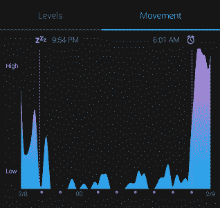

*典型的睡眠数据*

本项目的目标是借助睡眠数据创建一个模型，通过把睡眠看作时间函数，而确定睡眠的后验概率。由于时间是连续变量，确定整个后验分布非常棘手。因此我们转而使用一些可实现近似分布的方法，比如马尔可夫链蒙特卡罗（MCMC）。

**选择一个概率分布**

在开始使用 MCMC 之前，我们需要确定一个合适的函数来对睡眠的后验概率分布进行建模。一个简单的方法是直观检查这些数据。对于我的睡眠的时间函数的观察如下图所示。

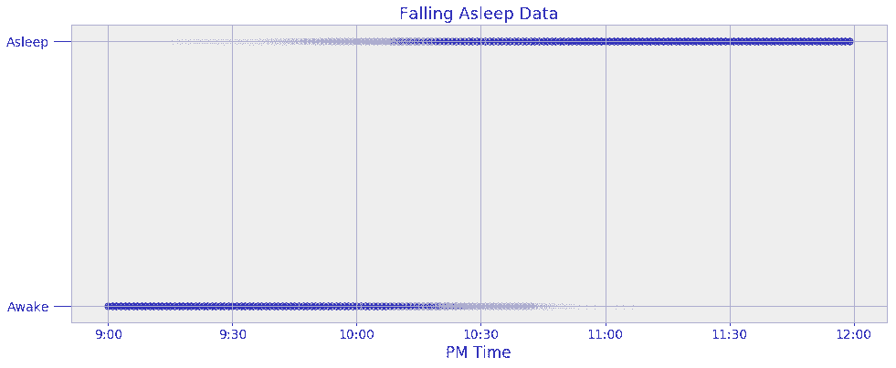

*睡眠数据*

上图中，每个数据点都用点表示，点的强度显示在特定时间的观测数量。我的手表只能记录我入睡的那一分钟，所以为了扩大数据量，我在精确时间的两边增加以分钟为单位的数据点。举例而言，如果我的手表显示我在晚上 10:05 入睡，那么 10:05 之前的每一分钟都被表示为 0（清醒），10:05 之后的每一分钟都被表示为 1（睡着）。这将大约 60 个夜晚的观测数据扩展到了 11340 个数据点。

我们可以发现，我一般在晚上 10 点之后入睡。但是我们想创建一个模型，以概率的形式捕捉从清醒到入睡的过渡过程。我们可以在模型中使用一个简单的阶跃函数，它在一个精确的时间从唤醒（0）过渡成入睡（1），但是这无法表现数据的不确定性。我不可能在每天晚上的同一时间睡觉，因此需要一个能模拟过渡过程的函数对这一渐进过程进行建模，显示变化特性。给定上述数据的情况下，我们的最佳选择是在 0 和 1 的边界之间平滑过渡的 logistic 函数。以下是睡眠概率作为时间函数的 logistic 方程：

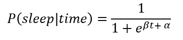

其中，β 和 α 是我们在 MCMC 过程中必须学习的模型参数。具有不同参数的 logsitic 函数图像如下所示。

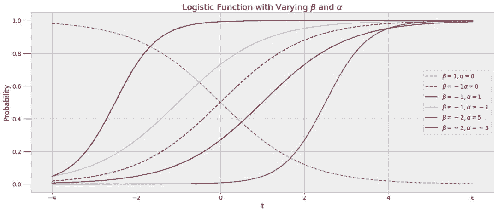

logsitic 函数很适合本案例中的数据，因为入睡的可能性会逐渐转变，此函数能捕捉睡眠模式之中的变化情况。我们希望能够在函数中插入时间 t，获得睡眠概率（其值在 0 和 1 之间）。我们最终得到的不是在晚上 10:00 入睡与否的直接答案，而是一个概率。为了建立这个模型，我们使用这些数据，通过 MCMC 寻找最佳的 α 和 β 参数。

**马尔科夫链蒙特卡罗**

马尔可夫链蒙特卡罗指从概率分布中抽样以构建最大可能分布的一类方法。我们不能直接构建 logistic 分布，所以，与之相反，我们为函数的参数（α 和 β）生成了上千个值——被称为样本——从而创造分布的近似值。MCMC 背后的思想是，当我们生成更多的样本时，我们的近似值越来越接近实际的真实分布。

马尔科夫链蒙特卡罗方法分为两部分。蒙特卡罗指的是使用重复随机样本获得数值解的一般性技术。蒙特卡罗可以被视为进行了若干次实验，其中每次都对模型中的变量进行改变并观察其响应。通过选择随机数，我们可以探索大部分参数空间，即变量可能值的范围。下图显示了我们的问题使用正常先验后的参数空间。

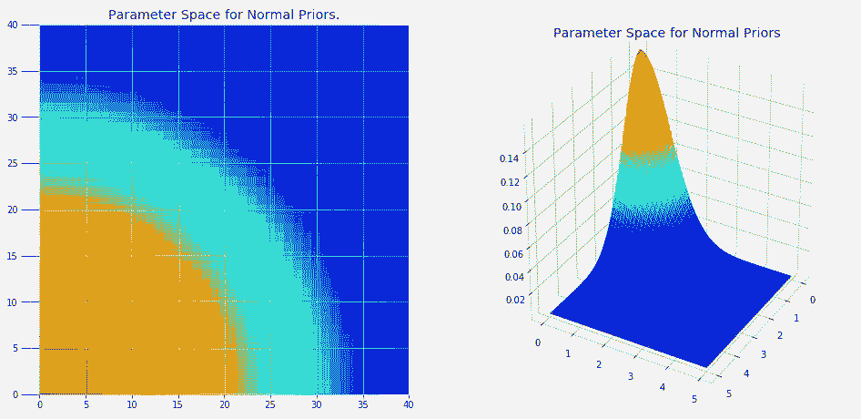

显然，我们无法一一尝试图像中的每一个点。但是通过对较高概率区域（红色区域）进行随机抽样，我们可以为问题建立最可能的模型。

**马尔科夫链**

马尔科夫链是一个随机过程，其中次态仅依赖于当前状态（在此语境中，一个状态指的是参数的一次赋值）。马尔科夫链没有记忆性，因为只有当前状态对下一状态起作用，而与到达当前状态的方式无关。如果这种说法还是有些难以理解，我们可以用日常现象中的天气来举例。如果我们想预测明日天气，我们可以仅通过今日天气来得到一个合理的估计。如果今天下雪了，我们可以查看下雪次日天气分布的历史数据，估算明天天气的概率。马尔科夫链的概念在于，我们无需了解整个历史过程就能预测下一状态，这个近似在许多现实情况中就能很好地工作。

综合马尔科夫链和蒙特卡罗的思想，马尔科夫链蒙特卡罗是一种基于当前值重复绘制某一分布参数随机值的方法。每个值的样本都是随机的，但是值的选择受限于当前状态和假定的参数先验分布。MCMC 可以被认为是一种随机游走，在这个过程中逐渐收敛到真实分布。

为了绘制 α 和 β 的随机值，我们需要假设这些值的先验分布。由于我们对参数没有任何提前的假设，我们可以使用正态分布。正态分布也称高斯分布，它由均值和方差定义，分别显示数据的位置以及扩散情况。下图是具有不同均值和方差的几种正态分布：


我们所使用的 MCMC 算法被称为 Metropolis Hastings。为了将我们观察的数据与模型联系起来，每绘制一组随机值，算法会根据数据对其进行评估。如果随机值与数据不一致（这里稍微进行了一些简化），这些值将被拒绝，模型保持当前状态。反之，如果随机值与数据一致，这些值将会分配给参数并成为当前状态。该过程将持续进行指定的步骤数目，模型的准确率也随着步骤数量的增加而改善。

综合而言，马尔科夫链蒙特卡罗在我们的问题当中基本步骤如下：

1.  为 logistic 函数选择一组初始参数 α 和 β。

2.  根据当前状态，把新的随机值分配给 α 和 β。

3.  检查新的随机值是否与观察结果一致。如果不一致，拒绝这些随机值并返回前一个状态。如果一致，则接受这些值，将其作为新的当前状态。

4.  对指定的迭代次数重复执行步骤 2 和 3。

该算法将返回它为 α 和 β 生成的所有值。然后，我们可以使用这些值的平均值作为 logistc 函数中 α 和 β 的最终可能值。MCMC 无法返回「真实」值，它给出的是分布的近似值。给定数据的情况下，最终输出的睡眠概率模型将是具有 α 和 β 均值的 logistic 函数。

**Python 实现**

上述细节在我脑海中徘徊已久，最后终于在 Python 中进行了实现！亲眼看到第一手的结果比读取别人的描述有帮助得多。要在 Python 中实现 MCMC，我们需要使用 PyMC3 贝叶斯推理库。它将大部分细节进行了抽象，从而让我们能不迷失在理论中，并建立我们的模型。

下面的代码创建的模型带有参数 α 和 β、概率 p 和观察结果 observed。step 变量指的是特定的算法，sleep_trace 则保存了模型生成的所有参数值。

```py
1.  with pm.Model() as sleep_model:

 *   # Create the alpha and beta parameters

*   # Assume a normal distribution

*   alpha = pm.Normal('alpha', mu=0.0, tau=0.05, testval=0.0)

*   beta = pm.Normal('beta', mu=0.0, tau=0.05, testval=0.0)

 *   # The sleep probability is modeled as a logistic function

*   p = pm.Deterministic('p', 1\. / (1\. + tt.exp(beta * time + alpha)))

 *   # Create the bernoulli parameter which uses observed data to inform the algorithm

*   observed = pm.Bernoulli('obs', p, observed=sleep_obs)

 *   # Using Metropolis Hastings Sampling

*   step = pm.Metropolis()

 *   # Draw the specified number of samples

*   sleep_trace = pm.sample(N_SAMPLES, step=step);
```

（请在 notebook 中查阅完整代码）

为了了解运行此代码时发生的情况，我们可以查看模型运行过程中生成的 α 和 β 的所有值。

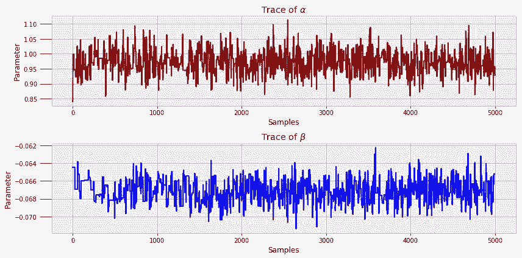

它们被称为轨迹图。我们可以看到，每个状态都与之前的状态有关（马尔科夫链），但是这些值波动显著（蒙特卡罗采样）。

在 MCMC 中，通常高达 90% 的轨迹会被抛弃。该算法无法立即收敛到真正的分布，且初始值往往并不准确。后期的参数值通常更好，这意味着它们是适用于建立模型的参数。我们使用了 10000 个样本并丢弃了前 50%，但是一个行业的应用可能会使用数十万甚至上百万个样本。

给定足够多的迭代次数，MCMC 将收敛于真实值。但是，对收敛进行评估可能比较困难。对此我将不在本文讨论（一个方法是测量轨迹的自相关），但是，如果我们想要结果最准确，这是一个重要的考虑因素。PyMC3 建立了评估模型好坏的函数，其中包括轨迹图和自相关图。

```py
1.  pm.traceplot(sleep_trace, ['alpha', 'beta'])

2.  pm.autocorrplot(sleep_trace, ['alpha', 'beta'])

```

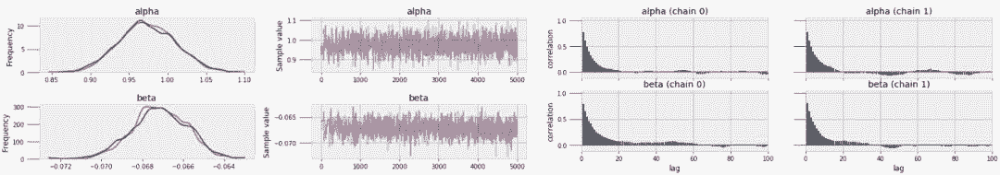

*轨迹图（左）和自相关图（右）*

**睡眠模型**

最终建立并运行模型之后，是时候使用结果了。我们将最后 5000 个 α 和 β 样本的平均值作为参数最可能的值，这就让我们能够创建一条曲线，建模睡眠后验概率：

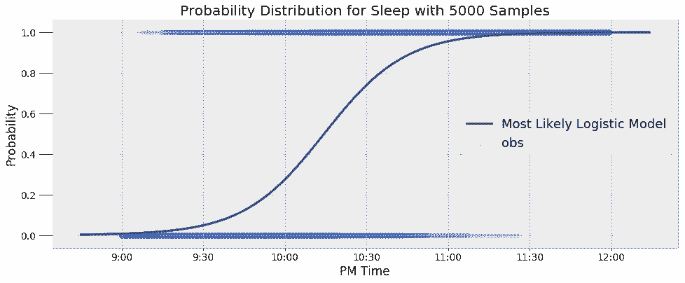

该模型能很好地反映数据的结果。此外，它捕捉了我睡眠模式当中的固有变化。该模型给出的不是一个简单的是非答案，而是一个概率。例如，我们可以通过该模型找到在给定时间我睡着的概率，并能找到睡眠概率经过 50% 的时间：

```py
1.  9:30  PM probability of being asleep: 4.80%.

2.  10:00 PM probability of being asleep: 27.44%.

3.  10:30 PM probability of being asleep: 73.91%.

4.  The probability of sleep increases to above 50% at 10:14 PM.

```

尽管我每天都试图在 10 点上床睡觉，但这显然不是大多数下的实际情况。我们可以发现，我上床的平均时间是晚上 10:14 左右。

在数据给定的情况下，这些值是最有可能的估计值。然而，因为模型本身是近似的，所以存在与这些概率相关的不确定性。为了表示这种不确定性，我们可以使用所有的 α 和 β 样本（而不是它们的平均值）来预测某一给定时间的睡眠概率，然后据此绘制直方图。

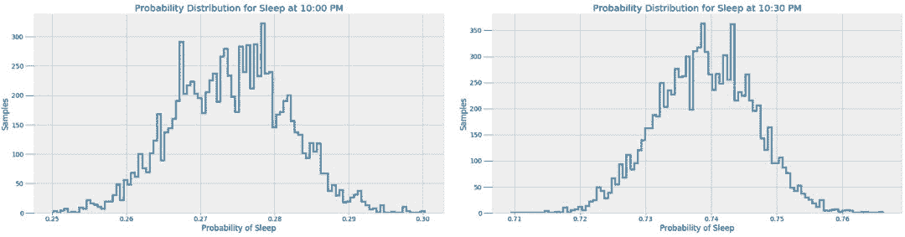

这些结果更好地反映了 MCMC 模型真正做了什么。MCMC 找到的不是一个简单的答案，而是可能值的样本。贝叶斯推理在现实世界中起到了重要作用，是因为它从概率的角度表示预测结果。我们可以说，问题会有一个可能性最大的答案，但是更加准确的回应是任何预测都存在一系列的可能值。

**唤醒模型**

我可以使用描述早晨醒来时间的数据建立一个类似的模型。我定了一个闹钟，努力在早晨 6:00 起床。但是可以看到，我并非每日都是如此。下图展现了我从入睡到醒来过渡过程的最终模型以及观察数据。

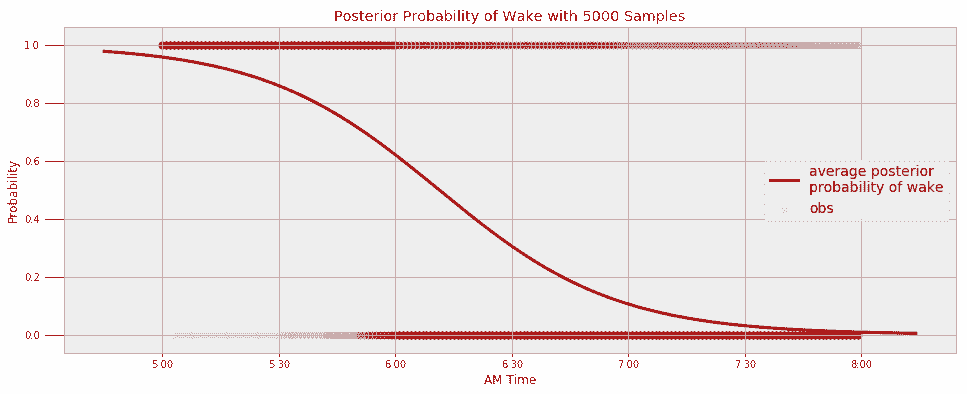

通过查询模型，我们可以找出在给定时间我睡着的概率以及最有可能醒来的时间。

```py
1.  Probability of being awake at 5:30 AM: 14.10%. 

2.  Probability of being awake at 6:00 AM: 37.94%. 

3.  Probability of being awake at 6:30 AM: 69.49%.

4.  The probability of being awake passes 50% at 6:11 AM.

```

看起来我得处理一下我的闹钟了！

**睡眠时长**

出于好奇心和练习目的，我最终想创造的是关于我睡眠时长的模型。首先，我们需要找到一个函数来模拟数据的分布。我猜想结果应该会是正态分布的形式，但是我们只有通过检查数据才能得到最终结果。

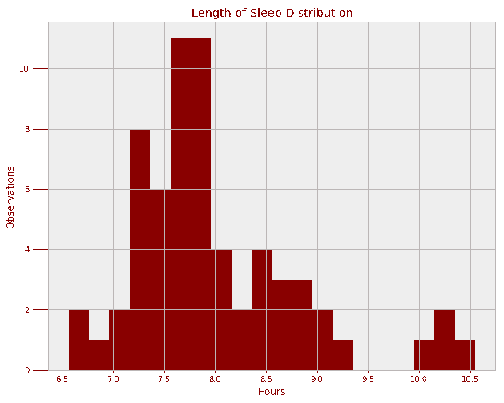

正态分布确实可行，但这无法捕捉右侧的偏离点（即我睡眠时间非常长的情况）。我们可以用两个独立的正态分布来表示两个模型，但是，我想使用偏正态分布。偏正态分布有三个参数：均值、方差、偏斜度 α。以上三个参数都需要通过 MCMC 来学习。下面的代码建立了上述模型，并进行了 Metropolis Hastings 抽样。

```py
1.  with pm.Model() as duration_model:

2.  # Three parameters to sample

3.  alpha_skew = pm.Normal('alpha_skew', mu=0, tau=0.5, testval=3.0)

4.  mu_ = pm.Normal('mu', mu=0, tau=0.5, testval=7.4)

5.  tau_ = pm.Normal('tau', mu=0, tau=0.5, testval=1.0)

 *   # Duration is a deterministic variable

*   duration_ = pm.SkewNormal('duration', alpha = alpha_skew, mu = mu_, 

*   sd = 1/tau_, observed = duration)

 *   # Metropolis Hastings for sampling

*   step = pm.Metropolis()

*   duration_trace = pm.sample(N_SAMPLES, step=step) 
```

现在，我们可以使用这三个参数的均值来构建最有可能的分布。以下是根据数据观察得到的最终偏正态分布。

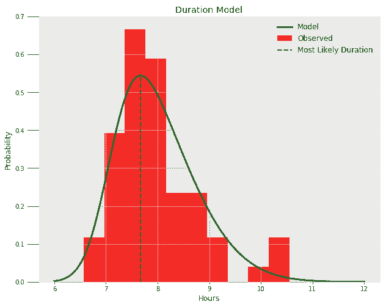

看起来拟合得不错！我们可以通过查询模型，找到我至少可以获得一定睡眠时长的概率，同时也能找到最可能的睡眠时长：

```py
1.  Probability of at least 6.5 hours of sleep = 99.16%.

2.  Probability of at least 8.0 hours of sleep = 44.53%.

3.  Probability of at least 9.0 hours of sleep = 10.94%.

4.  The most likely duration of sleep is 7.67 hours.

```

我对这个结果并不是完全满意，但是对一个研究生而言，这样的结果已经不错啦。

**小结**

这个项目的顺利完成再次展示了解决问题的重要性，而且我们最好选择解决真实存在的应用问题（https://towardsdatascience.com/how-to-master-new-skills-656d42d0e09c）。在使用马尔科夫链蒙特卡罗构建贝叶斯推理的端对端实现过程中，我学习了许多基础知识，而且非常享受这个过程。我不仅更加了解我的习惯（以及我需要改进的方面），而且终于弄明白了 MCMC 和贝叶斯推理到底是什么。在数据科学领域，我们要不断地给自己的库存知识增加新的工具，而最有效的学习方法就是找到一个问题并着手开始解决它！ 

*原文链接：https://towardsdatascience.com/markov-chain-monte-carlo-in-python-44f7e609be98*

****本文为机器之心编译，**转载请联系本公众号获得授权****。**

✄------------------------------------------------

**加入机器之心（全职记者/实习生）：hr@jiqizhixin.com**

**投稿或寻求报道：editor@jiqizhixin.com**

**广告&商务合作：bd@jiqizhixin.com**