# 如何从零开始构建深度学习项目？这里有一份详细的教程

选自 Medium

**作者：****Jonathan Hui**

**机器之心编译**

> 在学习了有关深度学习的理论课程之后，很多人都会有兴趣尝试构建一个属于自己的项目。本文将会从第一步开始，告诉你如何解决项目开发中会遇到的各类问题。

本文由六大部分组成，涵盖深度学习 ( DL ) 项目的整个过程。我们将使用一个自动漫画着色项目来说明深度学习的设计、程序调试和参数调整过程。

本文主题为「如何启动一个深度学习项目？」，分为以下六个部分：

*   第一部分：启动一个深度学习项目

*   第二部分：创建一个深度学习数据集

*   第三部分：设计深度模型

*   第四部分：可视化深度网络模型及度量指标

*   第五部分：深度学习网络中的调试

*   第六部分：改善深度学习模型性能及网络调参

**第一部分：启动一个深度学习项目**

**应该选择什么样的项目？**

很多人工智能项目其实并没有那么严肃，做起来还很有趣。2017 年初，我着手启动了一个为日本漫画上色的项目，并作为我对生成对抗网络 ( GAN ) 研究的一部分。这个问题很难解决，但却很吸引人，尤其是对于我这种不会画画的人来说！在寻找项目时，不要局限于增量性改进，去做一款适销对路的产品，或者创建一种学习速度更快、质量更高的新模型。

**调试深度网络（DN）非常棘手**

训练深度学习模型需要数百万次的迭代，因此查找 bug 的过程非常艰难，而且容易崩坏。因此我们要从简单的地方着手，循序渐进，例如模型的优化（如正则化）始终可以在代码调试完成后进行。此外，我们还需要经常可视化预测结果和模型度量标准，并且我们首先需要令模型跑起来，这样就有一个可以后退的基线。我们最好不要陷在一个很大的模型，并尝试将所有的模块都弄好。

**度量和学习**

宏伟的项目计划可能带惨烈的失败。多数个人项目的第一个版本会持续两到四个月，这个时间非常短暂，因为研究、调试和实验都需要花费大量的时间。一般我们安排这些复杂的实验，使其通宵运行，到第二天清晨时，我们希望得到足够的信息来采取下一步行动。在早期阶段，这些实验不应超过 12 小时，这是一条良好的经验法则。为了做到这一点，我们将漫画上色项目范围缩小到单个动画人物的上色。此外，我们需要设计很多测试，因此借助它们分析模型在实验中的不足之处。一般这些测试不要计划得太远，我们需要快速度量、学习，并为下一步设计提供足够的反馈。

**研究与产品**

当我们在 2017 年春季开始讨论漫画上色项目时，Kevin Frans 有一个 Deepcolor 项目，用 GAN 为漫画添加色彩提示。


在确定目标时，你会花很大力气来确保项目完成后仍然具有意义。GAN 模型相当复杂，2017 年初还没达到嵌入产品所需的质量水准。然而，如果你把应用范围缩小到产品可以巧妙处理的程度，你就可以把质量提高到商用水准。为此，无论着手启动何种 DL 项目，都要把握好模型泛化、容量和准确性之间的平衡。

**成本**

必须使用 GPU 来训练实际模型。它比 CPU 快 20 到 100 倍。价格最低的亚马逊 GPU p2.xlarge 站点实例要价 7.5 美元/天，而 8 核 GPU 的价格则高达 75 美元/天。在我们的漫画上色项目中，一些实验花费的时间就超过两天，因此平均每周花费至少需要 150 美元。至于更快的 AWS 实例，花费可能高达 1500 美元/周。我们可以购买独立计算机，而不是使用云计算。2018 年 2 月，搭载 Nvidia GeForce GTX 1080 Ti 的台式机售价约为 2200 美元。在训练精调的 VGG 模型时，它比 P2 实例大约要快 5 倍。

**时间线**

我们将开发分为四个阶段，最后三个阶段在多次迭代中进行。

*   项目研究

*   模型设计

*   实现及调试

*   实验及调参

项目研究

我们会先对现有产品进行研究，以探索它们的弱点。许多 GAN 类型的解决方案使用空间颜色提示，图案有点不清晰，有时还会出现颜色混杂。我们为自己的项目设定了两个月的时间框架，其中有两个优先事项：生成不带提示的颜色及提高颜色保真度。我们的目标是：

> 在单个动画角色上为灰度漫画着色，且不使用空间颜色提示。

站在巨人的肩膀上

接下来，我们需要了解相关的研究和开源项目，许多人在开始实践之前至少要看几十篇论文和项目。例如，当我们深入研究 GAN 时，发现有十几个新的 GAN 模型: DRAGAN、cGAN、LSGAN 等，阅读研究论文可能会很痛苦，但非常有意义。

深度学习 ( DL ) 代码简练，但很难排查缺陷，且很多研究论文常常遗漏了实现细节。许多项目始于开源实现，解决的问题也很相似，因此我们可以多多搜索开源项目。因此我们在 GitHub 上查看了不同 GAN 变体的代码实现，并对它们进行若干次测试。

**第二部分：创建一个深度学习数据集**

深度学习项目的成功取决于数据集的质量。在本文的第 2 部分中，我们将探讨创建优质训练数据集的核心问题。


**公开及学术数据集**

对于研究项目，可以搜索已建立的公开数据集。这些数据集可以提供更整齐的样本和基线模型性能。如果你有多个可用的公开数据集，请选择与你的问题最相关且质量最好的样本。

**自定义数据集**

对于实际问题，我们需要来自问题领域的样本。首先尝试查找公共数据集。关于创建高质量自定义数据集的研究还有所欠缺。如果没有可用的资料，请搜寻你可以抓取数据的位置。该位置通常有很多参考，但数据质量通常较低，还需要投入大量精力进行整理。在抓取样本之前，要专门抽出时间评估所有选项并选择最相关的选项。

高质量数据集应该包括以下特征：

*   类别均衡

*   数据充足

*   数据和标记中有高质量信息

*   数据和标记错误非常小

*   与你的问题相关

**不要一次爬取所有数据。**我们经常借助标签和分类来抓取网站样本，从而获取与我们的问题相关的数据。最好的爬取方法是在你的模型中训练、测试少量样本，并根据得到的经验教训改善抓取方法。

清理你抓取的数据非常重要，否则，即使最好的模型设计也达不到与人类水平相当的表现。Danbooru 和 Safebooru 是两个非常受欢迎的动漫人物来源，但是一些深入学习的应用程序偏爱 Getchu，以获得更高质量的绘图。我们可以使用一组标签从 Safebooru 下载图像，并直观地检查样本并运行测试来分析错误（表现不佳的样本）。

模型训练和视觉评估都提供了进一步的信息来细化我们的标签选择。随着迭代的继续，我们将学到更多，并逐渐进行样本积累。我们还需要使用分类器进一步过滤与问题无关的样本，如清除所有人物过小的图像等。与学术数据集相比，小型项目收集的样本很少，在适当情况下可以应用迁移学习。

下面的左图由 PaintsChainer 提供，右图由最终的模型上色：


我们决定用一些训练样本来对算法进行测试。结果并没有给人惊喜，应用的颜色较少，样式也不正确。


由于对模型进行了一段时间的训练，我们知道什么样的绘图表现欠佳。正如预期的那样，结构错综复杂的绘图更难上色。


这说明好好选择样本非常重要。作为一款产品，PaintsChainer 专注于它们擅长的线条类型，这点非常明智。这次我使用了从互联网上挑选的干净线条艺术，结果再次给人惊喜。


这里有一些经验教训：数据没有好坏之分，只是有些数据不能满足你的需求。此外，随着样本类别的增加，训练和保持输出质量会变得更加困难，删除不相关的数据可以得到一个更好的模型。

在开发早期，我们认识到一些绘图有太多错综复杂的结构。在不显著增加模型容量的情况下，这些绘图在训练中产生的价值很小，因此最好不要使用，否则只会影响训练效率。

**重点回顾**

*   尽可能使用公共数据集；

*   寻找可以获取高质量、多样化样本的最佳网站；

*   分析错误并过滤掉与实际问题无关的样本；

*   迭代地创建你的样本；

*   平衡每个类别的样本数；

*   训练之前先整理样本；

*   收集足够的样本。如果样本不够，应用迁移学习。

**第三部分：深度学习设计**

第三部分介绍了一些高层次的深度学习策略，接下来我们将详细介绍最常见的设计选择，这可能需要一些基本的 DL 背景。

**简单灵活**

设计初始要简单、小巧。在学习阶段，人们脑海中会充斥大量很酷的观念。我们倾向于一次性把所有细节都编码进来。但这是不现实的，最开始就想要超越顶尖的结果并不实际。从较少网络层和自定义开始设计，后面再做一些必要的超参数精调方案。这些都需要查证损失函数一直在降低，不要一开始就在较大的模型上浪费时间。

在简短的 Debug 之后，我们的模型经过 5000 次迭代产生了简单的结果。但至少该模型所上的颜色开始限制在固定区域内，且肤色也有些显露出来。


在模型是否开始上色上，以上结果给了我们有价值的反馈。所以不要从大模型开始，不然你会花费大量时间 Debug 和训练模型。

**优先性以及增量设计**

首先为了创造简单的设计，我们需要选出优先项。把复杂问题分解成小问题，一步一步解决。做深度学习的正确策略是快速的执行学到的东西。在跳到使用无暗示（no hints）模型之前，我们先使用带有空间颜色暗示的模型。不要一步跳到「无暗示」模型设计，例如我们首先去掉暗示中的空间信息，颜色质量会急剧下降，所以我们转变优先性，在做下一步前先精炼我们的模型。在设计模型的过程中，我们会遇到许多惊喜。相比于做个要不断改变的长期计划，还不如以优先性驱动的计划。使用更短、更小的设计迭代，从而保证项目可管理性。

**避免随机改进**

首先分析自己模型的弱点，而不是随意地改进，例如用双向 LSTM 或者 PReLU。我们需要根据可视化模型误差（表现极差的场景）以及性能参数来确定模型问题。随意做改进反而适得其反，会成比例的增加训练成本，而回报极小。

**限制**

我们把限制应用到网络设计，从而保证训练更高效。建立深度学习并不是简单的把网络层堆在一起。增加好的限制（constraints）能使得学习更为有效，或者更智能。例如，应用注意机制，能让网络知道注意哪里，在变分自编码器中，我们训练隐藏因子使其服从正态分布。在设计中，我们应用去噪方法通过归零除去空间颜色暗示的大量分数。啼笑皆非的是，这使得模型能更好地学习、泛化。

**设计细节**

文章接下来的部分，将讨论深度学习项目中会遇到的一些常见的设计选择。

深度学习软件框架

自谷歌 2015 年 11 月发布 TensorFlow 以来，短短 6 个月就成为了最流行的深度学习框架。虽然短期看起来难有竞争对手，但一年后 Facebook 就发布了 PyTorch，且极大的受研究社区的关注。到 2018 年，已经有大量的深度学习平台可供选择，包括 TensorFlow、PyTorch、Caffe、Caffe2、MXNet、CNTK 等。

一些研究员之所以转向 PyTorch 有一主要因素：PyTorch 设计上注重端用户（end-user)，API 简单且直观。错误信息可以直观地理解，API 文档也非常完整。PyTorch 中的特征，例如预训练模型、数据预处理、载入常用数据集都非常受欢迎。

TensorFlow 也非常棒，但目前为止它还是采用自下而上的方式，使其变得极为复杂。TensorFlow 的 API 很冗长，Debug 也不一样，它大概有十几种建立深度网络的 API 模型。

截止到 2018 年 2 月，TensorFlow 依然独占鳌头。开发者社区依然是是最大的。这是非常重要的因素。如果你想要用多个机器训练模型，或者把推理引擎部署到移动手机上，TensorFlow 是唯一的选择。然而，如果其他平台变得更加专注端用户，我们可以预见将会有更多从小项目转向中级项目。

随着 TensorFlow 的发展，有很多 API 可供选择来建立深度网络。最高层的 API 是提供隐式积分的评估器，而 TensorBoard 提供了性能评估。最低层的 API 非常冗长，在许多模块中都有。现在，它用封装器 API 合并到了 tf.layers、tf.metrics 和 tf.losses 模块，从而更容易地建立深度网络层。

对想要更直观 API 的研究者来说，还有 Keras、TFLearn、TF-Slim 等可以选择，这些都可直接在 TensorFlow 上使用。我建议是选择带有所需要的预训练模型与工具（来下载数据集）的框架，此外在学术界，用 Keras API 做原型设计相当流行。

迁移学习

不要做重复的工作。许多深度学习软件平台都有 VGG19、ResNet、Inception v3 这样的预训练模型。从头开始训练非常耗费时间。就像 2014 年 VGG 论文中所说的，「VGG 模型是用 4 块英伟达 Titan Black GPU 训练的，根据架构训练单个网络需要 2-3 周的时间。」

许多预训练模型可用于解决深度学习难题。例如，我们使用预训练 VGG 模型提取图像特征，并将这些特征反馈到 LSTM 模型来生成描述。许多预训练模型都用 ImageNet 数据集训练，如果你的目标数据和 ImageNet 差别不大，我们将固定大部分模型参数，只重新训练最后几个完全连接的层。否则，我们就要使用训练数据集对整个网络进行端到端的重训练。但是在这两种情况下，由于模型已经过预训练，再训练所需的迭代将大大减少。由于训练时间较短，即使训练数据集不够大，也可以避免过拟合。这种迁移学习在各个学科都很有效，例如用预先训练好的英语模型训练汉语模型。

然而，这种迁移学习仅适用于需要复杂模型来提取特征的问题。在我们的项目中，我们的示例与 ImageNet 不同，我们需要对模型进行端到端的重新训练。然而，当我们只需要相对简单的潜在因素（颜色）时，来自 VGG19 的训练复杂度太高。因此，我们决定建立一个新的更简单的 CNN 特征提取模型。

成本函数

并非所有的成本函数都是等价的，它会影响模型的训练难度。有些成本函数是相当标准的，但有些问题域需要仔细考虑。

*   分类问题：交叉熵，折页损失函数（SVM）

*   回归： 均方误差（MSE）

*   对象检测或分割：交并比（IoU）

*   策略优化：KL 散度

*   词嵌入：噪音对比估计（NCE）

*   词向量：余弦相似度

在理论分析中看起来不错的成本函数在实践中可能不太好用。例如，GAN 中鉴别器网络的成本函数采用了更为实用也更经得起实验考验的方法，而不是理论分析中看起来不错的方法。在一些问题域中，成本函数可以是部分猜测加部分实验，也可以是几个成本函数的组合。我们的项目始于标准 GAN 成本函数。此外，我们还添加了使用 MSE 和其他正则化成本的重建成本。然而，如何找到更好的成本函数是我们项目中尚未解决的问题之一，我们相信它将对色彩保真度产生重大影响。

度量标准

良好的度量标准有助于更好地比较和调整模型。对于特殊问题，请查看 Kaggle 平台，该平台组织了许多 DL 竞赛，并提供了详细的度量标准。不幸的是，在我们的项目中，你很难定义一个精确的公式来衡量艺术渲染的准确性。

正则化

> L1 正则化和 L2 正则化都很常见，但 L2 正则化在深度学习中更受欢迎。

L1 正则化有何优点？L1 正则化可以产生更加稀疏的参数，这有助于解开底层表示。由于每个非零参数会往成本上添加惩罚，与 L2 正则化相比，L1 更加青睐零参数，即与 L2 正则化中的许多微小参数相比，它更喜欢零参数。L1 正则化使过滤器更干净、更易于解释，因此是特征选择的良好选择。L1 对异常值的脆弱性也较低，如果数据不太干净，运行效果会更好。然而，L2 正则化仍然更受欢迎，因为解可能更稳定。

梯度下降

始终密切监视梯度是否消失或爆炸，梯度下降问题有许多可能的原因，这些原因难以证实。不要跳至学习速率调整或使模型设计改变太快，小梯度可能仅仅由编程 Bug 引起，如输入数据未正确缩放或权重全部初始化为零。

如果消除了其他可能的原因，则在梯度爆炸时应用梯度截断（特别是对于 NLP）。跳过连接是缓解梯度下降问题的常用技术。在 ResNet 中，残差模块允许输入绕过当前层到达下一层，这有效地增加了网络的深度。

缩放

缩放输入特征。我们通常将特征缩放为以零为均值在特定范围内，如 [-1, 1]。特征的不适当缩放是梯度爆炸或降低的一个最常见的原因。有时我们从训练数据中计算均值和方差，以使数据更接近正态分布。如果缩放验证或测试数据，要再次利用训练数据的均值和方差。

批归一化和层归一化

每层激活函数之前节点输出的不平衡性是梯度问题的另一个主要来源，必要时需要对 CNN 应用批量归一化（BN）。如果适当地标准化（缩放）输入数据，DN 将学习得更快更好。在 BN 中，我们从每批训练数据中计算每个空间位置的均值和方差。例如，批大小为 16，特征图具有 10 X10 的空间维度，我们计算 100 个平均值和 100 个方差（每个位置一个）。每个位置处的均值是来自 16 个样本的对应位置平均值，我们使用均值和方差来重新归一化每个位置的节点输出。BN 提高了准确度，同时缩短了训练时间。

然而，BN 对 RNN 无效，我们需要使用层归一化。在 RNN 中，来自 BN 的均值和方差不适合用来重新归一化 RNN 单元的输出，这可能是因为 RNN 和共享参数的循环属性。在层归一化中，输出由当前样本的层输出计算的平均值和方差重新归一化。一个含有 100 个元素的层仅使用来自当前输入的一个平均值方差来重新归一化该层。

Dropout

可以将 Dropout 应用于层以归一化模型。2015 年批量归一化兴起之后，dropout 热度降低。批量归一化使用均值和标准差重新缩放节点输出。这就像噪声一样，迫使层对输入中的变量进行更鲁棒的学习。由于批量归一化也有助于解决梯度下降问题，因此它逐渐取代了 Dropout。

结合 Dropout 和 L2 正则化的好处是领域特定的。通常，我们可以在调优过程中测试 dropout，并收集经验数据来证明其益处。

激活函数

在 DL 中，ReLU 是最常用的非线性激活函数。如果学习速率太高，则许多节点的激活值可能会处于零值。如果改变学习速率没有帮助，我们可以尝试 leaky ReLU 或 PReLU。在 leaky ReLU 中，当 x < 0 时，它不输出 0，而是具有小的预定义向下斜率（如 0.01 或由超参数设置）。参数 ReLU（PReLU）往前推动一步。每个节点将具有可训练斜率。

拆分数据集

为了测试实际性能，我们将数据分为三部分: 70 % 用于训练，20 % 用于验证，10 % 用于测试。确保样本在每个数据集和每批训练样本中被充分打乱。在训练过程中，我们使用训练数据集来构建具有不同超参数的模型。我们使用验证数据集来运行这些模型，并选择精确度最高的模型。但是保险起见，我们使用 10 % 的测试数据进行最后的错乱检查。如果你的测试结果与验证结果有很大差异，则应将数据打乱地更加充分或收集更多的数据。

基线

设置基线有助于我们比较模型和 Debug，例如我们可使用 VGG19 模型作为分类问题的基线。或者，我们可以先扩展一些已建立的简单模型来解决我们的问题。这有助于我们更好地了解问题，并建立性能基线进行比较。在我们的项目中，我们修改了已建立的 GAN 实现并重新设计了作为基线的生成网络。

检查点

我们定期保存模型的输出和度量以供比较。有时，我们希望重现模型的结果或重新加载模型以进一步训练它。检查点允许我们保存模型以便以后重新加载。但是，如果模型设计已更改，则无法加载所有旧检查点。我们也使用 Git 标记来跟踪多个模型，并为特定检查点重新加载正确的模型。我们的设计每个检查点占用 4gb 空间。在云环境中工作时，应相应配置足够的存储。我们经常启动和终止 Amazon 云实例，因此我们将所有文件存储在 Amazon EBS 中，以便于重新连接。

自定义层

深度学习软件包中的内建层已经得到了更好的测试和优化。尽管如此，如果想自定义层，你需要：

*   用非随机数据对前向传播和反向传播代码进行模块测试；

*   将反向传播结果和朴素梯度检查进行对比；

*   在分母中添加小量的ϵ或用对数计算来避免 NaN 值。

归一化

深度学习的一大挑战是可复现性。在调试过程中，如果初始模型参数在 session 间保持变化，就很难进行调试。因此，我们明确地对所有随机发生器初始化了种子。我们在项目中对 python、NumPy 和 TensorFlow 都初始化了种子。在精调过程中，我们我们关闭了种子初始化，从而为每次运行生成不同的模型。为了复现模型的结果，我们将对其进行 checkpoint，并在稍后重新加载它。

**优化器**

Adam 优化器是深度学习中最流行的优化器之一。它适用于很多种问题，包括带稀疏或带噪声梯度的模型。其易于精调的特性使得它能快速获得很好的结果。实际上，默认的参数配置通常就能工作得很好。Adam 优化器结合了 AdaGrad 和 RMSProp 的优点。Adam 对每个参数使用相同的学习率，并随着学习的进行而独立地适应。Adam 是基于动量的算法，利用了梯度的历史信息。因此，梯度下降可以运行得更加平滑，并抑制了由于大梯度和大学习率导致的参数振荡问题。

Adam 优化器调整

Adam 有 4 个可配置参数：

*   学习率（默认 0.001）；

*   β1：第一个矩估计的指数衰减率（默认 0.9）；

*   β2：第二个矩估计的指数衰减率（默认 0.999），这个值在稀疏梯度问题中应该被设置成接近 1；

*   ϵ（默认值 1e^-8）是一个用于避免除以零运算的小值。

β（动量）通过累积梯度的历史信息来平滑化梯度下降。通常对于早期阶段，默认设置已经能工作得很好。否则，最可能需要改变的参数应该是学习率。

**总结**

以下是对深度学习项目的主要步骤的简单总结：

```py
• Define task (Object detection, Colorization of line arts)
• Collect dataset (MS Coco, Public web sites)
    ◦ Search for academic datasets and baselines
    ◦ Build your own (From Twitter, News, Website,…)
• Define the metrics
    ◦ Search for established metrics
• Clean and preprocess the data
    ◦ Select features and transform data 
    ◦ One-hot vector, bag of words, spectrogram etc...
    ◦ Bucketize, logarithm scale, spectrogram
    ◦ Remove noise or outliers 
    ◦ Remove invalid and duplicate data
    ◦ Scale or whiten data
• Split datasets for training, validation and testing
    ◦ Visualize data
    ◦ Validate dataset
• Establish a baseline
    ◦ Compute metrics for the baseline
    ◦ Analyze errors for area of improvements
• Select network structure
    ◦ CNN, LSTM…
• Implement a deep network
    ◦ Code debugging and validation
    ◦ Parameter initialization
    ◦ Compute loss and metrics
    ◦ Choose hyper-parameters
    ◦ Visualize, validate and summarize result
    ◦ Analyze errors
    ◦ Add layers and nodes
    ◦ Optimization
• Hyper-parameters fine tunings
• Try our model variants
```

**第四部分：可视化深度神经网络模型和指标**

在为深度神经网络排除故障方面，人们总是太快、太早地下结论了。在了解如何排除故障前，我们要先考虑要寻找什么，再花费数小时时间追踪故障。这部分我们将讨论如何可视化深度学习模型和性能指标。

**TensorBoard**

在每一步追踪每个动作、检查结果非常重要。在预置包如 TensorBoard 的帮助下，可视化模型和性能指标变得简单，且奖励几乎是同时的。

**数据可视化（输入、输出）**

验证模型的输入和输出。在向模型馈送数据之前，先保存一些训练和验证样本用于视觉验证。取消数据预处理。将像素值重新调整回 [0, 255]。检查多个批次，以确定我们没有重复相同批次的数据。左下图像是一些训练样本，右下方验证样本。


有时，验证输入数据的直方图很棒。完美情况下，它应该是以 0 为中心的，区间在 -1 和 1 之间。如果特征在不同的尺度中，那么梯度要么下降要么爆炸（根据学习率而定）。

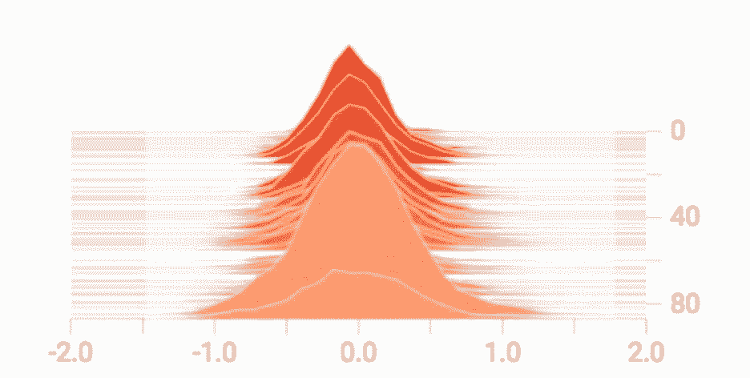

定期保存对应模型的输出，用于验证和误差分析。例如，验证输出中的颜色稍浅。


**指标（损失 & 准确率）**

除了定期记录损失和准确率之外，我们还可以记录和绘制它们，以分析其长期趋势。下图是 TensorBoard 上展示的准确率和交叉熵损失。

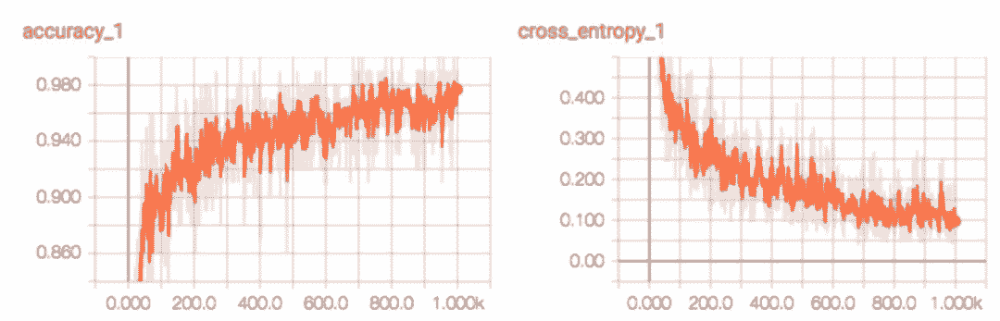

绘制损失图能够帮助我们调整学习率。损失的任意长期上升表明学习率太高了。如果学习率较低，则学习的速度变慢。

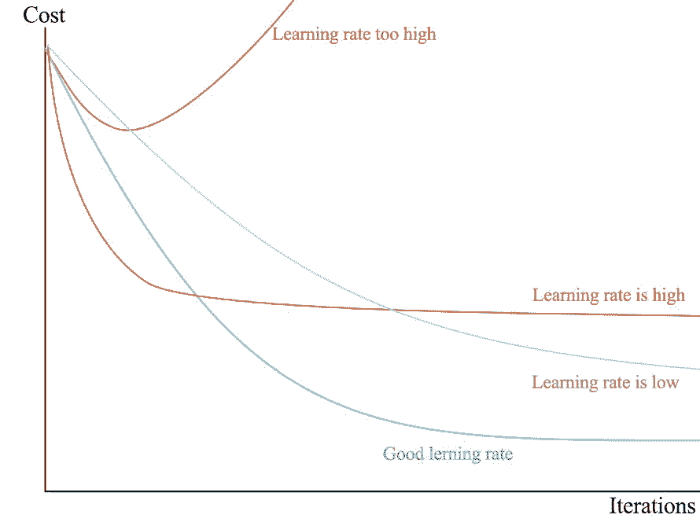

这里是另一个学习率太高的真实样本。我们能看到损失函数突然上升（可能由梯度突然上升引起）。

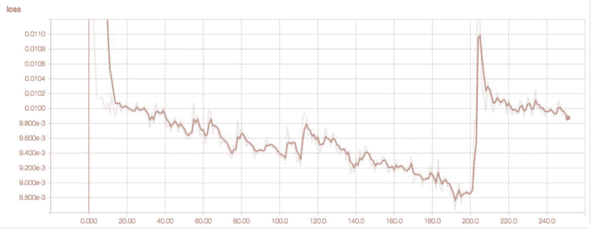

我们使用准确率图调整正则化因子。如果验证和训练准确率之间存在很大差距，则该模型出现过拟合。为了缓解过拟合，我们需要提高正则化因子。

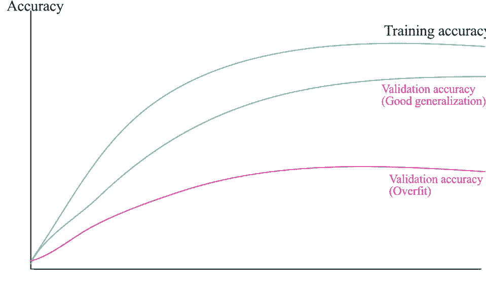

**小结**

**权重 & 偏置：**我们紧密监控权重和偏置。下图是层 1 在不同训练迭代中的权重和偏置。出现大型（正／负）权重是不正常的。正态分布的权重表明训练过程很顺利（但是也不一定）。

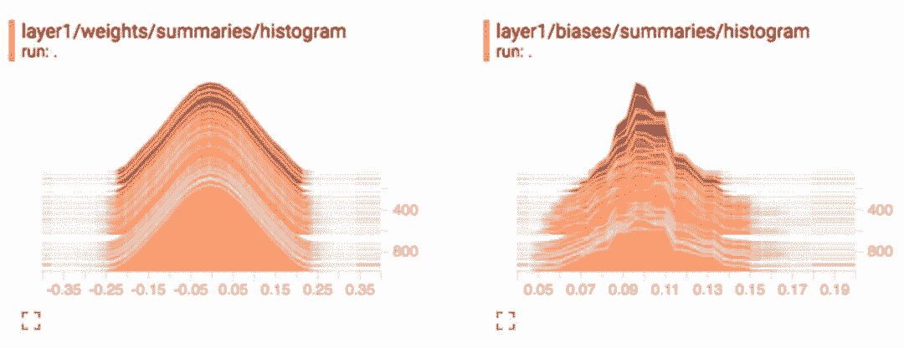

**激活：**为了梯度下降以实现最佳性能，激活函数之前的节点输出应该呈正态分布。如果不是，那么我们可能向卷积层应用批归一化，或者向 RNN 层应用层归一化。我们还监控激活函数之后无效节点（0 激活）的数量。

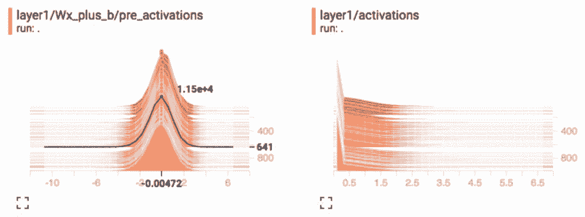

**梯度：**我们监控每一层的梯度，以确定一个最严肃的深度学习问题：梯度消失或爆炸。如果梯度从最右层向最左层快速下降，那么就出现了梯度消失问题。

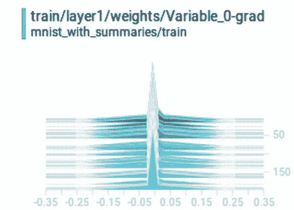

这或许不是很常见：我们可视化了 CNN 滤波器。它识别出模型提取的特征的类型。如下图所示，前两个卷积层在检测边界和颜色。

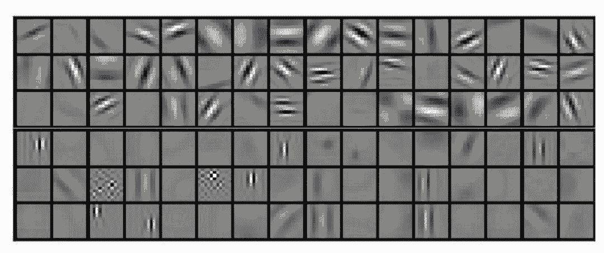

对于 CNN，我们可以看到特征图在学习什么。下图捕捉了特定图中具备最高激活函数的 9 张图（右侧）。它还使用解卷积网络从特征图中重建空间图像（左图）。

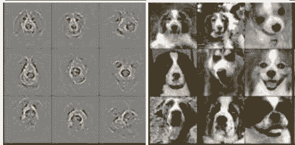

*Visualizing and Understanding Convolutional Networks, Matthew D Zeiler et al.*

这种图像重建很少进行。但是在生成模型中，我们经常改变一个潜在因子、保持其他不变。它验证该模型是否在智能地学习。

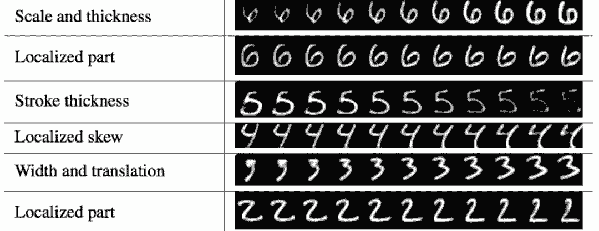

*Dynamic Routing Between Capsules, Sara Sabour, Nicholas Frosst, Geoffrey E Hinton*

**第五部分：调试深度学习网络**

**深度学习的问题解决步骤**

在前期开发中，我们会同时遇到多个问题。就像前面提到的，深度学习训练由数百万次迭代组成。找到 bug 非常难，且容易崩溃。从简单开始，渐渐做一些改变。正则化这样的模型优化可以在代码 degug 后做。以功能优先的方式检查模型：

*   把正则化因子设置为 0；

*   不要其他正则化（包括 dropouts);

*   使用默认设置的 Adam 优化器；

*   使用 ReLU;

*   不要数据增强；

*   更少的深度网络层；

*   扩大输入数据，但不要非必要预处理；

*   不要在长时间训练迭代或者大 batch size 上浪费时间。

**用小量的训练数据使模型过拟合是 debug 深度学习的最好方式。**如果在数千次迭代内，损失值不下降，进一步 debgug 代码。准确率超越瞎猜的概念，你就获得了第一个里程碑。然后对模型做后续的修改：增加网络层和自定义；开始用完整训练数据做训练；通过监控训练和验证数据集之间的准确率差别，来增加正则化控制过拟合。

> 如果卡住了，去掉所有东西，从更小的问题开始上手。

**初始化超参数**

许多超参数与模型优化更为相关。关掉超参数或者使用缺省值。使用 Adam 优化器，它速度快、高效且缺省学习率也很好。前期的问题主要来自于 bug，而不是模型设计和精调问题。在做微调之前，先过一遍下面的检查列表。这些问题更常见，也容易检查。如果损失值还没下降，就调整学习率。如果损失值降的太慢，学习率增加 10。如果损失值上升或者梯度爆炸，学习率降低 10。重复这个过程，直到损失值逐渐下降。典型的学习率在 1 到 1e-7 之间。


**检查列表**

数据：

*   可视化并检查输入数据（在数据预处理之后，馈送到模型之前）；

*   检查输入标签的准确率（在数据扰动之后）；

*   不要一遍又一遍的馈送同一 batch 的数据；

*   适当的缩放输入数据（一般可缩放到区间 (-1, 1) 之间，且具有零均值）；

*   检查输出的范围（如，在区间 (-1, 1) 之间）；

*   总是使用训练集的平均值/方差来重新调节验证/测试集；

*   模型所有的输入数据有同样的维度；

*   获取数据集的整体质量（是否有太多异常值或者坏样本）。

模型：

*   模型参数准确的初始化，权重不要全部设定为 0；

*   对激活或者梯度消失/爆炸的网络层做 debug（从最右边到最左边）；

*   对权重大部分是 0 或者权重太大的网络层做 debug；

*   检查并测试损失函数；

*   对预训练模型，输入数据范围要匹配模型中使用的范围；

*   推理和测试中的 Dropout 应该总是关掉。

**权重初始化**

把权重全部初始化到 0 是最常见的错误，深度网络也学不到任何东西。权重要按照高斯分布做初始化：


**缩放与归一化**

人们对缩放与归一化都有很好地理解，但这仍旧是最被轻视的问题之一。如果输入特征和节点输出都被归一化，就能更容易地训练模型。如果做的不准确，损失值就不会随着学习率降低。我们应该监控输入特征和每层节点输出的的直方图。要适当的缩放输入。而对节点的输出，完美的形状是零均值，且值不太大（正或负）。如果不是且遇到该层有梯度问题，则在卷积层做批归一化，在 RNN 单元上做层归一化。


**损失函数**

检查和测试损失函数的准确性。模型的损失值一定要比随机猜测的值低。例如，在 10 类别分类问题中，随机猜测的的交叉熵损失是-ln(1/10)。

**分析误差**

检查表现不好（误差）的地方并加以改进，且对误差进行可视化。在我们的项目中，模型表现对结构高度纠缠的图像表现不好。例如，增加更多带有更小滤波器的卷积层来解开小特征。如果有必要就增强数据或者收集更多类似的样本来更好的训练模型。在一些情景下，你可能想要移除这些样本，限制在更聚焦的模型。


**正则化精调**

> 关掉正则化（使得模型过拟合）直到做出合理的预测。

一旦模型代码可以工作了，接下来调整的参数是正则化因子。我们需要增加训练数据的体量，然后增加正则化来缩小训练和验证准确率之间的差别。不要做的太过分，因为我们想要稍微让模型过拟合。密切监测数据和正则化成本。长时间尺度下，正则化损失不应该控制数据损失。如果用大型正则化还不能缩小两个准确率间的差距，那先 degug 正则化代码或者方法。

类似于学习率，我们以对数比例改变测试值，例如开始时改变 1/10。注意，每个正则化因子都可能是完全不同的数量级，我们可以反复调整这些参数。


**多个损失函数**

在第一次实现中，避免使用多个数据损失函数。每个损失函数的权重可能有不同的数量级，也需要一些精力去调整。如果我们只有一个损失函数，就可以只在意学习率了。

**固定变量**

当我们使用预训练模型，我们可以固定特定层的模型参数，从而加速计算。一定要再次检查是否有变量固定的错误。

**单元测试**

正如极少会被谈到的，我们应该对核心模块进行单元测试，以便于代码改变时实现依旧稳健。如果其参数用随机发生器（randomizer）做初始化，检查一个网络层的输出不太简单。另外，我们可以模仿输入数据、检查输出。对每个模块（层），我们可以检查：

*   训练和推理输出的形状；

*   可训练变量的数量（不是参数的数量）。

**维度误匹配**

要一直跟踪 Tensor（矩阵）的形状，并将其归档到代码中。对形状是 [N, channel, W, H ] 的 Tensor，如果 W（宽）和 H（高）有同样的维度，二者交换代码不会出错。因此，我们应该用非对称形状做代码单元测试。例如，我们用 [4, 3]Tensor，而非 [4, 4] 做测试。

**第六部分：提升深度学习模型性能及网络调参**

**提升模型容量**

要想提升模型容量，我们可以向深度网络（DN）逐渐添加层和节点。更深的层会输出更复杂的模型。我们还可以降低滤波器大小。较小的滤波器（3×3 或 5×5）性能通常优于较大的滤波器。

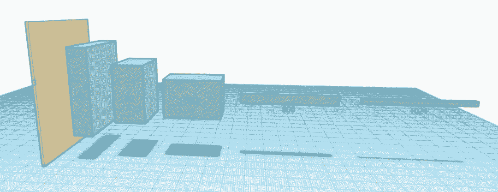

调参过程更重实践而非理论。我们逐渐添加层和节点，可以与模型过拟合，因为我们可以用正则化方式再将其调低。重复该迭代过程直到准确率不再提升，不再值得训练、计算性能的降低。

但是，GPU 的内存是有限的。截止 2018 年初，高端显卡 NVIDIA GeForce GTX 1080 TI 的内存为 11GB。两个仿射层之间隐藏节点的最大数量受内存大小的限制。

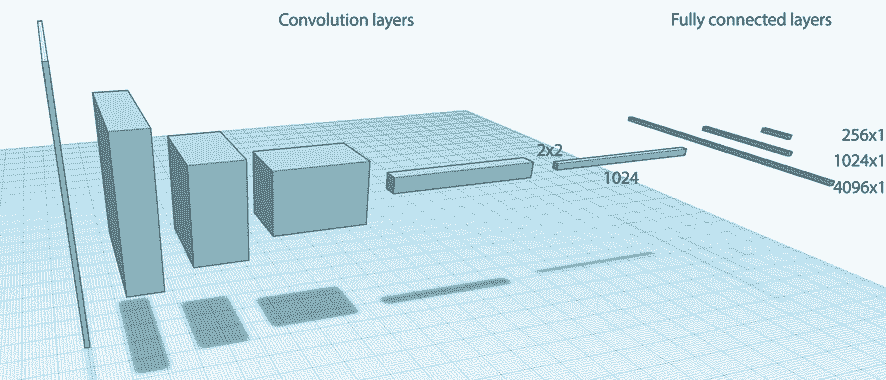

对于非常深层的网络，梯度消失问题很严重。我们可以添加跳跃连接（类似 ResNet 中的残差连接）来缓解该问题。

**模型 & 数据集设计变化**

以下是提升性能的检查列表：

*   在验证数据集中分析误差（糟糕的预测结果）；

*   监控激活函数。在激活函数不以零为中心或非正态分布时，考虑批归一化或层归一化；

*   监控无效节点的比例；

*   使用梯度截断（尤其是 NLP 任务中）来控制梯度爆炸问题；

*   Shuffle 数据集（手动或通过程序）；

*   平衡数据集（每个类别具备相似数量的样本）。

我们应该在激活函数之前密切监控激活直方图。如果它们的规模差别很大，那么梯度下降将会无效。使用归一化。如果深度网络有大量无效节点，那么我们应该进一步追踪该问题。它可能是由 bug、权重初始化或梯度消失导致的。如果都不是，则试验一些高级 ReLU 函数，如 leaky ReLU。

**数据集收集 & 清洗**

如果你想构建自己的数据集，那么最好的建议就是仔细研究如何收集样本。找最优质的资源，过滤掉与你问题无关的所有数据，分析误差。在我们的项目中，具备高度纠缠结构的图像性能非常糟糕。我们可以添加卷积层和小型滤波器来改变模型。但是模型已经很难训练了。我们可以添加更多纠缠样本做进一步训练，但是已经有了很多了……另一种方式：我们可以精细化项目范围，缩小样本范围。

**数据增强**

收集有标签的数据是一件昂贵的工作。对于图片来说，我们可以使用数据增强方法如旋转、随机剪裁、移位等方式来对已有数据进行修改，生成更多的数据。颜色失真则包括色调、饱和度和曝光偏移。


**半监督学习**

我们还可以使用无标注数据补充训练数据。使用模型分类数据。把具备高置信预测的样本添加到具备对应标签预测的训练数据集中。

**调整**

学习率调整

我们先简单回顾一下如何调整学习率。在早期开发阶段，我们关闭任意非关键超参数或设置为 0，包括正则化。在具备 Adam 优化器的情况下，默认学习率通常性能就很好了。如果我们对自己的代码很有信心，但是损失并没有下降，则需要调整学习率。典型的学习率在 1 和 1e-7 之间。每次把学习率降低 10%，并在简短迭代中进行测试，密切监控损失。如果它持续上升，那么学习率太高了。如果它没有下降，则学习率太低。提高学习率，直到损失提前变得平缓。


下面是一个真实样本，展示了学习率太高的情况，这导致成本突然上涨：


在不经常用的实践中，人们监控 W ratio 的更新情况：


*   如果 ratio > 1e-3，则考虑调低学习率；

*   如果 ratio < 1e-3，则考虑提高学习率。

超参数调整

在模型设计稳定后，我们也可以进一步调整模型。最经常调整的超参数是：

*   mini-batch 尺寸；

*   学习率；

*   正则化因子；

*   特定层的超参数（如 dropout）。

Mini-batch 尺寸

通常的批尺寸是 8、16、32 或 64。如果批尺寸太小，则梯度下降不会很顺畅，模型学习的速度慢，损失可能会振荡。如果批尺寸太大，则完成一次训练迭代（一轮更新）的时间太长，得到的返回结果较小。在我们的项目中，我们降低批尺寸，因为每次训练迭代时间太长。我们密切监控整个学习速度和损失。如果损失振荡剧烈，则我们会知道批尺寸降低的幅度太大了。批尺寸影响正则化因子等超参数。一旦我们确定好批尺寸，我们通常就锁定了值。

学习率 & 正则化因子

我们可以使用上述方法进一步调整学习率和正则化因子。我们监控损失，来控制学习率和验证与训练准确率之间的差距，从而调整正则化因子。我们没有把学习率降低 10%，而是降低 3%（精细调整中或许更小）。


调参不是线性过程。超参数是有关联的，我们将反复调整超参数。学习率和正则化因子高度相关，有时需要一起调。不要太早进行精细调整，有可能浪费时间。设计改变的话这些努力就白费了。

Dropout

Dropout 率通常在 20% 到 50% 之间。我们先从 20% 开始。如果模型出现过拟合，则提高值。

其他调整

*   稀疏度

*   激活函数

模型参数的稀疏度能使计算优化变得简单，并减少能耗（这对于移动设备来说至关重要）。如果需要，我们可以用 L1 正则化替代 L2 正则化。ReLU 是最流行的激活函数。对于一些深度学习竞赛，人们使用更高级的 ReLU 变体以提高准确率。在一些场景中它还可以减少无效节点。

高级调参

一些高级精细调参方法：

*   学习率衰减调度

*   动量（Momentum）

*   早停

我们没有使用固定的学习率，而是定期降低学习率。超参数包括学习率下降的频率和幅度。例如，你可以在每十万次迭代时减少 0.95 的学习率。要调整这些参数，我们需要监控成本，以确定参数下降地更快但又不至于过早平缓。

高级优化器使用动量使梯度下降过程流畅进行。Adam 优化器中存在两种动量设置，分别控制一阶（默认 0.9）和二阶（默认 0.999）动量。对于具备梯度陡降的问题领域如 NLP，我们可以稍稍提高动量值。

当验证误差持续上升时，过拟合可通过停止训练来缓解。

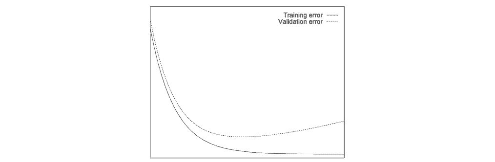

但是，这只是概念的可视化。实时误差可能暂时上升，然后再次下降。我们可以定期检查模型，记录对应的验证误差。稍后我们来选择模型。

**网格搜索**

一些超参数是高度相关的。我们应该使用对数尺度上的可能性网格一起调整它们。例如：对于两个超参数λ和γ，我们从相应的初始值开始，并在每个步骤中将其降低 10 倍：

*   （e-1, e-2, … and e-8）；

*   （e-3, e-4, … and e-6）。

相应的网格会是 [(e-1, e-3), (e-1, e-4), … , (e-8, e-5) 和 (e-8, e-6)]。

我们没有使用明确的交叉点，而是稍微随机移动了这些点。这种随机性可能会帮助我们发现一些隐藏的性质。如果最佳点位于网格的边界（蓝色点），我们则会在边界区域进行重新测试。


网格搜索的计算量很大。对于较小的项目，它们会被零星使用。我们开始用较少的迭代来调整粗粒度参数。在后期的细调阶段，我们会使用更长的迭代，并将数值调至 3（或更低）。

**模型集合**

在机器学习中，我们可以从决策树中投票进行预测。这种方法非常有效，因为判断失误通常是有局部性质的：两个模型发生同一个错误的几率很小。在深度学习中，我们可以从随机猜测开始训练（提交一个没有明确设置的随机种子），优化模型也不是唯一的。我们可以使用验证数据集测试多次选出表现最佳的模型，也可以让多个模型进行内部投票，最终输出预测结果。这种方式需要进行多个会话，肯定非常耗费系统资源。我们也可以训练一次，检查多个模型，随后在这个过程中选出表现最佳的模型。通过集合模型，我们可以基于这些进行准确的预测：

*   每个模型预测的「投票」；

*   基于预测置信度进行加权投票。

模型集合在提高一些问题的预测准确率上非常有效，经常会被深度学习数据竞赛的队伍所采用。

**模型提升**

在微调模型以外，我们也可以尝试使用模型的不同变体来提升性能。例如，我们可以考虑使用色彩生成器部分或全部替代标准 LSTM。这种概念并不陌生：我们可以分步绘制图片。


直观地说，在图像生成任务中引入时间序列方法是有优势的，这种方法已经在 DRAW: A Recurrent Neural Network For Image Generation 中被证明过了。

微调与模型提升

性能重大提升的背后往往是模型设计的改变。不过有些时候对模型进行微调也可以提升机器学习的性能。最终的判断可能会取决于你对相应任务的基准测试结果。

**Kaggle**

在开发过程中，你或许会有一些简单的问题，如：我需要使用 Leak ReLU 吗？。有时候问题很简单，但你永远无法在任何地方找到答案。在一些论文中，你会看到 Leak ReLU 的优越性，但另一些项目的经验显示并没有性能提升。太多的项目，太多的变量都缺乏衡量多种可能性的验证结果。Kaggle 是一个数据科学竞赛的开放平台，其中深度学习是很重要的一部分。深入观察一些优秀选手的方法，你或许就可以找到最为普遍的性能指标了。而且，一些数据竞赛团队还会把自己的代码（被称为 kernel）上传开源。只要留心探索，Kaggle 会是一个很棒的信息源。

**实验框架**

深度学习开发需要依赖大量经验，调节超参数是一件非常乏味的工作。创建一个实验框架可以加速这一过程。例如：一些人会开发代码将模型定义外化为字符串以便调节。然而这些努力通常不能为小团队带来收益。以我的经验，这样做的话代码的简洁性和可追溯性损失会远比受益要大，这意味着难以对代码进行简单的修改。易于阅读的代码必然有着简洁和灵活的特性。与此相反，很多 AI 云产品已经开始提供自动调节超参数的特性。虽然目前这种技术仍处于初始阶段，但无需人类自己编写框架的流程应该是大势所趋，请时刻注意这一趋势。

**结论**

现在，你已拥有了调整完毕的模型，可以正式部署了。希望这个系列教程对你有所帮助。深度学习可以帮助我们解决很多问题——其适用范围超出你的想象。想使用深度学习代替前端设计？你可以尝试一下 pix2code！

*原文链接：*

*   *https://medium.com/@jonathan_hui/how-to-start-a-deep-learning-project-d9e1db90fa72*

*   *https://medium.com/@jonathan_hui/build-a-deep-learning-dataset-part-2-a6837ffa2d9e*

*   *https://medium.com/@jonathan_hui/deep-learning-designs-part-3-e0b15ef09ccc*

*   *https://medium.com/@jonathan_hui/visualize-deep-network-models-and-metrics-part-4-9500fe06e3d0*

*   *https://medium.com/@jonathan_hui/debug-a-deep-learning-network-part-5-1123c20f960d*

*   *https://medium.com/@jonathan_hui/improve-deep-learning-models-performance-network-tuning-part-6-29bf90df6d2d*

 ******本文为机器之心编译，**转载请联系本公众号获得授权****。**

✄------------------------------------------------

**加入机器之心（全职记者/实习生）：hr@jiqizhixin.com**

**投稿或寻求报道：editor@jiqizhixin.com**

**广告&商务合作：bd@jiqizhixin.com****