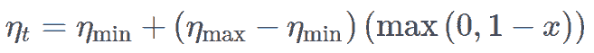
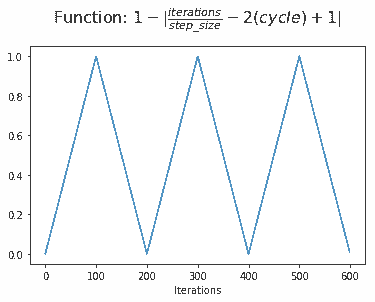
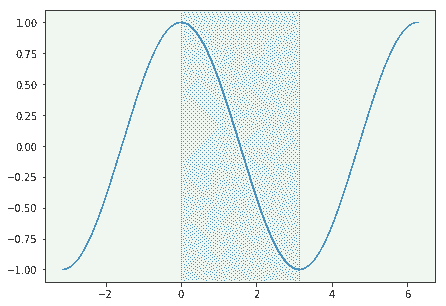

# 机器学习算法如何调参？这里有一份神经网络学习速率设置指南

作者：Jeremy Jordan

**机器之心编译**

**参与：黄小天、许迪**

> 每个机器学习的研究者都会面临调参过程的考验，而在调参过程中，学习速率（learning rate）的调整则又是非常重要的一部分。学习速率代表了神经网络中随时间推移，信息累积的速度。在理想情况下，我们会以很大的学习速率开始，逐渐减小速度，直至损失值不再发散。不过，说来容易做来难，本文作者对学习速率的调整思路进行了简要介绍，希望能够对你有所帮助。

在之前的文章里，我已经讲了如何用反向传播和梯度下降来训练神经网络。为了训练神经网络，其中一个需要设置的关键超参数是学习率。提醒一下，为了最小化此网络的损失函数，这个参数缩放了权重更新的幅度。

如果你把学习率设置太低，训练会进展的很慢：因为你在网络的权重上只做了很少的调整。然而，如果你的学习率被设置的太高，它可能在你的损失函数上带来不理想的后果。我已经可视化了这些案例——如果你发现这些图很难理解，我建议你事先参考一下（至少）我此前发布的关于梯度下降的第一部分。


所以，我们怎样找到最优学习速率呢？

让我们看看 Tesla AI 主管、李飞飞高徒 Andrej Karpathy 怎么说：


*推文：3e-4 是对 Adam 最好的学习速率，妥妥地~*

完美，我觉得我的工作完成了

好吧，并没有……


*第二条推：我想确认一下每个人都知道这是个玩笑吧……？*

神经网络的损失函数地图（loss landscape）（下图所示）是网络参数值的函数，当在特定数据集上执行推断（预测）时量化与使用特定参数配置相关的「误差」。这个损失地图可能对于很相似的网络架构也看起来很不同。下图来自论文《Visualizing the Loss Landscape of Neural Nets》，其中展示了残差连接可产生更平滑的拓扑结构。


最优学习率取决于你的损失地图的拓扑结构，也就是由你的模型结构和数据集。当你用默认的学习率（由你的深度学习库自动决定）可以提供一个差不多的结果，你也可以通过搜寻最优学习率来提高表现。我希望你在下一部分发现这很简单。

**一个找寻最优学习速率的系统化方法**

最终，我们希望得到一个学习率，极大地减少网路损失。我们可以在逐步提高每一次小批量（迭代）的学习速率的同时通过做一个简单实验来观察，记录每一次增量之后的损失。这个逐步的增长可以是线性或指数的。

对于太慢的学习速率来说，损失函数可能减小，但是按照非常浅薄的速率减小的。当进入了最优学习率区域，你将会观察到在损失函数上一次非常大的下降。进一步增加学习速率会造成损失函数值「跳来跳去」甚至在最低点附近发散。记住，最好的学习速率搭配着损失函数上最陡的下降，所以我们主要关注分析图的坡度。


你应该为这个实验设置你的学习率界限从而你能看到所有的三个阶段，确保识别最优范围。

**设置时间表以在训练中调整你的学习率**

另一个大家常用的技巧是学习速率退火（learning rate annealing），推荐大家先从一个比较高的学习速率开始然后慢慢地在训练中降低学习速率。这个方法背后的思想是我们喜欢快速地从初始参数移动到一个参数值「好」的范围，但这之后我们又想要一个学习速率小到我们可以发掘「损失函数上更深且窄的地方」，（来自 Karparthy 的 CS231n 课程笔记：http://cs231n.github.io/neural-networks-3/#annealing-the-learning-rate）。如果你很难想象我刚才所言，回想一下太高的学习速率可以造成参数更新会在最小值和随后的更新间「跳来跳去」，这点子会造成在极小值范围内持续的有噪声的收敛，或者在更极端的例子里可能造成从最小值发散出去。

学习速率退火的最流行方式是「步衰减」（Step Decay），其中学习率经过一定数量的训练 epochs 后下降了一定的百分比。


更常见的，我们可以创建一个学习速率时间表（learning rate schedule)，就是在训练期间根据特定规则来更新学习速率。

**周期性学习率**

在上述论文中《Cyclical Learning Rates for Training Neural Networks》中，Leslie Smith 提出了一种周期性学习率表，可在两个约束值之间变动。如下图所示，它是一个三角形更新规则，但他也提到如何使用这一规则与固定周期衰减或指数周期衰减相结合。


注意：在本文最后，我将给出实现这一学习率的代码。因此，如果你不关心数学公式的理解，可以跳过该部分。

我们可以将其写为：



其中 x 被定义为


并且 cycle 被计算为


其中η_min 和η_max 定义学习率的界限，iterations 表征已完成的小批量（mini-batches）的数量，stepsize 定义了一个周期长度的一半。据我所知，1−x 一直为正，因此看起来 max 操作并非绝对必要。

为了搞明白这一方程式如何工作，让我们逐步利用可视化构建它。对于下面的视觉效果，三个完整周期的三角形更新以 100 次迭代的步长显示。记住，一次迭代对应于一个小批量的训练。

最重要的是，我们可以在训练期间根据我们已完成的半个周期来确定「进程」。我们用半周期而不是全周期来衡量我们的进程，从而就可以在一个周期内实现对称（后面你会更加清晰认识到这点）。


接下来，我们把半周期进程与在当前周期完成时的半周期数量进行对比。当一个周期开始时，我们有两个半周期要完成；当一个周期结束时，该值达到零。


再接下来，我们将该值加 1，从而把函数移为以 y 轴为中心。现在我们参考半周期点展示一个周期内的进程。


在该点上，我们取绝对值以在每个周期内完成一个三角形。这就是我们分配给 x 的值。


但是，我们希望学习率表从最小值开始，在周期中间增加到最大值，然后再降低到最小值。我们可通过简单计算 1-x 来实现这一点。



通过把学习率范围的一部分添加到最小学习率（也称为基本学习率），现在我们有了一个可以调整学习率的值。

Smith 写到，周期性学习率背后的主要理论假设（与降低学习率相对反）是「增加学习率也许有一个短期的负面影响，但却获得了长期的正面影响」。确实，他的论文包含若干个损失函数演化的实例，与基准固定学习率相比，它们暂时偏离到较高的损失，并最终收敛到较低的损失。

为了直观理解这一短期影响如何带来长期的正面效果，重要的是理解我们收敛最小值的期望特征。最终，我们想要我们的网络以一种泛化到不可见数据的方式从数据中学习。进而，具备良好泛化能力的网络是应该是鲁棒的，参数的小变动并不会太大影响性能。考虑到这一点，尖锐的极小值导致很差的泛化能力也就合理了，正如参数值的小变动会导致巨大的较高损失。通过允许我们的学习率在次数上增加，我们可以「跳出」尖锐的极小值，虽然这会暂时增加损失，但可能最终收敛到更加理想的极小值。

注意：尽管「良好泛化的恰当极小值」已被广泛接受，但也存在很有力的反论（https://arxiv.org/abs/1703.04933）。

此外，增加学习率允许「更快速地穿越鞍点高原」。如下图所见，鞍点上梯度可以非常小。因为参数更新是一个梯度函数，这导致我们优化步骤非常短；在这里增加学习率可以避免在鞍点卡住太久，这很有用。


注意：根据定义，鞍点是一个临界点，其中一些维度观测局部极小值，另一些维度观测局部极大值。由于神经网路存在数千或数百万个参数，在所有维度上观测一个真正的局部极小值不太现实；这就是鞍点出现的意义。当我提到「尖锐的极小值」，实际上我们应该描画一个鞍点，其中极小值维度非常陡峭，极大值维度非常宽广（如下图所示）。


**带有热重启的随机梯度下降（SGDR）**

带有热重启的随机梯度下降（SGDR）与周期性方法很相似，其中一个积极的退火表与周期性「再启动」融合到原始的初始学习率之中。


我们可以将其写为


其中η_t 是时间步 t 上的学习率，（在每一个 mini batch 间增长）和定义理想学习率的范围，T_current 表征上次再启动之后 epoch 的数量，T_i 定义周期之中 epoch 的数量。让我们试着分解这个等式。

这个退火表依赖于余弦函数，其在-1 和 1 之间变化。能够取 0 到 1 之间的值，这是我们的余弦函数的输入。余弦函数的相应区域在下图用绿色突出显示。通过添加 1，我们的函数在 0 到 2 之间变化，然后缩小 1/2，现在在 0 到 1 之间变化。因此，我们简单地取极小值学习率，并添加指定学习率范围的一部分。由于这一函数从 1 开始并降为 0，结果是一个从特定范围的极大值开始并衰减为极小值的学习率。一旦我们的周期结束，T_current 重置为 0，我们从极大值学习率再开始循环这一过程。



作者也发现这个学习速率安排表可以适用于：

1.  当训练进行时延长周期

2.  在每一周期之后衰减  和

在每一次重启的时候彻底地提高学习速率，我们可以本质上的退出一个局部低点并且继续探索损失地图。

非常酷的主意：在每一轮循环后截图一下权重，研究员可以通过训练单个模型去建立一个全套模型。这是因为从一个周期到另一个周期，这个网络「沉淀」在不同的局部最优，像在下面图中画的一样。


**实现**

找寻最优学习速率的和设定一个学习速率安排表都可以简单的用 Keras 的回调函数中应用。

**寻找最优学习速率范围**

我们可以写一个 Keras 回调函数，就是追踪与一个在确定范围内变化的线性的学习速率相搭配的损失函数。

```py
1.  `from keras.callbacks import Callback`

2.  `import matplotlib.pyplot as plt`

 `*   `class LRFinder(Callback):`

 `*   `'''`

*   `A simple callback for finding the optimal learning rate range for your model + dataset.` 

 `*   `# Usage`

 `*   ````python`

*   `lr_finder = LRFinder(min_lr=1e-5, max_lr=1e-2, steps_per_epoch=10, epochs=3)`

*   `model.fit(X_train, Y_train, callbacks=[lr_finder])`

 `*   `lr_finder.plot_loss()`

*   ```py``

 `*   `# Arguments`

*   `min_lr: The lower bound of the learning rate range for the experiment.`

*   `max_lr: The upper bound of the learning rate range for the experiment.`

*   `steps_per_epoch: Number of mini-batches in the dataset.`

*   `epochs: Number of epochs to run experiment. Usually between 2 and 4 epochs is sufficient.` 

 `*   `# References`

 `*   `Blog post: jeremyjordan.me/nn-learning-rate`

*   `Original paper: https://arxiv.org/abs/1506.01186`

*   `'''`

 `*   `def __init__(self, min_lr=1e-5, max_lr=1e-2, steps_per_epoch=None, epochs=None):`

*   `super().__init__()`

 `*   `self.min_lr = min_lr`

*   `self.max_lr = max_lr`

*   `self.total_iterations = steps_per_epoch * epochs`

*   `self.iteration = 0`

*   `self.history = {}`

 `*   `def clr(self):`

*   `'''Calculate the learning rate.'''`

*   `x = self.iteration / self.total_iterations` 

*   `return self.min_lr + (self.max_lr-self.min_lr) * x`

 `*   `def on_train_begin(self, logs=None):`

*   `'''Initialize the learning rate to the minimum value at the start of training.'''`

*   `logs = logs or {}`

*   `K.set_value(self.model.optimizer.lr, self.min_lr)`

 `*   `def on_batch_end(self, epoch, logs=None):`

*   `'''Record previous batch statistics and update the learning rate.'''`

*   `logs = logs or {}`

*   `self.iteration += 1`

 `*   `K.set_value(self.model.optimizer.lr, self.clr())`

 `*   `self.history.setdefault('lr', []).append(K.get_value(self.model.optimizer.lr))`

*   `self.history.setdefault('iterations', []).append(self.iteration)`

 `*   `for k, v in logs.items():`

*   `self.history.setdefault(k, []).append(v)`

 `*   `def plot_lr(self):`

*   `'''Helper function to quickly inspect the learning rate schedule.'''`

*   `plt.plot(self.history['iterations'], self.history['lr'])`

*   `plt.yscale('log')`

*   `plt.xlabel('Iteration')`

*   `plt.ylabel('Learning rate')`

 `*   `def plot_loss(self):`

*   `'''Helper function to quickly observe the learning rate experiment results.'''`

*   `plt.plot(self.history['lr'], self.history['loss'])`

*   `plt.xscale('log')`

*   `plt.xlabel('Learning rate')`

*   `plt.ylabel('Loss')``````py```````py`````` 
```py

 ``**设置一个学习速率表**

**步衰减**

对于一个简单的步衰减（step decay），我们可以用 LearningRateScheduler 回调。

```
1.  `import numpy as np`

2.  `from keras.callbacks import LearningRateScheduler`

 `*   `def step_decay_schedule(initial_lr=1e-3, decay_factor=0.75, step_size=10):`

*   `'''`

*   `Wrapper function to create a LearningRateScheduler with step decay schedule.`

*   `'''`

*   `def schedule(epoch):`

*   `return initial_lr * (decay_factor ** np.floor(epoch/step_size))`

 `*   `return LearningRateScheduler(schedule)`

 `*   `lr_sched = step_decay_schedule(initial_lr=1e-4, decay_factor=0.75, step_size=2)`

 `*   `model.fit(X_train, Y_train, callbacks=[lr_sched])```py`` 
```

 ``**周期性学习速率**

要应用周期性学习速率技巧，我们可以参考这个 repo（https://github.com/bckenstler/CLR），其已在论文中实现了该技术。实际上这个 repo 已在论文附录中被引用。

**带有重启的随机梯度下降**

要应用这个 SGDR 技巧，我们可以参考：https://github.com/keras-team/keras/pull/3525/files 

*原文链接：https://www.jeremyjordan.me/nn-learning-rate/*

****本文为机器之心编译，**转载请联系本公众号获得授权****。**

✄------------------------------------------------

**加入机器之心（全职记者/实习生）：hr@jiqizhixin.com**

**投稿或寻求报道：editor@jiqizhixin.com**

**广告&商务合作：bd@jiqizhixin.com**````