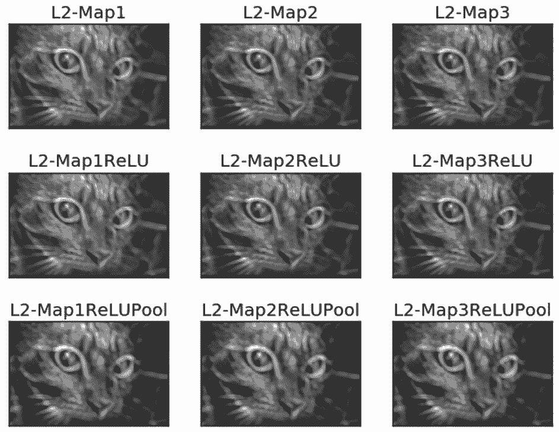

# 教程 | 如何使用纯 NumPy 代码从头实现简单的卷积神经网络

选自 KDnuggets

**作者：****Ahmed Gad**

**机器之心编译**

**参与：张倩、思源**

> 我们常使用深度学习框架构建强大的卷积神经网络，这些框架不仅能轻松调用卷积运算，同时还以矩阵乘法的方式大大提升了并行计算效率。但仅使用 NumPy 库创建 CNN 也许是理解这种网络的更好方法，本文就使用纯 NumPy 代码构建卷积层、ReLU 层和最大池化层等。

在某些情况下，使用 ML/DL 库中已经存在的模型可能会很便捷。但为了更好地控制和理解模型，你应该自己去实现它们。本文展示了如何仅使用 NumPy 库来实现 CNN。

卷积神经网络（CNN）是分析图像等多维信号的当前最优技术。目前已有很多库可以实现 CNN，如 TensorFlow 和 Keras 等。这种库仅提供一个抽象的 API，因此可以大大降低开发难度，并避免实现的复杂性，不过使用这种库的开发人员无法接触到一些细节，这些细节可能在实践中很重要。

有时，数据科学家必须仔细查看这些细节才能提高性能。在这种情况下，最好自己亲手构建此类模型，这可以帮助你最大程度地控制网络。因此在本文中，我们将仅使用 NumPy 尝试创建 CNN。我们会创建三个层，即卷积层（简称 conv）、ReLU 层和最大池化层。所涉及的主要步骤如下：

1.  读取输入图像。

2.  准备滤波器。

3.  卷积层：使用滤波器对输入图像执行卷积操作。

4.  ReLU 层：将 ReLU 激活函数应用于特征图（卷积层的输出）。

5.  最大池化层：在 ReLU 层的输出上应用池化操作。

6.  堆叠卷积层、ReLU 层和最大池化层。

**1\. 读取输入图像**

以下代码读取 skimage Python 库中一个已有图像，并将其转换为灰度图。

```py
1\.  import skimage.data  
2\.  # Reading the image  
3\.  img = skimage.data.chelsea()  
4\.  # Converting the image into gray.  
5\.  img = skimage.color.rgb2gray(img)
```

读取图像是第一步，因为后续步骤取决于输入大小，下图为转换后的灰度图。


**2\. 准备滤波器**

以下代码为第一个卷积层（简称 l1）准备滤波器组：

```py
1\.  l1_filter = numpy.zeros((2,3,3)) 
```

根据滤波器的数量和每个滤波器的大小创建数组。我们有 2 个大小为 3*3 的滤波器，因此数组大小为 (2=num_filters, 3=num_rows_filter, 3=num_columns_filter)。将滤波器的尺寸选择为没有深度的 2D 数组，因为输入图像是灰度图且深度为 1。如果图像是具有 3 个通道的 RGB，则滤波器大小必须是（3, 3, 3=depth）。

滤波器组的大小由上述 0 数组指定，但不是由滤波器的实际值指定。可以按如下方式覆写这些值，以检测垂直和水平边缘。

```py
1\.  l1_filter[0, :, :] = numpy.array([[[-1, 0, 1],   
2\.                                     [-1, 0, 1],   
3\.                                     [-1, 0, 1]]])  
4\.  l1_filter[1, :, :] = numpy.array([[[1,   1,  1],   
5\.                                     [0,   0,  0],   
6\.                                     [-1, -1, -1]]]) 
```

**3\. 卷积层**

在准备好滤波器之后，下一步就是用它们对输入图像执行卷积操作。下面一行使用 conv 函数对图像执行卷积操作：

```py
1\.  l1_feature_map = conv(img, l1_filter) 
```

此类函数只接受两个参数，即图像和滤波器组，实现如下：

```py
1\.  def conv(img, conv_filter):  
2\.      if len(img.shape) > 2 or len(conv_filter.shape) > 3: # Check if number of image channels matches the filter depth.  
3\.          if img.shape[-1] != conv_filter.shape[-1]:  
4\.              print("Error: Number of channels in both image and filter must match.")  
5\.              sys.exit()  
6\.      if conv_filter.shape[1] != conv_filter.shape[2]: # Check if filter dimensions are equal.  
7\.          print('Error: Filter must be a square matrix. I.e. number of rows and columns must match.')  
8\.          sys.exit()  
9\.      if conv_filter.shape[1]%2==0: # Check if filter diemnsions are odd.  
10\.         print('Error: Filter must have an odd size. I.e. number of rows and columns must be odd.')  
11\.         sys.exit()  
12\.   
13\.     # An empty feature map to hold the output of convolving the filter(s) with the image.  
14\.     feature_maps = numpy.zeros((img.shape[0]-conv_filter.shape[1]+1,   
15\.                                 img.shape[1]-conv_filter.shape[1]+1,   
16\.                                 conv_filter.shape[0]))  
17\.   
18\.     # Convolving the image by the filter(s).  
19\.     for filter_num in range(conv_filter.shape[0]):  
20\.         print("Filter ", filter_num + 1)  
21\.         curr_filter = conv_filter[filter_num, :] # getting a filter from the bank.  
22\.         """  
23\.         Checking if there are mutliple channels for the single filter. 
24\.         If so, then each channel will convolve the image. 
25\.         The result of all convolutions are summed to return a single feature map. 
26\.         """  
27\.         if len(curr_filter.shape) > 2:  
28\.             conv_map = conv_(img[:, :, 0], curr_filter[:, :, 0]) # Array holding the sum of all feature maps.  
29\.             for ch_num in range(1, curr_filter.shape[-1]): # Convolving each channel with the image and summing the results.  
30\.                 conv_map = conv_map + conv_(img[:, :, ch_num],   
31\.                                   curr_filter[:, :, ch_num])  
32\.         else: # There is just a single channel in the filter.  
33\.             conv_map = conv_(img, curr_filter)  
34\.         feature_maps[:, :, filter_num] = conv_map # Holding feature map with the current filter.
35\.      return feature_maps # Returning all feature maps. 
```

该函数首先确保每个滤波器的深度等于图像通道的数量。在下面的代码中，外部的 if 语句将检查通道和滤波器是否有深度。如果有，则内部 if 语句检查它们是否相等，如果不匹配，脚本将退出。

```py
1\.  if len(img.shape) > 2 or len(conv_filter.shape) > 3: # Check if number of image channels matches the filter depth.  
2\.          if img.shape[-1] != conv_filter.shape[-1]:  
3\.              print("Error: Number of channels in both image and filter must match.")  
```

此外，滤波器的尺寸行数和列数是奇数且相等。使用以下两个 if 语句对其进行检查。如果不满足这些条件，脚本将退出。

```py
1\.  if conv_filter.shape[1] != conv_filter.shape[2]: # Check if filter dimensions are equal.  
2\.      print('Error: Filter must be a square matrix. I.e. number of rows and columns must match.')  
3\.      sys.exit()  
4\.  if conv_filter.shape[1]%2==0: # Check if filter diemnsions are odd.  
5\.      print('Error: Filter must have an odd size. I.e. number of rows and columns must be odd.')  
6\.      sys.exit()  
```

如果不满足上述所有的 if 语句，则表示滤波器的深度适合图像，且可应用卷积操作。滤波器对图像的卷积从初始化一个数组开始，通过根据以下代码指定其大小来保存卷积的输出（即特征图）：

```py
1\.  # An empty feature map to hold the output of convolving the filter(s) with the image.  
2\.  feature_maps = numpy.zeros((img.shape[0]-conv_filter.shape[1]+1,   
3\.                              img.shape[1]-conv_filter.shape[1]+1,   
4\.                              conv_filter.shape[0])) 
```

特征图大小将与上述代码中的（img_rows-filter_rows+1, image_columns-filter_columns+1, num_filters）值相等。请注意，滤波器组中的每个滤波器都有一个输出特征图。因此将滤波器组（conv_filter.shape[0]）中的滤波器数量将指定为第三个参数。

```py
1\.   # Convolving the image by the filter(s).  
2\.      for filter_num in range(conv_filter.shape[0]):  
3\.          print("Filter ", filter_num + 1)  
4\.          curr_filter = conv_filter[filter_num, :] # getting a filter from the bank.  
5\.          """  
6\.          Checking if there are mutliple channels for the single filter. 
7\.          If so, then each channel will convolve the image. 
8\.          The result of all convolutions are summed to return a single feature map. 
9\.          """  
10\.         if len(curr_filter.shape) > 2:  
11\.             conv_map = conv_(img[:, :, 0], curr_filter[:, :, 0]) # Array holding the sum of all feature maps.  
12\.             for ch_num in range(1, curr_filter.shape[-1]): # Convolving each channel with the image and summing the results.  
13\.                 conv_map = conv_map + conv_(img[:, :, ch_num],   
14\.                                   curr_filter[:, :, ch_num])  
15\.         else: # There is just a single channel in the filter.  
16\.             conv_map = conv_(img, curr_filter)  
17\.         feature_maps[:, :, filter_num] = conv_map # Holding feature map with the current filter.  
```

外部循环在滤波器组中的每个滤波器上进行迭代，并根据下面这行代码返回，以执行后续步骤：

```py
1\.  curr_filter = conv_filter[filter_num, :] # getting a filter from the bank.    
```

如果要卷积的图像通道数大于 1，则滤波器深度必须与通道数量相等。在这种情况下，卷积是通过将每个图像通道与其在滤波器中对应的通道进行卷积来完成的。最后的结果加起来就是输出特征图。如果图像只有一个通道，则卷积将非常容易。此类行为由 if-else 块决定：

```py
1\.  if len(curr_filter.shape) > 2:  
2\.       conv_map = conv_(img[:, :, 0], curr_filter[:, :, 0]) # Array holding the sum of all feature map 
3\.       for ch_num in range(1, curr_filter.shape[-1]): # Convolving each channel with the image and summing the results.  
4\.          conv_map = conv_map + conv_(img[:, :, ch_num],   
5\.                                    curr_filter[:, :, ch_num])  
6\.  else: # There is just a single channel in the filter.  
7\.      conv_map = conv_(img, curr_filter) 
```

你可能会注意到，卷积是由名为 conv_ 的函数实现的，该函数与 conv 函数不同。conv 函数仅接受输入图像和滤波器组，但本身不执行卷积操作，只负责将每组待卷积的输入-滤波器组传输到 conv_ 函数上。这只是为了使代码更易于调查。下面是 conv_ 函数的实现：

```py
1\.  def conv_(img, conv_filter):  
2\.      filter_size = conv_filter.shape[0]  
3\.      result = numpy.zeros((img.shape))  
4\.      #Looping through the image to apply the convolution operation.  
5\.      for r in numpy.uint16(numpy.arange(filter_size/2,   
6\.                            img.shape[0]-filter_size/2-2)):  
7\.          for c in numpy.uint16(numpy.arange(filter_size/2, img.shape[1]-filter_size/2-2)):  
8\.              #Getting the current region to get multiplied with the filter.  
9\.              curr_region = img[r:r+filter_size, c:c+filter_size]  
10\.             #Element-wise multipliplication between the current region and the filter.  
11\.             curr_result = curr_region * conv_filter  
12\.             conv_sum = numpy.sum(curr_result) #Summing the result of multiplication.  
13\.             result[r, c] = conv_sum #Saving the summation in the convolution layer feature map.  
14\.               
15\.     #Clipping the outliers of the result matrix.  
16\.     final_result = result[numpy.uint16(filter_size/2):result.shape[0]-numpy.uint16(filter_size/2),   
17\.                           numpy.uint16(filter_size/2):result.shape[1]-numpy.uint16(filter_size/2)]  
18\.     return final_result      
```

它在图像上迭代，并根据以下代码提取与滤波器大小相等的区域：

```py
1\.  curr_region = img[r:r+filter_size, c:c+filter_size]  
```

然后，它在区域和滤波器之间应用逐元素乘法，并根据以下代码对它们求和，以获取单个值作为输出：

```py
1\.  #Element-wise multipliplication between the current region and the filter.  
2\.  curr_result = curr_region * conv_filter  
3\.  conv_sum = numpy.sum(curr_result) #Summing the result of multiplication.  
4\.  result[r, c] = conv_sum #Saving the summation in the convolution layer feature map. 
```

在滤波器对输入图像执行卷积操作之后，特征图由 conv 函数返回。下图为此类卷积层返回的特征图。


卷积层的输出将被应用到 ReLU 层。

**4\. ReLU 层**

ReLU 层对卷积层返回的每个特征图应用 ReLU 激活函数。根据以下代码使用 relu 函数使用它：

```py
l1_feature_map_relu = relu(l1_feature_map)
```

relu 函数的实现方式如下：

```py
1\.  def relu(feature_map):  
2\.      #Preparing the output of the ReLU activation function.  
3\.      relu_out = numpy.zeros(feature_map.shape)  
4\.      for map_num in range(feature_map.shape[-1]):  
5\.          for r in numpy.arange(0,feature_map.shape[0]):  
6\.              for c in numpy.arange(0, feature_map.shape[1]):  
7\.                  relu_out[r, c, map_num] = numpy.max(feature_map[r, c, map_num], 0) 
```

这很简单。只要循环地将 ReLU 函数应用于特征图中的每个元素，并在特征图中的原始值大于 0 时将其返回。其他情况下返回 0。ReLU 层的输出如下图所示。


ReLU 层的输出将馈送到最大池化层。

**5\. 最大池化层**

最大池化层接受 ReLU 层的输出，并根据以下代码应用最大池化操作：

```py
1\.  l1_feature_map_relu_pool = pooling(l1_feature_map_relu, 2, 2) 
```

最大池化层使用 pooling 函数实现，如下所示：

```py
1\.  def pooling(feature_map, size=2, stride=2):  
2\.      #Preparing the output of the pooling operation.  
3\.      pool_out = numpy.zeros((numpy.uint16((feature_map.shape[0]-size+1)/stride),  
4\.                              numpy.uint16((feature_map.shape[1]-size+1)/stride),  
5\.                              feature_map.shape[-1]))  
6\.      for map_num in range(feature_map.shape[-1]):  
7\.          r2 = 0  
8\.          for r in numpy.arange(0,feature_map.shape[0]-size-1, stride):  
9\.              c2 = 0  
10\.             for c in numpy.arange(0, feature_map.shape[1]-size-1, stride):  
11\.                 pool_out[r2, c2, map_num] = numpy.max(feature_map[r:r+size,  c:c+size])  
12\.                 c2 = c2 + 1  
13\.             r2 = r2 +1  
```

该函数接受三个输入，即 ReLU 层的输出、池化掩码大小和步长。它只需创建一个空数组，如前所述，用于保存此类层的输出。此类数组的大小是根据大小和步长参数指定的，如以下代码所示：

```py
1\.  pool_out = numpy.zeros((numpy.uint16((feature_map.shape[0]-size+1)/stride),  
2\.                          numpy.uint16((feature_map.shape[1]-size+1)/stride),  
3\.                          feature_map.shape[-1]))  
```

然后，它会根据循环变量 map_num 和外部循环一个一个通道地处理图像。最大池操作将应用于输入中的每个通道。根据所使用的步长和大小裁剪区域，根据以下代码在输出数组中返回最大值：

```py
pool_out[r2, c2, map_num] = numpy.max(feature_map[r:r+size,  c:c+size])
```

这种池化层的输出如下图所示。请注意，池化层输出要小于其输入，即使它们在图形中看起来大小相同。


**6\. 层级的堆叠**

至此，具有卷积、ReLU 和最大池化层的 CNN 体系架构已经完成。除了前面提到的层以外，还可以堆叠其它层来加深网络。

```py
1\.  # Second conv layer  
2\.  l2_filter = numpy.random.rand(3, 5, 5, l1_feature_map_relu_pool.shape[-1])  
3\.  print("\n**Working with conv layer 2**")  
4\.  l2_feature_map = conv(l1_feature_map_relu_pool, l2_filter)  
5\.  print("\n**ReLU**")  
6\.  l2_feature_map_relu = relu(l2_feature_map)  
7\.  print("\n**Pooling**")  
8\.  l2_feature_map_relu_pool = pooling(l2_feature_map_relu, 2, 2)  
9\.  print("**End of conv layer 2**\n")  
```

前一卷积层使用 3 个滤波器，其值随机生成。因此，这种卷积层会带来 3 个特征图。后面的 ReLU 层和池化层也是如此，这些层的输出如下所示：



```py
1\.  # Third conv layer  
2\.  l3_filter = numpy.random.rand(1, 7, 7, l2_feature_map_relu_pool.shape[-1])  
3\.  print("\n**Working with conv layer 3**")  
4\.  l3_feature_map = conv(l2_feature_map_relu_pool, l3_filter)  
5\.  print("\n**ReLU**")  
6\.  l3_feature_map_relu = relu(l3_feature_map)  
7\.  print("\n**Pooling**")  
8\.  l3_feature_map_relu_pool = pooling(l3_feature_map_relu, 2, 2)  
9\.  print("**End of conv layer 3**\n")  
```

下图显示了前几层的输出。前一卷积层仅使用一个滤波器，因此只有一个特征图作为输出。


但是请记住，前面每一层的输出是下一层的输入，例如以下代码接受先前的输出作为它们的输入。

```py
1\.  l2_feature_map = conv(l1_feature_map_relu_pool, l2_filter)  
2\.  l3_feature_map = conv(l2_feature_map_relu_pool, l3_filter)
```

**7\. 完整代码**

完整代码地址：https://github.com/ahmedfgad/NumPyCNN

该代码包含使用 Matplotlib 库可视化每个图层的输出。

原文链接：https://www.kdnuggets.com/2018/04/building-convolutional-neural-network-numpy-scratch.html

****本文为机器之心编译，**转载请联系本公众号获得授权****。**

✄------------------------------------------------

**加入机器之心（全职记者/实习生）：hr@jiqizhixin.com**

**投稿或寻求报道：**content**@jiqizhixin.com**

**广告&商务合作：bd@jiqizhixin.com**