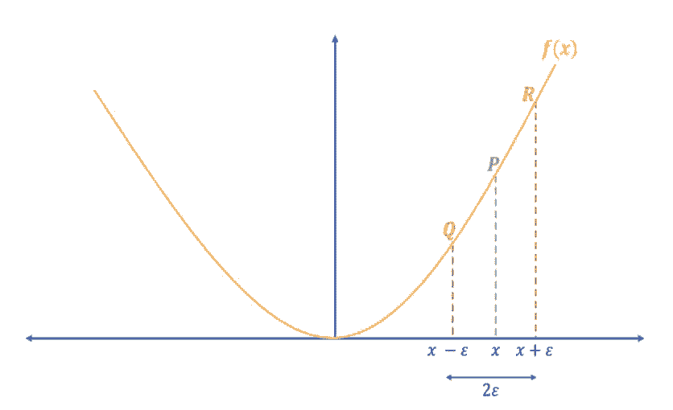
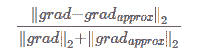

# 入门 | 如何通过梯度检验帮助实现反向传播

选自 imaddabbura

**机器之心编译**

**参与：刘天赐、路**

> 本文介绍了如何使用梯度检验方法确认反向传播代码是否准确。

在《Coding Neural Network - Forward Propagation and Backpropagation》一文中，我们借助 numpy 实现了前向传播和反向传播算法。但从头开始实现反向传播很容易遇到 bug 或者报错。因此，在训练数据上运行神经网络之前，必须检验反向传播的实现是否正确。不过首先，我们先复习一下反向传播的概念：从最后的节点开始，沿着拓扑排序的反方向遍历所有节点，计算每个边的尾节点相对于损失函数的导数。换言之，计算损失函数对所有参数的导数：∂J/∂θ，其中θ表示模型中的参数。

我们通过计算数值梯度并比较数值梯度和根据反向传播求出的梯度（解析梯度）间的差异，来测试我们的实现代码。这里有两种数值梯度的计算方法：

*   右边形式：

*   (1) [J(θ+ϵ)−J(θ)]/ϵ

*   双边形式（见图 2）：

*   (2) [J(θ+ϵ)−J(θ−ϵ)]/2ϵ



*图 2：双边数值梯度*

逼近导数的双边形式比右边形式更接近真实值。我们以 f(x)=x² 为例，在 x=3 处计算导数。

*   解析导数：∇_xf(x)=2x ⇒∇_xf(3)=6

*   双边数值导数：[(3+1e−2)²−(3−1e−2)²]/[2∗1e−2]=5.999999999999872

*   右边数值导数：[(3+1e−2)²−3²]/[1e−2]=6.009999999999849

可以看到，解析梯度和双边数值梯度之间的差值几乎为零；而和右边形式的数值梯度之间的差值为 0.01。因此在下文中，我们使用双边形式计算数值梯度。

另外，我们使用下式对数值梯度和解析梯度间的差值进行标准化。

(3)

如果差值≤10^−7，可以认为反向传播的实现代码没有问题；否则，就需要回去检查代码，因为一定有什么地方出错了。

以下是完成梯度检验的步骤：

1\. 随机从训练集中抽取一些样本，用来计算数值梯度和解析梯度（不要使用所有训练样本，因为梯度检验运行会很慢）。

2\. 初始化参数。

3\. 计算前向传播和交叉熵损失。

4\. 利用写好的反向传播的实现代码计算梯度（解析梯度）。

5\. 计算双边形式的数值梯度。

6\. 计算数值梯度和解析解梯度的差值。

这里，我们使用《Coding Neural Network - Forward Propagation and Backpropagation》中所写的函数来实现参数初始化、前向传播、反向传播以及交叉熵损失的计算。

导入数据。

```py
# Loading packages
import sys

import h5py
import matplotlib.pyplot as plt
import numpy as np
from numpy.linalg import norm
import seaborn as sns

sys.path.append("../scripts/")
from coding_neural_network_from_scratch import (initialize_parameters,
                                                L_model_forward,
                                                L_model_backward,
                                                compute_cost)
# Import the data
train_dataset = h5py.File("../data/train_catvnoncat.h5")
X_train = np.array(train_dataset["train_set_x"]).T
y_train = np.array(train_dataset["train_set_y"]).T
X_train = X_train.reshape(-1, 209)
y_train = y_train.reshape(-1, 209)

X_train.shape, y_train.shape
((12288, 209), (1, 209)) 
```

编写 helper 函数，帮助实现参数和梯度词典（gradients dictionary）到向量的相互转换。

```py
def dictionary_to_vector(params_dict):"""
    Roll a dictionary into a single vector.

    Arguments
    ---------
    params_dict : dict
        learned parameters.

    Returns
    -------
    params_vector : array
        vector of all parameters concatenated.
    """count = 0for key in params_dict.keys():new_vector = np.reshape(params_dict[key], (-1, 1))if count == 0:theta_vector = new_vectorelse:theta_vector = np.concatenate((theta_vector, new_vector))count += 1return theta_vectordef vector_to_dictionary(vector, layers_dims):"""
    Unroll parameters vector to dictionary using layers dimensions.

    Arguments
    ---------
    vector : array
        parameters vector.
    layers_dims : list or array_like
        dimensions of each layer in the network.

    Returns
    -------
    parameters : dict
        dictionary storing all parameters.
    """L = len(layers_dims)parameters = {}k = 0for l in range(1, L):# Create temp variable to store dimension used on each layerw_dim = layers_dims[l] * layers_dims[l - 1]b_dim = layers_dims[l]# Create temp var to be used in slicing parameters vectortemp_dim = k + w_dim# add parameters to the dictionaryparameters["W" + str(l)] = vector[k:temp_dim].reshape(layers_dims[l], layers_dims[l - 1])parameters["b" + str(l)] = vector[temp_dim:temp_dim + b_dim].reshape(b_dim, 1)k += w_dim + b_dimreturn parametersdef gradients_to_vector(gradients):"""
    Roll all gradients into a single vector containing only dW and db.

    Arguments
    ---------
    gradients : dict
        storing gradients of weights and biases for all layers: dA, dW, db.

    Returns
    -------
    new_grads : array
        vector of only dW and db gradients.
    """# Get the number of indices for the gradients to iterate overvalid_grads = [key for key in gradients.keys()if not key.startswith("dA")]L = len(valid_grads)// 2count = 0# Iterate over all gradients and append them to new_grads listfor l in range(1, L + 1):if count == 0:new_grads = gradients["dW" + str(l)].reshape(-1, 1)new_grads = np.concatenate((new_grads, gradients["db" + str(l)].reshape(-1, 1)))else:new_grads = np.concatenate((new_grads, gradients["dW" + str(l)].reshape(-1, 1)))new_grads = np.concatenate((new_grads, gradients["db" + str(l)].reshape(-1, 1)))count += 1return new_grads 
```

最后，编写梯度检验函数，利用此函数计算解析梯度和数值梯度之间的差值，并借此判断反向传播的实现代码是否正确。我们随机抽取 1 个样本来计算差值：

```py
def forward_prop_cost(X, parameters, Y, hidden_layers_activation_fn="tanh"):"""
    Implements the forward propagation and computes the cost.

    Arguments
    ---------
    X : 2d-array
        input data, shape: number of features x number of examples.
    parameters : dict
        parameters to use in forward prop.
    Y : array
        true "label", shape: 1 x number of examples.
    hidden_layers_activation_fn : str
        activation function to be used on hidden layers: "tanh", "relu".

    Returns
    -------
    cost : float
        cross-entropy cost.
    """# Compute forward propAL, _ = L_model_forward(X, parameters, hidden_layers_activation_fn)# Compute costcost = compute_cost(AL, Y)return costdef gradient_check(parameters, gradients, X, Y, layers_dims, epsilon=1e-7,hidden_layers_activation_fn="tanh"):"""
    Checks if back_prop computes correctly the gradient of the cost output by
    forward_prop.

    Arguments
    ---------
    parameters : dict
        storing all parameters to use in forward prop.
    gradients : dict
        gradients of weights and biases for all layers: dA, dW, db.
    X : 2d-array
        input data, shape: number of features x number of examples.
    Y : array
        true "label", shape: 1 x number of examples.
    epsilon : 
        tiny shift to the input to compute approximate gradient.
    layers_dims : list or array_like
        dimensions of each layer in the network.

    Returns
    -------
    difference : float
        difference between approx gradient and back_prop gradient
    """# Roll out parameters and gradients dictionariesparameters_vector = dictionary_to_vector(parameters)gradients_vector = gradients_to_vector(gradients)# Create vector of zeros to be used with epsilongrads_approx = np.zeros_like(parameters_vector)for i in range(len(parameters_vector)):# Compute cost of theta + epsilontheta_plus = np.copy(parameters_vector)theta_plus[i] = theta_plus[i] + epsilonj_plus = forward_prop_cost(X, vector_to_dictionary(theta_plus, layers_dims), Y,hidden_layers_activation_fn)# Compute cost of theta - epsilontheta_minus = np.copy(parameters_vector)theta_minus[i] = theta_minus[i] - epsilonj_minus = forward_prop_cost(X, vector_to_dictionary(theta_minus, layers_dims), Y,hidden_layers_activation_fn)# Compute numerical gradientsgrads_approx[i] = (j_plus - j_minus) / (2 * epsilon)# Compute the difference of numerical and analytical gradientsnumerator = norm(gradients_vector - grads_approx)denominator = norm(grads_approx) + norm(gradients_vector)difference = numerator / denominatorif difference > 10e-7:print ("\033[31mThere is a mistake in back-propagation " +\
               "implementation. The difference is: {}".format(difference))else:print ("\033[32mThere implementation of back-propagation is fine! "+\
               "The difference is: {}".format(difference))return difference 
```

```py
# Set up neural network architecture
layers_dims = [X_train.shape[0], 5, 5, 1]

# Initialize parameters
parameters = initialize_parameters(layers_dims)

# Randomly selecting 1 example from training data
perms = np.random.permutation(X_train.shape[1])
index = perms[:1]

# Compute forward propagation
AL, caches = L_model_forward(X_train[:, index], parameters, "tanh")

# Compute analytical gradients
gradients = L_model_backward(AL, y_train[:, index], caches, "tanh")

# Compute difference of numerical and analytical gradients
difference = gradient_check(parameters, gradients, X_train[:, index], y_train[:, index], layers_dims) 
```

反向传播的实现是 OK 的！这里的差值是 3.0220555297630148e-09

**结论**

以下是一些关键点：

*   双边形式的数值梯度在逼近解析梯度时效果比单边形式的数值梯度更好。

*   由于梯度检验的运行很慢，因此：

*   进行梯度检验时，只使用一个或少数样本；

*   在确认反向传播的实现代码无误后，训练神经网络时记得取消梯度检验函数的调用。

*   如果使用了 drop-out 策略，（直接进行）梯度检验会失效。可以在进行梯度检验时，将 keep-prob 设置为 1，训练神经网络时，再进行修改。

*   通常采用 e=10e-7 作为检查解析梯度和数值梯度间差值的基准。如果差值小于 10e-7，则反向传播的实现代码没有问题。

*   幸运的是，在诸如 TensorFlow、PyTorch 等深度学习框架中，我们几乎不需要自己实现反向传播，因为这些框架已经帮我们计算好梯度了；但是，在成为一个深度学习工作者之前，动手实现这些算法是很好的练习，可以帮助我们理解其中的原理。

源代码地址：https://github.com/ImadDabbura/blog-posts/blob/master/notebooks/Coding-Neural-Network-Gradient-Checking.ipynb

*原文链接：https://imaddabbura.github.io/blog/machine%20learning/deep%20learning/2018/04/08/coding-neural-network-gradient-checking.html*

****本文为机器之心编译，**转载请联系本公众号获得授权****。**

✄------------------------------------------------

**加入机器之心（全职记者/实习生）：hr@jiqizhixin.com**

**投稿或寻求报道：**content**@jiqizhixin.com**

**广告&商务合作：bd@jiqizhixin.com**