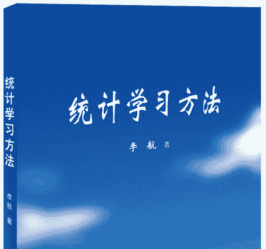
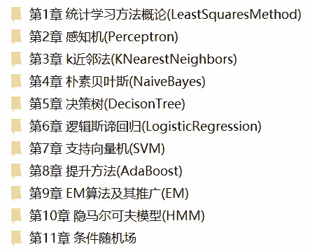
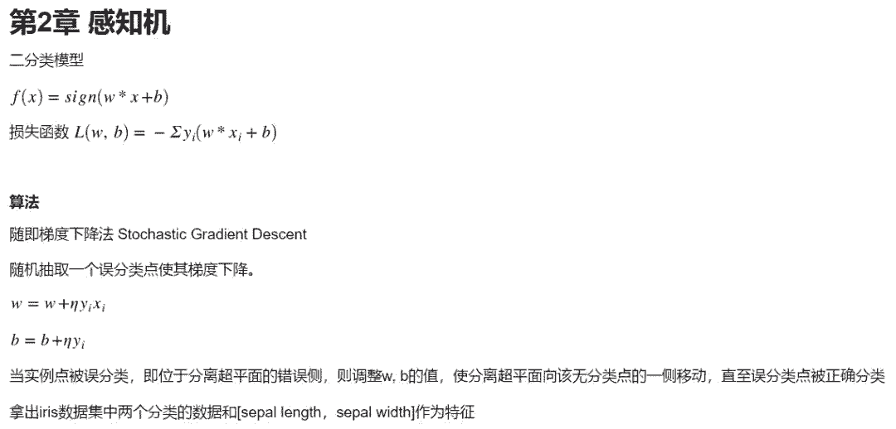
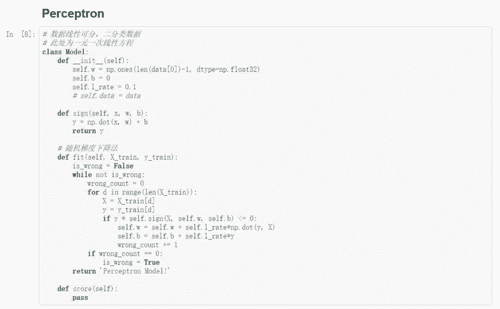
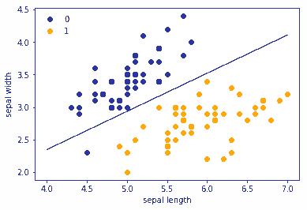
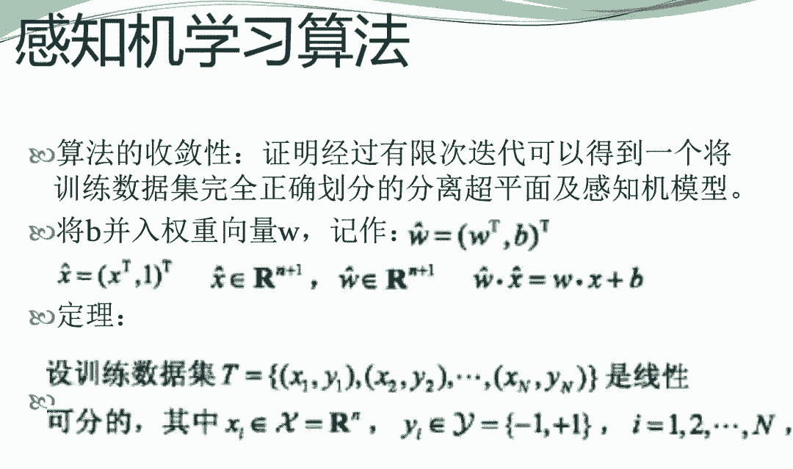
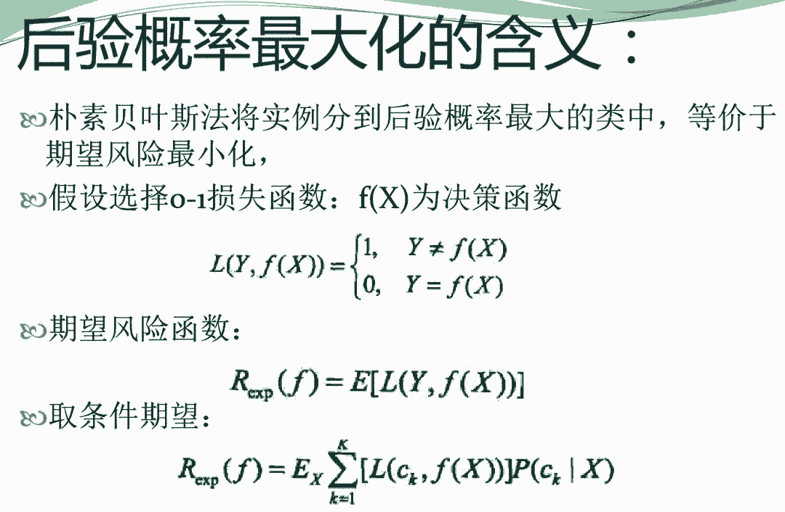
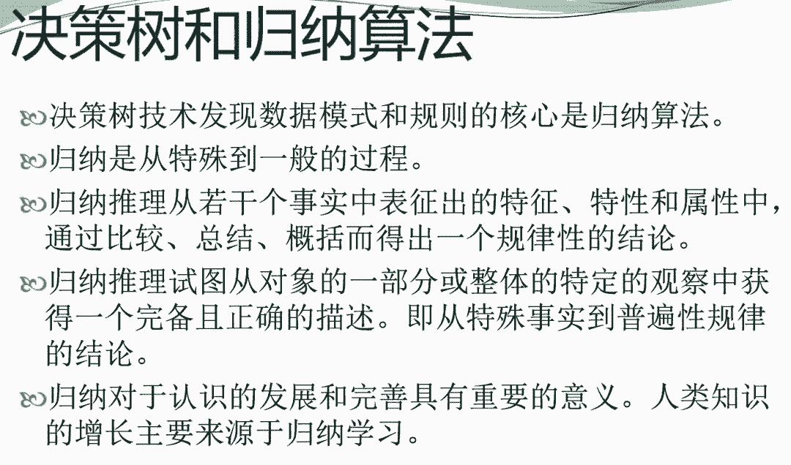

# 资源 | 《统计学习方法》的 Python 3.6 复现，实测可用

选自 Github

**作者：黄海广**

> 《统计学习方法》可以说是机器学习的入门宝典，许多机器学习培训班、互联网企业的面试、笔试题目，很多都参考这本书。机器之心近期发现了一个 GitHub 项目，其用 Python 复现了课程内容，并提供这本书的代码实现和课件。实现代码的配置环境是 Python 3.6，已经全部测试通过。

项目地址：https://github.com/fengdu78/lihang-code

《统计学习方法》，作者李航，本书全面系统地介绍了统计学习的主要方法，特别是监督学习方法，包括感知机、k 近邻法、朴素贝叶斯法、决策树、逻辑斯谛回归与支持向量机、提升方法、EM 算法、隐马尔可夫模型和条件随机场等。除第一章概论和最后一章总结外，每章介绍一种方法。叙述从具体问题或实例入手，由浅入深，阐明思路，给出必要的数学推导，便于读者掌握统计学习方法的实质，学会运用。

**统计学习方法的代码实现**

《统计学习方法》官方没有提供代码实现，但是网上有许多机器学习爱好者尝试对每一章的内容进行了代码实现。作者在 GitHub 网站搜集了一些代码进行整理，并作了一定的修改，使用 Python3.6 实现了第 1-11 章的课程代码。

代码目录与截图：

**算法示例**

**《统计学习方法》课件**

作者袁春： 清华大学深圳研究生院，提供了全书 12 章的 PPT 课件。

*   课件下载：https://pan.baidu.com/s/1nzE4zkNiQM7QgHib60OTPA 

*   提取码：ofmw

