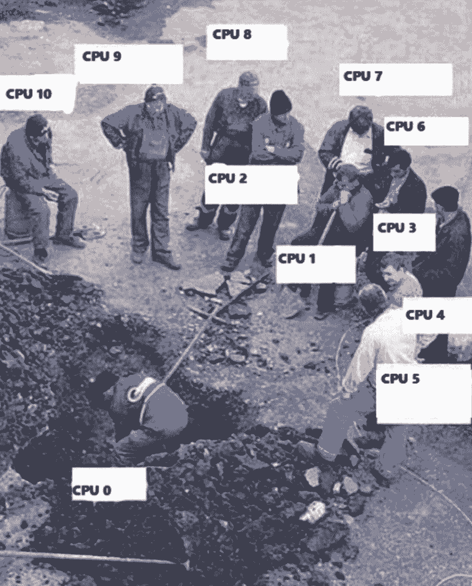

# 入门 | 三行 Python 代码，让数据预处理速度提高 2 到 6 倍

选自 TowardsDataScience

**作****者： ****George Seif**

**机器之心编译**

**参与****：张倩、李泽南**

> 在 Python 中，我们可以找到原生的并行化运算指令。本文可以教你仅使用 3 行代码，大大加快数据预处理的速度。


Python 是机器学习领域内的首选编程语言，它易于使用，也有很多出色的库来帮助你更快处理数据。但当我们面临大量数据时，一些问题就会显现……

目前，大数据（Big Data）这个术语通常用于表示包含数十万数据点的数据集。在这样的尺度上，工作进程中加入任何额外的计算都需要时刻注意保持效率。在设计机器学习系统时，数据预处理非常重要——在这里，我们必须对所有数据点使用某种操作。

在默认情况下，Python 程序是单个进程，使用单 CPU 核心执行。而大多数当代机器学习硬件都至少搭载了双核处理器。这意味着如果没有进行优化，在数据预处理的时候会出现「一核有难九核围观」的情况——超过 50% 的算力都会被浪费。在当前四核处理器（英特尔酷睿 i5）和 6 核处理器（英特尔酷睿 i7）大行其道的时候，这种情况会变得更加明显。



幸运的是，Python 库中内建了一些隐藏的特性，可以让我们充分利用所有 CPU 核心的能力。通过使用 Python 的 concurrent.futures 模块，我们只需要 3 行代码就可以让一个普通的程序转换成适用于多核处理器并行处理的程序。

**标准方法**

让我们举一个简单的例子，在单个文件夹中有一个图片数据集，其中有数万张图片。在这里，我们决定使用 1000 张。我们希望在所有图片被传递到深度神经网络之前将其调整为 600×600 像素分辨率的形式。以下是你经常会在 GitHub 上看到的标准 Python 代码：

```py
import glob
import os
import cv2

### Loop through all jpg files in the current folder 
### Resize each one to size 600x600
for image_filename in glob.glob("*-fs8.png"):
 ### Read in the image data
 img = cv2.imread(image_filename)

 ### Resize the image
 img = cv2.resize(img, (600, 600)) 
```

上面的程序遵循你在处理数据脚本时经常看到的简单模式：

1\. 首先从需要处理内容的文件（或其他数据）列表开始。

2\. 使用 for 循环逐个处理每个数据，然后在每个循环迭代上运行预处理。

让我们在一个包含 1000 个 jpeg 文件的文件夹上测试这个程序，看看运行它需要多久：

```py
time python standard_res_conversion.py 
```

在我的酷睿 i7-8700k 6 核 CPU 上，运行时间为 7.9864 秒！在这样的高端 CPU 上，这种速度看起来是难以让人接受的，看看我们能做点什么。

**更快的方法**

为了便于理解并行化的提升，假设我们需要执行相同的任务，比如将 1000 个钉子钉入木头，假如钉入一个需要一秒，一个人就需要 1000 秒来完成任务。四个人组队就只需要 250 秒。

在我们这个包含 1000 个图像的例子中，可以让 Python 做类似的工作：

*   将 jpeg 文件列表分成 4 个小组；

*   运行 Python 解释器中的 4 个独立实例；

*   让 Python 的每个实例处理 4 个数据小组中的一个；

*   结合四个处理过程得到的结果得出最终结果列表。

这一方法的重点在于，Python 帮我们处理了所有棘手的工作。我们只需告诉它我们想要运行哪个函数，要用多少 Python 实例，剩下的就交给它了！只需改变三行代码。实例：

```py
import glob
import os
import cv2
import concurrent.futures

def load_and_resize(image_filename):
 ### Read in the image data
 img = cv2.imread(image_filename)

 ### Resize the image
 img = cv2.resize(img, (600, 600)) 

### Create a pool of processes. By default, one is created for each CPU in your machine.
with concurrent.futures.ProcessPoolExecutor() as executor:
 ### Get a list of files to process
 image_files = glob.glob("*-fs8.png")

 ### Process the list of files, but split the work across the process pool to use all CPUs
 ### Loop through all jpg files in the current folder 
 ### Resize each one to size 600x600
 executor.map(load_and_resize, image_files)
```

从以上代码中摘出一行：

```py
with concurrent.futures.ProcessPoolExecutor() as executor: 
```

你的 CPU 核越多，启动的 Python 进程越多，我的 CPU 有 6 个核。实际处理代码如下：

```py
executor.map(load_and_resize, image_files) 
```

「executor.map()」将你想要运行的函数和列表作为输入，列表中的每个元素都是我们函数的单个输入。由于我们有 6 个核，我们将同时处理该列表中的 6 个项目！

如果再次用以下代码运行我们的程序：

```py
time python fast_res_conversion.py 
```

我们可以将运行时间降到 1.14265 秒，速度提升了近 6 倍！

注意：在生成更多 Python 进程及在它们之间整理数据时会有一些开销，所以速度提升并不总是这么明显。但是总的来说，速度提升还是非常可观的。

**它总是那么快吗？ **

如果你有一个数据列表要处理，而且在每个数据点上执行相似的运算，那么使用 Python 并行池是一个很好的选择。但有时这不是最佳解决方案。并行池处理的数据不会在任何可预测的顺序中进行处理。如果你对处理后的结果有特殊顺序要求，那么这个方法可能不适合你。

你处理的数据也必须是 Python 可以「炮制」的类型。所幸这些指定类别都很常见。以下来自 Python 官方文件：

*   None, True, 及 False

*   整数、浮点数、复数

*   字符串、字节、字节数组

*   只包含可挑选对象的元组、列表、集合和字典

*   在模块顶层定义的函数（使用 def ，而不是 lambda ）

*   在模块顶层定义的内置函数

*   在模块顶层定义的类

*   这种类的实例，其 __dict__ 或调用 __getstate__() 的结果是可选择的（参见「Pickling Class Instances」一节）。**

**原文链接：https://towardsdatascience.com/heres-how-you-can-get-a-2-6x-speed-up-on-your-data-pre-processing-with-python-847887e63be5**

****本文为机器之心编译，**转载请联系本公众号获得授权****。**

✄------------------------------------------------

**加入机器之心（全职记者 / 实习生）：hr@jiqizhixin.com**

**投稿或寻求报道：**content**@jiqizhixin.com**

**广告 & 商务合作：bd@jiqizhixin.com**