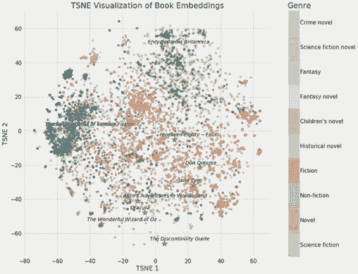
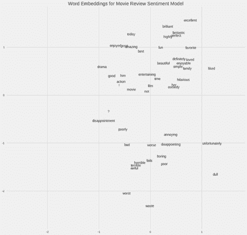
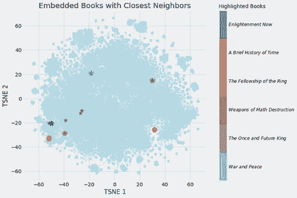
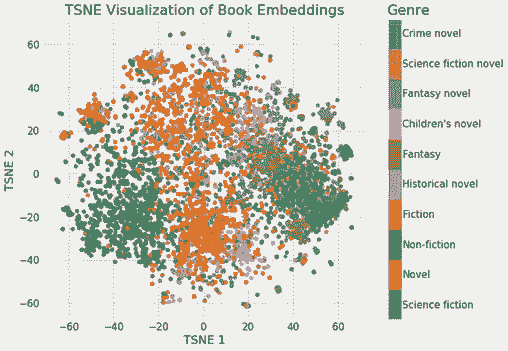
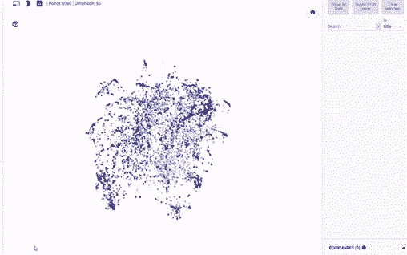

# 入门 | 神经网络词嵌入：如何将《战争与和平》表示成一个向量？

选自 Towards Data Science

**作者：****William Koehrsen**

**机器之心编译**

**参与：Panda**

> 深度学习可以怎样将《战争与和平》表示成一个向量？借助神经网络嵌入就能实现。神经网络嵌入是很多机器学习语言处理应用的基础性技术之一，Feature Labs 的数据科学家 William Koehrsen 通过一个基于维基百科的书籍推荐项目对词嵌入进行了介绍。

<mp-miniprogram class="miniprogram_element" data-miniprogram-appid="wxf424e2f3e2f94500" data-miniprogram-path="pages/technology/technology?id=2feeb7b3-2bea-4238-9c79-0d235ffc71cc&amp;from=weapp" data-miniprogram-nickname="机器之心 Synced" data-miniprogram-avatar="http://mmbiz.qpic.cn/mmbiz_png/f3g058loLBj0Pib4UhuCFagffSB1RHImwskFzvic6mSp2LDhuerbXxeqqv0b63wSt2Pas7MicNWIcia358rlnhiaVag/0?wx_fmt=png" data-miniprogram-title="词嵌入" data-miniprogram-imageurl="http://mmbiz.qpic.cn/mmbiz_jpg/KmXPKA19gW8ovwfyrWPCTqHeNOPpHBhzqgFUftwKuseUytibqxw9EtQuabgAp6uLe2q6iaTgKe7icic80p6Ok1dyzQ/0?wx_fmt=jpeg"></mp-miniprogram>

项目地址：https://github.com/WillKoehrsen/wikipedia-data-science/blob/master/notebooks/Book%20Recommendation%20System.ipynb


最近几年，神经网络的应用范围已经从图像分割显著扩展到了自然语言处理以及时间序列预测领域。深度学习一大显著成功的用途是嵌入（embedding），这是一种可用于将离散变量表示成连续向量的方法。这项技术的实际应用包括用于机器翻译的词嵌入和用于类别变量的实体嵌入。

在这篇文章中，我将解释神经网络嵌入的定义，我们使用它们的原因，以及它们的学习方式。我将在我正在研究的一个真实问题的背景中介绍这些概念：将维基百科上的所有书籍都表示成向量以创建一个书籍推荐系统。



维基百科上所有书籍的神经网络嵌入

**嵌入**

嵌入是离散的（类别化的）变量向连续数值向量的映射。在神经网络语境中，嵌入是离散变量的低维度的学习得到的连续向量表示。神经网络嵌入很有用，因为它们可以降低类别化变量的维度以及能够在变换后的空间中有意义地表示类别。

神经网络嵌入有三个主要用途：

1.  寻找嵌入空间中的最近邻。这可被用于基于用户兴趣或聚类类别来进行推荐；

2.  可作为机器学习模型的输入来学习监督式任务；

3.  可实现概念和类别之间的关系的可视化。

对于我们的书籍项目，这就意味着我们可以使用神经网络嵌入将维基百科上的 37000 篇书籍文章都各自表示成一个仅具有 50 个数字的向量。此外，因为嵌入是学习得到的，所以对于我们的学习问题而言，更相似的书籍在这个嵌入空间中具有更接近的位置。

神经网络嵌入能够克服常用的类别变量表示方法 one-hot 编码的两大局限。

**one-hot 编码的局限**

one-hot 编码的类别变量的操作实际上是一种简单的嵌入，其中每个类别都被映射成了不同的向量。其过程是将离散的实体的每个观察都映射成由一定数量的 0 和单个 1 构成的向量，这个 1 指示了特定的类别。

one-hot 编码技术具有两大主要缺陷：

1.  对于高基数变量（即有很多特有类别的变量），变换得到的向量的维度将难以掌控。

2.  这种映射方式信息完全不充分：「近似」的类别在嵌入空间中并不处于相近的位置。

第一个问题很容易理解：每增加一个类别（成为实体），我们都必须为 one-hot 编码的向量增加一个数。如果我们有维基百科上的 37000 本书，那么表示它们就将需要 37000 维的向量，基于这种表示方式训练任何机器学习模型都难以实现。

第二个问题具有同等的局限性：one-hot 编码并不会将相似的实体放在向量空间中相近的位置。如果使用余弦距离来衡量向量之间的相似性，那么在经过 one-hot 编码后，每一对比较的实体之间的相似度都是零。

这意味着，如果我们使用 one-hot 编码，《战争与和平》与《安娜·卡列尼娜》这样的实体（都是列夫·托尔斯泰的经典著作）不会比《战争与和平》与《银河系漫游指南》之间的距离更近。

```py
# One Hot Encoding Categoricals
books = ["War and Peace", "Anna Karenina", 
          "The Hitchhiker's Guide to the Galaxy"]
books_encoded = [[1, 0, 0],
                 [0, 1, 0],
                 [0, 0, 1]]
Similarity (dot product) between First and Second = 0
Similarity (dot product) between Second and Third = 0
Similarity (dot product) between First and Third = 0
```

考虑到这两个问题，则表示类别变量的理想方案是数字量比特有类别的数量更少，而且相似的类别能具有更近的距离。

```py
# Idealized Representation of Embedding
books = ["War and Peace", "Anna Karenina", 
          "The Hitchhiker's Guide to the Galaxy"]
books_encoded_ideal = [[0.53,  0.85],
                       [0.60,  0.80],
                       [-0.78, -0.62]]
Similarity (dot product) between First and Second = 0.99
Similarity (dot product) between Second and Third = -0.94
Similarity (dot product) between First and Third = -0.97
```

为了构建一种更好的类别实体表征，我们可以使用嵌入神经网络和学习嵌入的监督式网络。

**学习嵌入**

one-hot 编码的主要问题是其变换并不依赖于任何监督。通过在一个监督任务上使用神经网络来学习它们，我们可以对嵌入实现极大的提升。这些嵌入会构成网络的参数（权重），这些参数会得到调整以最小化在任务上的损失。所得到的嵌入向量是类别的表征，其中相似的任务（相对任务而言）的距离更近。

举个例子，如果我们有一个包含 50000 个词的电影评论汇集的词汇库，我们可以使用一个嵌入神经网络来为每个词学习 100 维的嵌入，训练目的是预测这些评论的情绪。（这个应用的详情请参阅：https://goo.gl/6rxG11）在这个词汇库中，「出色」和「很赞」这样积极的评论词会处于嵌入空间中更近的位置，因为网络已经学习到这些词都与积极评论相关。



电影情绪词嵌入

在上面提到的书籍案例中，我们的监督式任务会变成「识别一本书是否是列夫·托尔斯泰写的」，而由列夫·托尔斯泰写的书的嵌入会更近。找到如何创建监督式任务以得出相关表征的方法是嵌入设计中最困难的部分。

**实现**

在维基百科书籍项目中，监督学习任务的目标是预测给定维基百科页面的链接是否出现在了描述某本书的文章中。我们输入的数据是包含正例和负例的训练样本对（书籍题目，链接）。这种设置方式基于这样一个假设：链接到相似维基百科页面的书籍彼此更加相似。因此所得到的嵌入也应该在向量空间中将相似的数据放置在更相近的位置。

我使用的网络有两个并行的嵌入层，它们会将书籍和维基链接分别映射成 50 维的向量，另外还有一个点积层将这些嵌入结合成单个数值以供预测。这些嵌入是网络的参数，或者说权重，可以在训练过程中调整以最小化在该监督式任务上的损失。

用 Keras 代码表示就像是下面这样（看不懂代码也不要紧，可以直接跳过去看后面的图片）：

```py
# Both inputs are 1-dimensional
book = Input(name = 'book', shape = [1])
link = Input(name = 'link', shape = [1])

# Embedding the book (shape will be (None, 1, 50))
book_embedding = Embedding(name = 'book_embedding',
                           input_dim = len(book_index),
                           output_dim = embedding_size)(book)

# Embedding the link (shape will be (None, 1, 50))
link_embedding = Embedding(name = 'link_embedding',
                           input_dim = len(link_index),
                           output_dim = embedding_size)(link)

# Merge the layers with a dot product along the second axis (shape will be (None, 1, 1))
merged = Dot(name = 'dot_product', normalize = True, axes = 2)([book_embedding, link_embedding])

# Reshape to be a single number (shape will be (None, 1))
merged = Reshape(target_shape = [1])(merged)

# Output neuron
out = Dense(1, activation = 'sigmoid')(merged)
model = Model(inputs = [book, link], outputs = out)

# Minimize binary cross entropy
model.compile(optimizer = 'Adam', loss = 'binary_crossentropy', metrics = ['accuracy'])
```

尽管监督式机器学习任务的目标通常是训练一个模型来在新数据上进行预测，但在这个嵌入模型中，预测本身仅仅是实现最终目的的一种方式。我们想要的是嵌入权重，即作为连续向量的书籍和链接表示。

嵌入本身并不是那么有趣：它们都只是些数值的向量：


来自书籍推荐嵌入模型的嵌入示例

但是，这些嵌入也可被用于之前列出的三个目的；对于这个项目，我们主要感兴趣的是基于最近邻推荐书籍。为了计算相似度，我们取一个查询书籍，然后得出其向量与所有其它书籍的向量之间的点积。（如果我们的嵌入经过了归一化，那么这个点积就是向量之间的余弦距离，其范围从最不相似的 -1 到最相似的 +1。我们也可以使用欧几里德距离来衡量相似度。）

下面给出了我构建的书籍嵌入模型的输出结果：

```py
Books closest to War and Peace.
Book: War and Peace              Similarity: 1.0
Book: Anna Karenina              Similarity: 0.79
Book: The Master and Margarita   Similarity: 0.77
Book: Doctor Zhivago (novel)     Similarity: 0.76
Book: Dead Souls                 Similarity: 0.75
```

（一个向量与其自身的余弦相似度肯定是 1.0）。经过一定的降维之后，我们可以得到下面的图像：



与最近邻一起的嵌入书籍

我们可以清楚地看到学习嵌入的价值！现在，对于维基百科上的每一本书，我们都有一个 50 数字的表示，其中更相似的书籍也彼此更接近。

**嵌入可视化**

嵌入最值得关注的一大优势是它们可被用于概念的可视化，比如小说与非小说之间的相对性。这需要进一步的降维技术将维度降至二或三维。最流行的降维技术本身也是一种嵌入方法：t-分布随机近邻嵌入（TSNE）。

我们可以使用神经网络嵌入将维基百科上所有书籍的 37000 个原始维度映射成 50 维，然后再使用 TSNE 将其映射成二维。结果如下：


维基百科上所有 37000 本书的嵌入

（TSNE 是一种流形学习技术，也就是说它会试图将高维数据映射成更低维度的流形，这个过程中会创建一个嵌入来维持数据中的局部结构。这基本上只在可视化时使用，因为其输出是随机的，不支持转换成新数据。另一种正在迅猛发展的新方法是统一流形近似和投影/UMAP，它的速度要快得多，而且也支持转换成嵌入空间中的新数据。）

这些可视化本身并不非常有用，但如果我们根据不同的书籍类型给它加上颜色，就能看出一些见解了。



根据书籍类型上色后的嵌入

可以清楚看到，书籍根据各自不同的类型聚集在了一起。这并不完美，但仍然让人印象深刻，毕竟我们仅用 2 个数字就表示了维基百科上的所有书籍，而且这种表示方法还能展现出不同类型之间的差异。

这个书籍项目示例表明了神经网络嵌入的价值：我们能得到分类目标的向量表示，这个向量表示是低维的，并且相似的实体在嵌入空间中处于相近的位置。

**额外奖励：交互式可视化**

静态图表的问题是我们不能真正地探索数据以及研究变量之间的分组和关系。为了解决这个问题，TensorFlow 开发了 projector：https://projector.tensorflow.org/，这是一个让我们可以可视化嵌入并与之交互的在线应用。我后面会写一篇文章介绍使用这一工具的方法，但这里我们看看结果就好：



使用 projector 实现对书籍嵌入的交互式探索

**总结**

神经网络嵌入是学习到的离散数据的低维连续向量表示。这些嵌入克服了传统编码方法的局限，并可被用于寻找最近邻、作为另一个模型的输入以及可视化等目的。

尽管本文用一些学术术语谈到了很多深度学习概念，但神经网络嵌入很直观而且实现方法也相对简单。我确信任何人都可以学会深度学习，并且使用 Keras 这样的库来构建深度学习解决方案。嵌入是一种能有效处理离散变量的工具，是深度学习的一个很有价值的应用。

**资源**

*   谷歌的嵌入教程：https://developers.google.com/machine-learning/crash-course/embeddings/video-lecture

*   TensorFlow 的嵌入指南：https://www.tensorflow.org/guide/embedding

*   使用嵌入的书籍推荐系统：https://github.com/WillKoehrsen/wikipedia-data-science/blob/master/notebooks/Book%20Recommendation%20System.ipynb

*   Keras 词嵌入教程：https://machinelearningmastery.com/use-word-embedding-layers-deep-learning-keras/

原文链接：https://towardsdatascience.com/neural-network-embeddings-explained-4d028e6f0526

****本文为机器之心编译，**转载请联系本公众号获得授权****。**

✄------------------------------------------------

**加入机器之心（全职记者 / 实习生）：hr@jiqizhixin.com**

**投稿或寻求报道：**content**@jiqizhixin.com**

**广告 & 商务合作：bd@jiqizhixin.com**