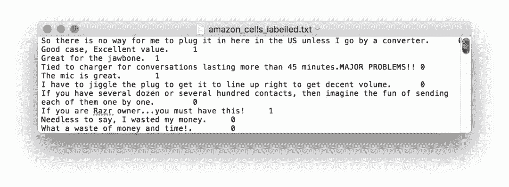
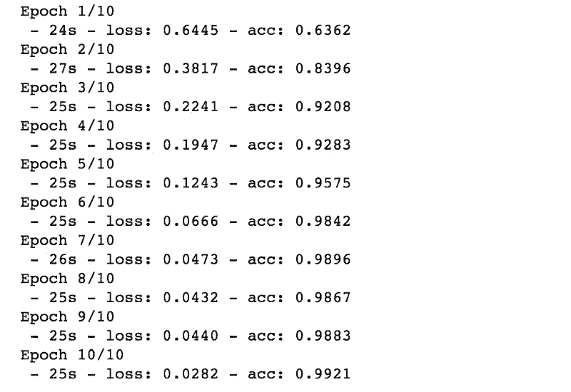
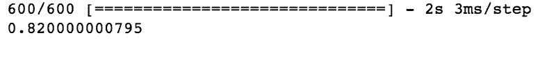

# 教程 | 如何用 50 行代码构建情感分类器

选自 Toward Data Science

**作者：****Rohith Gandhi**

****机器之心编译****

**参与：王淑婷、路**

> > 本文介绍了如何构建情感分类器，从介绍自然语言处理开始，一步一步讲述构建过程。
> 
> **自然语言处理简介**
> 
> 语言把人类联系在一起。语言是一种工具，它既可以让我们把想法和感受传达给另一个人，也能让我们理解别人的想法和感受。我们大多数人从 1 岁半到 2 岁开始说话。人脑是如何在如此年幼的时候掌握如此大量知识的，这仍是未解之谜。但是，人们已经发现大部分语言处理功能发生在大脑皮层内。
> 
> **情感分析背后的动机 **
> 
> 人类自己无法理解语言是如何被大脑处理的。那么，我们能教一台机器学习我们的语言吗？通过广泛研究，人们已经开发了许多方法来帮助机器理解语言。自然语言处理（NLP）是研究人类语言与计算机交互的领域。自然语言处理的一个子问题是情感分析，即把一个语句分类为积极或消极。把语句分类为积极或消极有什么用呢？以亚马逊网站为例。在亚马逊上，用户可以对一个产品发表评论，说明它是好是坏，甚至可以是中性的。然而，使用人工阅读所有评论并获得客户对产品的总体反馈既昂贵又耗时。再说说我们的机器学习模型。机器学习模型可以通过大量数据进行推断，对评论进行分类。利用这种机器学习模型，亚马逊可以通过客户评论改进其产品，从而为公司带来更多收入。
> 
> 情感分析并不像看起来那么简单。如果你认为含有「好的」、「很棒」等词的评论可归为积极评论，而含有「坏的」、「苦恼的」等词的评论可归为消极评论，那你需要三思。例如，「完全没有好味道」和「一份好的快餐，但没有什么特别的」分别代表消极和中立的反馈，即使都有「好」字。因此，这项任务可能没有看起来那么简单。接下来让我们看看即将使用的数据。
> 
> **数据集**
> 
> 我们将使用亚马逊产品评论、IMDB 电影评论和 Yelp 评论来构建情感分析模型。
> 
> 数据下载链接：https://www.kaggle.com/marklvl/sentiment-labelled-sentences-data-set/data
> 
> 所有数据都已经过注释，0 表示消极反馈，1 表示积极反馈。亚马逊的数据与下图相似。
> 
> 
> 
> **代码**
> 
> 我们可以写一些代码：
> 
> ```py
> with open("/Users/rohith/Documents/Datasets/sentiment_labelled_sentences/amazon_cells_labelled.txt") as f1:
>     lines = f1.readlines()
> 
> with open("/Users/rohith/Documents/Datasets/sentiment_labelled_sentences/imdb_labelled.txt") as f1:
>     temp = f1.readlines()
>     lines=lines+temp
> 
> with open("/Users/rohith/Documents/Datasets/sentiment_labelled_sentences/yelp_labelled.txt") as f1:
>     temp = f1.readlines()
>     lines=lines+temp
> ```
> 
> 数据存储于不同的文本文件中。我们打开每个文件并阅读所有的文本行，文本行还包括每个文本的标签。然后我们将其存储在一个名为「lines」的列表中。
> 
> ```py
> x = []
> y = []
> for value in lines:
>     temp = value.split('\t')
>     x.append(temp[0])
>     temp[1].replace('\n','')
>     y.append(int(temp[1]))
> ```
> 
> 数据集的每一行都包含文本，文本后是四个字符空间，还有该文本的标签（0 或 1）。因此，我们先将包含文本的第一部分添加到 features(x) 中，然后获取标签，标签的末尾有「\n」。所以标签被移除，然后添加到我们的标签列表 labels(y)。
> 
> ```py
> from keras.preprocessing.text import Tokenizer
> 
> tokenizer = Tokenizer(num_words=2500,split=' ')
> tokenizer.fit_on_texts(x)
> ```
> 
> Keras 有一个内置的 API，使得准备计算文本变得更容易。tokenizer 类共有 4 个属性，可用于特征准备。请看下面的示例，了解 tokenizer 的实际功能。
> 
> ```py
> ## CODE
> tokenizer = Tokenizer()
> texts = ["The sun is shining in June!","September is grey.","Life is beautiful in August.","I like it","This and other things?"]
> tokenizer.fit_on_texts(texts)
> print(tokenizer.word_index)
> tokenizer.texts_to_sequences(["June is beautiful and I like it!"])
> ## OUPUT
> {'sun': 3, 'september': 4, 'june': 5, 'other': 6, 'the': 7, 'and': 8, 'like': 9, 'in': 2, 'beautiful': 11, 'grey': 12, 'life': 17, 'it': 16, 'i': 14, 'is': 1, 'august': 15, 'things': 10, 'shining': 13, 'this': 18}
> [[5, 1, 11, 8, 14, 9, 16]]
> ```
> 
> tokenizer 为句子中的每个单词分配索引值，并且可以使用该索引值表示新句子。由于我们使用的文本语料库包含大量不同的单词，因此我们设置了一个上限，只使用最经常出现的 2500 个单词。
> 
> ```py
> from keras.preprocessing.sequence import pad_sequences
> 
> X = tokenizer.texts_to_sequences(x)
> X = pad_sequences(X)
> ```
> 
> 现在，我们将文本转换为如上所示的数字序列，并填充数字序列。因为句子可以有不同的长度，它们的序列长度也会不同。因此，pad_sequences 会找出最长的句子，并用 0 填充其他较短语句以匹配该长度。
> 
> ```py
> ## Pad Sequences Example
> pad_sequences([[1, 2, 3], [3, 4, 5, 6], [7, 8]])
> array([[0, 1, 2, 3],
>        [3, 4, 5, 6],
>        [0, 0, 7, 8]], dtype=int32)
> ```
> 
> ```py
> import numpy as np 
> from sklearn.model_selection import train_test_split
> 
> Y = []
> for val in y:
>     if(val == 0):
>         Y.append([1,0])
>     else:
>         Y.append([0,1])
> Y = np.array(Y)
> 
> x_train, x_test, y_train, y_test = train_test_split(X,Y,train_size=0.8)
> ```
> 
> 我们将标签转换为 one hot 编码，这有助于 LSTM 网络预测文本的标签。现在，我们已经准备好了文本数据，可以把它分为训练样本和测试样本。将 80% 的数据用于训练，20% 的数据用于测试模型。
> 
> ```py
> import keras 
> from keras.layers import Embedding, LSTM, Dense
> from keras.models import Sequential
> 
> model = Sequential()
> model.add(Embedding(2500,128,input_length=X.shape[1],dropout=0.2))
> model.add(LSTM(300, dropout_U=0.2,dropout_W=0.2))
> model.add(Dense(2,activation='softmax'))
> 
> model.compile(loss=keras.losses.categorical_crossentropy,optimizer='adam',metrics=['accuracy'])
> 
> model.fit(x_train,y_train,epochs=10,verbose=2,batch_size=32)
> 
> print(model.evaluate(x_test,y_test)[1])
> ```
> 
> 我们现在建立了模型，并对其进行编译、训练和测试。该模型具有嵌入层。输入序列是文本的稀疏表征，因为词汇表巨大，并且给定单词将由大向量表示。如果我们能够构建序列的某种密集表征，那么网络将更容易进行预测。2500 个单词的词嵌入/密集表征是通过嵌入层对模型进行训练获得的。然后，我们将 LSTM 和密集层添加到模型中。LSTM 单元负责进行上下文推断，并帮助预测句子是否积极。密集层输出每个类的概率。本文不详细介绍 LSTM，若想了解其更多信息，请参阅此博客：http://colah.github.io/posts/2015-08-Understanding-LSTMs/。
> 
> **输出**
> 
>  **
> 
> *训练*
> 
>  *
> 
> *测试*
> 
> 完成！你刚刚用 50 行代码构建了一个情感分类器～ 
> 
> 原文链接：https://towardsdatascience.com/sentiment-analysis-through-lstms-3d6f9506805c
> 
> ****本文为机器之心编译，**转载请联系本公众号获得授权****。**
> 
> ✄------------------------------------------------
> 
> **加入机器之心（全职记者 / 实习生）：hr@jiqizhixin.com**
> 
> **投稿或寻求报道：**content**@jiqizhixin.com**
> 
> **广告 & 商务合作：bd@jiqizhixin.com*****