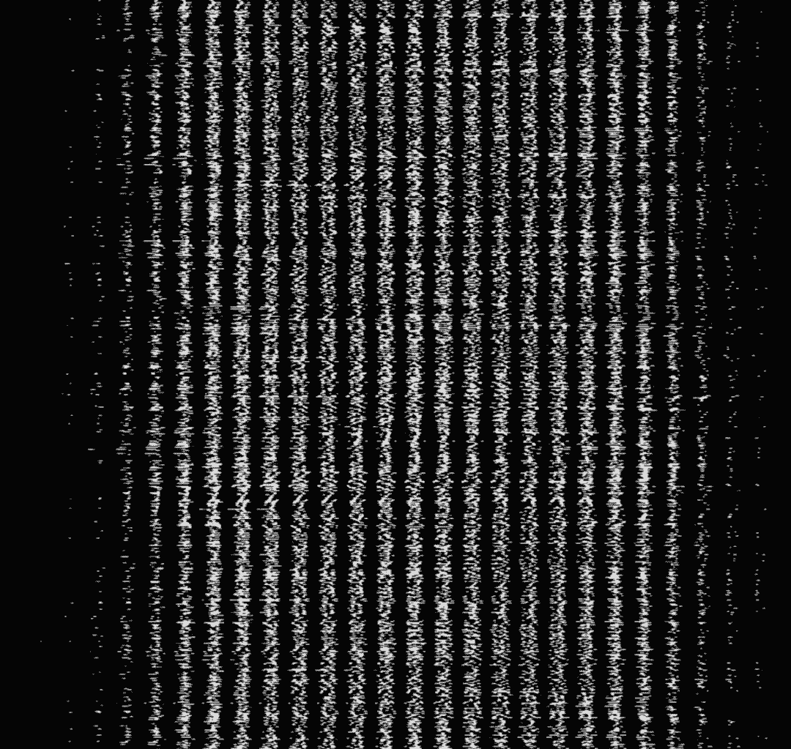

# 教程 | 如何在 Tensorflow.js 中处理 MNIST 图像数据

选自 freeCodeCamp

**作者：****Kevin Scott**

****机器之心编译****

**参与：李诗萌、路**

> 数据清理是数据科学和机器学习中的重要组成部分，本文介绍了如何在 Tensorflow.js（0.11.1）中处理 MNIST 图像数据，并逐行解释代码。

> 有人开玩笑说有 80% 的数据科学家在清理数据，剩下的 20% 在抱怨清理数据……在数据科学工作中，清理数据所占比例比外人想象的要多得多。一般而言，训练模型通常只占机器学习或数据科学家工作的一小部分（少于 10%）。
> 
> ——Kaggle CEO Antony Goldbloom

对任何一个机器学习问题而言，数据处理都是很重要的一步。本文将采用 Tensorflow.js（0.11.1）的 MNIST 样例（https://github.com/tensorflow/tfjs-examples/blob/master/mnist/data.js），逐行运行数据处理的代码。

**MNIST 样例**

```py
18 import * as tf from '@tensorflow/tfjs';
19
20 const IMAGE_SIZE = 784;
21 const NUM_CLASSES = 10;
22 const NUM_DATASET_ELEMENTS = 65000;
23
24 const NUM_TRAIN_ELEMENTS = 55000;
25 const NUM_TEST_ELEMENTS = NUM_DATASET_ELEMENTS - NUM_TRAIN_ELEMENTS;
26
27 const MNIST_IMAGES_SPRITE_PATH =
28 'https://storage.googleapis.com/learnjs-data/model-builder/mnist_images.png';
29 const MNIST_LABELS_PATH =
30 'https://storage.googleapis.com/learnjs-data/model-builder/mnist_labels_uint8';`
```

首先，导入 TensorFlow（确保你在转译代码）并建立一些常量，包括：

*   IMAGE_SIZE：图像尺寸（28*28=784）

*   NUM_CLASSES：标签类别的数量（这个数字可以是 0～9，所以这里有 10 类）

*   NUM_DATASET_ELEMENTS：图像总数量（65000）

*   NUM_TRAIN_ELEMENTS：训练集中图像的数量（55000）

*   NUM_TEST_ELEMENTS：测试集中图像的数量（10000，亦称余数）

*   MNIST_IMAGES_SPRITE_PATH&MNIST_LABELS_PATH：图像和标签的路径

将这些图像级联为一个巨大的图像，如下图所示：



**MNISTData**

接下来，从第 38 行开始是 MnistData，该类别使用以下函数：

*   load：负责异步加载图像和标注数据；

*   nextTrainBatch：加载下一个训练批；

*   nextTestBatch：加载下一个测试批；

*   nextBatch：返回下一个批的通用函数，该函数的使用取决于是在训练集还是测试集。

本文属于入门文章，因此只采用 load 函数。

**load**

```py
async load() {
 // Make a request for the MNIST sprited image.
 const img = new Image();
 const canvas = document.createElement('canvas');
 const ctx = canvas.getContext('2d');
```

异步函数（async）是 Javascript 中相对较新的语言功能，因此你需要一个转译器。

Image 对象是表示内存中图像的本地 DOM 函数，在图像加载时提供可访问图像属性的回调。canvas 是 DOM 的另一个元素，该元素可以提供访问像素数组的简单方式，还可以通过上下文对其进行处理。

因为这两个都是 DOM 元素，所以如果用 Node.js（或 Web Worker）则无需访问这些元素。有关其他可替代的方法，请参见下文。

**imgRequest**

```py
const imgRequest = new Promise((resolve, reject) => {
 img.crossOrigin = '';
 img.onload = () => {
 img.width = img.naturalWidth;
 img.height = img.naturalHeight;
```

该代码初始化了一个 new promise，图像加载成功后该 promise 结束。该示例没有明确处理误差状态。

crossOrigin 是一个允许跨域加载图像并可以在与 DOM 交互时解决 CORS（跨源资源共享，cross-origin resource sharing）问题的图像属性。naturalWidth 和 naturalHeight 指加载图像的原始维度，在计算时可以强制校正图像尺寸。

```py
 const datasetBytesBuffer =
 new ArrayBuffer(NUMDATASETELEMENTS * IMAGESIZE * 4);
57
58 const chunkSize = 5000;
59 canvas.width = img.width;
60 canvas.height = chunkSize;
```

该代码初始化了一个新的 buffer，包含每一张图的每一个像素。它将图像总数和每张图像的尺寸和通道数量相乘。

我认为 chunkSize 的用处在于防止 UI 一次将太多数据加载到内存中，但并不能 100% 确定。

```py
62 for (let i = 0; i < NUMDATASETELEMENTS / chunkSize; i++) {
63 const datasetBytesView = new Float32Array(
64 datasetBytesBuffer, i * IMAGESIZE * chunkSize * 4,
 IMAGESIZE * chunkSize);
66 ctx.drawImage(
67 img, 0, i * chunkSize, img.width, chunkSize, 0, 0, img.width,
68 chunkSize);
69
70 const imageData = ctx.getImageData(0, 0, canvas.width, canvas.height); 
```

该代码遍历了每一张 sprite 图像，并为该迭代初始化了一个新的 TypedArray。接下来，上下文图像获取了一个绘制出来的图像块。最终，使用上下文的 getImageData 函数将绘制出来的图像转换为图像数据，返回的是一个表示底层像素数据的对象。

```py
72 for (let j = 0; j < imageData.data.length / 4; j++) {
73 // All channels hold an equal value since the image is grayscale, so
74 // just read the red channel.
75 datasetBytesView[j] = imageData.data[j * 4] / 255;
76 }
77 }
```

我们遍历了这些像素并除以 255（像素的可能最大值），以将值限制在 0 到 1 之间。只有红色的通道是必要的，因为它是灰度图像。

```py
78 this.datasetImages = new Float32Array(datasetBytesBuffer);
79
80 resolve();
81 };
82 img.src = MNISTIMAGESSPRITEPATH;
);
```

这一行创建了 buffer，将其映射到保存了我们像素数据的新 TypedArray 中，然后结束了该 promise。事实上最后一行（设置 src 属性）才真正启动函数并加载图像。

起初困扰我的一件事是 TypedArray 的行为与其底层数据 buffer 相关。你可能注意到了，在循环中设置了 datasetBytesView，但它永远都不会返回。

datasetBytesView 引用了缓冲区的 datasetBytesBuffer（初始化使用）。当代码更新像素数据时，它会间接编辑缓冲区的值，然后将其转换为 78 行的 new Float32Array。

**获取 DOM 外的图像数据**

如果你在 DOM 中，使用 DOM 即可，浏览器（通过 canvas）负责确定图像的格式以及将缓冲区数据转换为像素。但是如果你在 DOM 外工作的话（也就是说用的是 Node.js 或 Web Worker），那就需要一种替代方法。

fetch 提供了一种称为 response.arrayBuffer 的机制，这种机制使你可以访问文件的底层缓冲。我们可以用这种方法在完全避免 DOM 的情况下手动读取字节。这里有一种编写上述代码的替代方法（这种方法需要 fetch，可以用 isomorphic-fetch 等方法在 Node 中进行多边填充）：

```py
const imgRequest = fetch(MNISTIMAGESSPRITE_PATH).then(resp => resp.arrayBuffer()).then(buffer => {
 return new Promise(resolve => {
 const reader = new PNGReader(buffer);
 return reader.parse((err, png) => {
 const pixels = Float32Array.from(png.pixels).map(pixel => {
 return pixel / 255;
 });
 this.datasetImages = pixels;
 resolve();
 });
 });
});
```

这为特定图像返回了一个缓冲数组。在写这篇文章时，我第一次试着解析传入的缓冲，但我不建议这样做。如果需要的话，我推荐使用 pngjs 进行 png 的解析。当处理其他格式的图像时，则需要自己写解析函数。

**有待深入**

理解数据操作是用 JavaScript 进行机器学习的重要部分。通过理解本文所述用例与需求，我们可以根据需求在仅使用几个关键函数的情况下对数据进行格式化。

TensorFlow.js 团队一直在改进 TensorFlow.js 的底层数据 API，这有助于更多地满足需求。这也意味着，随着 TensorFlow.js 的不断改进和发展，API 也会继续前进，跟上发展的步伐。

*原文链接：https://medium.freecodecamp.org/how-to-deal-with-mnist-image-data-in-tensorflow-js-169a2d6941dd*

****本文为机器之心编译，**转载请联系本公众号获得授权****。**

✄------------------------------------------------

**加入机器之心（全职记者 / 实习生）：hr@jiqizhixin.com**

**投稿或寻求报道：**content**@jiqizhixin.com**

**广告 & 商务合作：bd@jiqizhixin.com**