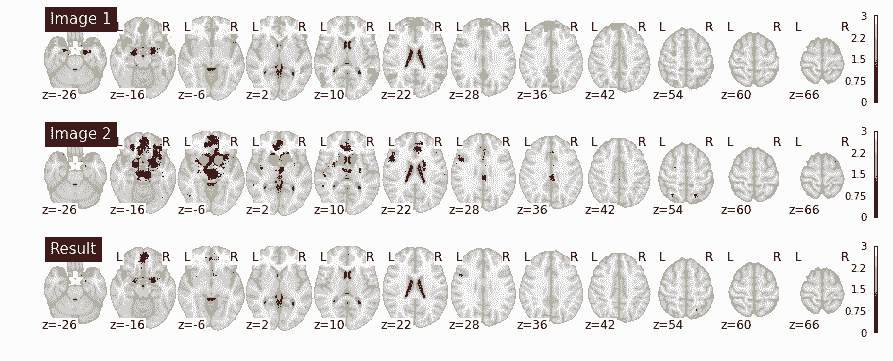

# 人生苦短，为什么我要用 Python？

选自 GitHub

**机器之心编译**

**参与：卓汇源、思源**

> 随着机器学习的兴起，Python 逐步成为了「最受欢迎」的语言。它简单易用、逻辑明确并拥有海量的扩展包，因此其不仅成为机器学习与数据科学的首选语言，同时在网页、数据爬取可科学研究等方面成为不二选择。此外，很多入门级的机器学习开发者都是跟随大流选择 Python，但到底为什么要选择 Python 就是本文的核心内容。

本教程的目的是让你相信两件事：首先，Python 是一种非常棒的编程语言；其次，如果你是一名科学家，Python 很可能值得你去学习。本教程并非想要说明 Python 是一种万能的语言；相反，作者明确讨论了在几种情况下，Python 并不是一种明智的选择。本教程的目的只是提供对 Python 一些核心特征的评论，并阐述作为一种通用的科学计算语言，它比其他常用的替代方案（最著名的是 R 和 Matlab）更有优势。

本教程的其余部分假定你已经有了一些编程经验，如果你非常精通其他以数据为中心的语言（如 R 或 Matlab），理解本教程就会非常容易。本教程不能算作一份关于 Python 的介绍，且文章重点在于为什么应该学习 Python 而不是怎样写 Python 代码（尽管其他地方有大量的优秀教程）。

**概述**

Python 是一种广泛使用、易于学习、高级、通用的动态编程语言。这很令人满意，所以接下来分开讨论一些特征。

**Python（相对来说）易于学习**

编程很难，因此从绝对意义上来说，除非你已经拥有编程经验，否则编程语言难以学习。但是，相对而言，Python 的高级属性（见下一节）、语法可读性和语义直白性使得它比其他语言更容易学习。例如，这是一个简单 Python 函数的定义（故意未注释），它将一串英语单词转换为（crummy）Pig Latin：

```py
def pig_latin(text):
    ''' Takes in a sequence of words and converts it to (imperfect) pig latin. '''

    word_list = text.split(' ')
    output_list = []

    for word in word_list:

        word = word.lower()

        if word.isalpha():
            first_char = word[0]

            if first_char in 'aeiou':
                word = word + 'ay'
            else:
                word = word[1:] + first_char + 'yay'

            output_list.append(word)

    pygged = ' '.join(output_list)
    return pygged 
```

以上函数事实上无法生成完全有效的 Pig Latin（假设存在「有效 Pig Latin」），但这没有关系。有些情况下它是可行的：

```py
test1 = pig_latin("let us see if this works")

print(test1) 
```

抛开 Pig Latin 不说，这里的重点只是，出于几个原因，代码是很容易阅读的。首先，代码是在高级抽象中编写的（下面将详细介绍），因此每行代码都会映射到一个相当直观的操作。这些操作可以是「取这个单词的第一个字符」，而不是映射到一个没那么直观的低级操作，例如「为一个字符预留一个字节的内存，稍后我会传入一个字符」。其次，控制结构（如，for—loops，if—then 条件等）使用诸如「in」，「and」和「not」的简单单词，其语义相对接近其自然英语含义。第三，Python 对缩进的严格控制强加了一种使代码可读的规范，同时防止了某些常见的错误。第四，Python 社区非常强调遵循样式规定和编写「Python 式的」代码，这意味着相比使用其他语言的程序员而言，Python 程序员更倾向于使用一致的命名规定、行的长度、编程习惯和其他许多类似特征，它们共同使别人的代码更易阅读（尽管这可以说是社区的一个特征而不是语言本身）。

**Python 是一种高级语言**

与其他许多语言相比，Python 是一种相对「高级」的语言：它不需要（并且在许多情况下，不允许）用户担心太多底层细节，而这是其他许多语言需要去处理的。例如，假设我们想创建一个名为「my_box_of_things」的变量当作我们所用东西的容器。我们事先不知道我们想在盒子中保留多少对象，同时我们希望在添加或删除对象时，对象数量可以自动增减。所以这个盒子需要占据一个可变的空间：在某个时间点，它可能包含 8 个对象（或「元素」），而在另一个时间点，它可能包含 257 个对象。在像 C 这样的底层语言中，这个简单的要求就已经给我们的程序带来了一些复杂性，因为我们需要提前声明盒子需要占据多少空间，然后每次我们想要增加盒子需要的空间时，我么需要明确创建一个占据更多空间的全新的盒子，然后将所有东西拷贝到其中。

相比之下，在 Python 中，尽管在底层这些过程或多或少会发生（效率较低），但我们在使用高级语言编写时并不需要担心这一部分。从我们的角度来看，我们可以创建自己的盒子并根据喜好添加或删除对象：

```py
# Create a box (really, a 'list') with 5 things# Create  
my_box_of_things = ['Davenport', 'kettle drum', 'swallow-tail coat', 'table cloth', 'patent leather shoes']

print(my_box_of_things) 
```

```py
['Davenport', 'kettle drum', 'swallow-tail coat', 'table cloth', 'patent leather shoes'] 
```

```py
# Add a few more things
my_box_of_things += ['bathing suit', 'bowling ball', 'clarinet', 'ring']

# Maybe add one last thing
my_box_of_things.append('radio that only needs a fuse')

# Let's see what we have...
print(my_box_of_things)
```

更一般来说，Python（以及根据定义的其他所有高级语言）倾向于隐藏需要在底层语言中明确表达的各种死记硬背的声明。这使得我们可以编写非常紧凑、清晰的代码（尽管它通常以降低性能为代价，因为内部不再可访问，因此优化变得更加困难）。

例如，考虑从文件中读取纯文本这样看似简单的行为。对于与文件系统直接接触而伤痕累累的开发者来说，从概念上看似乎只需要两个简单的操作就可以完成：首先打开一个文件，然后从其中读取。实际过程远不止这些，并且比 Python 更底层的语言通常强制（或至少是鼓励）我们去承认这一点。例如，这是在 Java 中从文件中读取内容的规范（尽管肯定不是最简洁的）方法：

```py
import java.io.BufferedReader;
import java.io.FileReader;
import java.io.IOException;

public class ReadFile {
    public static void main(String[] args) throws IOException{
        String fileContents = readEntireFile("./foo.txt");
    }

    private static String readEntireFile(String filename) throws IOException {
        FileReader in = new FileReader(filename);
        StringBuilder contents = new StringBuilder();
        char[] buffer = new char[4096];
        int read = 0;
        do {
            contents.append(buffer, 0, read);
            read = in.read(buffer);
        } while (read >= 0);
        return contents.toString();
    }
}
```

你可以看到我们不得不做一些令人苦恼的事，例如导入文件读取器、为文件中的内容创建一个缓存，以块的形式读取文件块并将它们分配到缓存中等等。相比之下，在 Python 中，读取文件中的全部内容只需要如下代码：

```py
# Read the contents of "hello_world.txt"
text = open("hello_world.txt").read() 
```

当然，这种简洁性并不是 Python 独有的；还有其他许多高级语言同样隐藏了简单请求所暗含的大部分令人讨厌的内部过程（如，Ruby，R，Haskell 等）。但是，相对来说比较少有其他语言能与接下来探讨的 Python 特征相媲美。

**Python 是一种通用语言**

根据设计，Python 是一种通用的语言。也就是说，它旨在允许程序员在任何领域编写几乎所有类型的应用，而不是专注于一类特定的问题。在这方面，Python 可以与（相对）特定领域的语言进行对比，如 R 或 PHP。这些语言原则上可用于很多情形，但仍针对特定用例进行了明确优化（在这两个示例中，分别用于统计和网络后端开发）。

Python 通常被亲切地成为「所有事物的第二个最好的语言」，它很好地捕捉到了这样的情绪，尽管在很多情况下 Python 并不是用于特定问题的最佳语言，但它通常具有足够的灵活性和良好的支持性，使得人们仍然可以相对有效地解决问题。事实上，Python 可以有效地应用于许多不同的应用中，这使得学习 Python 成为一件相当有价值的事。因为作为一个软件开发人员，能够使用单一语言实现所有事情，而不是必须根据所执行的项目在不同语言和环境间进行切换，是一件非常棒的事。

**标准库**

通过浏览标准库中可用的众多模块列表，即 Python 解释器自带的工具集（没有安装第三方软件包），这可能是最容易理解 Python 通用性的方式。若考虑以下几个示例：

*   os: 系统操作工具

*   re：正则表达

*   collections：有用的数据结构

*   multiprocessing：简单的并行化工具

*   pickle：简单的序列化

*   json：读和写 JSON

*   argparse：命令行参数解析

*   functools：函数化编程工具

*   datetime：日期和时间函数

*   cProfile：分析代码的基本工具

这张列表乍一看并不令人印象深刻，但对于 Python 开发者来说，使用它们是一个相对常见的经历。很多时候用谷歌搜索一个看似重要甚至有点深奥的问题，我们很可能找到隐藏在标准库模块内的内置解决方案。

**JSON，简单的方法**

例如，假设你想从 web.JSON 中读取一些 JSON 数据，如下所示：

```py
data_string = '''
[
  {
    "_id": "59ad8f86450c9ec2a4760fae",
    "name": "Dyer Kirby",
    "registered": "2016-11-28T03:41:29 +08:00",
    "latitude": -67.170365,
    "longitude": 130.932548,
    "favoriteFruit": "durian"
  },
  {
    "_id": "59ad8f8670df8b164021818d",
    "name": "Kelly Dean",
    "registered": "2016-12-01T09:39:35 +08:00",
    "latitude": -82.227537,
    "longitude": -175.053135,
    "favoriteFruit": "durian"
  }
]
''' 
```

我们可以花一些时间自己编写 json 解析器，或试着去找一个有效读取 json 的第三方包。但我们很可能是在浪费时间，因为 Python 内置的 json 模块已经能完全满足我们的需要：

```py
import json

data = json.loads(data_string)

print(data)
''' 

```
[{'_id': '59ad8f86450c9ec2a4760fae', 'name': 'Dyer Kirby', 'registered': '2016-11-28T03:41:29 +08:00', 'latitude': -67.170365, 'longitude': 130.932548, 'favoriteFruit': 'durian'}, {'_id': '59ad8f8670df8b164021818d', 'name': 'Kelly Dean', 'registered': '2016-12-01T09:39:35 +08:00', 'latitude': -82.227537, 'longitude': -175.053135, 'favoriteFruit': 'durian'}] 
```py

```

请注意，在我们能于 json 模块内使用 loads 函数前，我们必须导入 json 模块。这种必须将几乎所有功能模块明确地导入命名空间的模式在 Python 中相当重要，且基本命名空间中可用的内置函数列表非常有限。许多用过 R 或 Matlab 的开发者会在刚接触时感到恼火，因为这两个包的全局命名空间包含数百甚至上千的内置函数。但是，一旦你习惯于输入一些额外字符，它就会使代码更易于读取和管理，同时命名冲突的风险（R 语言中经常出现）被大大降低。

**优异的外部支持**

当然，Python 提供大量内置工具来执行大量操作并不意味着总需要去使用这些工具。可以说比 Python 丰富的标准库更大的卖点是庞大的 Python 开发者社区。多年来，Python 一直是世界上最流行的动态编程语言，开发者社区也贡献了众多高质量的安装包。

如下 Python 软件包在不同领域内提供了被广泛使用的解决方案（这个列表在你阅读本文的时候可能已经过时了！）：

*   Web 和 API 开发：flask，Django，Falcon，hug

*   爬取数据和解析文本/标记： requests，beautifulsoup，scrapy

*   自然语言处理（NLP）：nltk，gensim，textblob

*   数值计算和数据分析：numpy，scipy，pandas，xarray

*   机器学习：scikit-learn，Theano，Tensorflow，keras

*   图像处理：pillow，scikit-image，OpenCV

*   作图：matplotlib，seaborn，ggplot，Bokeh

*   等等

 Python 的一个优点是有出色的软件包管理生态系统。虽然在 Python 中安装包通常比在 R 或 Matlab 中更难，这主要是因为 Python 包往往具有高度的模块化和/或更多依赖于系统库。但原则上至少大多数 Python 的包可以使用 pip 包管理器通过命令提示符安装。更复杂的安装程序和包管理器，如 Anaconda 也大大减少了配置新 Python 环境时产生的痛苦。

**Python 是一种（相对）快速的语言**

这可能令人有点惊讶：从表面上看，Python 是一种快速语言的说法看起来很愚蠢。因为在标准测试时，和 C 或 Java 这样的编译语言相比，Python 通常会卡顿。毫无疑问，如果速度至关重要（例如，你正在编写 3D 图形引擎或运行大规模的流体动力学模拟实验），Python 可能不会成为你最优选择的语言，甚至不会是第二好的语言。但在实际中，许多科学家工作流程中的限制因素不是运行时间而是开发时间。一个花费一个小时运行但只需要 5 分钟编写的脚本通常比一个花费 5 秒钟运行但是需要一个礼拜编写和调试的脚本更合意。此外，正如我们将在下面看到的，即使我们所用的代码都用 Python 编写，一些优化操作通常可以使其运行速度几乎与基于 C 的解决方案一样快。实际上，对大多数科学家家来说，基于 Python 的解决方案不够快的情况并不是很多，而且随着工具的改进，这种情况的数量正在急剧减少。

**不要重复做功**

软件开发的一般原则是应该尽可能避免做重复工作。当然，有时候是没法避免的，并且在很多情况下，为问题编写自己的解决方案或创建一个全新的工具是有意义的。但一般来说，你自己编写的 Python 代码越少，性能就越好。有以下几个原因：

*   Python 是一种成熟的语言，所以许多现有的包有大量的用户基础并且经过大量优化。例如，对 Python 中大多数核心科学库（numpy，scipy，pandas 等）来说都是如此。

*   大多数 Python 包实际上是用 C 语言编写的，而不是用 Python 编写的。对于大多数标准库，当你调用一个 Python 函数时，实际上很大可能你是在运行具有 Python 接口的 C 代码。这意味着无论你解决问题的算法有多精妙，如果你完全用 Python 编写，而内置的解决方案是用 C 语言编写的，那你的性能可能不如内置的方案。例如，以下是运行内置的 sum 函数（用 C 编写）：

```py
# Create a list of random floats
import random
my_list = [random.random() for i in range(10000)] 
```

```py
# Python's built-in sum() function is pretty fast
%timeit sum(my_list) 
```

```py
47.7 µs ± 4.5 µs per loop (mean ± std. dev. of 7 runs, 10000 loops each) 
```

从算法上来说，你没有太多办法来加速任意数值列表的加和计算。所以你可能会想这是什么鬼，你也许可以用 Python 自己写加和函数，也许这样可以封装内置 sum 函数的开销，以防它进行任何内部验证。嗯……并非如此。

```py
def ill_write_my_own_sum_thank_you_very_much(l):
    s = 0
    for elem in my_list: 
        s += elem 
    return s

%timeit ill_write_my_own_sum_thank_you_very_much(my_list) 
```

```py
331 µs ± 50.9 µs per loop (mean ± std. dev. of 7 runs, 1000 loops each) 
```

至少在这个例子中，运行你自己简单的代码很可能不是一个好的解决方案。但这不意味着你必须使用内置 sum 函数作为 Python 中的性能上限！由于 Python 没有针对涉及大型输入的数值运算进行优化，因此内置方法在加和大型列表时是表现次优。在这种情况下我们应该做的是提问：「是否有其他一些 Python 库可用于对潜在的大型输入进行数值分析？」正如你可能想的那样，答案是肯定的：NumPy 包是 Python 的科学生态系统中的主要成分，Python 中的绝大多数科学计算包都以某种方式构建在 NumPy 上，它包含各种能帮助我们的计算函数。

在这种情况下，新的解决方案是非常简单的：如果我们将纯 Python 列表转化为 NumPy 数组，我们就可以立即调用 NumPy 的 sum 方法，我们可能期望它应该比核心的 Python 实现更快（技术上讲，我们可以传入一个 Python 列表到 numpy.sum 中，它会隐式地将其转换为数组，但如果我们打算复用该 NumPy 数组，最好明确地转化它）。

```py
import numpy as np

my_arr = np.array(my_list)

%timeit np.sum(my_arr) 
```

```py
7.92 µs ± 1.15 µs per loop (mean ± std. dev. of 7 runs, 100000 loops each) 
```

因此简单地切换到 NumPy 可加快一个数量级的列表加和速度，而不需要自己去实现任何东西。

**需要更快的速度？**

当然，有时候即使使用所有基于 C 的扩展包和高度优化的实现，你现有的 Python 代码也无法快速削减时间。在这种情况下，你的下意识反应可能是放弃并转化到一个「真正」的语言。并且通常，这是一种完全合理的本能。但是在你开始使用 C 或 Java 移植代码前，你需要考虑一些不那么费力的方法。

**使用 Python 编写 C 代码**

首先，你可以尝试编写 Cython 代码。Cython 是 Python 的一个超集（superset），它允许你将（某些）C 代码直接嵌入到 Python 代码中。Cython 不以编译的方式运行，相反你的 Python 文件（或其中特定的某部分）将在运行前被编译为 C 代码。实际的结果是你可以继续编写看起来几乎完全和 Python 一样的代码，但仍然可以从 C 代码的合理引入中获得性能提升。特别是简单地提供 C 类型的声明通常可以显著提高性能。

以下是我们简单加和代码的 Cython 版本：

```py
# Jupyter extension that allows us to run Cython cell magics
%load_ext Cython 
```

```py
The Cython extension is already loaded. To reload it, use:
  %reload_ext Cython 
```

```py
%%%%cythoncython
 defdef  ill_write_my_own_cython_sum_thank_you_very_muchill_write (list arr):
    cdef int N = len(arr)
    cdef float x = arr[0]
    cdef int i
    for i in range(1 ,N):
        x += arr[i]
    return x 
```

```py
%timeit ill_write_my_own_cython_sum_thank_you_very_much(my_list)
227 µs ± 48.4 µs per loop (mean ± std. dev. of 7 runs, 1000 loops each) 
```

关于 Cython 版本有几点需要注意一下。首先，在你第一次执行定义该方法的单元时，需要很少的（但值得注意的）时间来编译。那是因为，与纯粹的 Python 不同，代码在执行时不是逐行解译的；相反，Cython 式的函数必须先编译成 C 代码才能调用。

其次，虽然 Cython 式的加和函数比我们上面写的简单的 Python 加和函数要快，但仍然比内置求和方法和 NumPy 实现慢得多。然而，这个结果更有力地说明了我们特定的实现过程和问题的本质，而不是 Cython 的一般好处；在许多情况下，一个有效的 Cython 实现可以轻易地将运行时间提升一到两个数量级。

**使用 NUMBA 进行清理**

Cython 并不是提升 Python 内部性能的唯一方法。从开发的角度来看，另一种更简单的方法是依赖于即时编译，其中一段 Python 代码在第一次调用时被编译成优化的 C 代码。近年来，在 Python 即时编译器上取得了很大进展。也许最成熟的实现可以在 numba 包中找到，它提供了一个简单的 jit 修饰器，可以轻易地结合其他任何方法。

我们之前的示例并没有强调 JITs 可以产生多大的影响，所以我们转向一个稍微复杂点的问题。这里我们定义一个被称为 multiply_randomly 的新函数，它将一个一维浮点数数组作为输入，并将数组中的每个元素与其他任意一个随机选择的元素相乘。然后它返回所有随机相乘的元素和。

让我们从定义一个简单的实现开始，我们甚至都不采用向量化来代替随机相乘操作。相反，我们简单地遍历数组中的每个元素，从中随机挑选一个其他元素，将两个元素相乘并将结果分配给一个特定的索引。如果我们用基准问题测试这个函数，我们会发现它运行得相当慢。

```py
import numpy as np

def multiply_randomly_naive(l):
    n = l.shape[0]
    result = np.zeros(shape=n)
    for i in range(n):
        ind = np.random.randint(0, n)
        result[i] = l[i] * l[ind]
    return np.sum(result)

%timeit multiply_randomly_naive(my_arr) 
```

```py
25.7 ms ± 4.61 ms per loop (mean ± std. dev. of 7 runs, 10 loops each) 
```

在我们即时编译之前，我们应该首先自问是否上述函数可以用更加符合 NumPy 形式的方法编写。NumPy 针对基于数组的操作进行了优化，因此应该不惜一切代价地避免使用循环操作，因为它们会非常慢。幸运的是，我们的代码非常容易向量化（并且易于阅读）：

```py
def multiply_randomly_vectorized(l):
    n = len(l)
    inds = np.random.randint(0, n, size=n)
    result = l * l[inds]
    return np.sum(result)

%timeit multiply_randomly_vectorized(my_arr) 
```

```py
234 µs ± 50.9 µs per loop (mean ± std. dev. of 7 runs, 1000 loops each) 
```

在作者的机器上，向量化版本的运行速度比循环版本的代码快大约 100 倍。循环和数组操作之间的这种性能差异对于 NumPy 来说是非常典型的，因此我们要在算法上思考你所做的事的重要性。

假设我们不是花时间重构我们朴素的、缓慢的实现，而是简单地在我们的函数上加一个修饰器去告诉 numba 库我们要在第一次调用它时将函数编译为 C。字面上，下面的函数 multiply_randomly_naive_jit 与上面定义的函数 multiply_randomly_naive 之间的唯一区别是 @jit 修饰器。当然，4 个小字符是没法造成那么大的差异的。对吧？

```py
import numpy as np
from numba import jit

@jit
def multiply_randomly_naive_jit(l):
    n = l.shape[0]
    result = np.zeros(shape=n)
    for i in range(n):
        ind = np.random.randint(0, n)
        result[i] = l[i] * l[ind]
    return np.sum(result)

%timeit multiply_randomly_naive_jit(my_arr) 
```

```py
135 µs ± 22.4 µs per loop (mean ± std. dev. of 7 runs, 1 loop each) 
```

令人惊讶的是，JIT 编译版本的朴素函数事实上比向量化的版本跑得更快。

有趣的是，将 @jit 修饰器应用于函数的向量化版本（将其作为联系留给读者）并不能提供更多帮助。在 numba JIT 编译器用于我们的代码之后，Python 实现的两个版本都以同样的速度运行。因此，至少在这个例子中，即时编译不仅可以毫不费力地为我们提供类似 C 的速度，而且可以避免以 Python 式地去优化代码。

这可能是一个相当有力的结论，因为（a）现在 numba 的 JIT 编译器只覆盖了 NumPy 特征的一部分，（b）不能保证编译的代码一定比解译的代码运行地更快（尽管这通常是一个有效的假设）。这个例子真正的目的是提醒你，在你宣称它慢到无法去实现你想要做的事之前，其实你在 Python 中有许多可用的选择。值得注意的是，如 C 集成和即时编译，这些性能特征都不是 Python 独有的。Matlab 最近的版本自动使用即时编译，同时 R 支持 JIT 编译（通过外部库）和 C ++ 集成（Rcpp）。

**Python 是天生面向对象的**

即使你正在做的只是编写一些简短的脚本去解析文本或挖掘一些数据，Python 的许多好处也很容易领会到。在你开始编写相对大型的代码片段前，Python 的最佳功能之一可能并不明显：Python 具有设计非常优雅的基于对象的数据模型。事实上，如果你查看底层，你会发现 Python 中的一切都是对象。甚至函数也是对象。当你调用一个函数的时候，你事实上正在调用 Python 中每个对象都运行的 __call__ 方法：

```py
def double(x):
    return x*2

# Lists all object attributes
dir(double) 
```

```py
['__annotations__',
 '__call__',
 '__class__',
 '__closure__',
 '__code__',
 '__defaults__',
 '__delattr__',
 '__dict__',
 '__dir__',
 '__doc__',
 '__eq__',
 '__format__',
 '__ge__',
 '__get__',
 '__getattribute__',
 '__globals__',
 '__gt__',
 '__hash__',
 '__init__',
 '__init_subclass__',
 '__kwdefaults__',
 '__le__',
 '__lt__',
 '__module__',
 '__name__',
 '__ne__',
 '__new__',
 '__qualname__',
 '__reduce__',
 '__reduce_ex__',
 '__repr__',
 '__setattr__',
 '__sizeof__',
 '__str__',
 '__subclasshook__']
```

事实上，因为 Python 中的一切都是对象，Python 中的所有内容遵循相同的核心逻辑，实现相同的基本 API，并以类似的方式进行扩展。对象模型也恰好非常灵活：可以很容易地定义新的对象去实现有意思的事，同时仍然表现得相对可预测。也许并不奇怪，Python 也是编写特定领域语言（DSLs）的一个绝佳选择，因为它允许用户在很大程度上重载和重新定义现有的功能。

**魔术方法**

Python 对象模型的核心部分是它使用「魔术」方法。这些在对象上实现的特殊方法可以更改 Python 对象的行为——通常以重要的方式。魔术方法（Magic methods）通常以双下划线开始和结束，一般来说，除非你知道自己在做什么，否则不要轻易篡改它们。但一旦你真的开始改了，你就可以做些相当了不起的事。

举个简单的例子，我们来定义一个新的 Brain 对象。首先，Barin 不会进行任何操作，它只会待在那儿礼貌地发呆。

```py
class Brain(object):

    def __init__(self, owner, age, status):

        self.owner = owner
        self.age = age
        self.status = status

    def __getattr__(self, attr):
        if attr.startswith('get_'):
            attr_name = attr.split('_')[1]
            if hasattr(self, attr_name):
                return lambda: getattr(self, attr_name)
        raise AttributeError 
```

在 Python 中，__init__ 方法是对象的初始化方法——当我们尝试创建一个新的 Brain 实例时，它会被调用。通常你需要在编写新类时自己实现 __init__，所以如果你之前看过 Python 代码，那 __init__ 可能看起来就比较熟悉了，本文就不再赘述。

相比之下，大多数用户很少明确地实现 __getattr__ 方法。但它控制着 Python 对象行为的一个非常重要的部分。具体来说，当用户试图通过点语法（如 brain.owner）访问类属性，同时这个属性实际上并不存在时，__getattr__ 方法将会被调用。此方法的默认操作仅是引发一个错误：

```py
# Create a new Brain instance
brain = Brain(owner="Sue", age="62", status="hanging out in a jar") 
```

```py
print(brain.owner)

---------------------------------------------------------------------------sue
```

```py
print(brain.gender) 

```
---------------------------------------------------------------------------
AttributeError                            Traceback (most recent call last)
<ipython-input-136-52813a6b3567> in <module>()
----> 1 print(brain.gender)

<ipython-input-133-afe64c3e086d> in __getattr__(self, attr)
     12             if hasattr(self, attr_name):
     13                 return lambda: getattr(self, attr_name)
---> 14         raise AttributeError

AttributeError: 
```py

```

重要的是，我们不用忍受这种行为。假设我们想创建一个替代接口用于通过以「get」开头的 getter 方法从 Brain 类的内部检索数据（这是许多其他语言中的常见做法），我们当然可以通过名字（如 get_owner、get_age 等）显式地实现 getter 方法。但假设我们很懒，并且不想为每个属性编写一个显式的 getter。此外，我们可能想要为已经创建的 Brains 类添加新的属性（如，brain.foo = 4），在这种情况下，我们不需要提前为那些未知属性创建 getter 方法（请注意，在现实世界中，这些是为什么我们接下来要这么做的可怕理由；当然这里完全是为了举例说明）。我们可以做的是，当用户请求任意属性时，通过指示 Brain 类的操作去改变它的行为。

在上面的代码片段中，我们的 __getattr__ 实现首先检查了传入属性的名称。如果名称以 get_ 开头，我们将检查对象内是否存在期望属性的名称。如果确实存在，则返回该对象。否则，我们会引发错误的默认操作。这让我们可以做一些看似疯狂的事，比如：

```py
print(brain.get_owner()) 
```

其他不可思议的方法允许你动态地控制对象行为的其他各种方面，而这在其他许多语言中你没法做到。事实上，因为 Python 中的一切都是对象，甚至数学运算符实际上也是对对象的秘密方法调用。例如，当你用 Python 编写表达式 4 + 5 时，你实际上是在整数对象 4 上调用 __add__，其参数为 5。如果我们愿意（并且我们应该小心谨慎地行使这项权利！），我们能做的是创建新的特定领域的「迷你语言」，为通用运算符注入全新的语义。

举个简单的例子，我们来实现一个表示单一 Nifti 容积的新类。我们将依靠继承来实现大部分工作；只需从 nibabel 包中继承 NiftierImage 类。我们要做的就是定义 __and__ 和 __or__ 方法，它们分别映射到 & 和 | 运算符。看看在执行以下几个单元前你是否搞懂了这段代码的作用（可能你需要安装一些包，如 nibabel 和 nilearn）。

```py
from nibabel import Nifti1Image
from nilearn.image import new_img_like
from nilearn.plotting import plot_stat_map
import numpy as np
import matplotlib.pyplot as plt
%matplotlib inline

class LazyMask(Nifti1Image):
    ''' A wrapper for the Nifti1Image class that overloads the & and | operators
    to do logical conjunction and disjunction on the image data. '''

    def __and__(self, other):
        if self.shape != other.shape:
            raise ValueError("Mismatch in image dimensions: %s vs. %s" % (self.shape, other.shape))
        data = np.logical_and(self.get_data(), other.get_data())
        return new_img_like(self, data, self.affine)

    def __or__(self, other):
        if self.shape != other.shape:
            raise ValueError("Mismatch in image dimensions: %s vs. %s" % (self.shape, other.shape))
        data = np.logical_or(self.get_data(), other.get_data())
        return new_img_like(self, data, self.affine) 
```

```py
img1 = LazyMask.load('image1.nii.gz')
img2 = LazyMask.load('image2.nii.gz')
result = img1 & img2 
```

```py
fig, axes = plt.subplots(3, 1, figsize=(15, 6))
p = plot_stat_map(img1, cut_coords=12, display_mode='z', title='Image 1', axes=axes[0], vmax=3)
plot_stat_map(img2, cut_coords=p.cut_coords, display_mode='z', title='Image 2', axes=axes[1], vmax=3)
p = plot_stat_map(result, cut_coords=p.cut_coords, display_mode='z', title='Result', axes=axes[2], vmax=3) 
```



**Python 社区**

我在这里提到的 Python 的最后一个特征就是它优秀的社区。当然，每种主要的编程语言都有一个大型的社区致力于该语言的开发、应用和推广；关键是社区内的人是谁。一般来说，围绕编程语言的社区更能反映用户的兴趣和专业基础。对于像 R 和 Matlab 这样相对特定领域的语言来说，这意味着为语言贡献新工具的人中很大一部分不是软件开发人员，更可能是统计学家、工程师和科学家等等。当然，统计学家和工程师没什么不好。例如，与其他语言相比，统计学家较多的 R 生态系统的优势之一就是 R 具有一系列统计软件包。

然而，由统计或科学背景用户所主导的社区存在缺点，即这些用户通常未受过软件开发方面的训练。因此，他们编写的代码质量往往比较低（从软件的角度看）。专业的软件工程师普遍采用的最佳实践和习惯在这种未经培训的社区中并不出众。例如，CRAN 提供的许多 R 包缺少类似自动化测试的东西——除了最小的 Python 软件包之外，这几乎是闻所未闻的。另外在风格上，R 和 Matlab 程序员编写的代码往往在人与人之间的一致性方面要低一些。结果是，在其他条件相同的情况下，用 Python 编写软件往往比用 R 编写的代码具备更高的稳健性。虽然 Python 的这种优势无疑与语言本身的内在特征无关（一个人可以使用任何语言（包括 R、Matlab 等）编写出极高质量的代码），但仍然存在这样的情况，强调共同惯例和最佳实践规范的开发人员社区往往会使大家编写出更清晰、更规范、更高质量的代码。

**结论**

Python 太棒了。

*原文链接：https://github.com/neurohackweek/python-for-scientists/blob/master/Programming%20in%20Python.ipynb*

****本文为机器之心编译，**转载请联系本公众号获得授权****。**

✄------------------------------------------------

**加入机器之心（全职记者 / 实习生）：hr@jiqizhixin.com**

**投稿或寻求报道：**content**@jiqizhixin.com**

**广告 & 商务合作：bd@jiqizhixin.com**