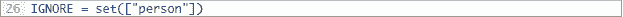

# 增加检测类别？这是一份目标检测的基础指南

选自 pyimagesearch

**作者： ****Adrian Rosebrock **

**机器之心编译**

> 目标检测技术作为计算机视觉的重要方向，被广泛应用于自动驾驶汽车、智能摄像头、人脸识别及大量有价值的应用上。这些系统除了可以对图像中的每个目标进行识别、分类以外，它们还可以通过在该目标周围绘制适当大小的边界框来对其进行定位。本文作者从图像识别与目标检测的区别开始，进一步简单介绍了目标检测的基本模块与实现方法。本文是目标检测的一般指南，它并没有详细介绍主流的目标检测算法，这些算法读者可参考[从 RCNN 到 SSD，这应该是最全的一份目标检测算法盘点 ](https://mp.weixin.qq.com/s?__biz=MzA3MzI4MjgzMw==&mid=2650741534&idx=1&sn=02dc164ffcedbf22124b97841ba67fe5&chksm=871adf60b06d567690fa2328b161c012a464687768e50f812a51b5533a7d68b99af1cf8f02b8&scene=21#wechat_redirect)

本文受 PyImageSearch 的读者 Ezekiel 的启发，他上个星期在邮件中咨询道：

> Adrian 你好，
> 
> 我仔细地浏览了您之前关于[深度学习目标检测](https://mp.weixin.qq.com/s?__biz=MzA3MzI4MjgzMw==&mid=2650731098&idx=2&sn=833275efb1b49db7c0469b84fce21fc4&chksm=871b3624b06cbf32c343a6f8a7d128f5a5e92df3da8d994b59069ee48e9edae2a0f708c1be0b&scene=21#wechat_redirect) 的文章及其跟进的[实时深度学习目标检测](https://mp.weixin.qq.com/s?__biz=MzA3MzI4MjgzMw==&mid=2650741123&idx=4&sn=11b3d4e9d07a010bcbc445a456960580&chksm=871addfdb06d54ebe030c1fb91e85e7ab51927a853644fcbf4e03c2b8550f250cdd73363964e&scene=21#wechat_redirect) 。感谢你做的这一切，我在自己的样例项目中使用了你的源代码，但是我有两个问题：
> 
> 1\. 我该如何过滤/忽略那些我不感兴趣的类？
> 
> 2\. 我如何才能向自己的目标检测器中增加新类别？有这个可能吗？
> 
> 如果你能就这两个问题写一篇文章，我将不胜感激。
> 
> Ezekiel 并不是受此问题困扰的唯一读者。事实上，如果你仔细浏览了我最近关于深度目标检测两篇文章的评论，你会发现最常见的问题可以被表述为：
> 
> 我该如何修改你的源代码来包含我自己的类别？

由于这是一个如此常见的问题，并且是关于神经网络/深度学习目标检测器实际工作的一个误解，所以我决定在今天的博客中重温深度学习目标检测的话题。

具体地，你将在这篇文章中学到以下内容：

*   图像分类和目标检测的区别

*   深度学习目标检测器的组成：包含不同目标检测架构的区别和基本模型之间的区别

*   如何使用预训练模型进行深度学习目标检测

*   如何从一个深度学习模型中过滤或者忽略一些预测类别

*   向深度神经网络增加类别或从中删除类别时常见的误区和误解

为了更多地了解深度学习目标检测，并解释清楚我们对基于深度学习的目标检测的一些误区和误解，请继续阅读本文。

想要查看本文相关的源码？请查看原文的下载链接：https://www.pyimagesearch.com/2018/05/14/a-gentle-guide-to-deep-learning-object-detection/#

**深度学习目标检测的一般指南**

今天的博客是对基于深度学习的目标检测的简单介绍。我尽可能对深度学习目标检测器的组成做一个概述，包括使用预训练的目标检测器执行任务的源代码。

你可以使用这份指南来帮助学习深度学习目标检测，但是也要意识到，目标检测是高度细节化的工作，我不可能在一篇文章中包含关于深度学习目标检测的所有细节。

这篇文章将从讨论图像分类和目标检测之间的本质区别开始，其中包括判断一个图像分类网络是否可以用于目标检测，以及在什么情况下可以这样使用等话题。

当我们理解了什么是目标检测时，随后会概述一个深度学习目标检测器的核心模块。它一般包括目标检测架构和基本模型，不熟悉目标检测的读者可能会误解这两个部分。

在这里，我们将使用 OpenCV 来实现实时深度学习目标检测。我也会展示如何在不修改网络架构或者重新训练的情况下忽略或者过滤一些不感兴趣的目标类别。最后，我们通过讨论如何从深度学习目标检测器中增加或者删除类别来总结本文。

**图像分类和目标检测的区别**

*图 1： 图像分类（左）和目标检测（右）的区别是比较直观和简单的。在图像分类中，整幅图像被分类为单一的标签。而在目标检测中，我们的神经网络还要找出图像中目标的位置（有可能是多个）。*

在进行标准的图像分类时，我们将一张给定的图像输入到神经网络，然后得到一个最可能的标签，而且也许会同时得到相关的概率。

这个类别标签用来表征整个图像的内容，或者至少是图像最主要的可见内容。例如，上面的图 1 中，给定输入图像（左），我们的 CNN 给它的标签是「比格犬」。所以我们可以认为图像分类具有以下特点：

*   一张图像输入

*   一个类别标签输出

无论是通过深度学习还是其他计算机视觉技术的目标检测，都是基于图像分类构建的，只不过需要精确定位每个对象在图像中出现的位置。在进行目标检测的时候，给定一张输入图像，我们期望得到：

*   一个边界框列表，或者一幅图像中每个对象的（x,y）坐标

*   与每个边界框关联的类别标签

*   与每个边界框和类别标签关联的概率或者置信度得分

图 1（右）展示了一个深度学习目标检测的例子。请注意，人物和狗都被用边界框找出了位置，同时类标签也被预测到了。

所以，目标检测允许我们：

*   向网络输入一张图像

*   得到多个边界框以及类别标签

**深度学习图像分类可以被用于目标检测吗？**

*图 2：非端到端深度学习的目标检测器使用一个滑动窗口（左）＋图像金字塔（右）相结合的方法来分类。*

所以现在你理解了图像分类和目标检测的根本区别：

*   在进行图像分类时，我们输入一张图像，得到一个输出类别

*   然而在进行目标检测时，我们输入一张图像，得到多个边界框以及类别标签的输出

这自然引发这么一个问题：

> 我们可以拿一个已训练的分类网络，将其用于目标检测吗？

这个答案有些棘手，因为这在技术上是可以的，但是理由并不太明显。解决方案涉及：

1\. 应用基于计算机视觉的标准目标检测方法（非深度学习方法），例如滑动窗口和图像金字塔等方法通常被用在 HOG+基于线性 SVM 的目标检测器。

2\. 采用预训练的网络，并将其作为深度学习目标检测架构的基本网络（例如 Faster R-CNN, SSD, YOLO）。

*   方法 #1： 传统的目标检测技术路线

第一个方法不是纯端到端的深度学习目标检测器。相反，我们使用：

1\. 固定尺寸的滑动窗口，它从左到右，自上而下滑动，来定位不同位置的对象。

2\. 图像金字塔，用来检测不同尺度的对象

3\. 一个预训练（分类）的 CNN 来分类

在滑动窗和对应图像金字塔每一次停留的时候，我们会提取 ROI（感兴趣区域），将其输入到 CNN 中，得到对 RIO 的分类。

如果标签 L 的分类概率比某个阈值 T 高，我们就将这个 ROI 的边界框标记为该标签（L）。对滑动窗和图像金字塔的每次停留都重复这个过程，我们就得到了目标检测器的输出。最终，我们对边界框应用非极大值抑制（NMS），得到最终输出的检测结果：

*图 3：应用 NMS 会抑制重叠的和置信度不高的边界框。这个方法在一些特定的用例中是有效的，但是它通常比较慢和繁琐，也容易出错。*

然而，这个方法也是值得学习的，因为它可以将任意图像分类网络转换为一个目标检测器，而不需要显式地训练一个端到端的深度学习目标检测器。这个方法可以节省大量的时间和精力，且效率的高低具体取决于你的用例。

*   方法 #2：目标检测架构的基本网络

第二个深度学习目标检测的方法允许我们将一个预训练的分类网络作为深度学习目标检测架构（例如 Faster R-CNN、SSD 或者 YOLO）的基本网络。

这个方法的好处是：你可以创建一个基于深度学习的复杂端到端目标检测器。

而其不足之处是：它需要一些关于深度学习目标检测器如何工作的知识，我们将在后面的部分中讨论这个问题。

**深度学习目标检测器的模块**

*图 4： VGG16 基本网络是 SSD 深度学习目标检测框架的一个特征抽取模块。*

深度学习目标检测器有很多模块，子模块以及更小的子模块，但是我们今天要重点关注的是深度学习入门读者所困惑的两个：

1\. 目标检测框架（不包括 Faster R-CNN, SSD, YOLO）

2\. 适合目标检测框架的基本网络

你可能已经比较熟悉基本网络（只是你之前并没听到它被称作基本网络而已）。基本网络就是你常用的分类 CNN 架构，包括：

*   VGGNet

*   ResNet

*   MobileNet

*   DenseNet

通常这些网络在大数据集上进行预训练来进行分类，例如 ImageNet，它们可以学习到很多具有鉴别能力的滤波器。

目标检测框架由很多组成部分和子模块构成。例如，Faster R-CNN 框架包括：

*   候选区域网络（RPN）

*   一组锚点

*   ROI 池化模块

*   最终基于区域的卷积神经网络

在使用 SSD（单步检测器，single shot detectors）时，具有以下的组成部分：

*   多框（MultiBox）

*   先验（Priors）

*   固定先验（Fixed priors）

请记住，基本网络只是整个深度学习目标检测框架的众多组件之一，上文图 4 描述了 SSD 框架内部的 VGG-16 网络。通常，我们需要在基本网络上进行「网络手术」。这种修改：

*   让它变成全卷积的形式，并接受任意输入维度。

*   剪除了基本网络中更深层的卷积和池化层，将它们以一系列新层（SSD）、新模块（Faster R-CNN），或者这两者的一些组合代替。

这里的「网络手术」是一种口语化的说法，它的意思是移除基本网络中的一些原始卷积层，将它们用新层替代。网络手术也是讲究策略的，我们移除一些不需要的部分，然后用一组新的部分来替代它们。

然后，当我们开始训练我们的框架进行目标检测时，（1）新层、模块和（2）基本网络的权重都被修改了。

再强调一次，综述关于不同深度学习目标检测框架是如何工作的（包括基本网络所起的作用）并不属于本文的探讨范围。

如果你对深度学习目标检测的完整综述（包括理论和实现）感兴趣，请参考机器之心曾经发过的文章：[从 RCNN 到 SSD，这应该是最全的一份目标检测算法盘点 ](https://mp.weixin.qq.com/s?__biz=MzA3MzI4MjgzMw==&mid=2650741534&idx=1&sn=02dc164ffcedbf22124b97841ba67fe5&chksm=871adf60b06d567690fa2328b161c012a464687768e50f812a51b5533a7d68b99af1cf8f02b8&scene=21#wechat_redirect)。

**我是如何计算一个深度学习目标检测器的准确度的？**

在评价目标检测器的性能时我们使用了一个叫做均值平均精度（mAP）的指标，它是以我们数据集中所有类别的交并比（IoU）为基础的。

*   交并比（IoU）

*图 5： 在这个交并比的可视化例子中，标注边界框（绿色）可以与预测的边界框（红色）进行对比。IoU 与 mAP 一起被用来评价一个深度学习目标检测器的精度。计算 IoU 的简单方程如图 5（右）所示。*

你通常会发现 IoU 和 mAP 被用于评价 HOG+线性 SVM 检测器、Haar cascades 以及基于深度学习的方法的性能；但是请记住，实际用于生成预测边界框的算法并不是那么重要。

任何一个以预测边界框作（以及可选择的标签）为输出的算法都可以用 IoU 来评价。更一般的地，为了使用 IoU 来评价任意一个目标检测器，我们需要：

1\. 真实的边界框（也就是测试集中表明我们的目标在图像的哪个位置的人工标签）

2\. 模型预测到的边界框

3\. 如果你想一起计算召回率和精度，那么还需要真实类别标签和预测类别标签

在图 5（左）中，我展示了真实边界框（绿色）与预测边界框（红色）相比的可视化例子。IoU 的计算可以用图 5 右边的方程表示。

仔细检查这个方程你会发现，IoU 就是一个比值。在分子项中，我们计算了真实边界框和预测边界框重叠的区域。分母是一个并集，或者更简单地说，是由预测边界框和真实边界框所包括的区域。两者相除就得到了最终弄的得分：交并比。

*   平均精度均值（MAP）

*图 6：为了计算目标检测器的 mAP@0.5，我们执行了以下计算。对于所有被标记为「正检测」（positive detection）、具备至少 0.5 的交并比（IoU）的对象，我们对所有 N 个类别计算 IoU (>0.5) 均值，然后对 N 个均值再求平均。这个指标就是 mAP@0.5。*

为了在我们的数据集中评估目标检测器，我们需要同时基于以下两者的 IoU 来计算 mAP：

1\. 基于每个类别（也就是说每个类别的平均 IoU）；

2\. 数据集中所有类别（也就是说所有类别平均 IoU 的均值，所以这个术语就是平均精度均值）。

为了计算每个类别的平均精度，我们在所有的数据点上计算某个类别的 IoU。一旦我们计算出了一个类别在每个数据点的 IoU，我们对它们求一次平均（第一次平均）。

为了计算 mAP，我们对所有的 N 个类别计算平均 IoU，然后对这 N 个平均值取平均值（均值的平均）。

通常我们使用 mAP@0.5，表示测试集中要被标记为「正检测」的目标必须具备的条件，真值不小于 0.5 的 IoU（并可以被正确地标记）。这里的 0.5 是可以调整的，但是在所有的目标检测数据集和挑战中，0.5 是一个相对标准的数值。

再次强调，这只是一个关于目标检测评价指标的快速指南，所以我将整个过程简化了一些。

**使用 OpenCV 进行基于深度学习的目标检测**

我们已经在本文以及之前的博客中讨论了深度学习和目标检测。出于完整性考虑，我们将在本文中概述实际的代码。

我们的例子包含以 MobileNet 作为基础模型的单次检测器（SSD）。该模型由 GitHub 用户 chuanqi305（https://github.com/chuanqi305/MobileNet-SSD）在 COCO 数据集上训练得到。更多细节请浏览我之前的文章（https://www.pyimagesearch.com/2017/09/11/object-detection-with-deep-learning-and-opencv/），这篇文章介绍了该模型以及相关的背景信息。

让我们回到 Ezekiel 在本文开始提出的第一个问题上。

> 1\. 我该如何过滤/忽略那些我不感兴趣的类？

我会在下面的示例代码中回答这个问题，但是首先你需要准备一下系统：

*   你需要在 Python 虚拟环境中安装版本不低于 3.3 的 OpenCV（如果你在使用 python 虚拟环境的话）。OpenCV 3.3+ 包含运行以下代码所需的 DNN 模块。确保使用链接中的 OpenCV 安装教程之一（https://www.pyimagesearch.com/opencv-tutorials-resources-guides/），要额外注意你下载和安装的 OpenCV 版本。

*   你还应该安装我的 imutils 包（https://github.com/jrosebr1/imutils）。为了在 Python 虚拟环境中安装/更新 imutils，简单地使用以下命令即可： pip install --upgrade imutils。

系统准备好之后，创建一个新文件，命名为 filter_object_detection.py。下面让我们开始：

在第 2 到 8 行中，我们导入了所需的包和模块，尤其是 imultils 和 OpenCV。我们会使用我的 VideoStream 类处理从摄像头获取的帧。

我们已经具备了所需的工具，接着我们来解析命令行参数：

我们的脚本在运行时需要两个命令行参数：

*   --prototxt : The path to the Caffe prototxt file which defines the model definition.

*   --model : Our CNN model weights file path.

*   --prototxt：Caffe prototxt 文件的路径，它定义了模型的定义。

*   --model：CNN 模型权重的文件路径。

你还可以有选择性地指定--confidence，这是过滤弱检测的阈值。

我们的模型可以预测 21 个对象类别：

CLASSES 列表包含该网络训练时的所有类别标签（也就是 COCO 中的标签）。

对 CLASSES 列表的一个常见误解是你可以：

1\. 向列表增加一个新的类别标签；

2\. 或者从列表移除一个类别标签。

……以及以为网络可以自动「了解」你想要完成的任务。

不是这样的。

你不能简单地修改文本标签列表，让网络自动修改自己，在非训练所用数据上学习、增加或者移除模式。这并不是神经网络的运行方式。

也就是说，有一个快速的技巧，你可以使用它来过滤或者忽略你不感兴趣的预测。

解决方案就是：

1\. 定义一个 IGNORE 标签集合（即网络是在这个类别标签列表上进行训练的，但你现在想忽略这些标签）。

2\. 对一个输入图像/视频帧进行预测。

3\. 忽略类别标签存在于 IGNORE 集合中的所有预测结果。

在 Python 中实现时，IGNORE 集合是这样的：

这里我们忽略所有具有类别标签「person」的预测对象（用于过滤的 if 语句会在后续内容中介绍）。

你可以很容易地增加额外的元素（CLASS 列表中的类别标签）来忽略该集合。

接下来，我们将生成随机的类别/框颜色，加载模型，然后启动视频流：

第 27 行中名为 COLORS 的随机数组为 21 个类别中的每一个随机生成颜色。这些颜色会在后边用于显示。

第 31 行中使用 cv2.dnn.readNetFromCaffe 函数加载我们的 Caffe 模型，我们所需的两个命令行参数作为参数被传递。

然后我们将 VideoStream 对象实例化为 vs，并开始 fps 计数（36-38 行）。2 秒钟的 sleep 让我们的摄像头有足够的预热时间。

现在我们已经准备好在来自摄像头的视频帧中进行循环，并将它们发送到我们的 CNN 目标检测器中：

在第 44 行，我们抓取 1 帧，然后重新调整它的大小并保留用于显示的长宽比（第 45 行）。

我们从中提取高度和宽度，稍后会用到（第 48 行）。

第 48 行和 49 行从这一帧中生成 blob。要了解更多 blob，以及如何使用 cv2.dnn.blobFromImage 函数构建 blob，请在以前的博文中查看所有细节（https://www.pyimagesearch.com/2017/11/06/deep-learning-opencvs-blobfromimage-works/）。

下一步，我们将 blob 发送到神经网络中来检测目标（54-55 行）。

循环检测：

从第 58 行开始检测循环。

对于每一次检测，我们都提取 confidence（#61 行），然后将它与置信度阈值进行比较（#65 行）。当 confidence 超过最小值（默认的 0.5 可以通过命令行参数进行修改），我们可以认为这次检测是一次积极有效的检测，可以继续进行处理。

首先，我们从 detections 中提取类别标签索引（#68）。

然后，回到 Ezekiel 的第一个问题，我们可以忽略 INGNORE 集合中的类别（#72—73）。如果这个类别是要被忽略的，我们只需返回到顶部的检测循环（不会显示这个类别的标签或边界框）。这符合我们的「quick hack」解决方案。

否则，我们检测到的目标就在白名单中，我们需要在该帧中显示对应的类别标签和矩形框：

在这段代码中，我们提取出了边界框的坐标（#77-78），然后画出这帧的标签和矩形框（#81-87）。

每个类别的标签和矩形框都是同样的颜色，也就是说，同一类别的对象都会具有相同的颜色（即视频中所有的「boats」都具有相同颜色的标签和边界框）。

最后，仍然在这个 while 循环中，我们将结果显示在屏幕上：

我们显示出这一帧，并且捕捉按键（#90-91）。

如果 q 键被按下，则我们通过跳出循环来结束程序（#94-95）。

否则，我们会继续更新 fps 计数（#98），并且继续抓取并分析视频帧。

在后面几行中，当循环中断后，我们会显示时间+fps（帧每秒）指标然后清空。

**运行你的深度学习目标检测器**

为了运行今天的脚本，你需要滚动到下面的「下载」部分来抓取文件。

当你提取到文件之后，打开一个终端，切换到已下载代码+模型的路径。并在这里执行以下命令：

 *

*图 6： 使用同一个模型的实时深度学习目标检测演示，在右边的视频中我在程序中忽略了某些目标类别。*

在上边的动图中，你在左边可以看到「person」类别被检测到了。这是由于 IGNORE 是空的。在右边的动图中，你可以看到我没有被检测到，这是由于我把「person」增加到了 IGNORE 集合了。

尽管我们的深度学习目标检测器仍然从技术上检测到了「person」类别，但是我们的后期处理代码将它过滤出来了。

*   也许你在运行这个深度学习目标检测器的时候会遇到错误？

排除故障的第一步是检查你是否连接了摄像头。如果这个是正常的，也许你会在你的终端中看到以下错误信息：

如果你看到这个信息，那说明你没有向程序传递「命令行参数」。如果他们不熟悉 Python、argparse 以及命令行参数的话（https://www.pyimagesearch.com/2018/03/12/python-argparse-command-line-arguments/）。

这是 PyImageSearch 读者最常遇见的问题。查看一下这个链接，看看你是否存在这个问题。带有注释的完整视频在这里：https://youtu.be/5cwFBUQb6_w

**如何向深度学习目标检测器添加或者删除类别？**

*图 7：深度学习目标检测的微调过程和迁移学习。*

正如我在这份指南中前期所提到的，你不能在 CLASS 列表中简单地增加或者删除类别，基础的网络并没有改变。

你所能做的，最好就是修改一个能够列出所有类别标签的文本文件。

此外，如果你想显式地在神经网络中增加或者删除类别，你需要做的工作有：

1\. 从零开始训练

2\. 进行微调

从零开始训练通常会比较耗时间，是一个代价昂贵的操作，所以我们尽可能避免，但是在一些情况下是无法避免的。另一个选择就是进行微调。微调是一种迁移学习的形式，它是这样的过程：

1\. 删除负责分类/打标签的全连接层

2\. 并用全新的、随机初始化的全连接层替代

我们也可以选择性地修改网络中的其它层（包括在训练过程中冻结一些层的权重，以及解冻它们）。

准确来说，如何训练你自己的定制的深度学习目标检测器（包括微调和从零开始训练）是比较高级的话题，并不属于本文的讨论范围，但是阅读下面的部分可以有助于你开始这项工作。

**我可以在哪里学到更多关于深度学习目标检测的内容？**

*图 8： 汽车前后视角的实时深度学习目标检测*

正如我们在这篇博文中讨论过的，目标检测并不是像图像分类一样简单，其细节和复杂度超出了本文的范围（我已经啰嗦了好多遍了）。

本教程肯定不是我在深度学习目标检测方方面的最后一篇文章（毫无疑问，我会在未来写更多关于深度学习目标检测的文章），但是如果你对学习以下内容感兴趣：

1\. 为目标检测准备你的数据集。

2\. 在你的数据集上精调并训练你自己的定制化目标检测器，包括 Faster R-CNN 和 SSD。

3\. 了解我的最好的实践做法、技术和过程，并使用它们来训练自己的深度学习目标检测器。

... 然后，你可能会想看一下我的新书（https://www.pyimagesearch.com/deep-learning-computer-vision-python-book/）。在《Deep Learning for Computer Vision with Python》一书中，我会一步一步地指导你构建自己的深度学习目标检测器。

**总结**

这篇博客简单介绍了深度学习目标检测所涉及的一些难点。我们以概述图像分类和目标检测之间的本质区别作为开始，包括如何将一个图像分类的神经网络用于目标检测。

然后我们概述了深度学习目标检测器的核心组成：

1\. 检测框架

2\. 基本模型

基本模型通常是一个预训练的（分类）网络，为了学习到一系列具有辨识能力的滤波器，一般是在大型图像数据集（例如 ImageNet）上进行训练的。

我们也可以从零开始训练基本网络，但是，对于目标检测器而言，为了达到较合理的准确率。这通常需要更长的训练时间。

在绝大多数情况下，你应该以一个预训练的基本模型作为开始，而不是尝试着从零开始训练。

当我们对深度学习目标检测器有了充分的理解之后，我们就可以在 OpenCV 中实现能够实时运行的目标检测器。

我还概述了如何过滤或者忽略那些不感兴趣的类别标签。

最后，我们了解到：实际地向深度学习目标检测器增加一个类别标签，或者从深度学习目标检测器中删除一个类别标签并不是像从硬编码的标签列表张增加或者删除标签一样简单。

神经网络本身并不在乎你是否修改了类别标签，相反，你需要：

1\. 通过删除全连接目标预测层并进行调整来修改网络结构

2\. 或者从零开始训练目标检测网络框架

对于更多的深度学习目标检测项目，你需要从一个基于目标检测任务（例如 COCO）的预训练深度学习目标检测器开始。然后基于预训练模型进行微调，以得到你自己的检测器。

训练一个端到端的定制深度学习目标检测器并不属于本文的范畴，所以，如果你对探索如何训练自己的目标检测器感兴趣，请参考我的书籍《deep learning for computer vision with python》。

在这本书中，我描述了一些深度学习目标检测的例子，包括为以下任务训练你自己的深度学习目标检测器：

1\. 检测交通标志，例如 Stop 标志，人行横道标志等等。

2\. 汽车的前后视角

*原文链接：*

*https://www.pyimagesearch.com/2018/05/14/a-gentle-guide-to-deep-learning-object-detection/*

 **5 月 25 日！杭州云栖小镇将成为离世界最近、离年青人最近、离未来最近的地方，点击阅读原文，立即加入这场年青人的盛会，共同创造不一样的 2050。

添加机器之心小助手：syncedai3，备注“2050”，获取 5 折购票码。

***