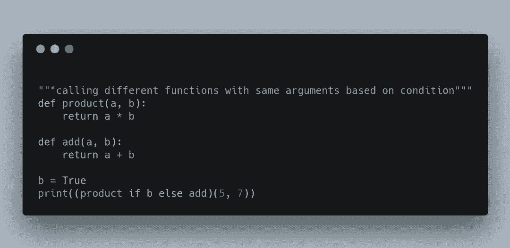
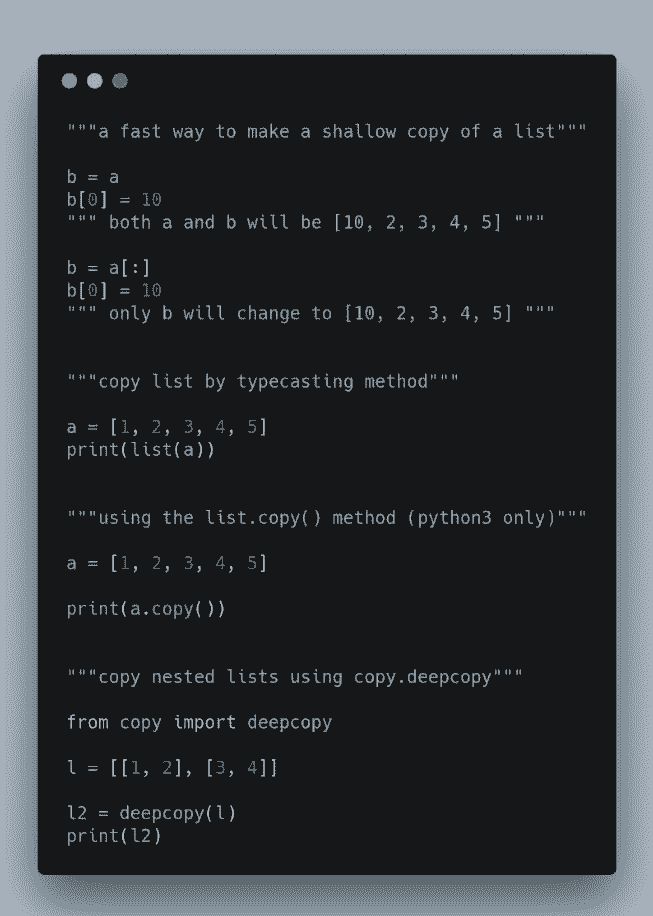

# 资源 | Python 技巧 101：这 17 个骚操作你都 Ok 吗

选自 Hackernoon

**作者：Gautham Santhosh**

**机器之心编译**

> Python 是一门非常优美的语言，其简洁易用令人不得不感概人生苦短。在本文中，作者 Gautham Santhosh 带我们回顾了 17 个非常有用的 Python 技巧，例如查找、分割和合并列表等。这 17 个技巧都非常简单，但它们都很常用且能激发不一样的思路。

[人生苦短，为什么我要用 Python？](http://mp.weixin.qq.com/s?__biz=MzA3MzI4MjgzMw==&mid=2650746553&idx=1&sn=08ab94df8d382bf0ff3aa47a042c48bc&chksm=871aeac7b06d63d16ec85111e34b061a0a824a778111ac5c950a3c08099555b0fe0de31d6131&scene=21#wechat_redirect)很多读者都知道 Python 是一种高级编程语言，其设计的核心理念是代码的易读性，以及允许编程者通过若干行代码轻松表达想法创意。

实际上，很多人选择学习 Python 的首要原因是其编程的优美性，用它编码和表达想法非常自然。此外，Python 的编写使用方式有多种，数据科学、网页开发、机器学习皆可使用 Python。Quora、Pinterest 和 Spotify 都使用 Python 作为其后端开发语言。

交换变量值

将列表中的所有元素组合成字符串

查找列表中频率最高的值

检查两个字符串是不是由相同字母不同顺序组成

反转字符串

反转列表

转置二维数组

链式比较

链式函数调用

复制列表

字典 get 方法

通过「键」排序字典元素

For Else

转换列表为逗号分割符格式

合并字典

列表中最小和最大值的索引

移除列表中的重复元素

****本文为机器之心编译，**转载请联系本公众号获得授权****。**

✄------------------------------------------------

**加入机器之心（全职记者 / 实习生）：hr@jiqizhixin.com**

**投稿或寻求报道：**content**@jiqizhixin.com**

**广告 & 商务合作：bd@jiqizhixin.com**