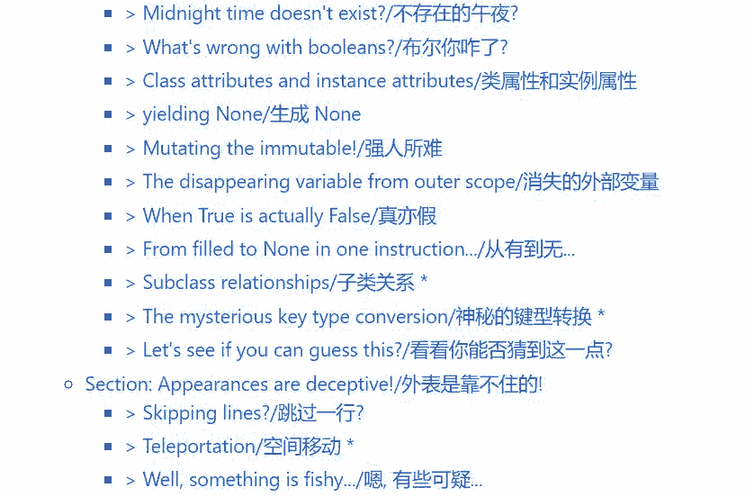

# WTF Python：有趣且鲜为人知的 Python 特性

机器之心转载

**译者：暮晨**

> Python 是一个设计优美的解释型高级语言，它提供了很多能让程序员感到舒适的功能特性。但有的时候，Python 的一些输出结果对于初学者来说似乎并不是那么一目了然。
> 
> 这个有趣的项目意在收集 Python 中那些难以理解和反人类直觉的例子以及鲜为人知的功能特性，并尝试讨论这些现象背后真正的原理！

虽然下面的有些例子并不一定会让你觉得 WTFs，但它们依然有可能会告诉你一些你所不知道的 Python 有趣特性。我觉得这是一种学习编程语言内部原理的好办法，而且我相信你也会从中获得乐趣！

如果您是一位经验比较丰富的 Python 程序员，你可以尝试挑战看是否能一次就找到例子的正确答案。你可能对其中的一些例子已经比较熟悉了，那这也许能唤起你当年踩这些坑时的甜蜜回忆~

如果你不是第一次读了, 你可以在这里获取变动内容.

*   更新说明：https://github.com/satwikkansal/wtfpython/releases/

*   项目地址：https://github.com/leisurelicht/wtfpython-cn

*   英文版：https://github.com/satwikkansal/wtfpython

*   pdf 版：http://www.satwikkansal.xyz/wtfpython-pdf/

那么，让我们开始吧...





**Structure of the Examples/示例结构**

所有示例的结构都如下所示：

**> 一个精选的标题 ***

标题末尾的星号表示该示例在第一版中不存在，是最近添加的。

```py
# 准备代码.# 释放魔法... 
```

Output (Python version):

```py
>>> 触发语句

出乎意料的输出结果 
```

（可选）：对意外输出结果的简短描述。

说明：

*   简要说明发生了什么以及为什么会发生。

```py
如有必要, 举例说明 
```

Output:

```py
>>> 触发语句 # 一些让魔法变得容易理解的例子# 一些正常的输入 
```

注意: 所有的示例都在 Python 3.5.2 版本的交互解释器上测试过, 如果不特别说明应该适用于所有 Python 版本.

**Usage/用法**

我个人建议，最好依次阅读下面的示例，并对每个示例：

*   仔细阅读设置例子最开始的代码。如果您是一位经验丰富的 Python 程序员，那么大多数时候您都能成功预期到后面的结果。

*   阅读输出结果，

*   确认结果是否如你所料。

*   确认你是否知道这背后的原理。

*   如果不知道, 深呼吸然后阅读说明 (如果你还是看不明白, 别沉默！可以在这 (https://github.com/satwikkansal/wtfPython) 提个 issue)。

*   如果知道，给自己点奖励，然后去看下一个例子。

PS: 你也可以在命令行阅读 WTFpython. 我们有 pypi 包 和 npm 包 (支持代码高亮)。(译: 这两个都是英文版的)

安装 npm 包 wtfpython（https://www.npmjs.com/package/wtfpython）

```py
$ npm install -g wtfpython 
```

或者, 安装 pypi 包 wtfpython（https://pypi.python.org/pypi/wtfpython）

```py
$ pip install wtfpython -U 
```

现在, 在命令行中运行 wtfpython, 你就可以开始浏览了.

**Examples/示例**

**Section: Strain your brain!/大脑运动!**

**> Strings can be tricky sometimes/微妙的字符串 ***

1.

```py
>>> a = "some_string"
>>> id(a)140420665652016
>>> id("some" + "_" + "string") # 注意两个的 id 值是相同的.
140420665652016
```

2.

```py
>>> a = "wtf"
>>> b = "wtf"
>>> a is bTrue
>>> a = "wtf!"
>>> b = "wtf!"
>>> a is bFalse
>>> a, b = "wtf!", "wtf!"
>>> a is b
True
```

3.

```py
>>> 'a' * 20 is 'aaaaaaaaaaaaaaaaaaaa'
True
>>> 'a' * 21 is 'aaaaaaaaaaaaaaaaaaaaa'
False
```

很好理解, 对吧?

说明:

*   这些行为是由于 Cpython 在编译优化时, 某些情况下会尝试使用已经存在的不可变对象而不是每次都创建一个新对象。（这种行为被称作字符串的驻留 [string interning]）

*   发生驻留之后, 许多变量可能指向内存中的相同字符串对象。（从而节省内存）

*   在上面的代码中, 字符串是隐式驻留的. 何时发生隐式驻留则取决于具体的实现. 这里有一些方法可以用来猜测字符串是否会被驻留：

*   所有长度为 0 和长度为 1 的字符串都被驻留。

*   字符串在编译时被实现（'wtf' 将被驻留, 但是 ''.join(['w', 't', 'f'] 将不会被驻留）

*   字符串中只包含字母，数字或下划线时将会驻留. 所以 'wtf!' 由于包含 ! 而未被驻留. 可以在这里找到 CPython 对此规则的实现。


*   当在同一行将 a 和 b 的值设置为 "wtf!" 的时候, Python 解释器会创建一个新对象, 然后同时引用第二个变量。如果你在不同的行上进行赋值操作，它就不会「知道」已经有一个 wtf！对象 (因为 "wtf!" 不是按照上面提到的方式被隐式驻留的). 它是一种编译器优化, 特别适用于交互式环境。

*   常量折叠 (constant folding) 是 Python 中的一种 窥孔优化 (peephole optimization) 技术。这意味着在编译时表达式 'a'*20 会被替换为 'aaaaaaaaaaaaaaaaaaaa' 以减少运行时的时钟周期。只有长度小于 20 的字符串才会发生常量折叠。(为啥? 想象一下由于表达式 'a'*10**10 而生成的 .pyc 文件的大小)。相关的源码实现在这里（https://github.com/python/cpython/blob/3.6/Python/peephole.c#L288）。

**> Time for some hash brownies!/是时候来点蛋糕了!**

*   hash brownie 指一种含有大麻成分的蛋糕, 所以这里是句双关

1.

```py
some_dict = {}
some_dict[5.5] = "Ruby"
some_dict[5.0] = "JavaScript"
some_dict[5] = "Python"
```

Output:

```py
>>> some_dict[5.5]
"Ruby"
>>> some_dict[5.0]
"Python"
>>> some_dict[5]
"Python"
```

"Python" 消除了 "JavaScript" 的存在?

说明:

*   Python 字典通过检查键值是否相等和比较哈希值来确定两个键是否相同。

*   具有相同值的不可变对象在 Python 中始终具有相同的哈希值。

```py
>>> 5 == 5.0
True
>>> hash(5) == hash(5.0)
True
```

注意: 具有不同值的对象也可能具有相同的哈希值（哈希冲突）.

*   当执行 some_dict[5] = "Python" 语句时, 因为 Python 将 5 和 5.0 识别为 some_dict 的同一个键, 所以已有值 "JavaScript" 就被 "Python" 覆盖了.

*   这个 StackOverflow 的回答（https://stackoverflow.com/a/32211042/4354153）漂亮的解释了这背后的基本原理.

**> Return return everywhere!/到处返回！**

```py
def some_func():
    try:
            return 'from_try'
    finally:
                    return 'from_finally'
```

Output:

```py
>>> some_func()
'from_finally'
```

说明:

*   当在 "try...finally" 语句的 try 中执行 return, break 或 continue 后，finally 子句依然会执行。

*   函数的返回值由最后执行的 return 语句决定。由于 finally 子句一定会执行，所以 finally 子句中的 return 将始终是最后执行的语句。

**> Deep down, we're all the same./本质上, 我们都一样. ***

```py
class WTF:
  pass
```

Output:

```py
>>> WTF() == WTF() # 两个不同的对象应该不相等
False
>>> WTF() is WTF() # 也不相同
False
>>> hash(WTF()) == hash(WTF()) # 哈希值也应该不同
True
>>> id(WTF()) == id(WTF())
True
```

说明：

*   当调用 id 函数时，Python 创建了一个 WTF 类的对象并传给 id 函数。然后 id 函数获取其 id 值 (也就是内存地址)，然后丢弃该对象。该对象就被销毁了。

*   当我们连续两次进行这个操作时，Python 会将相同的内存地址分配给第二个对象。因为 (在 CPython 中) id 函数使用对象的内存地址作为对象的 id 值，所以两个对象的 id 值是相同的。

*   综上，对象的 id 值仅仅在对象的生命周期内唯一。在对象被销毁之后，或被创建之前，其他对象可以具有相同的 id 值。

*   那为什么 is 操作的结果为 False 呢？让我们看看这段代码。

```py
class WTF(object):
  def __init__(self): print("I")
    def __del__(self): print("D")
```

Output:

```py
>>> WTF() is WTF()
I
I
D
DFalse>>> id(WTF()) == id(WTF())
I
D
I
DTrue
```

正如你所看到的, 对象销毁的顺序是造成所有不同之处的原因.

**> For what?/为什么?**

```py
some_string = "wtf"
some_dict = {}
for i, some_dict[i] in enumerate(some_string):
    pass
```

Output:

```py
>>> some_dict # 创建了索引字典.
{0: 'w', 1: 't', 2: 'f'}
```

说明:

*   Python 语法 中对 for 的定义是:

```py
for_stmt: 'for' exprlist 'in' testlist ':' suite ['else' ':' suite]
```

其中 exprlist 指分配目标。这意味着对可迭代对象中的每一项都会执行类似 {exprlist} = {next_value} 的操作。

一个有趣的例子说明了这一点：

```py
for i in range(4):
    print(i)
    i = 10
```

Output:

```py
0
1
2
3
```

你可曾觉得这个循环只会运行一次?

说明:

*   由于循环在 Python 中工作方式，赋值语句 i = 10 并不会影响迭代循环，在每次迭代开始之前，迭代器 (这里指 range(4)) 生成的下一个元素就被解包并赋值给目标列表的变量 (这里指 i) 了。

*   在每一次的迭代中, enumerate(some_string) 函数就生成一个新值 i (计数器增加) 并从 some_string 中获取一个字符. 然后将字典 some_dict 键 i (刚刚分配的) 的值设为该字符. 本例中循环的展开可以简化为：

```py
>>> i, some_dict[i] = (0, 'w')
>>> i, some_dict[i] = (1, 't')
>>> i, some_dict[i] = (2, 'f')
>>> some_dict
```

**> Evaluation time discrepancy/评估时间差异**

1.

```py
array = [1, 8, 15]
g = (x for x in array if array.count(x) > 0)
array = [2, 8, 22]
```

Output:

```py
>>> print(list(g))
[8]
```

2.

```py
array_1 = [1,2,3,4]
g1 = (x for x in array_1)
array_1 = [1,2,3,4,5]

array_2 = [1,2,3,4]
g2 = (x for x in array_2)
array_2[:] = [1,2,3,4,5]
```

Output:

```py
>>> print(list(g1))
[1,2,3,4]

>>> print(list(g2))
[1,2,3,4,5]
```

说明

*   在生成器表达式中，in 子句在声明时执行，而条件子句则是在运行时执行。

*   所以在运行前，array 已经被重新赋值为 [2, 8, 22]，因此对于之前的 1, 8 和 15, 只有 count(8) 的结果是大于 0 的，所以生成器只会生成 8。

*   第二部分中 g1 和 g2 的输出差异则是由于变量 array_1 和 array_2 被重新赋值的方式导致的。

*   在第一种情况下，array_1 被绑定到新对象 [1,2,3,4,5]，因为 in 子句是在声明时被执行的，所以它仍然引用旧对象 1,2,3,4。

*   在第二种情况下，对 array_2 的切片赋值将相同的旧对象 [1,2,3,4] 原地更新为 [1,2,3,4,5]。因此 g2 和 array_2 仍然引用同一个对象 (这个对象现在已经更新为 [1,2,3,4,5])。

**> is is not what it is!/出人意料的 is!**

下面是一个在互联网上非常有名的例子.

```py
>>> a = 256
>>> b = 256
>>> a is b
True

>>> a = 257
>>> b = 257
>>> a is b
False

>>> a = 257; b = 257
>>> a is b
True
```

说明:

is 和 == 的区别

*   is 运算符检查两个运算对象是否引用自同一对象 (即, 它检查两个预算对象是否相同)。

*   == 运算符比较两个运算对象的值是否相等。

*   因此 is 代表引用相同，== 代表值相等。下面的例子可以很好的说明这点，

```py
>>> [] == []
True
>>> [] is [] # 这两个空列表位于不同的内存地址.
False
```

256 是一个已经存在的对象, 而 257 不是

当你启动 Python 的时候， -5 到 256 的数值就已经被分配好了。这些数字因为经常使用所以适合被提前准备好。

引用自 https://docs.python.org/3/c-api/long.html

> 当前的实现为-5 到 256 之间的所有整数保留一个整数对象数组, 当你创建了一个该范围内的整数时, 你只需要返回现有对象的引用. 所以改变 1 的值是有可能的. 我怀疑这种行为在 Python 中是未定义行为. :-)

```py
>>> id(256)
10922528
>>> a = 256
>>> b = 256
>>> id(a)
10922528
>>> id(b)
10922528
>>> id(257)
140084850247312
>>> x = 257
>>> y = 257
>>> id(x)
140084850247440
>>> id(y)
140084850247344
```

这里解释器并没有智能到能在执行 y = 257 时意识到我们已经创建了一个整数 257，所以它在内存中又新建了另一个对象。

当 a 和 b 在同一行中使用相同的值初始化时，会指向同一个对象。

```py
>>> a, b = 257, 257
>>> id(a)
140640774013296
>>> id(b)
140640774013296
>>> a = 257
>>> b = 257
>>> id(a)
140640774013392
>>> id(b)
140640774013488
```

*   当 a 和 b 在同一行中被设置为 257 时, Python 解释器会创建一个新对象, 然后同时引用第二个变量. 如果你在不同的行上进行, 它就不会 "知道" 已经存在一个 257 对象了。

*   这是一种特别为交互式环境做的编译器优化. 当你在实时解释器中输入两行的时候, 他们会单独编译, 因此也会单独进行优化. 如果你在 .py 文件中尝试这个例子, 则不会看到相同的行为, 因为文件是一次性编译的。

**> A tic-tac-toe where X wins in the first attempt!/一蹴即至!**

```py
# 我们先初始化一个变量 row
row = [""]*3 #row i['', '', '']
# 并创建一个变量 board
board = [row]*3
```

Output:

```py
>>> board
[['', '', ''], ['', '', ''], ['', '', '']]
>>> board[0]
['', '', '']
>>> board[0][0]''
>>> board[0][0] = "X"
>>> board
[['X', '', ''], ['X', '', ''], ['X', '', '']]
```

我们有没有赋值过 3 个 "X" 呢？

说明:

当我们初始化 row 变量时, 下面这张图展示了内存中的情况。


而当通过对 row 做乘法来初始化 board 时, 内存中的情况则如下图所示 (每个元素 board[0], board[1] 和 board[2] 都和 row 一样引用了同一列表.)


我们可以通过不使用变量 row 生成 board 来避免这种情况. (这个 issue 提出了这个需求（https://github.com/satwikkansal/wtfpython/issues/68）

```py
>>> board = [['']*3 for _ in range(3)]
>>> board[0][0] = "X"
>>> board
[['X', '', ''], ['', '', ''], ['', '', '']]
```

**> The sticky output function/麻烦的输出**

```py
funcs = []
results = []
for x in range(7):
    def some_func():
            return x
    funcs.append(some_func)
    results.append(some_func())

funcs_results = [func() for func in funcs]
```

Output:

```py
>>> results
[0, 1, 2, 3, 4, 5, 6]
>>> funcs_results
[6, 6, 6, 6, 6, 6, 6]
```

即使每次在迭代中将 some_func 加入 funcs 前的 x 值都不相同, 所有的函数还是都返回 6。

// 再换个例子

```py
>>> powers_of_x = [lambda x: x**i for i in range(10)]
>>> [f(2) for f in powers_of_x]
[512, 512, 512, 512, 512, 512, 512, 512, 512, 512]
```

说明:

*   当在循环内部定义一个函数时，如果该函数在其主体中使用了循环变量，则闭包函数将与循环变量绑定，而不是它的值。因此，所有的函数都是使用最后分配给变量的值来进行计算的。

*   可以通过将循环变量作为命名变量传递给函数来获得预期的结果。为什么这样可行？因为这会在函数内再次定义一个局部变量。

```py
funcs = []
for x in range(7):
    def some_func(x=x):
            return x
    funcs.append(some_func)
```

Output:

```py
>>> funcs_results = [func() for func in funcs]
>>> funcs_results
[0, 1, 2, 3, 4, 5, 6]
```

**> is not ... is not is (not ...)/is not ... 不是 is (not ...)**

```py
>>> 'something' is not None
True
>>> 'something' is (not None)
False
```

说明：

*   is not 是个单独的二进制运算符，和分别使用 is 和 not 不同。

*   如果操作符两侧的变量指向同一个对象，则 is not 的结果为 False, 否则结果为 True。

本文中，机器之心摘录了该项目中约 1/4 的例子，更多内容请查看原项目页：

*   https://github.com/leisurelicht/wtfpython-cn ********


1.  点击**「阅读原文」**填写报名表单，工作人员在审核后会发送评选申请表格。

2.  申请企业需按照要求填写评选申请表格。

3.  未尽事宜可添加机器之心小助手：syncedai3 进行咨询；添加好友请备注「年度评选」。