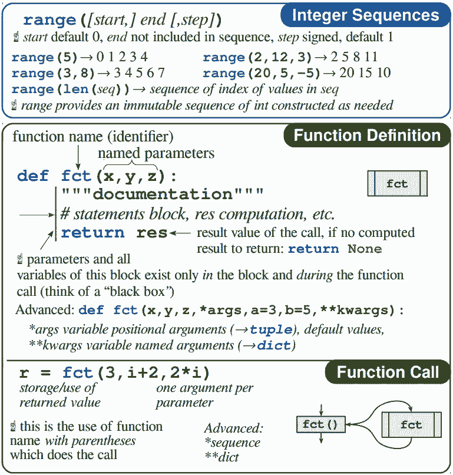

# 资源 | 忘了 Python 关键语句？这份备忘录拯救你的记忆

机器之心整理

**作者****：******Laurent Pointal****

 ****参与：****思源、刘晓坤**

> 今天要介绍的 Python 3 Cheat Sheet 由法国国家科学研究中心（CNRS）的法国机械工程与信息技术实验室（LIMSI）的工程师 Laurent Pointal 总结。这个简单的 Cheat Sheet 专注于从算法/编程开始所必需的语言部分，提供了学生入门所需的一般信息。注意：它不涉及面向对象的编程。

Python 3 Cheat Sheet 一共包含两页，分成了多个框图，涉及基本的 Python 数据结构、数学运算、条件和循环语句、文件读写，以及异常值处理等。在每个框图中，右上角是类型名称，蓝色和红色字体是该类型包含的关键字，绿色字体是示例，黑色斜体字提供更详细的信息。

*   pdf 地址：https://perso.limsi.fr/pointal/_media/python:cours:mementopython3-english.pdf

*   项目地址：https://perso.limsi.fr/pointal/python:memento

Python3 的基本数据类型和数据结构类型：

数据类型：整型（int）、浮点型（float）、布尔型（bool）、字符串（str）、二进制字节序列数（含二进制数、八进制数、十六进制数，bytes）等。

数据结构类型包含有序序列和键值容器。有序序列包含列表、元组和字符串等，其中列表和元组的重要区别是前者可变，后者不可变，列表主要用于存储同构数据，元组主要用于存储异构数据；键值容器没有预先设置顺序，可以通过访问键快速查找值，包含字典、集合等。

标识符：用于代表变量、函数、模块、类等的名称。注意尽量避免使用读音符号，不要使用 Python3 中的关键字，Python3 的标识符是区分大小写的，框图中分别列出了允许和不允许的标识符示例。

变量赋值：赋值也就是为变量赋予具体的值，等号左侧是变量名，右侧是值。如果右侧存在变量，可以看成是函数；可以将同一个值赋予多个变量；可以将多个值分别赋予多个变量；可以交换两个变量的值；可以用于表示循环语句，等。

类型转换：将数据从某一个数据类型转换为另一个数据类型，或将某一个数据结构转换为另一个数据结构。可以将表达式总结为 type(expression)，其中 type 是目标转换类型，expression 是要转换的数据或数据结构。此外，也可以用更具体的句式转换列表的格式，或者对列表中的每个数据同时转换数据类型。

序列容器索引：用于列表、元组、字符串、bytes 的数据排序。可以使用正索引，也可以使用负索引。定义了索引之后，可以方便地对容器的数据进行访问、赋值（可变量）等操作，数据访问/赋值可以用于单个数据，也可以用于多个数据，并能指定间隔、顺序/倒序等。

第一页剩余部分还包括：布尔逻辑、声明的模块结构、模块导入操作、数学运算、条件声明语句结构以及异常案例处理语句。

循环语句是编程语言中最核心的语句之一，如下在第二页所示在 Python 中主要有 while 循环与 for 循环。其中 While 循环需要一个「循环条件」，如果它为真，则继续迭代。而对于 For 循，我们可以把变量「var」应用需要循环的代码块中，「for」语句会迭代地从 seqence 中抽取它。注意这两个循环还会有控制语句，即立即从循环体跳出的 break 命令和跳过当前循环剩余语句并进入下一个循环的 continue 语句。

注意 for 循环需要可迭代目标，即列表、元组和字符串等，只有这样才能从它们中抽取元素。此外，for ... in range() 语句可以通过数值进行迭代，例如从 0 增加到 9 等。在上图还展示了 print() 函数和 input() 函数，其中 print() 函数可以打印字符串、变量和表达式。

Python 提供了非常多的内嵌运算函数，包括对数值变量的运算和各种数据结构的操作。如下展示了对列表、字典、集合和一般数据结构的操作方法，后面还继续展示了字符串或元组的操作。例如在一般数据结构的操作中，len() 函数可能是最常见的方法，它可以用来统计不同数据结构中元素的数量。例如如果一个列表中储存了所有神经元的输出值，那么我们可以使用 len() 统计神经元的数量，并用 for 循环依次访问不同的神经元。

后面的列表、字典和集合操作都非常重要，它们在机器学习及一般编程中都十分常见。例如在列表运算中，append() 方法会在列表的尾部添加新的元素，extend() 方法会将另外一个序列添加到列表的末尾，而 pop() 方法会移除列表中的一个元素（默认最后一个元素），并且返回该元素的值。列表数据结构还有其它很多方法，包括移除 remove()、排序 sort() 和统计 count() 等。

除了列表外，字典是另外一种很重要的数据结构，如果我们需要迭代地给神经网络不同层级的参数命名，那么很可能就需要借助字典数据结构。通过字典，我们可以使用数值型、字符型或其它类型的索引。字典的每个键值 (key=>value) 对用冒号 (:) 分割，每个对之间用逗号 (,) 分割，整个字典包括在花括号 ({}) 中。

字典同样也有非常多的方法，如上所示删除字典内所有元素的 clear() 方法、以列表返回可遍历的（键，值）元组的 items() 方法，以及把字典 d2 的键/值对更新到 d 里面的 update(d2) 方法。

下面备忘录中最重要的就是函数的定义和调用了，这在大多数编程语言中都是很核心的模块。函数的定义与调用都非常简单，这张表也只是展示了基本概念。此外，在这一张备忘录中，它并没有介绍类与实例等面向对象的编程方法。

最后是文件读写、字符串操作与字符串的格式化操作。其中文件读写在读写数据中是很常用的，当然我们也可以用 Pandas 等库实现更高效的读写方法。在对文件进行处理过程中，open() 方法用于打开一个文件，并返回文件对象，如果该文件无法被打开，会抛出 OSError。打开文件并执行某些操作后，一般我们都需要使用 write() 方法将字符串写入文件。每次打开一个文件，并完成读写后，我们必须使用 close() 关闭文件。

最后，两页完整的 Pyhon 3 备忘录展示如下，如果需要更清晰的 PDF 版，读者可点击「阅读原文」查阅。

****本文为机器之心整理，**转载请联系本公众号获得授权****。**

✄------------------------------------------------

**加入机器之心（全职记者 / 实习生）：hr@jiqizhixin.com**

**投稿或寻求报道：**content**@jiqizhixin.com**

**广告 & 商务合作：bd@jiqizhixin.com****