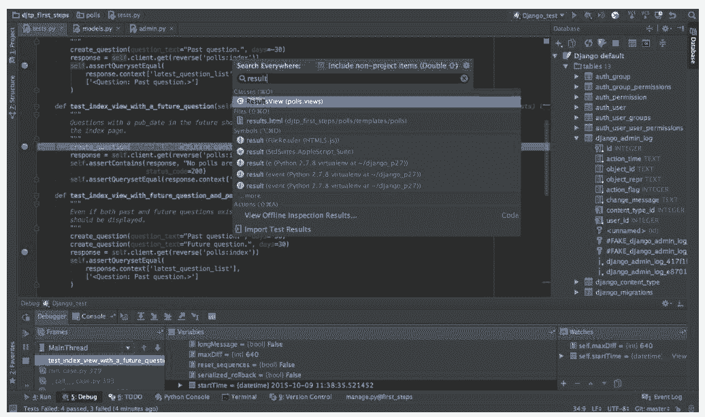

# 世界上最好的 Python 编辑器是什么？我投 PyCharm 一票

选自 KDnuggets

**作者：Saurabh Hooda**

**机器之心编译**

> 世界上最好的 Python 编辑器或 IDE 是什么？炫酷的界面、流畅的体验，我们投 PyCharm 一票，那么你呢？本文介绍了 PyCharm、Jupyter Notebook 和 Spyder 在内的 5 种主流 Python IDE，每一种都各有优缺点。不过结合经验教训，不论是纯文本编辑器还是集成开发环境，总有一款是你的最爱，那么快在文末为你最爱的 IDE 投上一票吧。

<mp-miniprogram class="miniprogram_element" data-miniprogram-appid="wxf424e2f3e2f94500" data-miniprogram-path="pages/resource/resource?id=aad4820e-5974-4bd3-b2af-3e3a29090da7&amp;from=weapp" data-miniprogram-nickname="机器之心 Synced" data-miniprogram-avatar="http://mmbiz.qpic.cn/mmbiz_png/f3g058loLBj0Pib4UhuCFagffSB1RHImwskFzvic6mSp2LDhuerbXxeqqv0b63wSt2Pas7MicNWIcia358rlnhiaVag/640?wx_fmt=png&amp;wxfrom=200" data-miniprogram-title="Python" data-miniprogram-imageurl="http://mmbiz.qpic.cn/mmbiz_jpg/KmXPKA19gW9IrJgldF5XXD9X7SwDEe895giaWCkNfaxdFnFnjhPt0xQFD2nwEqlyKWgibA7K8Dc5kcicfr29GyFrQ/0?wx_fmt=jpeg"></mp-miniprogram>

1991 年，Guido van Rossum 创建了 Python 并发布了第一个版本。这种解释型高级编程语言为通用编程而开发。Linux、MacOS 和 Windows 等操作系统中都有 Python 解释器。

经过近 30 年的发展，Python 已成为编程社区极受欢迎的语言。使用 IDLE 或 Python Shell 写 Python 编码适用于小型项目，但无法应对成熟的机器学习或数据科学项目。

在这种情况下，你需要使用一个 IDE（集成开发环境）或专用的代码编辑器。由于 Python 是最流行的编程语言之一，IDE 的选择也非常多。那么问题来了：「究竟什么样的 IDE 最适合 Python？」

很明显，没有哪一个 IDE 或代码编辑器可以称得上是「最好」的 Python IDE 或编辑器。这是因为它们各有优劣。此外，从为数众多的 IDE 中进行挑选实在太浪费时间。

但不用担心，本文已经为你整理好了。为了帮助你做出正确的选择，本文将介绍几种最适合 Python 的 IDE，专门用于处理数据科学项目。

**Atom**

*   平台：Linux/macOS/Windows

*   官网：https://atom.io/

*   类型：通用文本编辑器

Atom 是一种免费的开源文本及源代码编辑器，适用于 Java、PHP、Python 等多种编程语言。该文本编辑器支持用 Node.js 写成的插件。尽管 Atom 适用于多种语言，但它对 Python 情有独钟，其有趣的数据科学特性非常适合 Python。

Atom 的最大特点之一是支持 SQL 查询，但你需要安装 Data Atom 插件才能获取该特性。它支持 Microsoft SQL Server、MySQL 及 PostgreSQL。而且，你还可以可视化 Atom 的结果，无需打开其他任何窗口。

可以帮助 Python 数据科学家的另一个 Atom 插件是 Markdown Preview Plus。它可以为编辑、可视化 Markdown 文件提供支持，让你可以预览、渲染 LaTeX 公式等。

优点：

*   活跃的社区支持

*   与 Git 的完美集成

*   为管理多个项目提供支持

缺点：

*   在较老的 CPU 上运行可能会出现性能问题

*   可能遇到迁移问题

**Jupyter Notebook**

*   平台：Linux/macOS/Windows

*   官网：https://jupyter.org/

*   类型：基于 Web 的 IDE

Jupyter Netbook 起源于 2014 年的 Ipython，它是一种基于服务器-客户端结构的网页应用。Jupyter Netbook 允许我们通过「Notebook」创建和操作代码文件，并且采用一种即时运行的方法，这是 Jupyter Notebook 最重要的特性。对于 Python 数据科学家而言，Jupyter Notebook 基本上是必需品，因为它提供了最直观、最精炼的交互式数据科学环境。

对于刚入门的数据科学家而言，Jupyter 是最简单也最完美的工具。我们在写完一个代码片段后就能直接运行这些局部代码查看效果，因此它的交互效果是最好的。此外，Jupyter Notebook 中的单元可以选择代码或者文档，也就是说选择文档后可以直接按照 MarkDown 的语法写代码或整个文件的注释、心得和背景知识等。

通过使用 Matplotlib 和 Seaborn 等可视化工具，我们可以直接在代码单元下输出想要的可视化图信息。当然我们也可以将整个 Notebook 文件导出为 PDF、HTML 或纯 Python 代码文件，这非常有利于文件在不同平台间的传播，因此像谷歌的 Colab 等平台也都默认使用 Notebook 的这种形式。与 Ipython 一样，Jupyter Notebook 是一系列项目的总称，包括 Notebook、Console 和 Qt console 等。

优点：

*   允许使用 Notebook 直接创建博客或代码演示

*   确保可复现的研究与解释

*   在运行整体前可以运行并修正局部代码块

缺点：

*   复杂的安装过程（你也可以直接安装集成开发环境 Anoconda～）

**PyCharm**

*   平台：Linux/macOS/Windows

*   官网：https://www.jetbrains.com/pycharm/

*   类型：Python 专用 IDE

PyCharm 是 Python 的专用 IDE，地位类似于 Java 的 IDE Eclipse。功能齐全的集成开发环境同时提供收费版和免费版，即专业版和社区版。PyCharm 是安装最快的 IDE，且安装后的配置也非常简单，因此 PyCharm 基本上是数据科学家和算法工程师的首选 IDE。

对于喜欢 IPython 或 Anaconda 发行版的人而言，PyCharm 同样可以便捷地集成 Matplotlib 和 NumPy 等工具，这意味着我们在处理数据科学项目时可以便捷地使用数组查看器和交互式图表等。除此之外，IDE 还扩展了对 JavaScript 和 Angular JS 等语言的支持，这使得它同样也适合 Web 端的开发。

安装完成后，我们可以快速建立一个 Python 项目，并选择解释器和新的代码文件。可能我们会用 conda 等工具维护不同的环境，例如 TensorFlow 或 PyTorch 等，在建立新项目时只需要选择这些环境下的 Python 主程序就相当于选择了新环境。最后，除了提供直接 debug 和运行功能外，PyCharm 还提供对源代码和项目控制的支持。

优点：

*   活跃的社区支持

*   支持全面的 Python 开发，不论是数据科学还是非数据科学项目

*   新手和老兵都易于使用

*   快速 Reindexing

*   运行、编辑、debug Python 代码都不需要额外的支持

缺点：

*   加载可能比较慢

*   使用现有项目前可能需要调整默认设置

**Redeo**

*   平台：Linux/macOS/Windows

*   官网：https://rodeo.yhat.com/

*   类型：Python 专用 IDE

Redeo 的 logo 就暗示了这个 IDE 是专门为数据分析而开发的，如果用过 RStudio，你就会发现 Redeo 与它有很多相似的特征。对于那些不了解 RStudio 的人而言，你们只需要知道它是最流行的 R 语言集成开发环境。与 RStudio 一样，Rodeo 的窗口分为四部分，即代码文本编辑器、控制台、变量可视化环境和图形/库/文件的查看窗口。有意思的是，RStudio 和 Redeo 都与 MATLAB 有很多相似之处。

Redeo 的最大优势在于新手和老兵都能方便地使用。由于 Redeo 允许在写代码的同时查看变量和可视化等细节，它可以称得上是最好的数据科学 IDE 之一。此外，Redeo 还有内置的课程及辅助材料。

优点：

*   大量定制化设计

*   实时监控代码到底创建了些什么

*   通过自动补全和语法高亮，写代码会更快

缺点：

*   有很多 Bug

*   社区支持不是很多

*   内存问题

**Spyder**

*   平台：Linux/macOS/Windows

*   官网：https://www.github.com/spyder-ide/spyder

*   类型：Python 专用 IDE

Spyder 是 Python 专用的一种开源 IDE，其独特之处在于专为数据科学工作流程进行了优化。它与 Anconda 软件包管理器捆绑在一起，后者是 Python 编程语言的标准发行版。Spyder 拥有所有必需的 IDE 特性，包括代码完整性及集成文件浏览器。

Spyder 专为数据科学项目创建，具备平滑的学习曲线，即学即会。在线帮助选项允许用户在并行开发项目的同时寻找关于库的专门信息。而且，这个 Python 专用 IDE 与 RStudio 类似。因此，在从 R 切换到 Python 时这是一个恰当的选择。

适用于 Python 库的 Spyder 集成支持（如 Matplotlib 和 SciPy）进一步证明，Spyder 是为数据科学家量身打造的。除了可感知的 IPython/Jupyter 集成之外，Spyder 还有一个独特的「variable explorer」特性，允许使用基于表格的布局展示数据。

优点：

*   代码完备性和变量探索

*   易用性

*   数据科学项目的理想工具

*   界面整洁

*   活跃的社区支持

缺点：

*   不适用于非数据科学项目

*   对于高阶 Python 开发者而言太基础了

**如何为 Python 选择理想的 IDE？**

这完全取决于你的需求。以下是几点建议：

*   如果你刚开始使用 Python，找一个定制化较少、附加功能也较少的 IDE。干扰越少，上手越容易。

*   将这些 IDE 功能与你的期望进行对比。

*   多尝试几种 IDE 就会知道哪一种最适合你的需求。 ******

*原文链接：https://www.kdnuggets.com/2018/11/best-python-ide-data-science.html*

/mp/newappmsgvote?action=show&__biz=MzA3MzI4MjgzMw==&supervoteid=451345629#wechat_redirect

****本文为机器之心编译，**转载请联系本公众号获得授权****。**

✄------------------------------------------------

**加入机器之心（全职记者 / 实习生）：hr@jiqizhixin.com**

**投稿或寻求报道：**content**@jiqizhixin.com**

**广告 & 商务合作：bd@jiqizhixin.com**