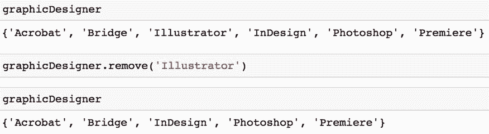
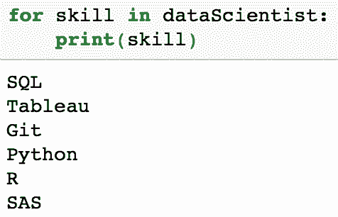
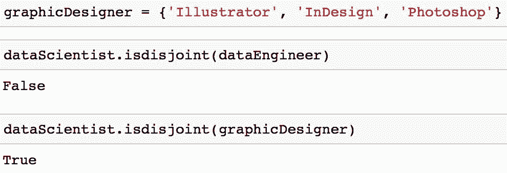

# 入门 | 一文带你了解 Python 集合与基本的集合运算

选自 DataCamp

**作者：****Michael Galarnyk**

****机器之心编译****

**参与：Geek Ai、思源**

> > 一般我们熟悉 Python 中列表、元组及字典等数据结构，但集合可能用得稍微少一点。但集合独特的元素唯一性与 O(1) 时间复杂度的成员检测方法，令其在很多任务中有特别的优势。本文介绍了 Python 集合的常见方法与概念，包括集合元素的操作、基本集合运算以及不可变集等。
> 
> 了解 Python 集合: 它们是什么，如何创建它们，何时使用它们，什么是内置函数，以及它们与集合论操作的关系
> 
> **集合、 列表与元组**
> 
> 列表（list）和元组（tuple）是标准的 Python 数据类型，它们将值存储在一个序列中。集合（set）是另一种标准的 Python 数据类型，它也可用于存储值。它们之间主要的区别在于，集合不同于列表或元组，集合中的每一个元素不能出现多次，并且是无序存储的。
> 
> **Python 集合的优势**
> 
> 由于集合中的元素不能出现多次，这使得集合在很大程度上能够高效地从列表或元组中删除重复值，并执行取并集、交集等常见的的数学操作。
> 
> 本教程将向你介绍一些关于 Python 集合和集合论的话题：
> 
> *   如何初始化空集和带有数值的集合
>     
>     
> *   如何向集合中添加值或者从集合中删除值
>     
>     
> *   如何高效地使用集合，用于成员检测、从列表中删除重复值等任务。
>     
>     
> *   如何执行常见的集合操作，例如求并集、交集、差集以及对称差。
>     
>     
> *   可变集合和不可变集之间的区别
>     
>     
> 
> 有了这个提纲，让我们开始吧。
> 
> **集合初始化**
> 
> 集合是一个拥有确定（唯一）的、不变的的元素，且元素无序的可变的数据组织形式。
> 
> 你可以使用「set()」操作初始化一个空集。
> 
> ```py
> emptySet = set() 
> ```
> 
> 如果要初始化一个带有值的集合，你可以向「set()」传入一个列表。
> 
> ```py
> dataScientist = set(['Python', 'R', 'SQL', 'Git', 'Tableau', 'SAS'])
> dataEngineer = set(['Python', 'Java', 'Scala', 'Git', 'SQL', 'Hadoop']) 
> ```
> 
> 
> 
> 如果你观察一下上面的「dataScientist」和「dataEngineer」集合中的变量，就会发现集合中元素值的顺序与添加时的顺序是不同的，这是因为集合是无序的。
> 
> 集合包含的值也可以通过花括号来初始化。
> 
> ```py
> dataScientist = {'Python', 'R', 'SQL', 'Git', 'Tableau', 'SAS'}
> dataEngineer = {'Python', 'Java', 'Scala', 'Git', 'SQL', 'Hadoop'} 
> ```
> 
> 
> 
> 请牢记，花括号只能用于初始化包含值的集合。如下图所示，使用不包含值的花括号是初始化字典（dict）的方法之一，而不是初始化集合的方法。
> 
> 
> 
> **向集合添加值或删除值**
> 
> 要想向集合中添加值或从中删除值，你首先必须初始化一个集合。
> 
> ```py
> # Initialize set with values
> graphicDesigner = {'InDesign', 'Photoshop', 'Acrobat', 'Premiere', 'Bridge'} 
> ```
> 
> **向集合中添加值**
> 
> 你可以使用「add」方法向集合中添加一个值。
> 
> ```py
> graphicDesigner.add('Illustrator') 
> ```
> 
> 
> 
> 需要注意的一点是，你只能将不可变的值（例如一个字符串或一个元组）加入到集合中。举例而言，如果你试图将一个列表（list）添加到集合中，系统会返回类型错误「TyprError」。
> 
> ```py
> graphicDesigner.add(['Powerpoint', 'Blender']) 
> ```
> 
> 
> 
> **从集合中删除值**
> 
> 有好几种方法可以从集合中删除一个值：
> 
> **选项 1**：你可以使用「remove」方法从集合中删除一个值。
> 
> ```py
> graphicDesigner.remove('Illustrator') 
> ```
> 
> 
> 
> 这种方法的一个缺点是，如果你想要删除一个集合中不存在的值，系统会返回一个键值错误「KeyError」。
> 
> 
> 
> **选项 2：**你可以使用「discard」方法从集合中删除一个值。
> 
> ```py
> graphicDesigner.discard('Premiere') 
> ```
> 
> 
> 
> 这种方法相对于「remove」方法的好处是，如果你试图删除一个集合中不存在的值，系统不会返回「KeyError」。如果你熟悉字典（dict）数据结构，你可能会发现这种方法与字典的「get」方法的工作模式相似。
> 
> 选项 3：你还可以使用「pop」方法从集合中删除并且返回一个任意的值。
> 
> ```py
> graphicDesigner.pop() 
> ```
> 
> 
> 
> 需要注意的是，如果集合是空的，该方法会返回一个「KeyError」。
> 
> **删除集合中所有的值**
> 
> 你可以使用「clear」方法删除集合中所有的值。
> 
> ```py
> graphicDesigner.clear() 
> ```
> 
> 
> 
> **在集合上进行迭代**
> 
> 与许多标准 Python 数据类型一样，用户可以在集合（set）上进行迭代。
> 
> ```py
> # Initialize a set
> dataScientist = {'Python', 'R', 'SQL', 'Git', 'Tableau', 'SAS'}
> 
> for skill in dataScientist:
>     print(skill) 
> ```
> 
> 
> 
> 如果你仔细观察「dataScientist」集合中打印出来的每一个值，你会发现集合中的值被打印出来的顺序与它们被添加的顺序是不同的。
> 
> **将集合中的值变为有序**
> 
> 本教程已经向大家强调了集合是无序的。如果你认为你需要以有序的形式从集合中取出值，你可以使用「sorted」函数，它会输出一个有序的列表。
> 
> ```py
> type(sorted(dataScientist)) 
> ```
> 
> 
> 
> 下面的代码按照字母降序（这里指 Z-A）输出「dataScientist」集合中的值。
> 
> ```py
> sorted(dataScientist, reverse = True) 
> ```
> 
> 
> 
> **删除列表中的重复项**
> 
> 首先我们必须强调的是，集合是从列表（list）中删除重复值的最快的方法。为了证明这一点，让我们研究以下两种方法之间的差异。
> 
> **方法 1：**使用集合删除列表中的重复值。
> 
> ```py
> print(list(set([1, 2, 3, 1, 7]))) 
> ```
> 
> 方法 2：使用一个列表推导式（list comprehension）从一个列表中删除重复值。
> 
> ```py
> def remove_duplicates(original):
>     unique = []
>     [unique.append(n) for n in original if n not in unique]
>     return(unique)
> 
> print(remove_duplicates([1, 2, 3, 1, 7])) 
> ```
> 
> 性能的差异可以用「timeit」库来测量，这个库允许你对 Python 代码进行计时。下面的代码将每种方法运行了 10,000 次，并且以秒为单位输出了总计时间。
> 
> ```py
> import timeit
> 
> # Approach 1: Execution time
> print(timeit.timeit('list(set([1, 2, 3, 1, 7]))', number=10000))
> 
> # Approach 2: Execution time
> print(timeit.timeit('remove_duplicates([1, 2, 3, 1, 7])', globals=globals(), number=10000)) 
> ```
> 
> 
> 
> 对比这两种方法，结果表明，使用集合删除重复值是更加高效的。虽然时间差异看似很小，但实际上在有一个非常大的列表时，能帮你节省很多的时间。
> 
> **集合运算方法**
> 
> Python 中常用的集合方法是执行标准的数学运算，例如：求并集、交集、差集以及对称差。下图显示了一些在集合 A 和集合 B 上进行的标准数学运算。每个韦恩（Venn）图中的红色部分是给定集合运算得到的结果。
> 
> 
> 
> Python 集合有一些让你能够执行这些数学运算的方法，还有一些给你等价结果的运算符。在研究这些方法之前，让我们首先初始化「dataScientist」和「dataEngineer」这两个集合。
> 
> ```py
> dataScientist = set(['Python', 'R', 'SQL', 'Git', 'Tableau', 'SAS'])
> dataEngineer = set(['Python', 'Java', 'Scala', 'Git', 'SQL', 'Hadoop']) 
> ```
> 
> **并集**
> 
> 一个表示为「dataScientist ∪ dataEngineer」的并集，是属于「dataScientist」或「dataEngineer」或同时属于二者元素的集合。你可以使用「union」方法找出两个集合中所有唯一的值。
> 
> ```py
> # set built-in function union
> dataScientist.union(dataEngineer)
> 
> # Equivalent Result
> dataScientist | dataEngineer 
> ```
> 
> 求并集操作返回的集合可以被可视化为下面的韦恩（Venn）图中的红色部分。
> 
> 
> 
> **交集**
> 
> 集合「dataScientist」和「dataEngineer」的交集可以表示为「dataScientist ∩ dataEngineer」，是所有同时属于两个集合的元素集合。
> 
> ```py
> # Intersection operation
> dataScientist.intersection(dataEngineer)
> 
> # Equivalent Result
> dataScientist & dataEngineer 
> ```
> 
> 
> 
> 交集运算返回的集合可以被可视化为下面韦恩图中的红色部分。
> 
> 
> 
> 你可能会发现，你会遇到你想确保两个集合没有共同值的情况。换句话说，你想得到两个交集为空的集合。这两个集合称为互斥集合，你可以使用「isdisjoint」方法测试两个集合是否为互斥。
> 
> ```py
> # Initialize a set
> graphicDesigner = {'Illustrator', 'InDesign', 'Photoshop'}
> 
> # These sets have elements in common so it would return False
> dataScientist.isdisjoint(dataEngineer)
> 
> # These sets have no elements in common so it would return True
> dataScientist.isdisjoint(graphicDesigner) 
> ```
> 
> 
> 
> 你会注意到，在如下韦恩图所示的交集中，「dataScientist」和「graphicDesigner」没有共有的值。
> 
> 
> 
> **差集**
> 
> 集合「dataScientist」和「dataEngineer」的差集可以表示为「dataScientist \ dataEngineer」，是所有属于「dataScientist」但不属于「dataEngineer」的元素集合。
> 
> ```py
> # Difference Operation
> dataScientist.difference(dataEngineer)
> 
> # Equivalent Result
> dataScientist - dataEngineer 
> ```
> 
> 
> 
> 差集运算返回的结果可以被可视化为以下韦恩图中的红色部分。
> 
> 
> 
> **对称集**
> 
> 一个「dataScientist」和「dataEngineer」的对称集，表示为「dataScientist △ dataEngineer」，它是所有属于两个集合但不属于二者共有部分的集合。
> 
> ```py
> # Symmetric Difference Operation
> dataScientist.symmetric_difference(dataEngineer)
> 
> # Equivalent Result
> dataScientist ^ dataEngineer 
> ```
> 
> 
> 
> 对称集运算返回的结果可以被可视化为下面韦恩图中的红色部分。
> 
> 
> 
> **集合推导式**
> 
> 你之前可能已经学习过列表推导式（list comprehensions）、字典推导式（dictionary comprehensions）和生成器推导式。这里还有一个集合推导式（Set Comprehension）。集合推导式和它们是很类似的，Python 中的集合推导式可以按照下面的方法构造：
> 
> ```py
> {skill for skill in ['SQL', 'SQL', 'PYTHON', 'PYTHON']} 
> ```
> 
> 
> 
> 上面的输出为一个包含 2 个值的集合，因为集合中相同的元素不能多次出现。使用集合推导式背后的动机是希望能够用手动进行数学运算的方法在代码中编写和推导式子。
> 
> ```py
> {skill for skill in ['GIT', 'PYTHON', 'SQL'] if skill not in {'GIT', 'PYTHON', 'JAVA'}} 
> ```
> 
> 
> 
> 上面的代码与你之前学过的求差集类似，只是看上去有一点点不同。
> 
> **成员检测**
> 
> 成员检测能够检查某个特定的元素是否被包含在一个序列中，例如字符串、列表、元组或集合。在 Python 中使用集合的一个主要的优点是，它们在 Python 中为成员检测做了深度的优化。例如，对集合做成员检测比对列表做成员检测高效地多。如果你是计算机科班出身，我们可以说，这是因为集合中成员检测的平均时间复杂度是 O（1）的而列表中则是 O（n）。
> 
> 下面的代码展示了使用列表做成员检测的过程：
> 
> ```py
> # Initialize a list
> possibleList = ['Python', 'R', 'SQL', 'Git', 'Tableau', 'SAS', 'Java', 'Spark', 'Scala']
> 
> # Membership test
> 'Python' in possibleList 
> ```
> 
> 
> 
> 集合中也可以做类似的操作，只不过集合更加高效。
> 
> ```py
> # Initialize a set
> possibleSet = {'Python', 'R', 'SQL', 'Git', 'Tableau', 'SAS', 'Java', 'Spark', 'Scala'}
> # Membership test
> 'Python' in possibleSet 
> ```
> 
> 
> 
> 由于「possibleSet」是一个集合，而且「Python」是集合「possibleSet」中的一个元素，这可以被表示为「Python' ∈ possibleSet」如果你有一个不属于集合的值，比如「Fortran」，这可以被表示为「Fortran' ∉ possibleSet」。
> 
> **子集**
> 
> 实际上集合的成员及成员的组合就是一个子集，让我们首先初始化两个集合。
> 
> ```py
> possibleSkills = {'Python', 'R', 'SQL', 'Git', 'Tableau', 'SAS'}
> mySkills = {'Python', 'R'} 
> ```
> 
> 如果集合「mySkills」中的每一个值都属于集合「possibleSkills」，那么「mySkills」被称为「possibleSkills」的一个子集，数学上写作「mySkills ⊆ possibleSkills」。你可以使用「issubset」方法检查一个集合是否是另一个集合的子集。
> 
> ```py
> mySkills.issubset(possibleSkills) 
> ```
> 
> 
> 
> 因为在这个例子中，这个方法返回的是「True」。在下面的韦恩图中，请注意「mySkills」中的每一个值同时也在集合「possibleSkills」中。
> 
> 
> 
> **不可变集**
> 
> 我们常常能看到嵌套的列表或元组，它们的元素可能是另一个列表或元组。
> 
> ```py
> # Nested Lists and Tuples
> nestedLists = [['the', 12], ['to', 11], ['of', 9], ['and', 7], ['that', 6]]
> nestedTuples = (('the', 12), ('to', 11), ('of', 9), ('and', 7), ('that', 6)) 
> ```
> 
> 
> 
> 嵌套集合的问题在于，集合中通常不能包含集合等可变的值。在这种情况下，你可能希望使用一个不可变集（frozenset）。除了值不可以改变，不可变集和可变集是很相似的。你可以使用「frozenset()」创建一个不可变集。
> 
> ```py
> # Initialize a frozenset
> immutableSet = frozenset() 
> ```
> 
> 
> 
> 如果你使用如下所示的不可变集，就可以创建一个嵌套集合了。
> 
> ```py
> nestedSets = set([frozenset()]) 
> ```
> 
> 
> 
> 重要的是，你需要记住，不可变集的一个主要的缺点是：由于它们是不可变的，这意味着你不能向其中添加元素或者删除其中的元素。
> 
> **结语**
> 
> Python 集合是非常实用的，它能够高效地从列表等数据结构中删除重复的值，并且执行常见的数学运算，例如：求并集、交集。人们经常遇到的一个挑战是：何时使用各种数据类型，例如什么时候使用集合或字典。作者希望本文能展示基本的集合概念，并有利于我们在不同任务中使用不同的数据类型。
> 
> *原文链接：https://www.datacamp.com/community/tutorials/sets-in-python*
> 
> ****本文为机器之心编译，**转载请联系本公众号获得授权****。**
> 
> ✄------------------------------------------------
> 
> **加入机器之心（全职记者 / 实习生）：hr@jiqizhixin.com**
> 
> **投稿或寻求报道：**content**@jiqizhixin.com**
> 
> **广告 & 商务合作：bd@jiqizhixin.com**