# 教程 | 入门 Python 神经机器翻译，这是一篇非常精简的实战指南

选自 Medium

**作者：Susan Li**

**机器之心编译**

**参与：Huiyuan Zhuo、思源**

> 机器翻译（MT）是一项极具挑战性的任务，其研究如何使用计算机将文本或是语音从一种语言翻译成另一种语言。本文借助 Keras 从最基本的文本加载与数据预处理开始，并讨论了在循环神经网络与编码器解码器框架下如何才能构建一个可接受的神经翻译系统，本教程所有的代码已在 GitHub 开源。

传统意义上来说，机器翻译一般使用高度复杂的语言知识开发出的大型统计模型，但是近来很多研究使用深度模型直接对翻译过程建模，并在只提供原语数据与译文数据的情况下自动学习必要的语言知识。这种基于深度神经网络的翻译模型目前已经获得了最佳效果。

项目地址：https://github.com/susanli2016/NLP-with-Python/blob/master/machine_translation.ipynb

接下来，我们将使用深度神经网络来解决机器翻译问题。我们将展示如何开发一个将英文翻译成法文的神经网络机器翻译模型。该模型将接收英文文本输入同时返回法语译文。更确切地说，我们将构建 4 个模型，它们是：

*   一个简单的 RNN；

*   一个带词嵌入的 RNN；

*   一个双向 RNN；

*   一个编码器—解码器模型。

训练和评估深度神经网络是一项计算密集型的任务。作者使用 AWS EC2 实例来运行所有代码。如果你打算照着本文做，你得访问 GPU 实例。

**加载库**

```py
import collections
import helper
import numpy as np
import project_tests as tests
from keras.preprocessing.text import Tokenizer
from keras.preprocessing.sequence import pad_sequences
from keras.models import Model
from keras.layers import GRU, Input, Dense, TimeDistributed, Activation, RepeatVector, Bidirectional
from keras.layers.embeddings import Embedding
from keras.optimizers import Adam
from keras.losses import sparse_categorical_crossentropy
```

作者使用 help.py 加载数据，同时使用 project_test.py 测试函数。

**数据**

该数据集包含一个相对较小的词汇表，其中 small_vocab_en 文件包含英文语句，small_vocab_fr 包含对应的法文翻译。

数据集下载地址：https://github.com/susanli2016/NLP-with-Python/tree/master/data

**加载数据**

```py
english_sentences = helper.load_data('data/small_vocab_en')
french_sentences = helper.load_data('data/small_vocab_fr')
print('Dataset Loaded')
```

*   **语句样本**

small_vocab_en 中的每行包含一个英文语句，同时其法文翻译位于 small_vocab_fr 中对应的每行。

```py
for sample_i in range(2):
 print('small_vocab_en Line {}: {}'.format(sample_i + 1, english_sentences[sample_i]))
 print('small_vocab_fr Line {}: {}'.format(sample_i + 1, french_sentences[sample_i]))
```

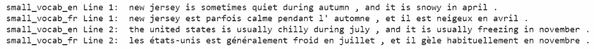

*   **词汇表**

问题的复杂性取决于词汇表的复杂性。一个更复杂的词汇表意味着一个更复杂的问题。对于将要处理的数据集，让我们看看它的复杂性。

```py
english_words_counter = collections.Counter([word for sentence in english_sentences for word in sentence.split()])
french_words_counter = collections.Counter([word for sentence in french_sentences for word in sentence.split()])
print('{} English words.'.format(len([word for sentence in english_sentences for word in sentence.split()])))
print('{} unique English words.'.format(len(english_words_counter)))
print('10 Most common words in the English dataset:')
print('"' + '" "'.join(list(zip(*english_words_counter.most_common(10)))[0]) + '"')
print()
print('{} French words.'.format(len([word for sentence in french_sentences for word in sentence.split()])))
print('{} unique French words.'.format(len(french_words_counter)))
print('10 Most common words in the French dataset:')
print('"' + '" "'.join(list(zip(*french_words_counter.most_common(10)))[0]) + '"') 
```


**预处理**

我们将使用以下预处理方法将文本转化为整数序列：

1\. 将词转化为 id 表达；

2\. 加入 padding 使得每个序列一样长。

**Tokensize（标记字符串）**

使用 Keras 的 Tokenizer 函数将每个语句转化为一个单词 id 的序列。使用该函数来标记化英文语句和法文语句。

函数 tokenize 返回标记化后的输入和类。

```py
def tokenize(x):
 x_tk = Tokenizer(char_level = False)
 x_tk.fit_on_texts(x)
 return x_tk.texts_to_sequences(x), x_tk
text_sentences = [
 'The quick brown fox jumps over the lazy dog .',
 'By Jove , my quick study of lexicography won a prize .',
 'This is a short sentence .']
text_tokenized, text_tokenizer = tokenize(text_sentences)
print(text_tokenizer.word_index)
print()
for sample_i, (sent, token_sent) in enumerate(zip(text_sentences, text_tokenized)):
 print('Sequence {} in x'.format(sample_i + 1))
 print(' Input: {}'.format(sent))
 print(' Output: {}'.format(token_sent))
```

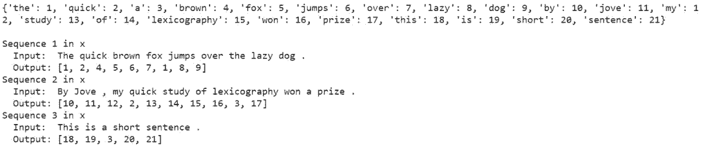

**Padding**

通过使用 Keras 的 pad_sequences 函数在每个序列最后添加零以使得所有英文序列具有相同长度，所有法文序列具有相同长度。

```py
def pad(x, length=None):
 if length is None:
 length = max([len(sentence) for sentence in x])
 return pad_sequences(x, maxlen = length, padding = 'post')
tests.test_pad(pad)
# Pad Tokenized output
test_pad = pad(text_tokenized)
for sample_i, (token_sent, pad_sent) in enumerate(zip(text_tokenized, test_pad)):
 print('Sequence {} in x'.format(sample_i + 1))
 print(' Input: {}'.format(np.array(token_sent)))
 print(' Output: {}'.format(pad_sent))
```

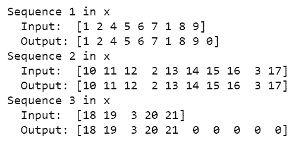

**预处理流程**

实现预处理函数：

```py
def preprocess(x, y):
 preprocess_x, x_tk = tokenize(x)
 preprocess_y, y_tk = tokenize(y)
preprocess_x = pad(preprocess_x)
 preprocess_y = pad(preprocess_y)
# Keras's sparse_categorical_crossentropy function requires the labels to be in 3 dimensions
 preprocess_y = preprocess_y.reshape(*preprocess_y.shape, 1)
return preprocess_x, preprocess_y, x_tk, y_tk
preproc_english_sentences, preproc_french_sentences, english_tokenizer, french_tokenizer =\
 preprocess(english_sentences, french_sentences)

max_english_sequence_length = preproc_english_sentences.shape[1]
max_french_sequence_length = preproc_french_sentences.shape[1]
english_vocab_size = len(english_tokenizer.word_index)
french_vocab_size = len(french_tokenizer.word_index)
print('Data Preprocessed')
print("Max English sentence length:", max_english_sequence_length)
print("Max French sentence length:", max_french_sequence_length)
print("English vocabulary size:", english_vocab_size)
print("French vocabulary size:", french_vocab_size) 
```

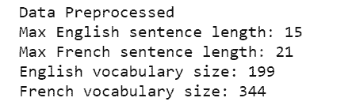

**模型**

在本节中，我们将尝试各种神经网络结构。我们将训练 4 个相对简单的结构作为开始：

*   模型 1 是一个简单的 RNN；

*   模型 2 是一个带词嵌入的 RNN；

*   模型 3 是一个双向 RNN；

*   模型 4 是两个 RNN 组成的编码器—解码器架构。

在尝试了 4 种简单的结构之后，我们将构建一个更深的模型，其性能要优于以上 4 种模型。

**id 重新转化为文本**

神经网络将输入转化为单词 id，但这不是我们最终想要的形式，我们想要的是法文翻译。logits_to_text 函数弥补了从神经网络输出的 logits 到法文翻译之间的缺口，我们将使用该函数更好地理解神经网络的输出。

```py
def logits_to_text(logits, tokenizer):
 index_to_words = {id: word for word, id in tokenizer.word_index.items()}
 index_to_words[0] = '<PAD>'
return ' '.join([index_to_words[prediction] for prediction in np.argmax(logits, 1)])
print('`logits_to_text` function loaded.')
```

**模型 1：RNN**

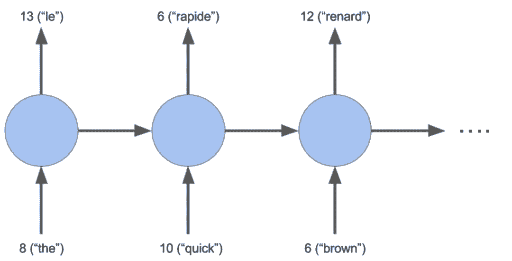

我们构建一个基础的 RNN 模型，该模型是将英文翻译成法文序列的良好基准。

```py
def simple_model(input_shape, output_sequence_length, english_vocab_size, french_vocab_size):
 learning_rate = 1e-3
 input_seq = Input(input_shape[1:])
 rnn = GRU(64, return_sequences = True)(input_seq)
 logits = TimeDistributed(Dense(french_vocab_size))(rnn)
 model = Model(input_seq, Activation('softmax')(logits))
 model.compile(loss = sparse_categorical_crossentropy, 
 optimizer = Adam(learning_rate), 
 metrics = ['accuracy'])

 return model
tests.test_simple_model(simple_model)
tmp_x = pad(preproc_english_sentences, max_french_sequence_length)
tmp_x = tmp_x.reshape((-1, preproc_french_sentences.shape[-2], 1))
# Train the neural network
simple_rnn_model = simple_model(
 tmp_x.shape,
 max_french_sequence_length,
 english_vocab_size,
 french_vocab_size)
simple_rnn_model.fit(tmp_x, preproc_french_sentences, batch_size=1024, epochs=10, validation_split=0.2)
# Print prediction(s)
print(logits_to_text(simple_rnn_model.predict(tmp_x[:1])[0], french_tokenizer))
```

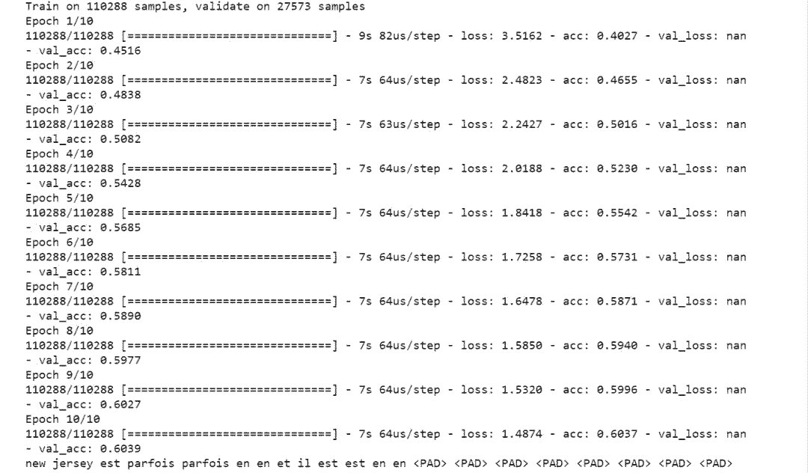

基础 RNN 模型的验证集准确度是 0.6039。

**模型 2：词嵌入**

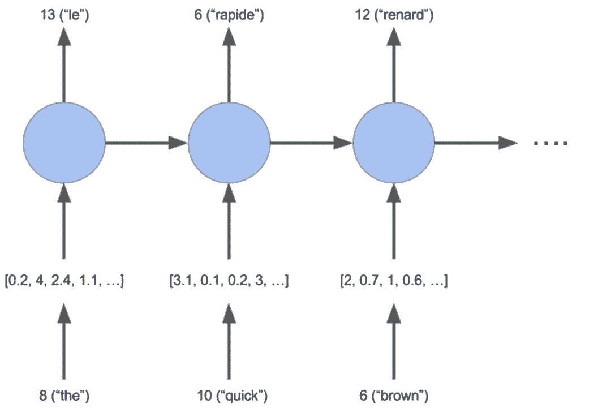

词嵌入是在 n 维空间中近义词距离相近的向量表示，其中 n 表示嵌入向量的大小。我们将使用词嵌入来构建一个 RNN 模型。

```py
from keras.models import Sequential
def embed_model(input_shape, output_sequence_length, english_vocab_size, french_vocab_size):
 learning_rate = 1e-3
 rnn = GRU(64, return_sequences=True, activation="tanh")

 embedding = Embedding(french_vocab_size, 64, input_length=input_shape[1]) 
 logits = TimeDistributed(Dense(french_vocab_size, activation="softmax"))

 model = Sequential()
 #em can only be used in first layer --> Keras Documentation
 model.add(embedding)
 model.add(rnn)
 model.add(logits)
 model.compile(loss=sparse_categorical_crossentropy,
 optimizer=Adam(learning_rate),
 metrics=['accuracy'])

 return model
tests.test_embed_model(embed_model)
tmp_x = pad(preproc_english_sentences, max_french_sequence_length)
tmp_x = tmp_x.reshape((-1, preproc_french_sentences.shape[-2]))
embeded_model = embed_model(
 tmp_x.shape,
 max_french_sequence_length,
 english_vocab_size,
 french_vocab_size)
embeded_model.fit(tmp_x, preproc_french_sentences, batch_size=1024, epochs=10, validation_split=0.2)
print(logits_to_text(embeded_model.predict(tmp_x[:1])[0], french_tokenizer))
```

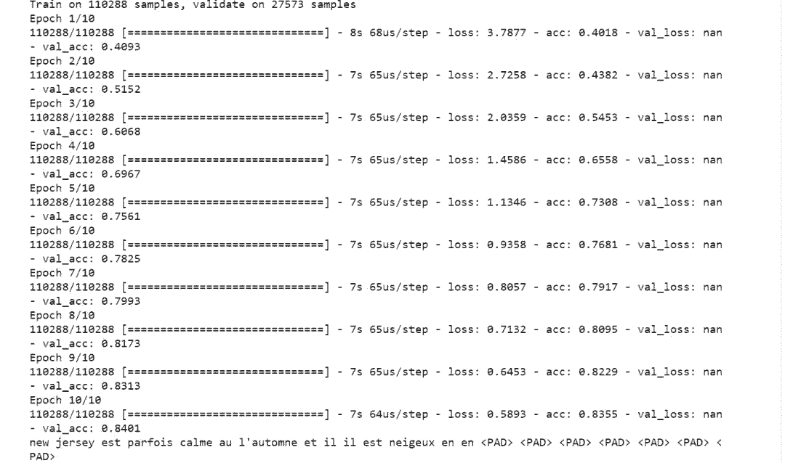

嵌入式模型的验证集准确度是 0.8401。

**模型 3：双向 RNN**


```py
def bd_model(input_shape, output_sequence_length, english_vocab_size, french_vocab_size):

 learning_rate = 1e-3
 model = Sequential()
 model.add(Bidirectional(GRU(128, return_sequences = True, dropout = 0.1), 
 input_shape = input_shape[1:]))
 model.add(TimeDistributed(Dense(french_vocab_size, activation = 'softmax')))
 model.compile(loss = sparse_categorical_crossentropy, 
 optimizer = Adam(learning_rate), 
 metrics = ['accuracy'])
 return model
tests.test_bd_model(bd_model)
tmp_x = pad(preproc_english_sentences, preproc_french_sentences.shape[1])
tmp_x = tmp_x.reshape((-1, preproc_french_sentences.shape[-2], 1))
bidi_model = bd_model(
 tmp_x.shape,
 preproc_french_sentences.shape[1],
 len(english_tokenizer.word_index)+1,
 len(french_tokenizer.word_index)+1)
bidi_model.fit(tmp_x, preproc_french_sentences, batch_size=1024, epochs=20, validation_split=0.2)
# Print prediction(s)
print(logits_to_text(bidi_model.predict(tmp_x[:1])[0], french_tokenizer))
```

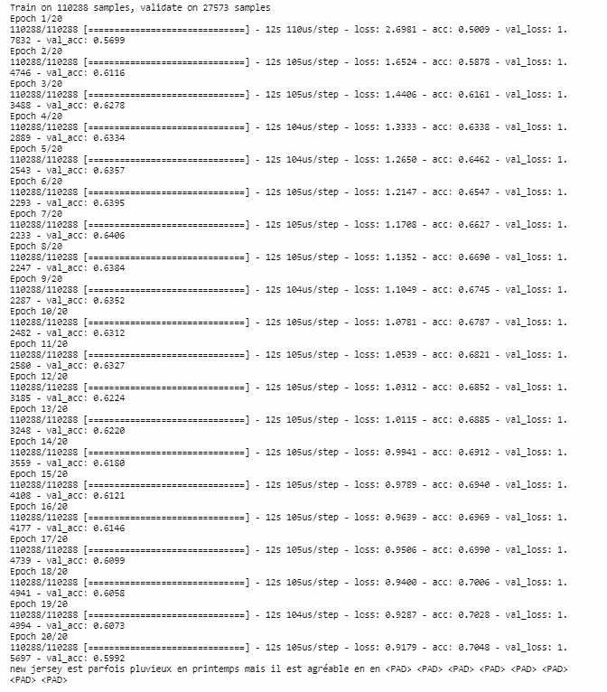

双向 RNN 模型的验证集准确度是 0.5992。

**模型 4：编码器—解码器框架**

编码器构建一个语句的矩阵表示，而解码器将该矩阵作为输入并输出预测的翻译。

```py
def encdec_model(input_shape, output_sequence_length, english_vocab_size, french_vocab_size):

 learning_rate = 1e-3
 model = Sequential()
 model.add(GRU(128, input_shape = input_shape[1:], return_sequences = False))
 model.add(RepeatVector(output_sequence_length))
 model.add(GRU(128, return_sequences = True))
 model.add(TimeDistributed(Dense(french_vocab_size, activation = 'softmax')))

 model.compile(loss = sparse_categorical_crossentropy, 
 optimizer = Adam(learning_rate), 
 metrics = ['accuracy'])
 return model
tests.test_encdec_model(encdec_model)
tmp_x = pad(preproc_english_sentences)
tmp_x = tmp_x.reshape((-1, preproc_english_sentences.shape[1], 1))
encodeco_model = encdec_model(
 tmp_x.shape,
 preproc_french_sentences.shape[1],
 len(english_tokenizer.word_index)+1,
 len(french_tokenizer.word_index)+1)
encodeco_model.fit(tmp_x, preproc_french_sentences, batch_size=1024, epochs=20, validation_split=0.2)
print(logits_to_text(encodeco_model.predict(tmp_x[:1])[0], french_tokenizer))
```

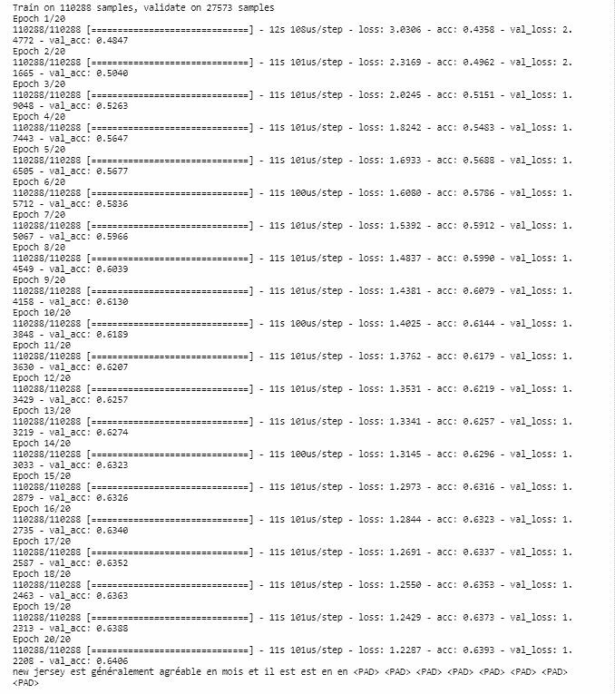

编码器—解码器模型的验证集准确度是 0.6406。

**模型 5：自定义深度模型**

构建一个将词嵌入和双向 RNN 合并到一个模型中的 model_final。

至此，我们需要需要做一些实验，例如将 GPU 参数改为 256，将学习率改为 0.005，对模型训练多于（或少于）20 epochs 等等。

```py
def model_final(input_shape, output_sequence_length, english_vocab_size, french_vocab_size):

 model = Sequential()
 model.add(Embedding(input_dim=english_vocab_size,output_dim=128,input_length=input_shape[1]))
 model.add(Bidirectional(GRU(256,return_sequences=False)))
 model.add(RepeatVector(output_sequence_length))
 model.add(Bidirectional(GRU(256,return_sequences=True)))
 model.add(TimeDistributed(Dense(french_vocab_size,activation='softmax')))
 learning_rate = 0.005

 model.compile(loss = sparse_categorical_crossentropy, 
 optimizer = Adam(learning_rate), 
 metrics = ['accuracy'])

 return model
tests.test_model_final(model_final)
print('Final Model Loaded')
```

**预测**

```py
def final_predictions(x, y, x_tk, y_tk):
 tmp_X = pad(preproc_english_sentences)
 model = model_final(tmp_X.shape,
 preproc_french_sentences.shape[1],
 len(english_tokenizer.word_index)+1,
 len(french_tokenizer.word_index)+1)

 model.fit(tmp_X, preproc_french_sentences, batch_size = 1024, epochs = 17, validation_split = 0.2)

 y_id_to_word = {value: key for key, value in y_tk.word_index.items()}
 y_id_to_word[0] = '<PAD>'
sentence = 'he saw a old yellow truck'
 sentence = [x_tk.word_index[word] for word in sentence.split()]
 sentence = pad_sequences([sentence], maxlen=x.shape[-1], padding='post')
 sentences = np.array([sentence[0], x[0]])
 predictions = model.predict(sentences, len(sentences))
print('Sample 1:')
 print(' '.join([y_id_to_word[np.argmax(x)] for x in predictions[0]]))
 print('Il a vu un vieux camion jaune')
 print('Sample 2:')
 print(' '.join([y_id_to_word[np.argmax(x)] for x in predictions[1]]))
 print(' '.join([y_id_to_word[np.max(x)] for x in y[0]]))
final_predictions(preproc_english_sentences, preproc_french_sentences, english_tokenizer, french_tokenizer)
```

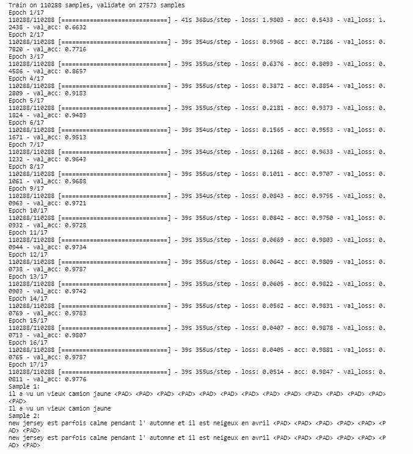

我们得到了语句完美的翻译同时验证集准确度是 0.9776！

*原文链接：https://medium.com/@actsusanli/neural-machine-translation-with-python-c2f0a34f7dd*

****本文为机器之心编译，**转载请联系本公众号获得授权****。**

✄------------------------------------------------

**加入机器之心（全职记者 / 实习生）：hr@jiqizhixin.com**

**投稿或寻求报道：**content**@jiqizhixin.com**

**广告 & 商务合作：bd@jiqizhixin.com**