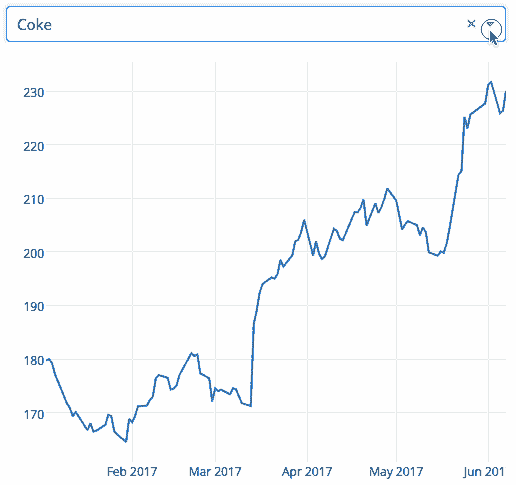

# 资源 | 让你事半功倍的小众 Python 库

选自 medium

**作者：Parul Pandey**

**机器之心编译**

**参与：高璇、张倩**

> Python 是世界上发展最快的编程语言之一。它一次又一次地证明了自己在开发人员和跨行业的数据科学中的实用性。Python 及其机器学习库的整个生态系统使全世界的用户（无论新手或老手）都愿意选择它。Python 成功和受欢迎的原因之一是存在强大的库，这些库使 Python 极具创造力且运行快速。然而，使用 Pandas、Scikit-learn、Matplotlib 等常见库在解决一些特殊的数据问题时可能并不实用，本文介绍的这些非常见库可能更有帮助。

**WGET**

提取数据，特别是从网络中提取数据是数据科学家的重要任务之一。Wget 是一个免费的工具，用于以非交互式方式从 Web 上下载文件。它支持 HTTP、HTTPS 和 FTP 协议，通过 HTTP 代理进行检索。由于它是非交互式的，即使用户没有登录，它也可以在后台工作。所以，如果你想下载一个网站或一个页面上的所有图片，wget 会帮助你。

安装：

```py
$ pip install wget 
```

示例：

```py
import wget
url = 'http://www.futurecrew.com/skaven/song_files/mp3/razorback.mp3'
filename = wget.download(url)
100% [................................................] 3841532 / 3841532
filename
'razorback.mp3'  **Pendulum**

```

对于那些在 python 中被处理 datetimes 困扰的人来说，Pendulum 是个好选择。它是一个 Python 包，用于简化 datetimes 操作。它是 Python「本机」类（native class）的代替。更多内容，请参阅文档：https://um.eustace.io/docs/# installation。

安装：

```py
$ pip install pendulum 
```

示例：

```py
import wget
url = 'http://www.futurecrew.com/skaven/song_files/mp3/razorback.mp3'
filename = wget.download(url)
100% [................................................] 3841532 / 3841532
filename
'razorback.mp3' 
```

**IMBALANCED-LEARN**

<mp-miniprogram class="miniprogram_element" data-miniprogram-appid="wxf424e2f3e2f94500" data-miniprogram-path="pages/technology/technology?id=aaeb1c15-66f2-4822-91bb-b441607f9ecf&amp;from=weapp" data-miniprogram-nickname="机器之心 Synced" data-miniprogram-avatar="http://mmbiz.qpic.cn/mmbiz_png/f3g058loLBj0Pib4UhuCFagffSB1RHImwskFzvic6mSp2LDhuerbXxeqqv0b63wSt2Pas7MicNWIcia358rlnhiaVag/640?wx_fmt=png&amp;wxfrom=200" data-miniprogram-title="分类问题" data-miniprogram-imageurl="http://mmbiz.qpic.cn/mmbiz_jpg/KmXPKA19gW8aQfbUpicJiaAH0COiaYYTIuwVCbs3tKkBxl7o9u0PJtp2Cg9qH0VEWvBY99Tag1qFJePQ9z7Q9KYHg/0?wx_fmt=jpeg"></mp-miniprogram>

可以看出，当每个类的样本数量相等即平衡时，大多数分类算法的工作效果最好。但现实生活中充满了不平衡的数据集，这些数据集对机器学习的学习阶段和后续预测都有影响。创建这个库是为了解决这个问题。它与 scikit-learn 兼容，并且是 scikit-learn-contrib 项目的一部分。下次遇到不平衡的数据集时，可以尝试一下。

安装：

```py
pip install -U imbalanced-learn

# or

conda install -c conda-forge imbalanced-learn 
```

示例：

有关用法和示例，请参考：http://imbalancedlearn.org/en/stable/api.html。

**FLASHTEXT**

在 NLP 任务中，清理文本数据通常需要替换句子中的关键词或从句子中提取关键词。通常，这样的操作可以用正则表达式来完成，但是如果要搜索的词汇量过大，操作就会变得麻烦。Python 中基于 FlashText 算法的 FlashText 模块，为这种情况提供了一个合适的替代方案。FlashText 最大的优点是搜索词数量不影响运行时长。更多相关信息请见：https://flashtext.readthedocs.io/en/latest/#。

安装：

```py
$ pip install flashtext 
```

**示例**

提取关键词：

```py
from flashtext import KeywordProcessor
keyword_processor = KeywordProcessor()
# keyword_processor.add_keyword(<unclean name>, <standardised name>)
keyword_processor.add_keyword('Big Apple', 'New York')
keyword_processor.add_keyword('Bay Area')
keywords_found = keyword_processor.extract_keywords('I love Big Apple and Bay Area.')
keywords_found
['New York', 'Bay Area'] 
```

替换关键词：

```py
keyword_processor.add_keyword('New Delhi', 'NCR region')
new_sentence = keyword_processor.replace_keywords('I love Big Apple and new delhi.')
new_sentence
'I love New York and NCR region.' 
```

更多使用示例，请参阅官方文档。

**FUZZYWUZZY**

虽然名字听起来很奇怪，但涉及到字符串匹配时，fuzzywuzzy 是一个非常有用的库，可以很容易地实现诸如字符串比较比率、token 比率等操作。对于匹配不同数据库中的记录也很方便。

安装：

```py
$ pip install fuzzywuzzy 
```

示例：

```py
from fuzzywuzzy import fuzz
from fuzzywuzzy import process
# Simple Ratio
fuzz.ratio("this is a test", "this is a test!")
97
# Partial Ratio
fuzz.partial_ratio("this is a test", "this is a test!")
 100 
```

更多有趣的例子可以在 GitHub 上找到：https://github.com/seatgeek/fuzzywuzzy。

**PYFLUX**

时间序列分析是机器学习领域最常见的问题之一。PyFlux 是 Python 中为处理时间序列问题而创建的开源库。该库有一系列极好的时间序列模型，包括但不限于 ARIMA、 GARCH 和 VAR 模型。简而言之，PyFlux 提供了一个时间序列建模的概率方法。值得尝试。

安装：

```py
pip install pyflux 
```

示例：

有关用法和示例，请参考：https://pyflux.readthedocs.io/en/latest/index.html。

**IPYVOLUME**

交流结果是数据科学的一个基本方面。能够将结果可视化是一个很大的优势。IPyvolume 是一个用于在 Jupyter notebook 中可视化 3d 体积和字形（如 3d 散点图）的 Python 库，只需少量配置即可。然而，它目前还处于前 1.0 版。IPyvolume 的 volshow 之于 3d 数组，就像 matplotlib 的 imshow 之于 2d 数组一样。更多相关信息请见：https://ipyvolume.readthedocs.io/en/latest/?badge=latest。

安装：

```py
Using pip
$ pip install ipyvolume
Conda/Anaconda
$ conda install -c conda-forge ipyvolume 
```

**DASH**

Dash 是一个用于构建 web 应用程序的高效 Python 框架。它写在 Flask、Plotly.js 和 React.js 之上，将下拉列表、滑块和图形等 UI 元素与你的分析性 Python 代码直接相连，无需 javascript。Dash 非常适合构建数据可视化应用程序。然后这些应用程序可以在 web 浏览器中进行渲染。用户指南请见：https://dash.plot.ly/。

安装：

```py
pip install dash==0.29.0 # The core dash backend

pip install dash-html-components==0.13.2 # HTML components

pip install dash-core-components==0.36.0 # Supercharged components

pip install dash-table==3.1.3 # Interactive DataTable component (new!) 
```

示例：

下图示例显示了具有下拉功能的高度交互图。当用户在下拉列表中选择一个值时，应用程序代码会动态地将 Google Finance 的数据导出为 Pandas DataFrame。资源：https://gist.github.com/chriddyp/3d2454905d8f01886d651f207e2419f0。



**GYM**

来自 OpenAI 的 Gym 是一个开发和对比强化学习算法的工具包。它兼容于任何数值计算库，如 TensorFlow 或 Theano。Gym 库是一个测试问题的集合，也被称为环境——可以用它来计算你的强化学习算法。这些环境有一个共享的接口，允许你写通用算法。

安装：

```py
pip install gym 
```

示例：

运行环境 CartPole-v0 的 1000 个时间步骤实例，在每个步骤渲染环境。


阅读其他环境请见：https://gym.openai.com/。

**结论**

这些是作者为数据科学挑选的实用 python 库，而非常见的 numpy、panda 等。值得一试。********

*原文链接：https://medium.com/analytics-vidhya/python-libraries-for-data-science-other-than-pandas-and-numpy-95da30568fad*

****本文为机器之心编译，**转载请联系本公众号获得授权****。**

✄------------------------------------------------

**加入机器之心（全职记者 / 实习生）：hr@jiqizhixin.com**

**投稿或寻求报道：**content**@jiqizhixin.com**

**广告 & 商务合作：bd@jiqizhixin.com**