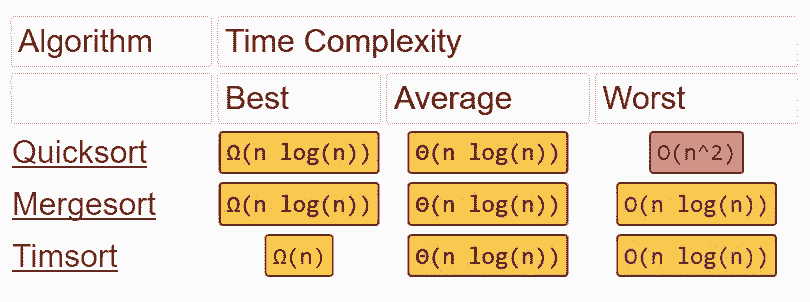
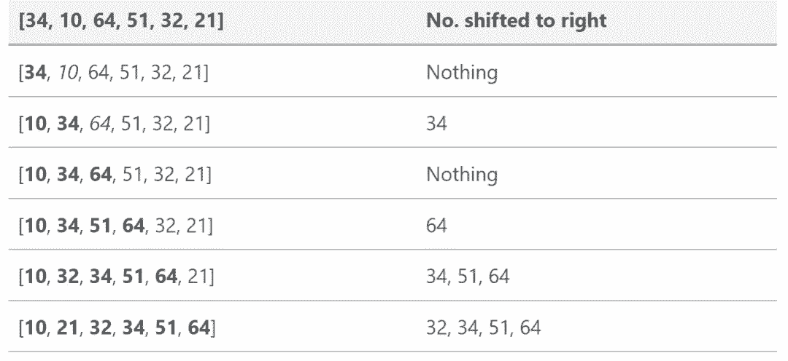
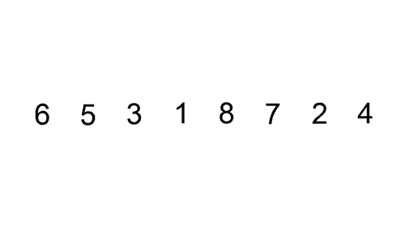
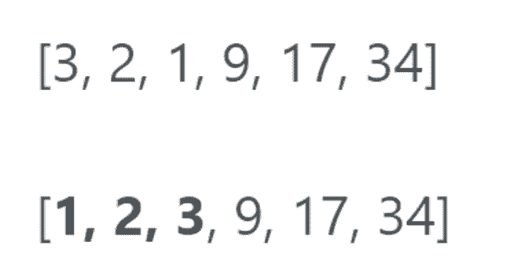
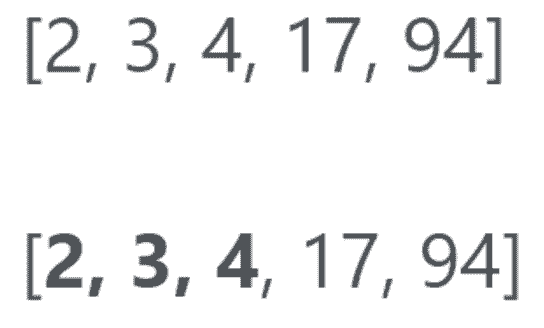
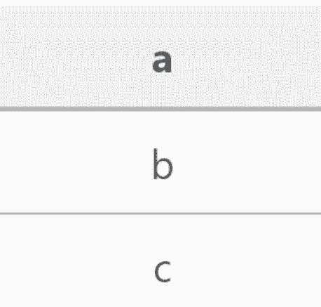
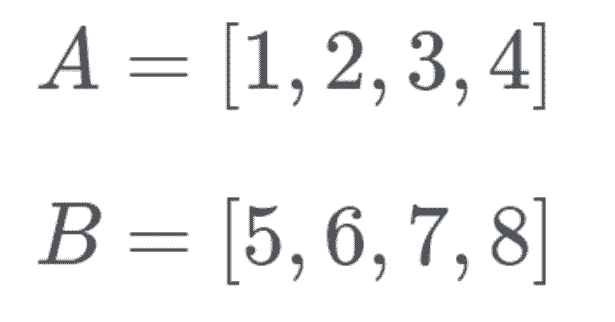

# 除了冒泡排序，你知道 Python 内建的排序算法吗？

选自 hackernoon

**作者：****Brandon Skerritt**

**机器之心编译**

**参与：高璇、思源**

> 对于编程算法，可能很多读者在学校第一个了解的就是冒泡排序，但是你真的知道 Python 内建排序算法 list.sort() 的原理吗？它使用的是一种快速、稳定的排序算法 Timsort，其时间复杂度为 O(n log n)，该算法的目标在于处理大规模真实数据。

<mp-miniprogram class="miniprogram_element" data-miniprogram-appid="wxf424e2f3e2f94500" data-miniprogram-path="pages/technology/technology?id=05cfb700-bc4f-48a8-ba2a-78169045e42e&amp;from=weapp" data-miniprogram-nickname="机器之心 Synced" data-miniprogram-avatar="http://mmbiz.qpic.cn/mmbiz_png/f3g058loLBj0Pib4UhuCFagffSB1RHImwskFzvic6mSp2LDhuerbXxeqqv0b63wSt2Pas7MicNWIcia358rlnhiaVag/640?wx_fmt=png&amp;wxfrom=200" data-miniprogram-title="排序算法" data-miniprogram-imageurl="http://mmbiz.qpic.cn/mmbiz_jpg/KmXPKA19gWibQ4BK0We9uhcp0y5OS2DDMgm109uWzr6JTax5ZxJ2xdQGop7DBdJfIhJn2pF5cibhud0iaKXZHiaLibg/0?wx_fmt=jpeg"></mp-miniprogram>

Timsort 是一种对真实数据非常有效的排序算法。Tim Peters 在 2001 年为 Python 编程语言创造了 Timsort。Timsort 首先分析它要排序的列表，然后基于该分析选择合理方案。

Timsort 自发明以来，就成为 Python、Java 、Android 平台和 GNU Octave 的默认排序算法。



*图源：http://bigocheatsheet.com/*

Timsort 的排序时间与 Mergesort 相近，快于其他大多数排序算法。Timsort 实际上借鉴了插入排序和归并排序的方法，后文将详细介绍它的具体过程。

Peters 设计 Timsort 是为了利用大量存在于现实数据集中的有序元素，这些有序元素被称为「natural runs」。总而言之，Timsort 会先遍历所有数据并找到数据中已经排好序的分区，且每一个分区可以称为一个 run，最后再按规则将这些 run 归并为一个。

**数组中元素少于 64 个**

如果排序的数组中元素少于 64 个，那么 Timsort 将执行插入排序。插入排序是对小型列表最有效的简单排序，它在大型列表中速度很慢，但是在小型列表中速度很快。插入排序的思路如下：

*   逐个查看元素

*   通过在正确的位置插入元素来建立排序列表

下面的跟踪表说明了插入排序如何对列表 [34, 10, 64, 51, 32, 21] 进行排序的：



在这个示例中，我们将从左向右开始排序，其中黑体数字表示新的已排序子数组。在原数组每一个元素的排序中，它会从右到左对比已排序子数组，并插入适当的位置。用动图来说明插入排序：



**天然有序的区块：run**

如果列表大于 64 个元素，则 Timsort 算法首先遍历列表，查找「严格」升序或降序的部分（Run）。如果一个部分递减，Timsort 将逆转这个部分。因此，如果 run 递减，则如下图所示（run 用粗体表示）：



如果没有递减，则如下图所示：



minrun 的大小是根据数组大小确定的。Timsort 算法选择它是为了使随机数组中的大部分 run 变成 minrun。当 run N 的长度等于或略小于 2 的倍数时，归并 2 个数组更加高效。Timsort 选择 minrun 是为了确保 minrun 等于或稍微小于 2 的倍数。

该算法选择 minrun 的范围为 32 ~ 64。当除以 minrun 时，使原始数组的长度等于或略小于 2 的倍数。

如果 run 的长度小于 minrun，则计算 minrun 减去 run 的长度。我们可以将 run 之外的新元素（minrun - run 个）放到 run 的后面，并执行插入排序来创建新的 run，这个新的 run 长度和 minrun 相同。

如果 minrun 是 63，而 run 的长度是 33，那么可以获取 63 - 33 = 30 个新元素。然后将这 30 个新元素放到 run 的末尾并作为新的元素，所以 run 的第 34 个元素 run[33] 有 30 个子元素。最后只需要对后面 30 个元素执行一个插入排序就能创建一个长度为 63 的新 run。

在这一部分完成之后，现在应该在一个列表中有一系列已排序的 run。

**归并**

Timsort 现在需要执行归并排序来合并 run，需要确保在归并排序的同时保持稳定和平衡。为了保持稳定，两个等值的元素不应该交换，这不仅保持了它们在列表中的原始位置，而且使算法更快。

当 Timsort 搜索到 runs 时，它们会被添加到堆栈中。一个简单的堆栈是这样的：



*想象一堆盘子。你不能从底部取盘子，必须从顶部取，堆栈也是如此。*

当归并不同的 run 时，Timsort 试图平衡两个相互矛盾的需求。一方面，我们希望尽可能地延迟归并，以便利用之后可能出现的模式。但我们更希望尽快归并，以利用刚才发现的在内存层级中仍然排名很高的 run。我们也不能「过分」延迟合并，因为它记住未合并的运行需要消耗内存，而堆栈的大小是固定的。

为了得到折衷方案，Timsort 追踪堆栈上最近的三个项，并为这些堆栈项创建了两个必须保持为 True 的规则：

1.  A > B + C

2.  B > C

其中 A、B 和 C 是堆栈中最近的三个项。

用 Tim Peters 自己的话来说：

> 一个好的折衷方案是在堆栈项上维护两个不变量，其中 A、B 和 C 是最右边三个还未归并片段的长度。

通常，将不同长度的相邻 run 归并在一起是很难的。更困难的是还必须要保持稳定。为了解决这个问题，Timsort 设置了临时内存。它将两个 run 中较小的（同时调用 runA 和 runB）放在这个临时内存中。

**GALLOPING（飞奔模式）**

当 Timsort 归并 A 和 B 时，它注意到一个 run 已经连续多次「获胜」。如果 run A 的数值完全小于 run B，那么 run A 会回到原始位置。归并这两个 run 会耗费巨大工作量，而且还不会取得任何效果。

通常情况下，数据会有一些预设的内部结构。Timsort 假设，如果 run A 中的值大多低于 run B 的值，那么 A 的值可能就会小于 B。



然后 Timsort 将进入飞奔模式。Timsort 不是检查 A[0] 和 B[0]，而是二分法搜索 B[0] 在 A[0] 中的合理位置。这样，Timsort 可以将 A 的整个部分移动到合适的位置。然后，Timsort 在 B 中搜索 A[0] 的适当位置。然后，Timsort 将立即移动整个 B 到合适的位置。

Timsort 检查 B[0]（值为 5），并使用二分法搜索查找其 A 中的正确位置。

现在 B[0] 在 A 列表的后面，Timsort 检查 B 的正确位置是否有 A[0]（即 1），所以我们要看 1 的位置。这个数在 B 的前部，现在我们知道 B 在 A 的后边，A 在 B 的前边。

如果 B[0] 的位置非常接近 A 的前端（反之亦然），那么这个操作就没必要了。Timsort 也会注意到这一点，并通过增加连续获得 A 或 B 的数量提高进入飞奔模式的门槛。如果飞奔模式合理，Timsort 使它更容易重新进入该模式。

简而言之，Timsort 做了两件非常好的事情：

*   具有预设的内部结构的数组具有良好的性能

*   能够保持稳定的排序

在此之前，为了实现稳定的排序，必须将列表中的项压缩为整数，并将其排序为元组数组。

**代码**

下面的源代码基于我和 Nanda Javarma 的工作。源代码并不完整，也不是类似于 Python 的官方 sort() 源代码。这只是我实现的一个简化的 Timsort，可以对 Timsort 有个整体把握。此外，Python 中的内置 Timsort 算法是在 C 中正式实现的，因此能获得更好的性能。

Timsort 的原始源代码：https://github.com/python/cpython/blob/master/Objects/listobject.c。

```py
# based off of this code https://gist.github.com/nandajavarma/a3a6b62f34e74ec4c31674934327bbd3
# Brandon Skerritt
# https://skerritt.tech

def binary_search(the_array, item, start, end):
    if start == end:
        if the_array[start] > item:
            return start
        else:
            return start + 1
    if start > end:
        return start

    mid = round((start + end)/ 2)

    if the_array[mid] < item:
        return binary_search(the_array, item, mid + 1, end)

    elif the_array[mid] > item:
        return binary_search(the_array, item, start, mid - 1)

    else:
        return mid

"""
Insertion sort that timsort uses if the array size is small or if
the size of the "run" is small
"""
def insertion_sort(the_array):
    l = len(the_array)
    for index in range(1, l):
        value = the_array[index]
        pos = binary_search(the_array, value, 0, index - 1)
        the_array = the_array[:pos] + [value] + the_array[pos:index] + the_array[index+1:]
    return the_array

def merge(left, right):
    """Takes two sorted lists and returns a single sorted list by comparing the
    elements one at a time.
    [1, 2, 3, 4, 5, 6]
    """
    if not left:
        return right
    if not right:
        return left
    if left[0] < right[0]:
        return [left[0]] + merge(left[1:], right)
    return [right[0]] + merge(left, right[1:])

def timsort(the_array):
    runs, sorted_runs = [], []
    length = len(the_array)
    new_run = [the_array[0]]

    # for every i in the range of 1 to length of array
    for i in range(1, length):
        # if i is at the end of the list
        if i == length - 1:
            new_run.append(the_array[i])
            runs.append(new_run)
            break
        # if the i'th element of the array is less than the one before it
        if the_array[i] < the_array[i-1]:
            # if new_run is set to None (NULL)
            if not new_run:
                runs.append([the_array[i]])
                new_run.append(the_array[i])
            else:
                runs.append(new_run)
                new_run = []
        # else if its equal to or more than
        else:
            new_run.append(the_array[i])

    # for every item in runs, append it using insertion sort
    for item in runs:
        sorted_runs.append(insertion_sort(item))

    # for every run in sorted_runs, merge them
    sorted_array = []
    for run in sorted_runs:
        sorted_array = merge(sorted_array, run)

    print(sorted_array)

timsort([2, 3, 1, 5, 6, 7]) 
```

Timsort 实际上在 Python 中已经内建了，所以这段代码只充当概念解释。要使用 Timsort，只需在 Python 中写：

```py
list.sort()
```

或者：

```py
sorted(list)
```

如果你想掌握 Timsort 的工作方式并对其有所了解，我强烈建议你尝试自己实现它！********

*原文链接：https://hackernoon.com/timsort-the-fastest-sorting-algorithm-youve-never-heard-of-36b28417f399*

****本文为机器之心编译，**转载请联系本公众号获得授权****。**

✄------------------------------------------------

**加入机器之心（全职记者 / 实习生）：hr@jiqizhixin.com**

**投稿或寻求报道：**content**@jiqizhixin.com**

**广告 & 商务合作：bd@jiqizhixin.com**