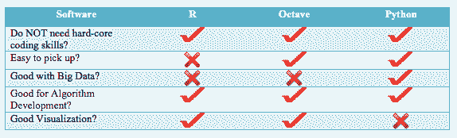
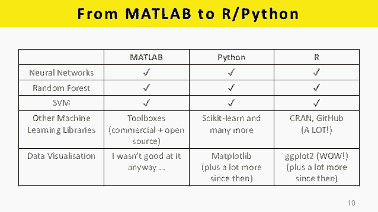
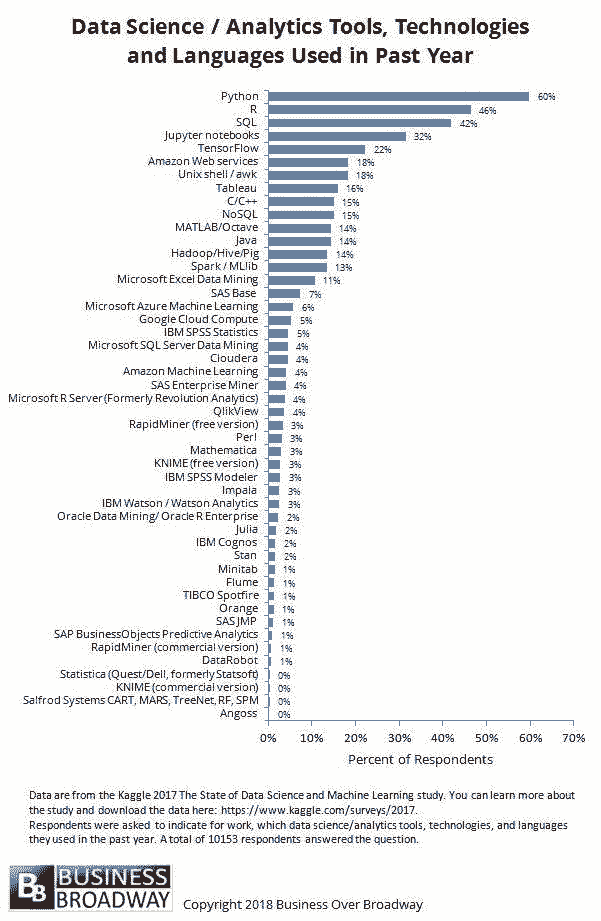

# 业界 | 四大机器学习编程语言对比：R、Python、MATLAB、Octave

选自 towardsdatascience

**机器之心编译**

**作者：****MJ Bahmani**

**参与：****张倩、路**

> 本文作者是一位机器学习工程师，他比较了四种机器学习编程语言（工具）：R、Python、MATLAB 和 OCTAVE。作者列出了这些语言（工具）的优缺点，希望对想开始学习它们的人有用。

*图源：Pixabay.com*

GitHub 地址：https://github.com/mjbahmani/10-steps-to-become-a-data-scientist

** R 语言**

<mp-miniprogram class="miniprogram_element" data-miniprogram-appid="wxf424e2f3e2f94500" data-miniprogram-path="pages/resource/resource?id=34497ec5-810f-4bf1-8ba4-52926b85ec7f&amp;from=weapp" data-miniprogram-nickname="机器之心 Synced" data-miniprogram-avatar="http://mmbiz.qpic.cn/mmbiz_png/f3g058loLBj0Pib4UhuCFagffSB1RHImwskFzvic6mSp2LDhuerbXxeqqv0b63wSt2Pas7MicNWIcia358rlnhiaVag/640?wx_fmt=png&amp;wxfrom=200" data-miniprogram-title="R" data-miniprogram-imageurl="http://mmbiz.qpic.cn/mmbiz_jpg/KmXPKA19gW80te0YYs5q3Gph3icEcpAIwGsU0DwW3KBiaf4ToncM4h6C3tDibicuSI912jPYhevzcNuheyuEOOleuA/0?wx_fmt=jpeg"></mp-miniprogram>

R 是一种用于统计计算和图的语言及环境。它是一个 GNU 项目，与贝尔实验室的 John Chambers 及其同事开发的 S 语言及环境类似。R 可以视为 S 的一种不同实现。二者存在一些重要差异，但使用 S 写的很多代码在 R 下运行时无需修改。

**优点：**

*   端到端开发到执行（一些 brokers package 允许执行，IB）

*   开发速度快（比 Python 的代码少 60%）

*   开源包多

*   成熟的量化交易包（quantstrat、quantmod、performanceanalyitics、xts）

*   社区最大

*   使用 rcpp 可以整合 R 和 C++/C 

**缺点：**

*   比 Python 慢，尤其是在迭代循环和非向量化函数中

*   比 Matlab 绘图差，难以实现交互式图表

*   创建独立应用程序的能力有限

** Python**

<mp-miniprogram class="miniprogram_element" data-miniprogram-appid="wxf424e2f3e2f94500" data-miniprogram-path="pages/resource/resource?id=aad4820e-5974-4bd3-b2af-3e3a29090da7&amp;from=weapp" data-miniprogram-nickname="机器之心 Synced" data-miniprogram-avatar="http://mmbiz.qpic.cn/mmbiz_png/f3g058loLBj0Pib4UhuCFagffSB1RHImwskFzvic6mSp2LDhuerbXxeqqv0b63wSt2Pas7MicNWIcia358rlnhiaVag/640?wx_fmt=png&amp;wxfrom=200" data-miniprogram-title="Python" data-miniprogram-imageurl="http://mmbiz.qpic.cn/mmbiz_jpg/KmXPKA19gW80te0YYs5q3Gph3icEcpAIwGsU0DwW3KBiaf4ToncM4h6C3tDibicuSI912jPYhevzcNuheyuEOOleuA/0?wx_fmt=jpeg"></mp-miniprogram>

Python 是一种用于通用编程的解释型高级编程语言，由 Guido van Rossum 创建并于 1991 年首次发布。Python 的设计强调代码可读性，使用了大量空格。它的结构使其在大规模和小规模编程中都能清晰明了。

**优点：**

*   端到端开发到执行（一些 brokers package 允许执行，IB）

*   开源包（Pandas、Numpy、scipy）

*   交易包（zipline、pybacktest、pyalgotrade）

*   最适合一般编程和应用程序开发

*   可连接 R、C++ 和其他语言的「胶水」语言

*   总体速度最快，尤其是在迭代循环中

**缺点：**

*   有一些不成熟的包，尤其是交易包

*   有些包与其他包不兼容或包含重叠

*   在金融领域的社区比 R 小

*   与 R 或 Matlab 相比，相同操作需要更多代码

*   追踪静默错误（silent error）可能需要很长时间（即使使用可视化调试器/IDE）

** MATLAB**

<mp-miniprogram class="miniprogram_element" data-miniprogram-appid="wxf424e2f3e2f94500" data-miniprogram-path="pages/resource/resource?id=8b6df91f-318c-4841-abef-aa8be3ce0d0c&amp;from=weapp" data-miniprogram-nickname="机器之心 Synced" data-miniprogram-avatar="http://mmbiz.qpic.cn/mmbiz_png/f3g058loLBj0Pib4UhuCFagffSB1RHImwskFzvic6mSp2LDhuerbXxeqqv0b63wSt2Pas7MicNWIcia358rlnhiaVag/640?wx_fmt=png&amp;wxfrom=200" data-miniprogram-title="MATLAB" data-miniprogram-imageurl="http://mmbiz.qpic.cn/mmbiz_jpg/KmXPKA19gW80te0YYs5q3Gph3icEcpAIwGsU0DwW3KBiaf4ToncM4h6C3tDibicuSI912jPYhevzcNuheyuEOOleuA/0?wx_fmt=jpeg"></mp-miniprogram>

MATLAB（matrix laboratory）是一种多范型数值计算环境。作为 MathWorks 开发的一种专用编程语言，MATLAB 允许矩阵运算、函数和数据绘图、算法实现、用户界面创建，以及与用其他语言（包括 C、C++、C#、Java、Fortran、Python）写成的程序进行交互。

尽管 MATLAB 的设计初衷是数值计算，但其中的可选工具箱使用 MuPAD symbolic engine，具备符号计算能力。额外的包 Simulink 添加了图多领域模拟和针对动态和嵌入系统的基于模型的设计。

**优点：**

*   最快的数学和计算平台，尤其是向量化运算／线性矩阵代数。

*   适合所有数学和交易领域的商业级软件。

*   脚本简短，但高度集成了所有包。

*   拥有图和交互式图表的最佳可视化

*   具备良好测试和支持。

*   易于管理多线程支持和垃圾收集

*   最好的调试器

**缺点：**

*   无法执行，必须转换成另一种语言。

*   昂贵：每个 license 大约 1000 美元，每添加一个包需要额外支付 50+ 美元。

*   无法与其他语言很好地集成。

*   很难检测出交易系统中的偏差（它是为数学和工程模拟而构建的），因此可能需要广泛的测试。

*   糟糕的迭代循环性能。

*   无法开发单独的应用。

** Octave**

<mp-miniprogram class="miniprogram_element" data-miniprogram-appid="wxf424e2f3e2f94500" data-miniprogram-path="pages/resource/resource?id=a44cde05-4c0e-4581-a5ac-9f1eb725f661&amp;from=weapp" data-miniprogram-nickname="机器之心 Synced" data-miniprogram-avatar="http://mmbiz.qpic.cn/mmbiz_png/f3g058loLBj0Pib4UhuCFagffSB1RHImwskFzvic6mSp2LDhuerbXxeqqv0b63wSt2Pas7MicNWIcia358rlnhiaVag/640?wx_fmt=png&amp;wxfrom=200" data-miniprogram-title="Octave" data-miniprogram-imageurl="http://mmbiz.qpic.cn/mmbiz_jpg/KmXPKA19gW80te0YYs5q3Gph3icEcpAIwGsU0DwW3KBiaf4ToncM4h6C3tDibicuSI912jPYhevzcNuheyuEOOleuA/0?wx_fmt=jpeg"></mp-miniprogram>

Octave 可以看作是商业语言 MATLAB 的 GNU 版本，它是一种脚本矩阵语言（scripting matrix language），其语法有大约 95% 可与 MATLAB 兼容。Octave 由工程师设计，因此预装了工程师常用的程序，其中很多时间序列分析程序、统计程序、文件命令和绘图命令与 MATLAB 语言相同。

**优点：**

*   首先，目前没有可用的鲁棒性 Octave 编译器，且没有必要有，因为该软件可以免费安装。

*   Octave 和 Matlab 的语言元素相同，除了一些个例，如嵌套函数。Octave 仍然处于积极开发的状态，每一个偏离 Matlab 语法之处都被视为 bug 或者至少是待解决问题。

*   Octave 有很多可用工具箱，只要程序不要求图输出，那么在不进行大量更改的前提下，使用 Octave 运行和使用 Matlab 运行差不多。

*   图方面的能力是 Matlab 的优势。Matlab 最新版本包括 GUI 设计器，包含大量很棒的可视化特征。

*   Octave 使用 GNU Plot 或 JHandles 作为图程序包，JHandles 与 Matlab 中的图程序包更接近一些。但是，Octave 不具备类似 GUI 设计器的组件，其可视化机制很受限且不与 Matlab 兼容。

*   集成开发环境也是类似的情况：Octave 有一个 QTOctave 项目，但仍处于早期阶段。

*   Octave 社区的合作很可能帮助该软件很快提供更好、更兼容的图以及 GUI 能力。

**缺点：**

*   它只是 MATLAB 的免费开源版本，无法带给用户新的东西。

下表列举了数据科学家和机器学习工程师的常用工具，读者可以查看这些工具的流行度。

*原文链接：https://towardsdatascience.com/r-vs-python-vs-matlab-vs-octave-c28cd059aa69*

****本文为机器之心编译，**转载请联系本公众号获得授权****。**

✄------------------------------------------------

**加入机器之心（全职记者 / 实习生）：hr@jiqizhixin.com**

**投稿或寻求报道：**content**@jiqizhixin.com**

**广告 & 商务合作：bd@jiqizhixin.com**