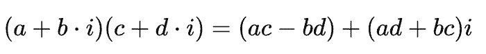

# Julia 1.0 正式发布，这是新出炉的一份简单中文教程

机器之心发布

**作者：罗秀哲**

> > 两天前，机器之心报道 MIT 正式发布 [Julia 1.0 的文章](http://mp.weixin.qq.com/s?__biz=MzA3MzI4MjgzMw==&mid=2650746791&idx=3&sn=bd348998f7c60d94ec7fea914841c6a1&chksm=871aebd9b06d62cf6e3263cd3d74ae86bb5fdf25dd84225d07515516cf5846bc5eaa4d2d31ab&scene=21#wechat_redirect)引发了极大的关注（20 多万的阅读量），对此编程语言既有批判者也有推崇者。如机器之心了解到 Julia 在科学计算、数据处理行业很受欢迎。为了方便大家更了解这一新正式发布的编程语言，我们推荐 Julia 中文社区（中文社区介绍见文后）组织者之一罗秀哲新出炉的一篇简单教程。
> 
> 文章地址：https://zhuanlan.zhihu.com/p/41802723
> 
> **写在前面**
> 
> 这两天的媒体报道可能让一些人有了恐慌，但是我现在有一个诚恳的建议就是如果你完全没有编程基础，时间也不多的话（时间多了不是想学啥学啥），我建议你先学一下 Python，这并不冲突，因为 Julia 的语法本身和 Python 很像，1.0 之后也专门增加了一些 feature 帮助你更好地从 Python 转向 Julia。Julia 刚刚有了第一个长期支持版本，这还不意味着这个语言已经完全成熟，我想此时的 Julia 更像是彼时的 Python 2.0，还有很长一段路要走，但是已经非常的有前景。
> 
> 那么什么人我会建议学习 Julia 呢？或者 Julia 在什么场景下也许能够有优势呢？我个人的体验是以下这里一类：
> 
> *   之前使用 Python 但是因为性能问题，经常需要使用 numba/Cython/C API/ctypes/etc. 等方式进行优化的人。Julia 或许能够帮助你解决两语言问题，并且获得可读性更好，更容易维护的代码。
>     
>     
> *   之前使用 MATLAB，但是被一些付费功能困扰的用户（MATLAB 2018 也是不错的，但是要支持正版哈）
>     
>     
> *   之前使用 Fortran 和 R 的用户，强烈建议使用 Julia（可以结合着用也，FFI 是很不错的）
>     
>     
> *   之前使用 Sage/Octave 的用户，不妨尝试一下这个新玩意儿
>     
>     
> *   之前使用 Mathematica 但是想开始做一些数值的用户，Mathematica 不是不能做数值，也可以调用 C/C++ 但是 Julia 不妨是相比其它工具更平滑的选择。
>     
>     
> 
> 如果你之前的工作仅仅使用 Python 就足以胜任，那么不必着急，也不必恐慌，不妨在感兴趣的时候试试这个新东西，但是也完全可以等到 Julia 被大规模使用的时候再跟进。实际上从一开始像 MXNet 这样的深度学习框架就官方支持了 Julia，这些框架的 Python 用户转移过来也并不是什么难事，但是如果你本来就不担心自己程序的性能（很多时候这并不是一个大问题），那么其实不会体会到什么明显的不同和优势。但是这样说也并不完全正确，Julia 语言的优势不仅仅在其性能，也在其语言本身的设计。
> 
> 此外，也要再三声明，虽然 Julia 可以写出高性能的代码，但是写出高性能的代码这件事情本身就很困难。虽然写起来像 Python，运行速度像 C 是我们的梦想，但是在现在这个阶段，并不是随便写一段 Julia 代码就真的能达到 C 的。Julia 只是给你提供了充分优化的空间，和（达到高性能代码的）相对容易的编程体验。
> 
> **下载和安装 Julia**
> 
> Julia 目前因为官网的服务器只有 AWS s3（他们也很穷）。所以国内的一些地区下载速度很慢：
> 
> 链接：https://julialang.org/downloads/
> 
> 大家可以试一试，然后也可以去 Julia Computing 公司提供的 Julia 全家桶（你可以把它理解为 Julia 版本的 Anaconda），最左边的 JuliaPro 是免费的：
> 
> 链接：https://juliacomputing.com/
> 
> 之前浙大的 LUG 搭建了一个镜像，但是维护的同学最近有一些忙，所以目前还没有更新到 1.0。但是其实你如果无法从以上途径下载，那么从境内的源里下载 Julia 0.6 也其实并不影响你先熟悉一些基本语法（这是这个教程的主要目的），境内的源的下载地址在这里：
> 
> 链接：http://juliacn.com/downloads/
> 
> 我们也会尽快更新。
> 
> 然后还有一个叫做 Julia Box 的云服务很方便可以使用，里面有很多教程，都是 jupyter notebook，打开即用，全部都是在线的不用安装。但是唯一的缺点就是国内可能不一定能够正常访问到。
> 
> 链接：http://suo.im/4S7gbT
> 
> **使用什么编辑器**
> 
> Julia 语言的社区不够大，此外由于不是像 rust 这样的静态编译语言，也不是像 CPython 这样的解释型编译器，在启动的时候有比较明显的 overhead，这个问题一直在优化（REPL 的启动时间已经从曾经的 1.0s 到了现在的 0.2s，依然和 IPython 这样的有明显差距），有 PL 的朋友私下和我说是 LLVM 的 JIT 不是那么好（像 nodejs 的 V8 这个问题就不是很明显）
> 
> 所以在这个阶段选择一个合适的开发工具是非常必要的。目前支持最好，bug 最少的是 Atom 上的 Juno 插件，如果你下载 Julia Pro 那么会自带这个编辑器。如果你想选择手动安装，那么可以在这里下载 Atom：
> 
> 链接：https://atom.io/
> 
> 然后安装方法在这里有介绍：
> 
> 链接：http://docs.junolab.org/latest/man/installation.html
> 
> 或者我也推荐你安装 IJulia 之后，使用 jupyter notebook 和 jupyter lab 进行开发。
> 
> 其它的平台也有支持，例如 Jetbrain 的各个 IDE 都可以使用由 @ 考古学家千里冰封等开发的插件。VS code 也有 Julia 插件，以及 Vim 也是有支持的。但是他们都还没有支持逐行执行和单独执行某一块代码的功能，这对于本身被设计得很像 Mathematica 的 Julia 来说没有执行一个 cell 的支持开发起来会时常被 JIT 的预热时间所困扰。
> 
> 然后为了克服 JIT 的预热，避免重复启动编译器。如果你不重新定义（re-define）类型的话，可以试试 Revise.jl :
> 
> 链接：https://github.com/timholy/Revise.jl
> 
> 这是一个用于热加载 Julia 代码的工具，1.0 已经支持方法（method）的删除了。所以也能够方便你的开发。
> 
> 其实和 Python 一样，在我日常使用中，作为动态语言，以及因为语法本身适合分块执行，我其实很少会用到断点和专门的 debugger，此外虽然有相关的包，在 1.0 的编译器里也为未来加入 debugger 提供了相关功能，但是目前还没有完善，你也许可以试试（但是我暂时不推荐）：
> 
> 链接：https://github.com/Keno/Gallium.jl
> 
> 链接：https://github.com/timholy/Rebugger.jl
> 
> **我怎么知道我要用什么包**
> 
> Julia 有一个由社区维护的网站用来帮助你从 1900 多个包里找出符合你需求的 Julia 包：
> 
> 链接：https://juliaobserver.com/
> 
> 一般来说用比较新的，star 比较多的包会好一些。然后如果你觉得某个包不错，也请在 GitHub 上给一个 star。
> 
> **基本操作**
> 
> 当你下载好了 Julia 之后，不论是 Julia Pro 还是单独的 Julia 编译器，你都可以先打开一个 REPL（交互式编程环境），类似于 IPython 之于 Python，Julia 的 REPL 支持了基本的代码高亮，文档查看等功能。但是 Julia 的 REPL 更强大（这件事稍后再说）。
> 
> **Windows/Mac 用户：**
> 
> 双击 Julia 的三色图标，就能打开 REPL。在 Atom 里面的话在左上角有 Julia 一栏，点击里面的 open terminal 即可。
> 
> Linux 用户：
> 
> 下载好以后去找到 bin 文件夹，然后把它加入你的 PATH 环境变量里去，以后就可以在命令行里直接通过 `julia` 命令启动 REPL。
> 
> **树莓派用户和超算用户：**
> 
> 我相信你们是专业的，请阅读官网的教程吧。注意超算用户不用要求管理员安装也可以安装到自己的用户目录下的，设置好环境变量即可。然后有一些超算（比如中国科学技术大学的超算中心）Julia 编译器是很早就装好的，但是可能使用 module load 加载。
> 
> 运行 Julia 的程序总的来说可以有三种方式（其实原理上它们都基本是等价的）：
> 
> 1\. 执行一个 Julia 脚本，和其它 Julia 语言一样，你可以用如下命令执行 Julia 脚本，一般来说 Julia 脚本都以 `.jl` 作为扩展名。
> 
> ```py
> julia script.jl 
> ```
> 
> 这个执行出来是没有报错高亮的，需要颜色请用以下命令执行
> 
> ```py
> julia --color=yes script.jl 
> ```
> 
> 2\. 如果直接启动 Julia 会进入到 REPL 里去
> 
> ```py
> julia 
> ```
> 
> 你会看到
> 
> ```py
> _
>    _       _ _(_)_     |  Documentation: https://docs.julialang.org
>   (_)     | (_) (_)    |
>    _ _   _| |_  __ _   |  Type "?" for help, "]?" for Pkg help.
>   | | | | | | |/ _` |  |
>   | | |_| | | | (_| |  |  Version 1.0.0 (2018-08-08)
>  _/ |\__'_|_|_|\__'_|  |
> |__/                   |
> 
> julia> 
> ```
> 
> 也可以在这里运行 Julia 命令。
> 
> 在 REPL 里面可以直接查文档，按？就会跳到 help 模式，在 0.7 之后（包括 1.0），按 ] 就会进入 pkg 模式，在这个模式下按？就会显示相关文档
> 
> ```py
> (v1.0) pkg> ?
>   Welcome to the Pkg REPL-mode. To return to the julia> prompt, either press backspace
>   when the input line is empty or press Ctrl+C.
> 
>   Synopsis
> 
>   pkg> [--env=...] cmd [opts] [args]
> 
>   Multiple commands can be given on the same line by interleaving a ; between the
>   commands.
> 
>   Environment
> 
>   The --env meta option determines which project environment to manipulate. By default,
>   this looks for a git repo in the parents directories of the current working directory,
>   and if it finds one, it uses that as an environment. Otherwise, it uses a named
>   environment (typically found in ~/.julia/environments) looking for environments named
>   v$(VERSION.major).$(VERSION.minor).$(VERSION.patch),
>   v$(VERSION.major).$(VERSION.minor), v$(VERSION.major) or default in order.
> 
>   Commands
> 
>   What action you want the package manager to take:
> 
>   help: show this message
> 
>   status: summarize contents of and changes to environment
> 
>   add: add packages to project
> 
>   develop: clone the full package repo locally for development
> 
>   rm: remove packages from project or manifest
> 
>   up: update packages in manifest
> 
>   test: run tests for packages
> 
>   build: run the build script for packages
> 
>   pin: pins the version of packages
> 
>   free: undoes a pin, develop, or stops tracking a repo.
> 
>   instantiate: downloads all the dependencies for the project
> 
>   resolve: resolves to update the manifest from changes in dependencies of developed
>   packages
> 
>   generate: generate files for a new project
> 
>   preview: previews a subsequent command without affecting the current state
> 
>   precompile: precompile all the project dependencies
> 
>   gc: garbage collect packages not used for a significant time
> 
>   activate: set the primary environment the package manager manipulates 
> ```
> 
> 查看具体某个命令的文档可以
> 
> ```py
> (v1.0) pkg> ?add
>   add pkg[=uuid] [@version] [#rev] ...
> 
>   Add package pkg to the current project file. If pkg could refer to multiple different
>   packages, specifying uuid allows you to disambiguate. @version optionally allows
>   specifying which versions of packages. Versions may be specified by @1, @1.2, @1.2.3,
>   allowing any version with a prefix that matches, or ranges thereof, such as
>   @1.2-3.4.5. A git-revision can be specified by #branch or #commit.
> 
>   If a local path is used as an argument to add, the path needs to be a git repository.
>   The project will then track that git repository just like if it is was tracking a
>   remote repository online.
> 
>   Examples
> 
>   pkg> add Example
>   pkg> add Example@0.5
>   pkg> add Example#master
>   pkg> add Example#c37b675
>   pkg> add https://github.com/JuliaLang/Example.jl#master
>   pkg> add git@github.com:JuliaLang/Example.jl.git
>   pkg> add Example=7876af07-990d-54b4-ab0e-23690620f79a 
> ```
> 
> 安装包在 0.7 之后都用 pkg 模式来安装，因为这个更方便，但是和 0.6 一样，如果你想使用代码来安装也是可以的，但是在 0.7 之后需要加载 Pkg 模块（0.6 不用）
> 
> ```py
> using Pkg 
> ```
> 
> 然后安装你想要的包
> 
> ```py
> Pkg.add("Example") 
> ```
> 
> Julia 的 REPL 扩展性很强，比较有名的比如 OhMyREPL
> 
> 
> 
> 甚至还可以在 Julia 的 REPL 里把 C++ 当成动态语言来写，按 < 键进入 C++ 模式（Julia 的 C++ FFI：Cxx.jl，暂时还没更新到 1.0，需要 0.6）
> 
> 
> 
> 3\. 第三种方式就是在 Atom 这样支持 cell 的编辑器里（notebook 也是类似的），在 Atom 中在某一行按 shift+enter 会单独执行这一行，结果会打印在这一行的后面。如果有多行的结果你可以用鼠标点击以下，就会展开。如果你选中了很多行，那么就会执行你选中的部分，结果显示在选中的部分最后。
> 
> notebook 里面的使用方法也是 shift + enter 和 Python 等其它语言类似。
> 
> 下面的部分你可以在以上三种方式里的任意一种里执行。
> 
> 本教程只是帮助熟悉语法，想要掌握 Julia 还请认真阅读手册（中文手册还在翻译中）：
> 
> 链接：https://docs.julialang.org/en/stable/manual/getting-started/
> 
> **基本语法**
> 
> 正如所有的经典教程一样，我们先来学习怎么写 hello world：
> 
> 在 Julia 里面写 hello world 可以这样写
> 
> ```py
> > println("Hello World") 
> ```
> 
> 注意 在 Julia 里为了保证声明可以帮助你区分类型，String 是需要双引号的，字符使用单引号。
> 
> Julia 的字符串继承了 Perl 的字符串差值，正则表达式等，Stefan 的评价是他觉得 Perl 的字符串处理是最漂亮的，于是就抄了过来。
> 
> ```py
> > name = "Roger"
> > println("Hello $name") 
> ```
> 
> 这里 name 是一个变量，Julia 和 Python 一样，不需要声明变量，因为所有的变量都只是给值绑定了一个名字而已。然后对于变量插入，可以直接使用 $ 符号。
> 
> 这将打印出
> 
> ```py
> Hello Roger 
> ```
> 
> 当然对于比较长的表达式你也可以使用括号
> 
> ```py
> > println("1 + 1 = $(1 + 1)") 
> ```
> 
> 这将打印出
> 
> ```py
> 1 + 1 = 2 
> ```
> 
> 我们上面提到了怎么绑定一个变量名：
> 
> ```py
> > x = "Roger" 
> ```
> 
> Julia 的变量名除了 ASCII 字符以外，还可以使用包括但不限于 UTF-8 的 unicode，比如甚至是中文
> 
> ```py
> > 你好 = "Hello!" 
> ```
> 
> 还可以是 Emoji，输入 `\:smile` 然后再按 `tab`
> 
> ```py
> > 😄 = "smile" 
> ```
> 
> 别忘了这是一个为科学家们打造的语言，还可以利用 LaTeX 来输入特别的数学符号，在 notebook 或者 REPL 里输入 `\` + `epsilon` 按 `tab` 键
> 
> ```py
> > ϵ = 2.2 
> ```
> 
> Julia 还利用了 LLVM 的一些常数（无限精度）：
> 
> ```py
> > π
> π = 3.1415926535897... 
> ```
> 
> **函数声明**
> 
> 我们写一个非常简单的求和函数，它会对一个向量 A 求和
> 
> ```py
> function mysum(A)
>     s = 0.0 # s = zero(eltype(A))
>     for a in A
>         s += a
>     end
>     s
> end 
> ```
> 
> 函数声明使用 function 关键字开头搭配 end 关键字，所有的 Julia 函数都会返回函数声明的最后一行，这其实是一种函数式语言的特性。return 关键字往往只用于在运行过程中返回。也许一开始你对这个 end 不是很喜欢，或许会问为什么不像 Python 一样呢？为什么不用 {} 呢？别着急后面在元编程的部分告诉你 end 的好处。
> 
> 然后 for 循环也是一样的，使用 for 关键字，然后可以搭配 in 来遍历一个数组（是不是几乎和 Python 一样？），但是别忘记了所有的代码块都最后要写一个 end。
> 
> 当然 in 关键字可以单独使用，用于判断某个集合类（collection，例如一个数组）里面是否包含某个元素
> 
> ```py
> > 1 in [1, 2, 3]
> 
> true 
> ```
> 
> 注释方式和 Python 一样，也使用 #，而多行注释使用
> 
> ```py
> #=
> 
>  xxx
> 
> =# 
> ```
> 
> 但是除此之外，Julia 是有类型的，也可以标注类型（而不是声明），而对于短小的函数声明也可以更加的贴近数学语言。例如我们想要判断某个数字是奇数还是偶数
> 
> ```py
> is_even(x::Int) = x % 2 == 0 
> ```
> 
> Julia 使用 :: 来标注类型（学过 Python3 的朋友可能知道 Python 也有类似的类型标注但是是：）。
> 
> 这个时候如果输入了，例如浮点数那么就会报错
> 
> ```py
> > is_even(2.0)
> MethodError: no method matching is_even(::Float64)
> Closest candidates are:
>   is_even(!Matched::Int64) at In[3]:1
> 
> Stacktrace:
>  [1] top-level scope at none:0 
> ```
> 
> 然后多写文档是个好习惯，让我们给 is_even 和 mysum 加上文档，对于已经定义过的东西，可以直接这样加文档
> 
> ```py
> """
>     is_even(x::Int) -> Bool
> 
> 判断一个整数 `x` 是否是偶数
> """
> is_even
> 
> """
>     mysum(A) -> Number
> 
> 对 `A` 求和。
> """
> mysum 
> ```
> 
> 但是也可以在声明的时候加
> 
> ```py
> """
>     is_even(x::Int) -> Bool
> 
> 判断一个整数 `x` 是否是偶数
> """
> is_even(x::Int) = x % 2 == 0
> 
> """
>     mysum(A) -> Number
> 
> 对 `A` 求和。
> """
> function mysum(A)
>     s = 0.0 # s = zero(eltype(A))
>     for a in A
>         s += a
>     end
>     s
> end 
> ```
> 
> Julia 的文档系统使用 Documenter.jl，所有文档都用 markdown 编写，这种 markdown 是 Julia flavor 的，具体细则非常简单还请参见：
> 
> 链接：https://docs.julialang.org/en/stable/manual/documentation/#Markdown-syntax-1
> 
> Julia 里的分支判断也很简单，和很多语言都非常像
> 
> ```py
> if cond1
> # blabla
> elseif cond2
> # blabla
> else
> # blabla
> end 
> ```
> 
> **多维数组**
> 
> Julia 也有原生支持的多维数组（而不是 List）甚至有非常完善的 Array Interface。这表现为 Julia 拥有大量的针对不同情况设计的数组类型，例如：可共享数组，供并行计算使用；静态数组，适合给小的数组加速；稀疏数组，实现上目前只有稀疏矩阵；分布式数组，用于分布式计算；CUDA 数组 CuArray，用于在 N 卡上计算，等等，就不一一列举了它们之中除了自带的数组（类似于 numpy 的多维数组）以外都在外部支持的包里，而所有的这些数组都适用了同样的 Interface。他们在使用体验上几乎没有差别。
> 
> 比如可以产生一个随机数组
> 
> ```py
> > rand(10) 
> ```
> 
> 这将得到一个向量，里面有 10 个元素，每个元素的类型是默认的 Float64 类型。
> 
> 产生一个随机矩阵（跟随你的直觉就好）
> 
> ```py
> > rand(10, 20) 
> ```
> 
> 产生一个三维的张量
> 
> ```py
> > rand(10, 20, 30) 
> ```
> 
> 那么如果要声明 Int 类型的数组呢？
> 
> ```py
> > rand(Int, 10)
> > rand(Int, 10, 20)
> > rand(Int, 10, 20, 30) 
> ```
> 
> 那么如何声明初始化为 0 的数组呢？现在告诉你函数名称是 zeros 和 MATLAB 以及 numpy 完全一样，看了上面 rand 的用法，猜猜这个怎么用？
> 
> 那么如果我需要更复杂的构造呢？Python 的 List 有一个很著名的 List Comprehension 方法，Julia 也有。
> 
> ```py
> > [i for I in 1:10]
> ```
> 
> 这将获得
> 
> ```py
> [1, 2, 3, 4, 5, 6, 7, 8, 9, 10] 
> ```
> 
> 和 Python 的 List Comprehension 是不是一样？但是等等，还不止如此，Julia 对多维数组的支持是非常好的，Comprehension 对于多维数组也可以用，用逗号分隔即可
> 
> ```py
> [(i, j) for i in 1:5, j in 1:6]
> 
> 5×6 Array{Tuple{Int64,Int64},2}:
>  (1, 1)  (1, 2)  (1, 3)  (1, 4)  (1, 5)  (1, 6)
>  (2, 1)  (2, 2)  (2, 3)  (2, 4)  (2, 5)  (2, 6)
>  (3, 1)  (3, 2)  (3, 3)  (3, 4)  (3, 5)  (3, 6)
>  (4, 1)  (4, 2)  (4, 3)  (4, 4)  (4, 5)  (4, 6)
>  (5, 1)  (5, 2)  (5, 3)  (5, 4)  (5, 5)  (5, 6) 
> ```
> 
> 这将得到一个由 Tuple 构成的矩阵，那你已经看到了 Julia 里面元组使用括号来声明。而除了这种元组还有一种称为命名元组（NamedTuple）的东西，这是 1.0 的新特性
> 
> ```py
> info = (name="Roger", age="0", wechat="不告诉你") 
> ```
> 
> 你可以直接通过 . 算符来访问
> 
> ```py
> > info.name
> "Roger"
> 
> > info.age
> "0"
> 
> > info.wechat
> "不告诉你" 
> ```
> 
> **广播（broadcast）**
> 
> 多维数组的广播是一个很重要的特性，也是 Julia 多维数组的标准接口（Interface）任何 Julia 的数组都可以使用广播。Julia 从 MATLAB 学来了 . 算符。任何被点算符作用的函数和其它算符都可以被广播。例如
> 
> ```py
> > sin.(A) 
> ```
> 
> 将广播 sin 函数到 A 的每一个元素。什么是广播简单来说就是将一个函数作用在多维数组，元组，标量的每一个元素上去。这有点像是函数式编程里 map 的概念，但是不完全一样。
> 
> 广播运算对任何函数都是支持的，比如
> 
> ```py
> > foo.(A, B, c) 
> ```
> 
> 这里 A 和 B 时两个数组，c 是一个标量那么 foo 将会以 foo(a, b, c) 的形式作用在每一个 A，B 的元素 a, b 上。
> 
> **类型——一切都是对象**
> 
> 和很多其它的面向对象语言一样，Julia 里所有的东西都是对象，或者说是某个类型的实例，但非 `class` 的实例，Julia 没有 `class`，但是有更轻量级的类型。
> 
> 定义一个复数类型 复数是很多数值计算和数据分析算法都会用到的类型，然而一般的处理器上并不是自带复数类型的，我们往往使用两倍精度的浮点数来模拟一个复数，例如在 `C` 语言里，双精度的复数可以写作：
> 
> ```py
> double _Complex a; 
> ```
> 
> 或者在 `C++` 中，双精度的复数可以写作：
> 
> ```py
> std::complex<double> a; 
> ```
> 
> 在 `Python` 里，没有显示类型，但是我们可以使用 `j`：
> 
> ```py
> In [1]: 1 + 1.j
> Out[1]: (1+1j) 
> ```
> 
> Julia 里有自带的 Complex 类型，和 Python 类似，用 im 表示虚数单位
> 
> ```py
> 1 + 1im 
> ```
> 
> Complex 是纯 Julia 实现的数值类型。所以我们用这个作为例子来看看怎么定义一个类型
> 
> ```py
> struct MyComplex
>     real::Float64
>     imag::Float64
> end
> 
> # 一个复数就是 MyComplex 类型的一个实例，也就是一种对象
> a = MyComplex(1.0, 2.0) 
> ```
> 
> 而实际上和 C/C++ 一样，Julia 的复数类型也是纯 Julia 实现的，我们这里会简单地实现一个复数类型 MyComplex。Julia 的类型使用 struct 关键字，然后用 end 表示这一段表达式的结束。每个 Julia 类型有一个默认的构造函数，这个构造函数的变量即为类型声明的成员。
> 
> 但是仅仅声明了类型还远远不够，我们还需要对复数定义复数运算，方便起见我们这里仅重载 * 算符：
> 
> 
> 
> 首先我们需要将要重载的东西从 Base 模块中拿出来（而不是自己声明一个新的，为什么？留给大家之后思考，这对你理解什么是 Julia 的多重派发很有帮助），在 Julia 里，运算符 只是一种特殊的函数，并不会被特别对待
> 
> ```py
> import Base: *
> 
> *(a::MyComplex, b::MyComplex) = MyComplex(a.real * b.real - a.imag * b.imag, a.real * b.imag + a.imag * b.real) 
> ```
> 
> 然后试试？
> 
> ```py
> b = MyComplex(1.0, 3.0)
> 
> a * b 
> ```
> 
> 现在输出不是很好看，我们重载一下 show 方法把默认打印出来的字符串修改一下，这里字符串里的 $ 是字符串插入，可以将一个 Julia 表达式的输出转换为字符串（String 类型）然后插入到字符串里。
> 
> ```py
> import Base: show
> 
> show(io::IO, ::MIME"text/plain", x::MyComplex) = print(io, "$(x.real) + $(x.imag)im") 
> ```
> 
> **任意精度的复数类型**
> 
> 我们已经有了一个简单的复数类型，但是实际上真正在用的时候，我们可能会需要不同精度的复数类型，例如使用 32 位浮点精度的复数类型。为了能够使用不同的复数类型，我们需要使用参数类型，而复数的实部和虚部都是实数，我们还需要限制其类型范围
> 
> ```py
> struct MyComplex2{T <: Real}
>     real::T
>     imag::T
> end 
> ```
> 
> 这里 Real 是自带的抽象类型，我们之后会讲什么是抽象类型。而 T 则是一个参数。参数类型也有默认的构造函数。
> 
> ```py
> MyComplex2{Float32}(1.0f0, 2.0f0) 
> ```
> 
> 但是实际上你还可以定义一些自己的构造函数，在 Julia 里因为是没有 class 的，除了构造函数以外的方法都不能写在类型声明内部。而一旦你在类型声明中声明了一个自己的构造函数，默认的构造将被覆盖。比如试试下面这个例子
> 
> ```py
> struct MyComplex3{T <: Real}
>     real::T
>     imag::T
> 
>     MyComplex3(real::T) where {T <: Real} = new{T}(real, 0)
> end
> 
> MyComplex3(1.0) 
> ```
> 
> 什么时候用内部构造函数，什么时候用外部构造函数？
> 
> 内部构造函数往往是为了在生成这个实例前做一些预处理（例如判断输入变量是否符合要求等）更详细的例子请参见文档
> 
> 链接：https://docs.julialang.org/en/latest/manual/constructors/
> 
> **多重派发和 Julia 的面向对象**
> 
> Julia 语言是没有 class 的，但这并不意味着 Julia 无法面向对象，Julia 对象的方法（method）通过 多重派发 和 类型树 进行分配，而不依赖于 class 这种结构。下面这一部分不会影响你使用 Julia 的多重派发特性，因为它非常的直觉化，但是如果你可以通过下面 Python 和 C++ 的例子了解到到底什么是多重派发和单重派发，那么也将是非常有益的。
> 
> 想了解什么是多重派发，我们要先从单重派发（single dispatch）说起，我再用 Python 举个例子，Python 3.4 有一个的提案（PEP 443）里有一个对单重派发通用函数的提案：
> 
> ```py
> from functools import singledispatch
> 
> @singledispatch
> def fun(arg, verbose=Falase):
>     print(arg)
> 
> @fun.register(int)
> def _(arg, verbose=False):
>     print(arg) 
> ```
> 
> 所谓单重派发就是只能按照函数参数的一个类型进行派发方法，从而实现多态。
> 
> 顾名思义，多重派发就是根据所有参数的类型进行派发方法。C++ 的函数重载其实就是一种静态的多重派发（static multiple dispatch）。但是到了动态类型就不行了，比如下面这个来自 StackOverflow 的例子
> 
> ```py
> #include <iostream>
> 
> struct A {};
> struct B : public A {};
> 
> class Foo {
> public:
>     virtual void wooo(A *a, A *b) { std::cout << "A/A" << std::endl; };
>     virtual void wooo(A *a, B *b) { std::cout << "A/B" << std::endl; };
> };
> 
> void CallMyFn(Foo *p, A *arg1, A *arg2) {
>     p->wooo(arg1, arg2);
> }
> 
> int main(int argc, char const *argv[]) {
>     Foo *f = new Foo();
>     A *a = new A(); B *b = new B();
>     CallMyFn(f, a, b);
>     return 0;
> } 
> ```
> 
> 运行上面的 C++ 代码将会得到
> 
> ```py
> A/A 
> ```
> 
> 而我们预期的是
> 
> ```py
> A/B 
> ```
> 
> 这是因为 C++ 只支持 Single Dispatch (多重派发在提案中：Report on language support for Multi-Methods and Open-Methods for C++)，对于动态类型，编译器只能通过 class 名称决定调用的方法，当需要根据参数等信息决定方法的时候就无能为力了。注意，多重派发是一个动态类型的特性，这里 A，B 都是做成了动态类型，于函数重载不同，一些类似于多重派发在 C++ 中实际上是函数重载，出现歧义（ambiguous）是由于 C++ 的隐式类型转换。
> 
> 顾名思义，就是会根据所有的参数来进行派发。例如让我们在 Julia 里重新实现 C++ 里的例子，注意由于 Julia 没有继承，我们在这里用抽象类型代替。Julia 会匹配参数类型最符合的方法，然后调用。在 Julia 里，由于 Julia 本身是动态语言，函数的重载（overload）与多重派发是一个意思，但是实际上 Julia 的派发会发生在运行时和编译时，而这在很少的情况下有可能影响性能。
> 
> ```py
> abstract type TypeA end
> 
> struct TypeB <: TypeA end
> struct TypeC <: TypeA end
> 
> wooo(a1::TypeA, a2::TypeA) = println("A/A")
> wooo(a::TypeA, b::TypeB) = println("A/B")
> 
> callme(a1::TypeA, a2::TypeA) = wooo(a1, a2)
> 
> b = TypeB(); c = TypeC();
> callme(c, b) 
> ```
> 
> 在 Julia 里，上面的 wooo 称为一个通用函数（generic function）而对某些类型的具体实现，例如
> 
> ```py
> wooo(a1::TypeA, a2::TypeA) = println("A/A") 
> ```
> 
> 称为 method。
> 
> 下面来说说 Julia 的类型系统。
> 
> **类型系统**
> 
> Julia 的类型主要分为抽象类型（Abstract Type）和实体类型（Concrete Type），实体类型主要分为可变类型（Mutable Type）和不可变类型（Immutable Type）
> 
> ```py
> abstract type AbstractType end
> 
> struct ImmutableType <: AbstractType
> end
> 
> mutable struct MutableType <: AbstractType
> end 
> ```
> 
> 抽象类型使用 abstract type 关键字 匹配 end 声明。默认的合成类型都是不可变类型，使用 struct 搭配 end 声明。而可变类型在 struct 前面增加 mutable 关键字即可。某个实体类型（concrete type）是另外一个抽象类型（abstract type）或者抽象类型是另外一个抽象类型的子类，这样的关系使用 <: 来声明。
> 
> 一个抽象类型的所有子类型会构成一颗树，其中实体类型一定在树的叶子结点。
> 
> 下面这个 view_tree 函数会对一颗类型树进行深度优先遍历（DFS）
> 
> ```py
> using InteractiveUtils # 0.7 之后需要调用这个标准库
> 
> function view_tree(T, depth=0)
>     println("  "^depth, T)
>     for each in subtypes(T)
>         view_tree(each, depth+1)
>     end
> end
> 
> view_tree(AbstractType) 
> ```
> 
> 运行会得到 AbstractType 作为父节点的类型树
> 
> ```py
> AbstractType
>   ImmutableType
>   MutableType 
> ```
> 
> 再看一个复杂一些的例子（自己运行一下试试）：
> 
> ```py
> abstract type AbstractAnimal end
> 
> abstract type AbstractBird <: AbstractAnimal end
> abstract type AbstractDog <: AbstractAnimal end
> abstract type AbstractCat <: AbstractAnimal end
> 
> struct Sparrow <: AbstractBird end
> struct Kitty <: AbstractCat end
> struct Snoope <: AbstractDog end
> 
> view_tree(AbstractAnimal) 
> ```
> 
> 而 Julia 在分发一个函数的方法的时候，会尽可能匹配最具体的类型，也就是尽可能匹配这颗树的叶子结点。思考一下下面这段代码的运行结果
> 
> ```py
> combine(a::AbstractAnimal, b::AbstractAnimal, c::AbstractAnimal) = "three animals get together!" # method 1
> combine(a::Sparrow, b::AbstractCat, c::AbstractAnimal) = "a sparrow, a cat and some animal" # method 2
> 
> combine(Sparrow(), Kitty(), Sparrow()) # 这个会匹配方法 2 
> ```
> 
> 类型在 Julia 里是非常廉价的，利用多重派发和廉价的类型，我们可以针对数学对象实现更详细的优化，例如对于满足不同性质的矩阵，我们有对它们之间互相乘积的优化方法，我们可以将部分操作作为懒惰求值（Lazy Evaluation）加入运算中，然后再为满足不同性质的矩阵派发精细的优化方法：
> 
> *   对满足 ATA=I 的矩阵，如果遇到了自己的转置可以什么都不算
>     
>     
> *   对满足上三角的矩阵（或者下三角矩阵），在一些矩阵分解等操作的时候可以调用更快的数值方法
>     
>     
> *   而对于单位矩阵，我们总可以什么都不算
>     
>     
> 
> 实际上 Julia 在标准库里已经这么做了（虽然实际上依然还有更多的特殊矩阵，你也许可以在 JuliaArrays 里找到你需要的矩阵类型），不同类型的矩阵会被派发到不同类型的方法上去。
> 
> 试试对 Julia 自带的抽象类型 AbstractMatrix 运行这个代码
> 
> ```py
> view_tree(AbstractMatrix)
> ```
> 
> **在 Julia 里调用 Python**
> 
> 在当下，如果有人说放弃 Python 那一定是一个很愚蠢的决定，正如开头所说，Python 和 Julia 各自有其优缺点，而我们在迁移到 Julia 之后依然可以调用我们的一些历史依赖，并且也依然可以将新写的更快更简单的代码作为 Python 的包提供给 Python 社区。所以你可以选择
> 
> *   用 Julia 给 Python 加速
>     
>     
> *   整体迁移到 Julia 上来，但是调用自己的历史代码。
>     
>     
> 
> 这主要需要依赖于两个包：PyCall.jl 和 pyjulia。这一部分我们主要讲 PyCall.jl
> 
> 目前 PyCall 还没有更新到 1.0 但是在 0.6 和 0.7 都是没有问题的。如果你没有安装 PyCall 模块，请使用 Julia 的包管理器安装 PyCall，如果你的环境里没有安装 python 或者不在标准路径中，那么 Julia 将会下载一个 miniconda 来安装 python 环境。如果你想使用你已经安装的 python，请在 Julia 的环境变量 ENV 中设置 python 路径：
> 
> ```py
> julia> ENV["PYTHON"] = "... python 路径 ..."
> 
> julia> Pkg.build("PyCall") 
> ```
> 
> 安装好之后 PyCall 的使用方法和原生 Python 的语法很接近（多亏了 Julia 的宏！）
> 
> ```py
> using PyCall
> 
> @pyimport numpy as np
> 
> np.zeros(10) 
> ```
> 
> Julia 自带的多维数组类型 Array 和 numpy 可以共享一块内存，所以当使用 numpy 在 Python 中得到了一个 numpy.ndarray 后在 Julia 里会看到一个新的 Array。
> 
> 除了像 @pyimport, @pydef 这样的宏以外，和其它 FFI（外部函数接口）的模块一样，PyCall 也有 python 的字符串字面量，它将会执行一行 python 代码 / 或者在 __main__ 模块里执行一段 Python 代码，然后将其转换为 Julia 对象。试试这个
> 
> py"sum([1, 2, 3])"
> 
> ```py
> py"sum([1, 2, 3])" 
> ```
> 
> **Julia 的元编程（看不懂也没关系）**
> 
> 作为一个具有 Lisp 血统的语言，元编程是绕不过去的话题。但是 Julia 在宏上的继承其实是相对克制的。元编程属于比较深入的内容，这里我只会简单地介绍一下，想要深入了解可以看看文档和 Lazy.jl 这个非常简单的库是怎么实现的，这部分看不懂不会影响你的使用。
> 
> **一切都是表达式**
> 
> 在 Julia 里，所有的东西不仅仅可以是对象，他们也都是表达式，当然表达式也是对象。也许你一开始还在讨厌 Julia 的 end 不够简洁，但是学了这一部分，你就会发现 end 关键字的妙处了。
> 
> 在 Julia 里我们可以使用语言本身的语法来处理 Julia 自己的表达式，这被称为元编程（Meta Programming），那么元编程有什么用呢？
> 
> *   代码生成，产生更加高效的代码（低抽象的代码）
>     
>     
> *   预处理表达式，提高代码可读性（例如实现一个 DSL）
>     
>     
> *   etc.
>     
>     
>     
> 
> **定义自己的字符串字面量**
> 
> 字符串的字面量是区分不同类型的字符串的一种非常方便的方法，在 Python 里，我们有正则表达式字面量 r"(.*)"，格式化字面量 f"hello {who}"。而在 Julia 里，则可以通过宏定义自己的字符串字面量，只需声明以 _str 为结尾的宏即可。
> 
> 试试这段代码
> 
> ```py
> struct MyStr <: AbstractString
>     data::String
> end
> 
> Base.show(io::IO, s::MyStr) = print(io, "My String is: ", s.data)
> 
> macro my_str(s)
>    MyStr(s)    
> end
> 
> my"hello!" 
> ```
> 
> 这大大方便了需要做大量字符串处理的任务，例如生物信息（这其实是 Julia 的一个重要应用领域，值得一提的是深圳的 Haplox 公司一直在维护 Julia 里用于生物信息处理的 OpenGene.jl) 等。此外这也使得 Julia 很容易在文档里支持 LaTeX，Markdown 等多种不同的格式，并且按照统一的接口（Interface）给它们派发不同的方法。
> 
> 试试自带的 markdown string literal（markdown 字符串字面量）
> 
> ```py
> import Base.Markdown: @md_str
> 
> md"""
> # Header 1
> ## Header 2
> ### Header 3
> #### Header 4
> """ 
> ```
> 
> **如何获得 Julia 的表达式？**
> 
> 在 Julia 里获得表达式的方法被称为引用（quote），可以有两种方法进行引用。
> 
> 对于短小的表达式使用 :(blabla) 进行引用
> 
> ```py
> ex = :(a + b) 
> ```
> 
> 对于大段的表达式，使用 quote 关键字进行引用
> 
> ```py
> quote
>     a + b
>     b + c
> end 
> ```
> 
> 到了这里你也许已经发现了，实际上任何一部分 Julia 代码都是表达式，而不同的表达式有不同的 tag 而正是因为使用了 end 才能够和各种不同的代码块进行匹配。例如实际上函数关键字 function 和 end 本身定义了一个代码块
> 
> ```py
> ex = quote
>     function foo()
>         println()
>     end
> end
> 
> ex.args 
> ```
> 
> 所有的表达式都是 Expr，QuoteNode，Symbol 三种类型之一。
> 
> **用宏实现函数的合成**
> 
> 当我们有很多个函数嵌套调用的时候会需要打很多括号，现在想要比较方便地用空格表示函数合成例如：g f k l ⇒ g(f(k(l(x))))，我们将在这里实现一个非常简单的（单变量）函数合成的宏 @>
> 
> ```py
> fa(x) = (println("call a"); x)
> 
> fb(x) = (println("call b"); x)
> 
> fc(x) = (println("call c"); x)
> 
> macro >(fs...)
> 
>  fs
> 
> end 
> ```
> 
> 使用 @macroexpand 查看你的宏所产生的表达式
> 
> ```py
> @macroexpand @> fa fb fc # => x->fa(fb(fc(x))) 
> ```
> 
> 然后想想这个代码是什么意思？这里的 $ 也是插入另外一个表达式的意思
> 
> ```py
> macro >(fs...)
>     ex = :($(last(fs))(x))
>     for f in reverse(fs[1:end-1])
>         ex = :($f($ex))
>     end
>     :(x->$ex)
> end
> 
> f = @> fa fb fc
> f(2) 
> ```
> 
> 看看是不是成功了！
> 
> 实际上，作为一个多范式的编程语言，Julia 本身是支持函数式编程的，而函数式编程常常会使用 Lazy 这个包，里面写好了更加强大的用于函数合成的宏 @>，它支持多变量函数的合成。
> 
> 好了到此为止你已经掌握了非常基本的 Julia 语法。更进一步还请阅读官方文档的手册部分。希望你可以享受 Julia 的多重派发和元编程！
> 
> **总结一下**
> 
> Julia 有这样的特点：廉价的类型和多重派发 + 类型树的结构，我们可以继承类型的行为（behavior）而不能继承类型的成员，而多重派发让所有 Julia 类型很自然地变成了鸭子类型（Duck Type），我们只要定义好不同的接口 /interface 就足以定义类型的行为。
> 
> 实际上由于严格保持了树的结构，Julia 也不允许多重继承，也不存在混入（mixin）这样的设计模式，这避免了钻石继承的问题。
> 
> 需要说明的是，以上仅仅是 Julia 的特点，它带来了一些好处，也同时带来了一些缺点。限于篇幅暂且不表。
> 
> 问题：想想这几种 rand 的接口，例如 rand(1:10)，rand(Bool), rand(Bool, 2, 2) 等是怎么实现的？
> 
> **有问题去哪里？**
> 
> 有问题去哪里问，我首先推荐的是中文和英文的 discourse 论坛，它们的链接也都可以在官网找到，地址分别如下：
> 
> *   中文论坛：discourse.juliacn.com
>     
>     
> *   英文论坛（这个人比较多）：discourse.julialang.org
>     
>     
>     
> 
> 然后你可以加 Julia 的其他社区：https://julialang.org/community/
> 
> 也甚至可以直接去 GitHub 提交 issue，整个 Julia 语言的开发都是在 GitHub 上的：https://github.com/julialang/julia/issues
> 
> 然后你也可以在知乎上提问，知乎上也有很多 Julia 的深度用户（虽然还很少）。
> 
> 最后你也可以加我们中文社区的 QQ 群，但是这是最不推荐的，因为 QQ 没有代码高亮，也不能像 slack 一样支持各种方便技术讨论的特性。一般 QQ 主要用于讨论文档翻译工作的一些问题和社区建设。对于比较紧急的问题希望你可以在 discourse（中英文皆可）上发了帖子之后把链接发到 QQ 群里来。
> 
> **中文论坛的访问问题**
> 
> 中文论坛目前由于域名备案还没有完成（将会暂时挂靠在集智俱乐部名下）也还没有配置 CDN，将会从香港跳转，可能第一次访问速度较慢，之后就好了，这是正常的我们也在慢慢解决这个问题。
> 
> Julia 官方团队也在寻找怎么加速国内访问官网 julialang.org 的问题，我们日后也会考虑直接使用 julialang.org。包括在境内维护镜像下载等。但是因为目前真的非常缺乏人手，也希望大家可以参与到社区建设里来。
> 
> **关于中文社区**
> 
> 中文社区是受到 Julia 开发团队支持的众多本地化组织之一，非盈利是基本准则。值得自豪的是，在 Julia 只有 0.3 的时候在 24 个贡献者的努力下，就有了 0.3 的中文文档。1.0 的中文文档也正在进行中，我们也利用 Julia 的文档系统尝试支持 doc string。早期的成员里有 Jiahao Chen，Yichao Yu，i2300 等 Julia 团队的成员。
> 
> *   GitHub 地址：JuliaCN
>     
>     
> *   网址：juliacn.org / juliacn.com / juliacn.ac.cn
>     
>     
> *   论坛地址：discourse.juliacn.com
>     
>     
> 
> JuliaCN 目前暂时不接受任何个人捐赠（因为这可能并不合法），但是如果你愿意资助 Julia 语言的发展，可以通过官网的捐赠按钮进行捐赠官网的地址在这里：julialang.org 但是也希望对 Julia 语言感兴趣的公司和机构能够帮助这样一个真正开源的，由社区成员自发组织起来的组织成长起来，虽然发起人已经不知道是谁了（并不是我），但是目前具体合作事宜都可以联系我或者在 GitHub/discourse 上发 issue 和帖子。也非常希望有更多的机构可以赞助我们的（甚至是接下来的）活动和服务器等开支。如果有 Julia 的招聘岗位也欢迎来社区做广告。
> 
> 