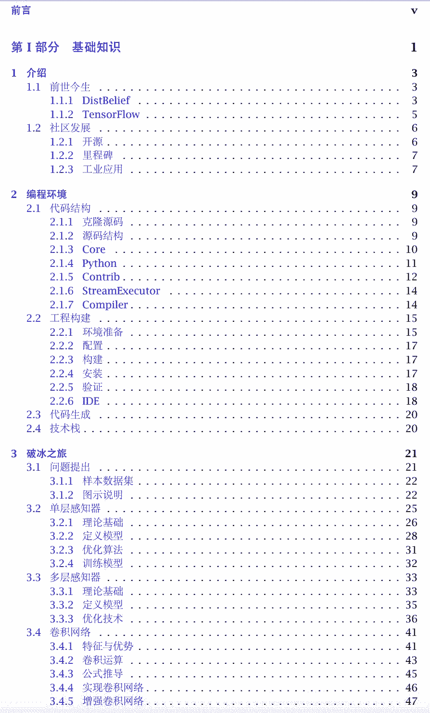
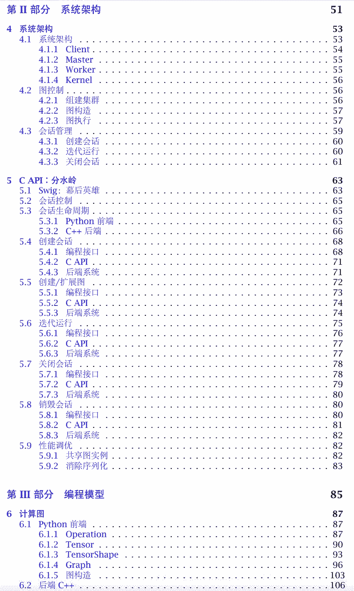
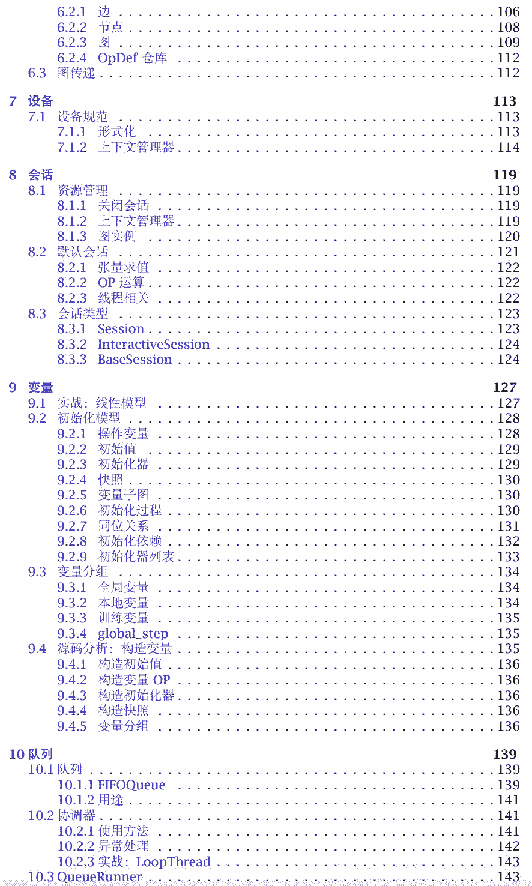
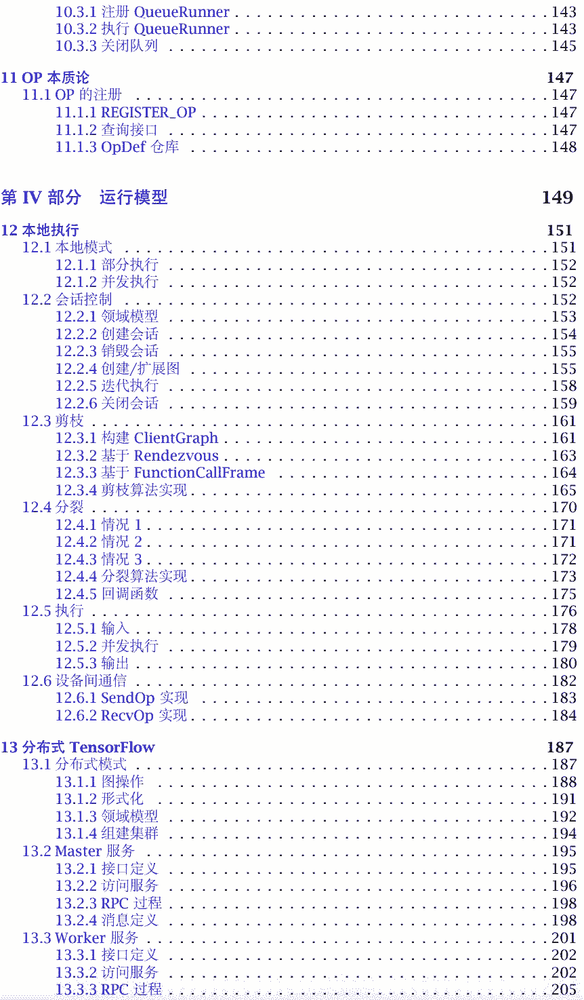
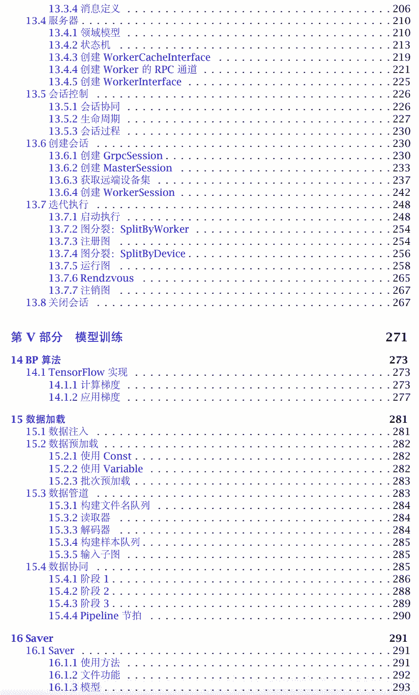
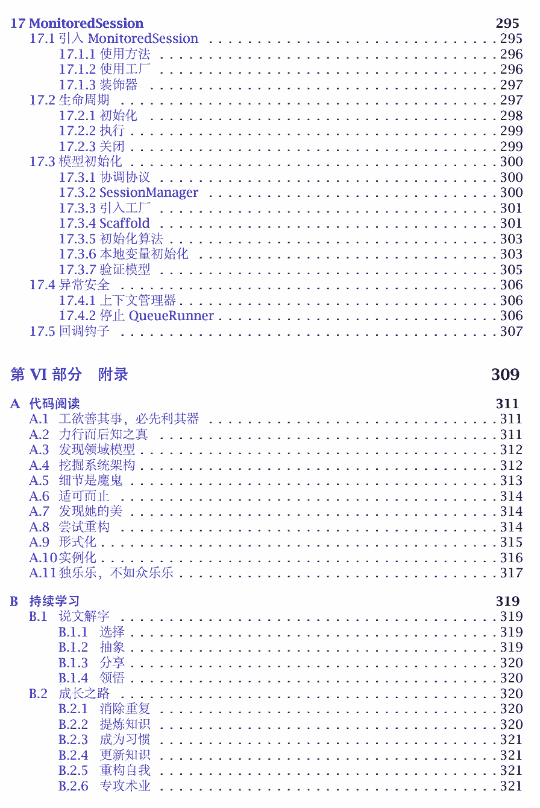

# 揭秘框架的本源：开源中文书「TensorFlow 内核剖析」

机器之心专栏

**作者：刘光聪**

> 这是一本剖析 TensorFlow 内核工作原理的书籍，并非讲述如何使用 TensorFlow 构建机器学习模型，也不会讲述应用 TensorFlow 的最佳实践。本书将通过剖析 TensorFlow 源代码的方式，揭示 TensorFlow 的系统架构、领域模型、工作原理、及其实现模式等相关内容，以便揭示内在的知识。

项目链接：https://github.com/horance-liu/tensorflow-internals

在项目地址中，作者提供了全部的 LaTex 源文件，也提供了对应的 PDF，读者可直接下载 PDF。本书假设读者已经了解机器学习相关基本概念与理论，了解机器学习相关的基本方法论; 同时，假设读者熟悉 Python, C++ 等程序设计语言。

本书适合于渴望深入了解 TensorFlow 内核设计，期望改善 TensorFlow 系统设计和性能优化，及其探究 TensorFlow 关键技术的设计和实现的系统架构师、AI 算法工程师、和 AI 软件工程师。

PDF 下载地址：https://raw.github.com/horance-liu/tensorflow-internals/master/tensorflow-internals.pdf

**阅读方式**

初次阅读本书，推荐循序渐进的阅读方式；对于高级用户，可以选择感兴趣的章节阅读。首次使用 TensorFlow 时，推荐从源代码完整地构建一次 TensorFlow，以便了解系统的构建方式，及其理顺所依赖的基本组件库。

另外，推荐使用 TensorFlow 亲自实践一些具体应用，以便加深对 TensorFlow 系统行为的认识和理解，熟悉常见 API 的使用方法和工作原理。强烈推荐阅读本书的同时，阅读 TensorFlow 关键代码；关于阅读代码的最佳实践，请查阅本书附录 A 的内容。

**版本说明**

本书写作时，TensorFlow 稳定发布版本为 1.2。不排除本书讲解的部分 API 将来被废弃，也不保证某些系统实现在未来版本发生变化，甚至被删除。

同时，为了更直接的阐述问题的本质，书中部分代码做了局部的重构；删除了部分异常处理分支，或日志打印，甚至是某些可选参数列表。但是，这样的局部重构，不会影响读者理解系统的主要行为特征，更有利于读者掌握系统的工作原理。

同时，为了简化计算图的表达，本书中的计算图并非来自 TensorBoard，而是采用简化了的，等价的图结构。同样地，简化了的图结构，也不会降低读者对真实图结构的认识和理解。

**在线帮助**

为了更好地与读者交流，已在 Github 上建立了勘误表，及其相关补充说明。由于个人经验与能力有限，在有限的时间内难免犯错。如果读者在阅读过程中，如果发现相关错误，请帮忙提交 Pull Request，避免他人掉入相同的陷阱之中，让知识分享变得更加通畅，更加轻松，我将不甚感激。

**目录**

****本文为机器之心专栏，**转载请联系原作者获得授权****。**

✄------------------------------------------------

**加入机器之心（全职记者 / 实习生）：hr@jiqizhixin.com**

**投稿或寻求报道：**content**@jiqizhixin.com**

**广告 & 商务合作：bd@jiqizhixin.com**