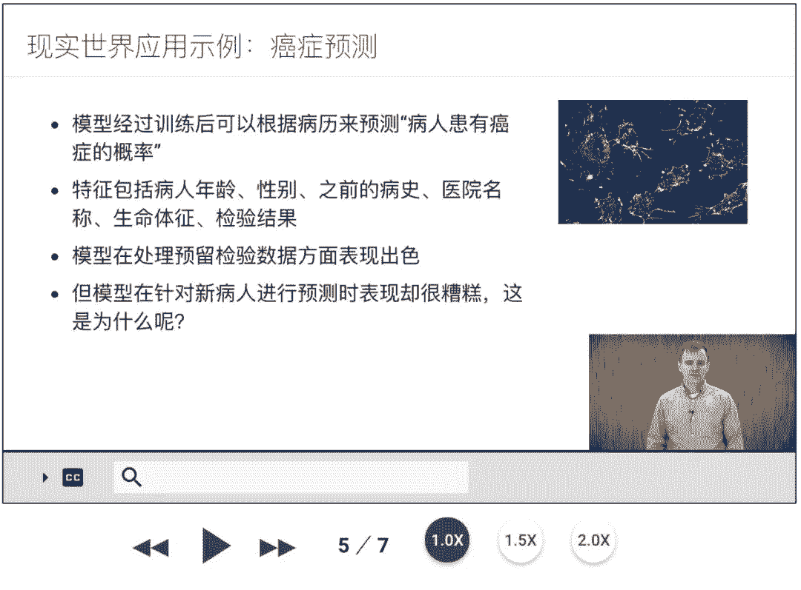
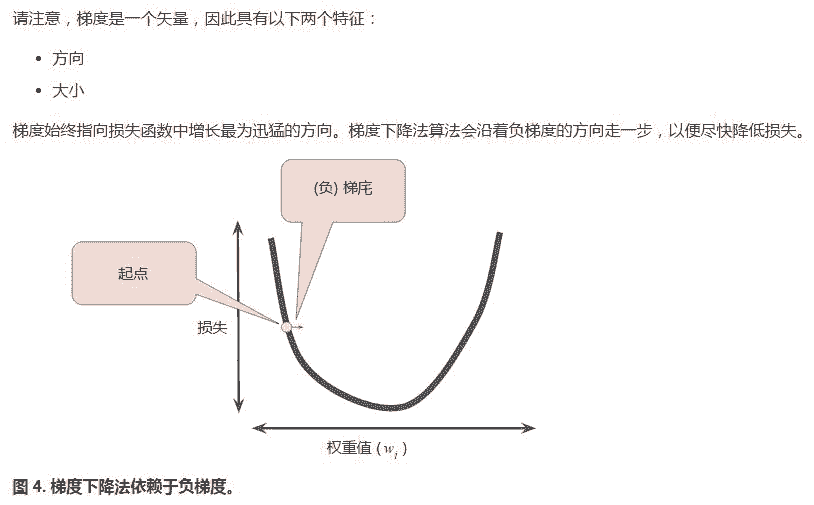

# 学习了！谷歌今日上线基于 TensorFlow 的机器学习速成课程（中文版）

机器之心整理

**参与：思源、许迪**

> > 随着机器学习越来越受到公众的关注，很多初学者希望能快速了解机器学习及前沿技术。而今天谷歌上线了基于 TensorFlow 的机器学习速成课程，它包含 40 多项练习、25 节课程以及 15 个小时的紧凑学习内容。谷歌官方描述为机器学习热爱者的自学指南，且课程资料都是中文书写，课程视频都由机器学习技术转述为中文音频。这对于中文读者来说将会有很大的帮助，当然我们也能选择英文语音以更精确地学习内容。此外，据机器之心了解，这曾是谷歌内部培训工程师的课程，有近万名谷歌员工参与并将学到的东西用在产品的优化和增强上。
> 
> 课程地址：https://developers.google.cn/machine-learning/crash-course/
> 
> 
> 
> 按照该课程所述，读者可能需要初级代数知识，如变量与系数、线性方程组和函数曲线等以理解基本的机器学习模型。此外，读者也需要一些 Python 编程经验，但一般只需要最基础的函数定义、列表/字典、循环和条件表达式等。本课程的实现是基于 Python 和 TensorFlow，不过读者在学习前并不需要任何 TensorFlow 知识。
> 
> 除了前面所述的两个基本要求外，读者可能还需要准备一些基础知识，当然等真正遇到再去查资料也完全没问题。其实准备工作主要分为数学基础、编程基础和函数库三个部分，我们给各位读者提供机器之心的资源文章合集，以便查阅相关问题。
> 
> 在数学方面，代数相关的变量、系数、线性方程、对数和 Sigmoid 函数有助于读者了解模型最基本的表达，包括怎么定义的推断过程、如何构建的损失函数以及激活函数等。线性代数相关的矩阵和张量等知识有助于读者理解模型在计算过程中到底代表了什么意思，例如矩阵乘法这种仿射变换在神经网络中代表了神经元的线性组合或全连接。概率论与统计学也是有要求的，不过本课程仅仅需要能知道均值、方差等概念就行。对于微积分，我们只需要了解导数、偏导数和链式法则的基本概念就行，虽然最优化方法需要非常多的数学知识才能明确地推导出流行的优化器表达式，但在基础阶段只需要调用工具就行了。
> 
> 在 Python 编程与常见第三方库等方面，该课程也只有非常少的要求，掌握基本的操作就行。例如 Python 的列表、字典和元组三大数据结构，还有循环和条件等基本表达式。而需要了解的第三方库也是科学计算方面代表，如 NumPy、Pandas 和 Matplotlib 等。以下是 2017 年机器之心发过的教程，它基本上可以为读者提供足够的学习资料。
> 
> [灵魂追问 | 教程那么多，你……看完了吗？](http://mp.weixin.qq.com/s?__biz=MzA3MzI4MjgzMw==&mid=2650737992&idx=2&sn=753da163e9d4d35e838fcc628922c45a&chksm=871ac936b06d40202dc982d420f7e2052a0b61cabd2be08764291a3419165b9453b24a325c84&scene=21#wechat_redirect)
> 
> **目录**
> 
> 简介：
> 
> *   前提条件和准备工作
>     
>     
> 
> 机器学习概念：
> 
> *   框架处理（15 分钟）机器学习中的监督学习
>     
>     
> *   深入了解机器学习（20 分钟）什么是损失函数，权重和 bias 是什么
>     
>     
> *   降低损失（60 分钟）两种梯度下降，及对学习率的实验
>     
>     
> *   使用 TensorFlow 基本步骤（60 分钟）不能不懂的 TensorFlow
>     
>     
> *   泛化（15 分钟）什么是过拟合，怎样评价一个模型的好坏，把数据集分成测试和训练两部分
>     
>     
> *   训练及测试集（25 分钟）验证把数据集分成两部分的好处
>     
>     
> *   验证（40 分钟）担心过拟合？在测试和训练集外多弄一个验证集
>     
>     
> *   表示法（65 分钟）特征工程，75% 机器学习工程师的时间都在干的事
>     
>     
> *   特征组合（70 分钟）明白什么是特征组合，怎么用 TensorFlow 实现
>     
>     
> *   正则化：简单性（40 分钟）L2 正则化，学习复杂化和普遍化的取舍
>     
>     
> *   逻辑回归（20 分钟）理解逻辑回归，探索损失函数和正则化
>     
>     
> *   分类（90 分钟）评估一个逻辑回归模型的正确性和精度
>     
>     
> *   正则化：稀松性（45 分钟）L2 的其他种类
>     
>     
> *   介绍神经网络（40 分钟）隐藏层，激活函数
>     
>     
> *   训练神经网络（40 分钟）反向传播
>     
>     
> *   多种类神经网络（50 分钟）理解多类分类器问题，Softmax，在 TensorFlow 中实现 Softmax 结果。
>     
>     
> *   嵌入（80 分钟）什么是嵌入，这是干什么的，怎样用好。
>     
>     
> 
> 工程：
> 
> *   生产 ML 系统（3 分钟）ML 生产中的宽度
>     
>     
> *   静态 vs. 动态训练（7 分钟）静态和动态训练的优缺点
>     
>     
> *   静态 vs. 动态推断（7 分钟）静态和动态推断的优缺点
>     
>     
> *   数据依赖（14 分钟）理解 ML 中的数据依赖
>     
>     
> 
> 生活中实际的 ML 例子：
> 
> *   预测癌症（5 分钟）
>     
>     
> *   18 世纪文献（5 分钟）
>     
>     
> *   真实世界方针（2 分钟）
>     
>     
> 
> 结论：
> 
> *   下一步要学习的内容，推荐了 TensorFlow，Google 的课程深度学习，及 Kaggle 比赛等。
>     
>     
> 
> 练习题：
> 
> *   大部分练习题的数据是用的 California housing data set 。
>     
>     
> *   测试分成三种，编程练习，检查你的理解和 Playground。
>     
>     
> 
> **课程特点**
> 
> 这一机器学习速成课程最大的特点是它有完整的中文资料、中文语音和字幕以及中文测试题，它为机器学习初学者提供了最实用的的资料。
> 
> 
> 
> 如下所示，该课程提供的课件非常适合于国内初学者：
> 
> 
> 
> 如下所示，该课程提供了很多中文练习，包括编程练习和文本理解的选择题，这非常有助于各位读者检验在视频和资料中学习到的知识。
> 
> 
> 
> 如下展示了机器学习术语，这一部分分成全面的介绍了机器学习中的术语的含义，非常好懂。
> 
> 
> 
> 最后，该课程还提供了非常多的中文学习资料或技术博客，这些文本资料同样也是扩展读者知识并从原理上学习新技术的重要保证。
> 
> 
> 
> ****本文为机器之心整理，**转载请联系本公众号获得授权****。**
> 
> ✄------------------------------------------------
> 
> **加入机器之心（全职记者/实习生）：hr@jiqizhixin.com**
> 
> **投稿或寻求报道：content@jiqizhixin.com**
> 
> **广告&商务合作：bd@jiqizhixin.com**