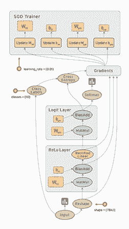
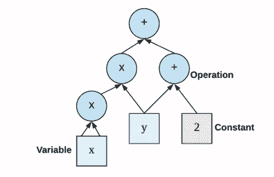
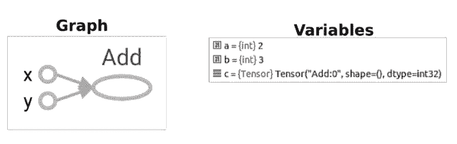
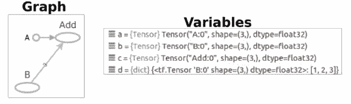
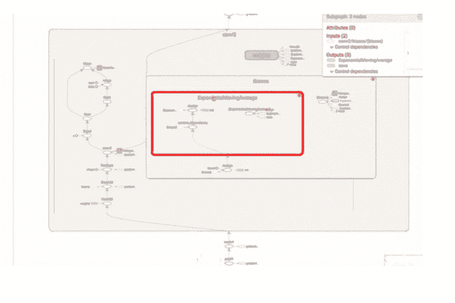
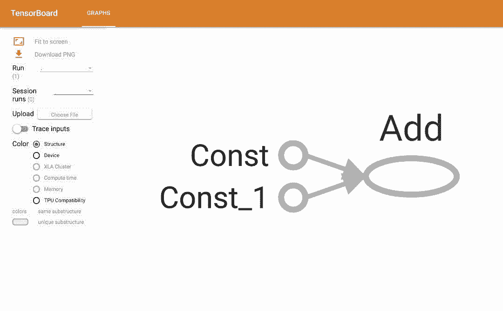

# 从框架优缺点说起，这是一份 TensorFlow 入门极简教程

选自 easy-tensorflow

**机器之心编译**

**参与：张倩、刘晓坤**

> 随着 TensorFlow 在研究及产品中的应用日益广泛，很多开发者及研究者都希望能深入学习这一深度学习框架。而在昨天机器之心发起的框架投票中，2144 位参与者中有 1441 位都在使用 TensorFlow 框架，是所有框架中使用率最高的。但 TensorFlow 这种静态计算图有一定的学习成本，因此也阻挡了很多准备入坑的初学者。本文介绍了学习 TensorFlow 的系列教程，旨在通过简单的理论与实践帮助初学者一步步掌握 TensorFlow 的编程技巧。

这一系列教程分为 6 部分，从为什么选择 TensorFlow 到卷积神经网络的实现，介绍了初学者所需要的技能。机器之心在本文介绍了 PyTorch 和 Caffe 等深度学习框架的优缺点及 TensorFlow 基础，包括静态计算图、张量、TensorBoard 可视化和模型参数的保存等。

教程地址：http://www.easy-tensorflow.com

机器之心此前也介绍过很多 TensorFlow 的学习资源，读者可结合这些资源阅读该系列教程：

*   [学习了！谷歌今日上线基于 TensorFlow 的机器学习速成课程（中文版）](http://mp.weixin.qq.com/s?__biz=MzA3MzI4MjgzMw==&mid=2650738445&idx=1&sn=b2dbe3aa45c253e37b4a81a0ba3dc4a0&chksm=871acb73b06d426503929c75ff2c8112e04ed8c0acfc80e03d64f36010da255b90e3ea9e9628&scene=21#wechat_redirect)

*   [机器之心 GitHub 项目：从零开始用 TensorFlow 搭建卷积神经网络 ](http://mp.weixin.qq.com/s?__biz=MzA3MzI4MjgzMw==&mid=2650730287&idx=1&sn=5697b072a5671ac201e15b43339efab9&chksm=871b2b51b06ca247ac1fdc939e39cfc44cbc2ee25e1b105cf9a582395ddbcdd43cfe18fecd40&scene=21#wechat_redirect)

*   [教程 | 从零开始：TensorFlow 机器学习模型快速部署指南 ](http://mp.weixin.qq.com/s?__biz=MzA3MzI4MjgzMw==&mid=2650736925&idx=2&sn=3ec7f2370ce60ff1bc18f5122e0aa5f2&chksm=871acd63b06d4475c22d227bb03b696dbaea94b5c0ec5486c03db2a056b051ec2e436d3f5976&scene=21#wechat_redirect)

*   [分布式 TensorFlow 入坑指南：从实例到代码带你玩转多机器深度学习 ](http://mp.weixin.qq.com/s?__biz=MzA3MzI4MjgzMw==&mid=2650734471&idx=1&sn=be4cd4b85ed84f997baf4c88543dc3f4&chksm=871b3bf9b06cb2ef94ea9531ec74fef14b8db5d1996b0cf0c9bd31ca3594ef1f54feaea17109&scene=21#wechat_redirect)

*   [三天速成！香港科技大学 TensorFlow 课件分享](http://mp.weixin.qq.com/s?__biz=MzA3MzI4MjgzMw==&mid=2650731659&idx=1&sn=0ad68e73f2501eb9d2d9d28eae3e1390&chksm=871b30f5b06cb9e319d8231ea735c564f2b20ebe917fd9b34e24be815095fd3b69c3461bf386&scene=21#wechat_redirect)

*   [TensorFlow 从基础到实战：一步步教你创建交通标志分类神经网络 ](http://mp.weixin.qq.com/s?__biz=MzA3MzI4MjgzMw==&mid=2650729406&idx=2&sn=a5e37e1d653bbc74063994f739ce3920&chksm=871b2fc0b06ca6d6590ea266086c5a7061d094a12e3dfde3fd3bfdbb7b09f980785139e30b9b&scene=21#wechat_redirect)

**为什么选择 TensorFlow？**

在本文中，我们将对比当前最流行的深度学习框架（包括 Caffe、Theano、PyTorch、TensorFlow 和 Keras），帮助你为应用选择最合适的框架。

**1\. Caffe**：第一个主流产品级深度学习库，于 2014 年由 UC Berkeley 启动。

优点：

*   快速

*   支持 GPU

*   漂亮的 Matlab 和 Python 接口

缺点：

*   不灵活。在 Caffe 中，每个节点被当做一个层，因此如果你想要一种新的层类型，你需要定义完整的前向、后向和梯度更新过程。这些层是网络的构建模块，你需要在无穷无尽的列表中进行选择。（相反，在 TensorFlow 中，每个节点被当做一个张量运算例如矩阵相加、相乘或卷积。你可以轻易地定义一个层作为这些运算的组合。因此 TensorFlow 的构建模块更小巧，允许更灵活的模块化。）

*   需要大量的非必要冗长代码。如果你希望同时支持 CPU 和 GPU，你需要为每一个实现额外的函数。你还需要使用普通的文本编辑器来定义你的模型。真令人头疼！几乎每个人都希望程序化地定义模型，因为这有利于不同组件之间的模块化。有趣的是，Caffe 的主要架构师现在在 TensorFlow 团队工作。

*   专一性。仅定位在计算机视觉（但做得很不错）。

*   不是以 Python 编写！如果你希望引入新的变动，你需要在 C++和 CUDA 上编程（对于更小的变动，你可以使用它的 Python 和 Matlab 接口）。

*   糟糕的文档。

*   安装比较困难！有大量的依赖包。

*   只有少量种类的输入格式，仅有一种输出格式 HDF5（虽然你总是可以使用它的 Python/C++/Matlab 接口来运行，并从中得到输出数据）。

*   不适用于构建循环网络。

**2\. Theano**：由蒙特利尔大学研究团队构建。Theano 的顶层构建了数值开源深度库，包括 Keras、Lasagne 和 Blocks。[Yoshua Bengio 在 2017 年 9 月 28 日宣布，Theano 的开发将终止](http://mp.weixin.qq.com/s?__biz=MzA3MzI4MjgzMw==&mid=2650731455&idx=1&sn=f1957d20f92c474c397ab2dcc08cc9cf&chksm=871b37c1b06cbed704fbc358de5f8379cd331e1e6f289d44f25dae188c83aa2208190f8a33d2&scene=21#wechat_redirect)。因此实际上 Theano 已死！

优点：

*   计算图的抽象很漂亮（可媲美 TensorFlow）

*   为 CPU 和 GPU 都做了优化

*   很好地适应数值优化任务

*   高级封装（Keras、Lasagne）

缺点：

*   原始的 Theano 只有比较低级的 API

```py
import numpy
           for _ in range(T):
               h = torch.matmul(W, h) + b 
```

*   大型模型可能需要很长的编译时间

*   不支持多 GPU

*   错误信息可能没有帮助（有时候令人懊恼）

**3\. Pytorch**：2017 年 1 月，Facebook 将 Python 版本的 Torch 库（用 Lua 编写）开源。

优点：

*   提供动态计算图（意味着图是在运行时生成的），允许你处理可变长度的输入和输出，例如，在使用 RNN 时非常有用。

*   另一个例子是，在 PyTorch 中，可以使用标准 Python 语法编写 for 循环语句。

*   大量预训练模型

*   大量易于组合的模块化组件

*   易于编写自己的图层类型，易于在 GPU 上运行

*   「TensorBoard」缺少一些关键功能时，「Losswise」可以作为 Pytorch 的替代品

缺点：

*   正式文档以外的参考资料/资源有限

*   无商业支持

**4\. TensorFlow:** 由较低级别的符号计算库（如 Theano）与较高级别的网络规范库（如 Blocks 和 Lasagne）组合而成。

优点：

*   由谷歌开发、维护，因此可以保障支持、开发的持续性。

*   巨大、活跃的社区

*   网络训练的低级、高级接口

*   「TensorBoard」是一款强大的可视化套件，旨在跟踪网络拓扑和性能，使调试更加简单。

*   用 Python 编写（尽管某些对性能有重要影响的部分是用 C++实现的），这是一种颇具可读性的开发语言

*   支持多 GPU。因此可以在不同的计算机上自由运行代码，而不必停止或重新启动程序

*   比基于 Theano 的选项更快的模型编译

*   编译时间比 Theano 短

*   TensorFlow 不仅支持深度学习，还有支持强化学习和其他算法的工具。

缺点：

*   计算图是纯 Python 的，因此速度较慢

*   图构造是静态的，意味着图必须先被「编译」再运行

**5\. Keras：**Keras 是一个更高级、对用户最友好的 API，具有可配置的后端，由 Google Brain 团队成员 Francis Chollet 编写和维护。

优点：

*   提供高级 API 来构建深度学习模型，使其易于阅读和使用

*   编写规范的文档

*   大型、活跃的社区

*   位于其他深度学习库（如 Theano 和 TensorFlow，可配置）之上

*   使用面向对象的设计，因此所有内容都被视为对象（如网络层、参数、优化器等）。所有模型参数都可以作为对象属性进行访问。

例如：

*   model.layers[3].output 将提供模型的第三层

*   model.layers[3].weights 是符号权重张量的列表

缺点：

*   由于用途非常普遍，所以在性能方面比较欠缺

*   与 TensorFlow 后端配合使用时会出现性能问题（因为并未针对其进行优化），但与 Theano 后端配合使用时效果良好

*   不像 TensorFlow 或 PyTorch 那样灵活

**TensorFlow 基础**

TensorFlow 是一种采用数据流图（data flow graphs），用于数值计算的开源软件库。其中 Tensor 代表传递的数据为张量（多维数组），Flow 代表使用计算图进行运算。数据流图用「节点」（nodes）和「边」（edges）组成的有向图来描述数学运算。「节点」一般用来表示施加的数学操作，但也可以表示数据输入的起点和输出的终点，或者是读取/写入持久变量（persistent variable）的终点。边表示节点之间的输入/输出关系。这些数据边可以传送维度可动态调整的多维数据数组，即张量（tensor）。



**计算图与会话**

学习 TensorFlow 的第一步是了解它的主要特色——「计算图」方法。基本上所有的 TensorFlow 代码都包含两个重要部分：

1\. 创建「计算图」，表示计算的数据流

2\. 运行「会话」，执行图中的运算

事实上，TensorFlow 将计算的定义与其执行分开。这两个部分将在以下各节中详细说明。在此之前，请记住第一步是导入 TensorFlow ！

```py
import tensorflow as tf
```

这样，Python 就可以访问 TensorFlow 的所有类、方法和符号。使用此命令，TensorFlow 库将在别名「tf」下导入，以便以后我们可以使用它而不必每次键入其全称「TensorFlow」。

1\. 计算图

TensorFlow 的创意中的最大创意是数值计算被表达成计算图。换种说法，任何 TensorFlow 程序的骨干都是一个计算图。正如 TensorFlow 官网上提及的，「一个计算图是被组织到图节点上的一系列 TensorFlow 运算」。

首先，什么是节点和运算？最好的解释方式是，举个例子。假设我们为函数「f(x,y)=x²y+y+2」编写代码。TensorFlow 中的计算图如下所示：



*图 2：TensorFlow 构建的计算图。*

如上图所示，计算图有一系列由边互相连接的节点构成。每个节点称为 op，即 operation（运算）的缩写。因此每个节点代表一个运算，可能是张量运算或生成张量的操作。每个节点以零或更多张量为输入，并生成一个张量作为输出。

现在我们来构建一个简单的计算图。

```py
import tensorflow as tf
a = 2
b = 3
c = tf.add(a, b, name='Add')
print(c)
______________________________________________________
Tensor("Add:0", shape=(), dtype=int32) 
```

生成的计算图和变量为：



*图 3：左：生成的图在 Tensorboard 中可视化；右：生成的变量（在 debug 模式下运行时从 PyCharm 调试器获取的屏幕截图）*

为了实际评估节点，必须在会话内运行计算图。简言之，编写的代码只生成仅仅用来确定张量的预期大小以及对它们执行的运算的图。但是，它不会为任何张量赋值。

因此，TensorFlow Graph 类似于 Python 中的函数定义。它「不会」为你执行任何计算（就像函数定义不会有任何执行结果一样）。它「仅」定义计算操作。

2\. 会话（Session）

在 TensorFlow 中，所有不同的变量和运算都是储存在计算图。所以在我们构建完模型所需要的图之后，还需要打开一个会话（Session）来运行整个计算图。在会话中，我们可以将所有计算分配到可用的 CPU 和 GPU 资源中。举个简单的例子，运行计算图并获取 c 的值：

```py
sess = tf.Session()
print(sess.run(c))
sess.close()
__________________________________________
5
```

这些代码创建了一个 Session() 对象（分配到 sess），然后（第二行）调用它的运行方法来运行足够的计算图以评估 c。计算完毕后需要关闭会话来帮助系统回收资源，不然就会出现资源泄漏的问题。

**TensorFlow 张量**

```py
import tensorflow as tf 
```

TensorFlow 中最基本的单位是常量（Constant）、变量（Variable）和占位符（Placeholder）。常量定义后值和维度不可变，变量定义后值可变而维度不可变。在神经网络中，变量一般可作为储存权重和其他信息的矩阵，而常量可作为储存超参数或其他结构信息的变量。

1\. 常量

创建一个节点取常数值，它接收以下的变量：

```py
tf.constant(value, dtype=None, shape=None, name='Const', verify_shape=False) 
```

我们来创建两个常量并将它们加起来。常量张量可以通过定义一个值来简单地定义：

```py
# create graph
a = tf.constant(2)
b = tf.constant(3)
c = a + b
# launch the graph in a session
with tf.Session() as sess:
    print(sess.run(c))
____________________________________________________
5 
```

现在我们来看看创建的计算图和生成的数据类型：


2\. 变量

变量是状态性的节点，输出的是它们当前的值，意味着它们可以在一个计算图的多次执行中保留它们的值。它们有一系列的有用特征，例如：

它们可以在训练期间或训练后保存到硬盘上。这允许来自不同公司和团队的人们保存、恢复和发送他们的模型参数给别人。

默认情况下，梯度更新（在所有神经网络中应用）将应用到计算图中的所有变量。实际上，变量是你希望调整以最小化损失函数的东西。

为了创建变量，你可以按如下方式使用 tf.Variable：

```py
# Create a variable.
w = tf.Variable(<initial-value>, name=<optional-name>) 
```

以下语句声明一个 2 行 3 列的变量矩阵，该变量的值服从标准差为 1 的正态分布，并随机生成。

```py
w1=tf.Variable(tf.random_normal([2,3],stddev=1,seed=1)) 
```

TensorFlow 还有 tf.truncated_normal() 函数，即截断正态分布随机数，它只保留 [mean-2*stddev,mean+2*stddev] 范围内的随机数。

调用 tf.Variable 来创建一个变量是一种老方法。TensorFlow 推荐使用封装器 tf.get_variable，它能接收命名、形状等参数：

```py
tf.get_variable(name,
                shape=None,
                dtype=None,
                initializer=None,
                regularizer=None,
                trainable=True,
                collections=None,
                caching_device=None,
                partitioner=None,
                validate_shape=True,
                use_resource=None,
                custom_getter=None,
                constraint=None) 
```

变量在使用前需要初始化。为此，我们必须调用「变量初始值设定项操作」，并在 session 上运行该操作。

```py
a = tf.get_variable(name="var_1", initializer=tf.constant(2))
b = tf.get_variable(name="var_2", initializer=tf.constant(3))
c = tf.add(a, b, name="Add1")

# launch the graph in a session
with tf.Session() as sess:
    # now let's evaluate their value
    print(sess.run(a))
    print(sess.run(b))
    print(sess.run(c)) 
```

3\. 占位符

我们已经创建了各种形式的常量和变量，但 TensorFlow 同样还支持占位符。占位符并没有初始值，它只会分配必要的内存。在会话中，占位符可以使用 feed_dict 馈送数据。

feed_dict 是一个字典，在字典中需要给出每一个用到的占位符的取值。在训练神经网络时需要每次提供一个批量的训练样本，如果每次迭代选取的数据要通过常量表示，那么 TensorFlow 的计算图会非常大。因为每增加一个常量，TensorFlow 都会在计算图中增加一个节点。所以说拥有几百万次迭代的神经网络会拥有极其庞大的计算图，而占位符却可以解决这一点，它只会拥有占位符这一个节点。

```py
a = tf.constant([5, 5, 5], tf.float32, name='A')
b = tf.placeholder(tf.float32, shape=[3], name='B')
c = tf.add(a, b, name="Add")

with tf.Session() as sess:
    # create a dictionary:
    d = {b: [1, 2, 3]}
    # feed it to the placeholder
    print(sess.run(c, feed_dict=d)) 
 ___________________________________________________
 [6\. 7\. 8.] 
```

它生成的计算图与变量如下所示：



现在，我们已经能创建一个简单的神经网络。如下利用随机生成的数据创建了一个三层全连接网络：

```py
import tensorflow as tf
from numpy.random import RandomState

batch_size=10
w1=tf.Variable(tf.random_normal([2,3],stddev=1,seed=1))
w2=tf.Variable(tf.random_normal([3,1],stddev=1,seed=1))

# None 可以根据 batch 大小确定维度，在 shape 的一个维度上使用 None
x=tf.placeholder(tf.float32,shape=(None,2))
y=tf.placeholder(tf.float32,shape=(None,1))

#激活函数使用 ReLU
a=tf.nn.relu(tf.matmul(x,w1))
yhat=tf.nn.relu(tf.matmul(a,w2))

#定义交叉熵为损失函数，训练过程使用 Adam 算法最小化交叉熵
cross_entropy=-tf.reduce_mean(y*tf.log(tf.clip_by_value(yhat,1e-10,1.0)))
train_step=tf.train.AdamOptimizer(0.001).minimize(cross_entropy)

rdm=RandomState(1)
data_size=516

#生成两个特征，共 data_size 个样本
X=rdm.rand(data_size,2)
#定义规则给出样本标签，所有 x1+x2<1 的样本认为是正样本，其他为负样本。Y，1 为正样本
Y = [[int(x1+x2 < 1)] for (x1, x2) in X]

with tf.Session() as sess:
    sess.run(tf.global_variables_initializer())
    print(sess.run(w1))
    print(sess.run(w2))
    steps=11000
    for i in range(steps):

        #选定每一个批量读取的首尾位置，确保在 1 个 epoch 内采样训练
        start = i * batch_size % data_size
        end = min(start + batch_size,data_size)
        sess.run(train_step,feed_dict={x:X[start:end],y:Y[start:end]})
        if i % 1000 == 0:
            training_loss= sess.run(cross_entropy,feed_dict={x:X,y:Y})
            print("在迭代 %d 次后，训练损失为 %g"%(i,training_loss)) 
```

上面的代码定义了一个简单的三层全连接网络（输入层、隐藏层和输出层分别为 2、3 和 2 个神经元），隐藏层和输出层的激活函数使用的是 ReLU 函数。该模型训练的样本总数为 512，每次迭代读取的批量为 10。这个简单的全连接网络以交叉熵为损失函数，并使用 Adam 优化算法进行权重更新。

其中需要注意的几个函数如 tf.nn.relu() 代表调用 ReLU 激活函数，tf.matmul() 为矩阵乘法等。tf.clip_by_value(yhat,1e-10,1.0) 这一语句代表的是截断 yhat 的值，因为这一语句是嵌套在 tf.log() 函数内的，所以我们需要确保 yhat 的取值不会导致对数无穷大。

**TensorBoard 基础**

TensorBoard 是一个可视化软件，在所有的 TensorFlow 标准安装中都包含了 TensorBoard。按谷歌的话说：「使用 TensorFlow 执行的计算，例如训练一个大规模深度神经网络，可能复杂且令人困惑。为了更加容易理解、调试和优化 TensorFlow 程序，我们内置了一套可视化工具，即 TensorBoard。」

TensorFlow 程序既能解决非常简单也能解决非常复杂的问题，它们都有两种基本组件——运算和张量。如前所述，你创建了一个由一系列运算构成的模型，馈送数据到模型上，张量将在运算之间流动，直到得到了输出张量，即你的结果。

完全配置好后，TensorBoard 窗口将呈现与下图类似的画面：


TensorBoard 的创建是为了帮助你了解模型中张量的流动，以便调试和优化模型。它通常用于两项任务:

1\. 图形可视化

2\. 编写摘要（或可视化学习）

在本教程中，我们将介绍 TensorBoard 的上述两项主要用法。尽早学习使用 TensorBoard，可以让使用 TensorFlow 的工作更有趣也更有成效。

**1\. 计算图可视化**

强大的 TensorFlow 计算图会变得极其复杂。可视化图形有助于理解并对其进行调试。这是一个在 TensorFlow 网站工作的可视化示例。



为了激活 TensorFlow 程序 TensorBoard，需要向其中添加几行代码。这将把 TensorFlow 运算导出到一个名为「event file」（或 event log file）的文件中。TensorBoard 能够读取此文件并深入了解模型图及其性能。

现在我们来编写一个简单的 TensorFlow 程序，并用 TensorBoard 可视化其计算图。先创建两个常量并将其添加到一起。常数张量可以简单地通过定义它们的值来定义：

```py
import tensorflow as tf

# create graph
a = tf.constant(2)
b = tf.constant(3)
c = tf.add(a, b)
# launch the graph in a session
with tf.Session() as sess:
    print(sess.run(c))
_____________________________________________
5 
```

为了用 TensorBoard 可视化程序，我们需要编写程序的日志文件。为了编写事件文件，我们首先需要为那些日志编写一个 writer，使用以下代码：

```py
writer = tf.summary.FileWriter([logdir], [graph]) 
```

其中 [logdir] 是你想要保存那些日志文件的文件夹。你可以选择 [logdir] 作为某些有意义的东西，例如『./graphs』。第二个参数 [graph] 是我们正在编写的程序的计算图。有两种获取计算图的方法：

1\. 使用 tf.get_default_graph() 调用计算图，返回程序的默认计算图

2\. 将计算图设置为 sess.graph，返回会话的计算图（注意这里需要我们已经创建了会话）

我们将在以下的例子中展示两种方法。然而，第二种方法更加常用。不管用哪种方法，确保仅当你定义了计算图之后才创建一个 writer。否则，TensorBoard 中可视化的计算图将是不完整的。让我们添加 writer 到第一个例子中并可视化计算图。

```py
import tensorflow as tf

# create graph
a = tf.constant(2)
b = tf.constant(3)
c = tf.add(a, b)

# creating the writer out of the session
# writer = tf.summary.FileWriter('./graphs', tf.get_default_graph())

# launch the graph in a session
with tf.Session() as sess:
    # or creating the writer inside the session
    writer = tf.summary.FileWriter('./graphs', sess.graph)
    print(sess.run(c))
    # don't forget to close the writer at the end
    writer.close() 
```

接下来转到 Terminal，确保当前工作目录与运行 Python 代码的位置相同。例如，此处我们可以使用以下代码切换到目录

```py
$ cd ~/Desktop/tensorboard
```

接下来运行：

```py
$ tensorboard --logdir="./graphs" —port 6006 
```

这将为你生成一个链接。ctrl+左键单击该链接（或将其复制到浏览器中，或只需打开浏览器并转到 http://localhost:6006/）。接下来将显示 TensorBoard 页面，如下所示：



**参数存储与加载**

在基础部分中，最后还介绍了模型参数的保存与恢复。一般 TensorFlow 模型持久化可使用 tf.train.Saver() 完成，它会将 TensorFlow 模型保存为 .ckpt 格式的文件。一般该文件目录下会有三个文件，第一个 model.ckpt.meta 保存了 TensorFlow 计算图的结构，第二个 model.ckpt 文件保存了 TensorFlow 中每一个变量的取值，而最后一个 cheekpoint 文件保存了同目录下所有的模型文件列表。

为了保存和恢复模型变量，我们需要在构建计算图后调用 tf.train.Saver()，例如：

```py
# create the graph
X = tf.placeholder(..)
Y = tf.placeholder(..)
w = tf.get_variale(..)
b = tf.get_variale(..)
...
loss = tf.losses.mean_squared_error(..)
optimizer = tf.train.AdamOptimizer(..).minimize(loss)
...

saver = tf.tfain.Saver() 
```

在训练模式中，我们需要打开会话初始化变量和运行计算图，并在训练结束时调用 saver.save() 保存变量：

```py
# TRAIN
with tf.Session() as sess:
    sess.run(tf.globale_variables_initializer())
    # train our model
    for step in range(steps):
        sess.run(optimizer)
        ...
    saved_path = saver.save(sess, './my-model', global_step=step) 
```

在测试模式中，我们需要使用 saver.restore() 恢复参数：

```py
# TEST
with tf.Session() as sess:
    saver.restore(sess, './my-model')
    ... 
```

当然，模型持久化还有非常多的内容，例如由 MetaGraphDef Protocol Buffer 定义的计算图节点元数据。读者可继续阅读完整的教程或其它书籍以了解详细信息。

深度学习时代，传统 NLP 中的语言知识库是否就不再有用了呢？在最新一期的 INTERFACE 中，清华大学刘知远副教授将为我们介绍在深度学习模型中应用 HowNet 知识的探索和未来展望。


点击「阅读原文」参与报名。